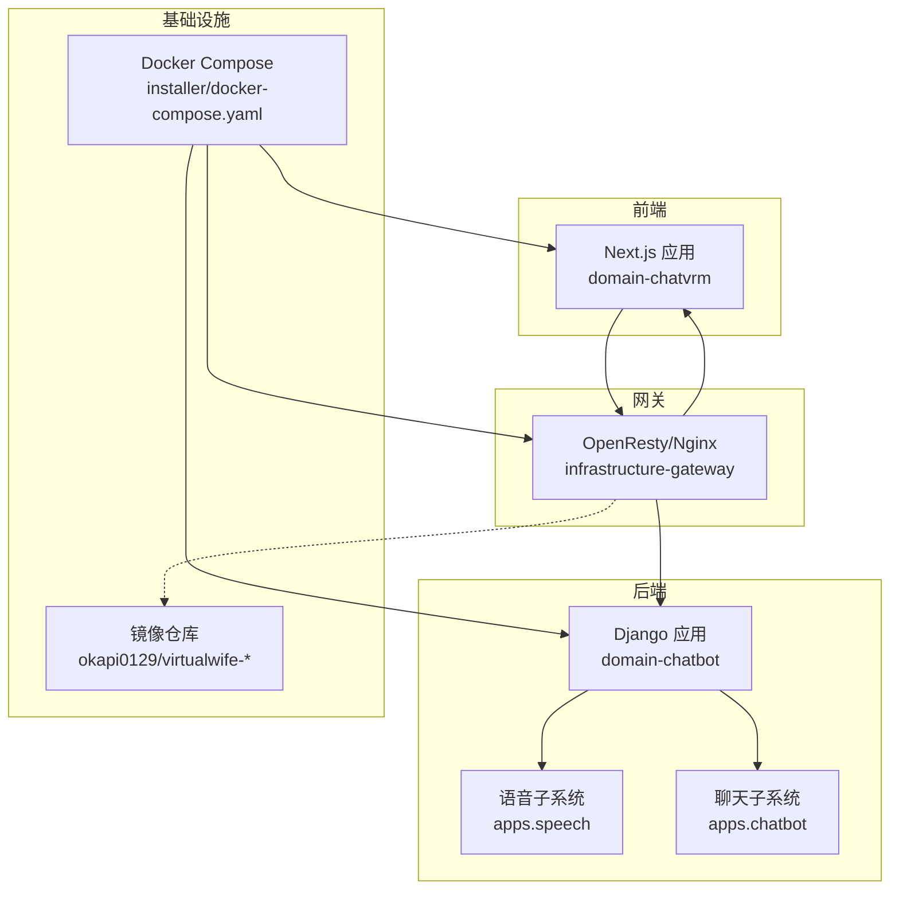
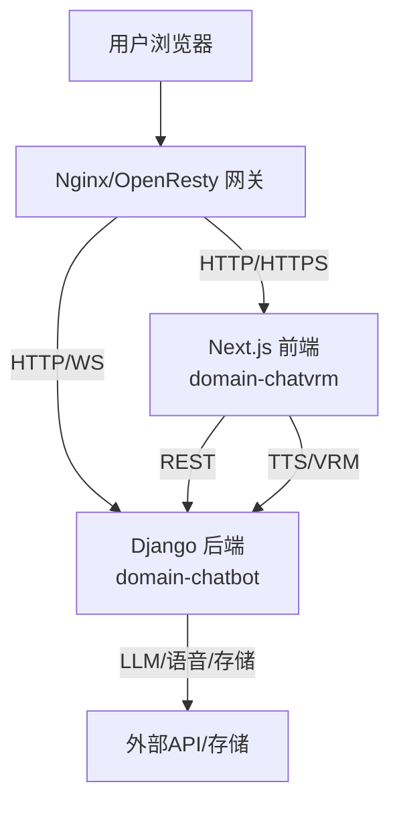
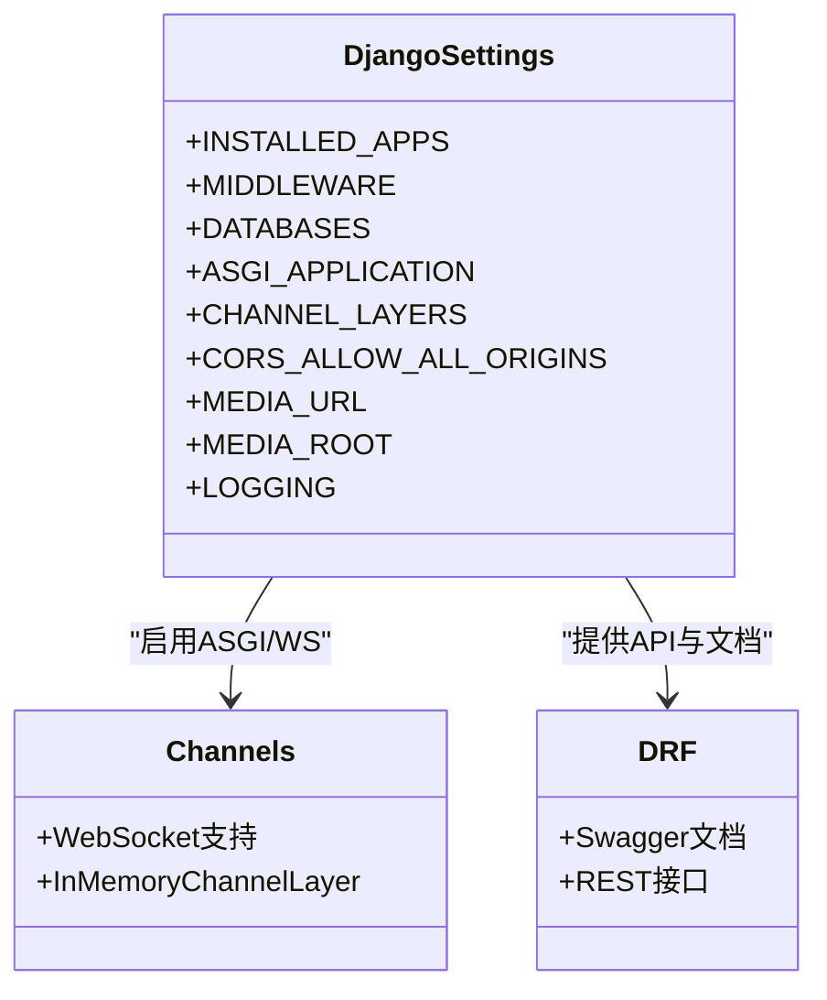
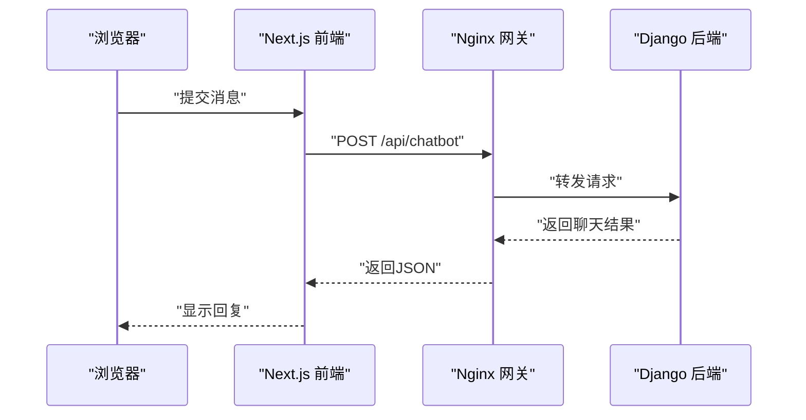
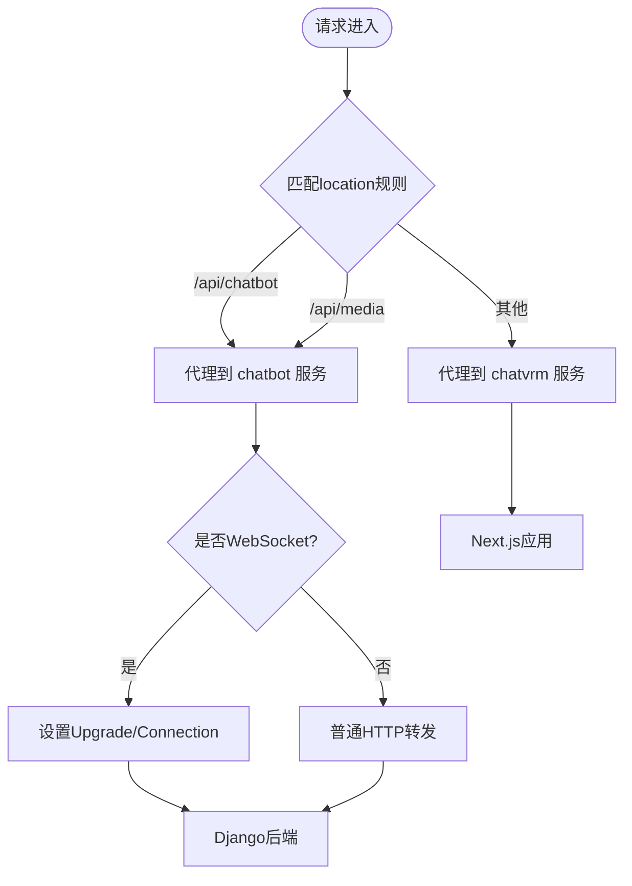
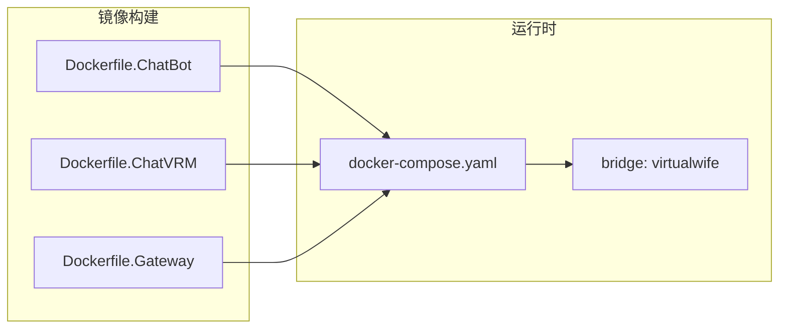
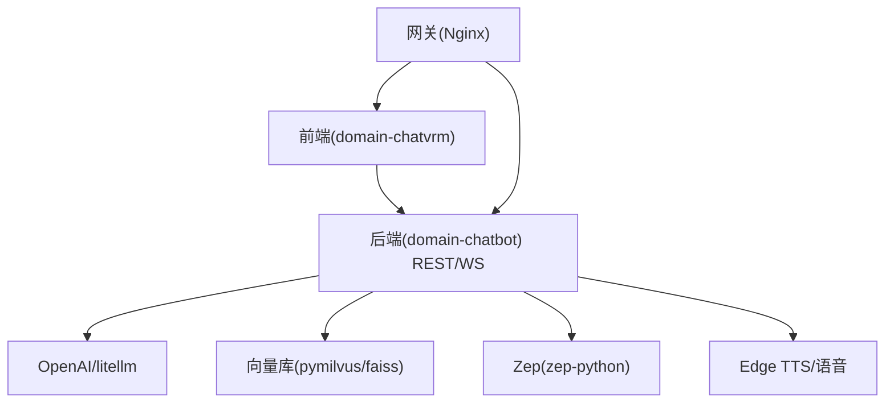

# 系统架构

<cite>
**本文引用的文件**
- [manage.py](file://domain-chatbot/manage.py)
- [settings.py](file://domain-chatbot/VirtualWife/settings.py)
- [urls.py](file://domain-chatbot/VirtualWife/urls.py)
- [requirements.txt](file://domain-chatbot/requirements.txt)
- [package.json](file://domain-chatvrm/package.json)
- [chat.ts](file://domain-chatvrm/src/pages/api/chat.ts)
- [openAiChat.ts](file://domain-chatvrm/src/features/chat/openAiChat.ts)
- [Dockerfile.ChatBot](file://infrastructure-packaging/Dockerfile.ChatBot)
- [Dockerfile.ChatVRM](file://infrastructure-packaging/Dockerfile.ChatVRM)
- [Dockerfile.Gateway](file://infrastructure-packaging/Dockerfile.Gateway)
- [docker-compose.yaml](file://installer/docker-compose.yaml)
- [default.conf](file://infrastructure-gateway/conf.d/default.conf)
- [chatbot.conf](file://infrastructure-gateway/conf.d/server/chatbot.conf)
- [chatvrm.conf](file://infrastructure-gateway/conf.d/server/chatvrm.conf)
</cite>

## 目录
1. [引言](#引言)
2. [项目结构](#项目结构)
3. [核心组件](#核心组件)
4. [架构总览](#架构总览)
5. [详细组件分析](#详细组件分析)
6. [依赖分析](#依赖分析)
7. [性能考量](#性能考量)
8. [故障排查指南](#故障排查指南)
9. [结论](#结论)
10. [附录](#附录)

## 引言
本架构文档面向VirtualWife系统，描述其微服务架构与部署拓扑，覆盖前后端分离（Django后端 + Next.js前端）、API网关（OpenResty/Nginx）与容器化部署（Docker Compose）。文档重点阐述组件间交互关系、数据流向与集成模式，解释技术选型与权衡（如Django+Next.js、Docker容器化），并给出基础设施要求、可扩展性建议、安全与监控、灾难恢复思路、技术栈与版本兼容性以及系统边界与外部集成点。

## 项目结构
系统采用多模块分层组织：
- domain-chatbot：基于Django的后端服务，提供聊天机器人、语音合成、消息队列、LLM接入、记忆与情感管理等能力。
- domain-chatvrm：基于Next.js的前端应用，负责VRM模型展示、实时对话、TTS与表情控制等。
- infrastructure-packaging：容器化打包脚本，分别构建ChatBot、ChatVRM与Gateway镜像。
- infrastructure-gateway：OpenResty/Nginx配置，实现反向代理、跨域、缓存与WebSocket升级。
- installer：编排脚本，定义容器网络、端口映射与环境变量注入。

图表来源
- [docker-compose.yaml](file://installer/docker-compose.yaml#L1-L44)
- [Dockerfile.ChatBot](file://infrastructure-packaging/Dockerfile.ChatBot#L1-L31)
- [Dockerfile.ChatVRM](file://infrastructure-packaging/Dockerfile.ChatVRM#L1-L29)
- [Dockerfile.Gateway](file://infrastructure-packaging/Dockerfile.Gateway#L1-L4)
- [default.conf](file://infrastructure-gateway/conf.d/default.conf#L1-L56)
- [chatbot.conf](file://infrastructure-gateway/conf.d/server/chatbot.conf#L1-L22)
- [chatvrm.conf](file://infrastructure-gateway/conf.d/server/chatvrm.conf#L1-L16)

章节来源
- [docker-compose.yaml](file://installer/docker-compose.yaml#L1-L44)
- [Dockerfile.ChatBot](file://infrastructure-packaging/Dockerfile.ChatBot#L1-L31)
- [Dockerfile.ChatVRM](file://infrastructure-packaging/Dockerfile.ChatVRM#L1-L29)
- [Dockerfile.Gateway](file://infrastructure-packaging/Dockerfile.Gateway#L1-L4)

## 核心组件
- Django后端服务（domain-chatbot）
  - 职责：提供REST接口、WebSocket通道、Swagger文档、媒体资源访问、跨域支持、日志与配置管理。
  - 关键特性：ASGI/Channels用于WebSocket；CORS允许跨域；SQLite默认数据库；日志轮转与控制台输出。
- Next.js前端（domain-chatvrm）
  - 职责：用户界面、VRM模型渲染、实时对话流式响应、TTS调用、HTTP客户端封装。
  - 关键特性：Next API Route对接后端；OpenAI流式响应解析；浏览器端OpenAI SDK适配。
- API网关（OpenResty/Nginx）
  - 职责：统一入口、反向代理、CORS设置、WebSocket升级、静态资源与媒体转发、缓存策略。
- 容器化与编排
  - 职责：镜像构建、服务编排、网络隔离、端口暴露、环境变量注入。

章节来源
- [settings.py](file://domain-chatbot/VirtualWife/settings.py#L37-L50)
- [settings.py](file://domain-chatbot/VirtualWife/settings.py#L56-L69)
- [settings.py](file://domain-chatbot/VirtualWife/settings.py#L146-L152)
- [urls.py](file://domain-chatbot/VirtualWife/urls.py#L35-L41)
- [package.json](file://domain-chatvrm/package.json#L1-L51)
- [default.conf](file://infrastructure-gateway/conf.d/default.conf#L1-L56)
- [chatbot.conf](file://infrastructure-gateway/conf.d/server/chatbot.conf#L1-L22)
- [chatvrm.conf](file://infrastructure-gateway/conf.d/server/chatvrm.conf#L1-L16)

## 架构总览
系统采用“前端-网关-后端”的三层架构，前端通过Next.js提供交互体验，后端通过Django提供业务能力，网关统一对外暴露并进行协议转换与流量治理。

图表来源
- [default.conf](file://infrastructure-gateway/conf.d/default.conf#L38-L53)
- [chatbot.conf](file://infrastructure-gateway/conf.d/server/chatbot.conf#L1-L22)
- [chatvrm.conf](file://infrastructure-gateway/conf.d/server/chatvrm.conf#L1-L16)
- [urls.py](file://domain-chatbot/VirtualWife/urls.py#L35-L41)

## 详细组件分析

### 组件A：Django后端服务（domain-chatbot）
- 技术栈与特性
  - 框架：Django + Daphne + Channels（ASGI/WS）
  - 接口：REST + Swagger文档
  - 跨域：django-cors-headers
  - 日志：RotatingFileHandler + 控制台
  - 数据库：SQLite（开发/演示）
- 关键配置要点
  - INSTALLED_APPS包含channels、rest_framework、drf_yasg、corsheaders等
  - CORS允许所有来源与头部，支持GET/POST/PUT/DELETE
  - ASGI_APPLICATION启用channels，内存ChannelLayer用于开发
  - MEDIA_URL/MEDIA_ROOT用于媒体资源访问
- 依赖与版本
  - Python 3.10.x（容器基础镜像）
  - Django 4.2.1、djangorestframework 3.14.0、channels 4.0.0、daphne 4.0.0
  - LLM与嵌入：openai、transformers、sentence-transformers、litellm
  - 向量库：pymilvus、faiss-cpu
  - 记忆：zep-python
  - 其他：edge-tts、bilibili-api-python、APScheduler、schedule等

图表来源
- [settings.py](file://domain-chatbot/VirtualWife/settings.py#L37-L50)
- [settings.py](file://domain-chatbot/VirtualWife/settings.py#L56-L69)
- [settings.py](file://domain-chatbot/VirtualWife/settings.py#L95-L100)
- [settings.py](file://domain-chatbot/VirtualWife/settings.py#L146-L152)
- [settings.py](file://domain-chatbot/VirtualWife/settings.py#L160-L207)

章节来源
- [settings.py](file://domain-chatbot/VirtualWife/settings.py#L37-L50)
- [settings.py](file://domain-chatbot/VirtualWife/settings.py#L56-L69)
- [settings.py](file://domain-chatbot/VirtualWife/settings.py#L95-L100)
- [settings.py](file://domain-chatbot/VirtualWife/settings.py#L146-L152)
- [settings.py](file://domain-chatbot/VirtualWife/settings.py#L160-L207)
- [requirements.txt](file://domain-chatbot/requirements.txt#L1-L33)
- [manage.py](file://domain-chatbot/manage.py#L1-L28)

### 组件B：Next.js前端（domain-chatvrm）
- 技术栈与特性
  - 框架：Next.js 13.2.4（React 18.2.0）
  - 功能：VRM模型渲染（three.js + @pixiv/three-vrm）、实时对话、TTS、优先队列、HTTP客户端
  - 流式响应：OpenAI流式返回解析
- 关键流程
  - 前端通过Next API Route或直接HTTP调用后端REST接口
  - 对话时先调用后端聊天接口，再根据需要调用TTS
  - 浏览器端OpenAI SDK适配，移除User-Agent以规避特定限制

图表来源
- [chatvrm.conf](file://infrastructure-gateway/conf.d/server/chatvrm.conf#L1-L16)
- [chatbot.conf](file://infrastructure-gateway/conf.d/server/chatbot.conf#L1-L22)
- [openAiChat.ts](file://domain-chatvrm/src/features/chat/openAiChat.ts#L90-L113)

章节来源
- [package.json](file://domain-chatvrm/package.json#L1-L51)
- [chat.ts](file://domain-chatvrm/src/pages/api/chat.ts#L1-L39)
- [openAiChat.ts](file://domain-chatvrm/src/features/chat/openAiChat.ts#L1-L113)

### 组件C：API网关（OpenResty/Nginx）
- 职责
  - 反向代理：将/api/chatbot与/api/media转发至后端，根路径转发至前端
  - 跨域：设置Access-Control-Allow-Origin/Credentials/Headers/Methods
  - WebSocket：升级Header与proxy_http_version
  - 缓存：proxy_cache_path与buffer配置
  - 日志：JSON格式access_log输出到stdout
- 配置要点
  - default.conf定义全局日志格式、缓存、上游映射与连接升级
  - chatbot.conf与chatvrm.conf分别定义路由规则与代理行为

图表来源
- [default.conf](file://infrastructure-gateway/conf.d/default.conf#L1-L56)
- [chatbot.conf](file://infrastructure-gateway/conf.d/server/chatbot.conf#L1-L22)
- [chatvrm.conf](file://infrastructure-gateway/conf.d/server/chatvrm.conf#L1-L16)

章节来源
- [default.conf](file://infrastructure-gateway/conf.d/default.conf#L1-L56)
- [chatbot.conf](file://infrastructure-gateway/conf.d/server/chatbot.conf#L1-L22)
- [chatvrm.conf](file://infrastructure-gateway/conf.d/server/chatvrm.conf#L1-L16)

### 组件D：容器化与编排
- 镜像构建
  - ChatBot：基于python:3.10.12，复制后端代码，安装依赖并迁移数据库，暴露8000端口
  - ChatVRM：基于node:14.21.3，构建Next.js产物，生产镜像仅保留运行时依赖，暴露3000端口
  - Gateway：基于openresty/openresty:1.21.4.2-0-alpine-fat，拷贝conf.d配置
- 编排
  - docker-compose定义三服务：chatbot、chatvrm、gateway，桥接网络virtualwife，端口映射与环境变量注入

图表来源
- [Dockerfile.ChatBot](file://infrastructure-packaging/Dockerfile.ChatBot#L1-L31)
- [Dockerfile.ChatVRM](file://infrastructure-packaging/Dockerfile.ChatVRM#L1-L29)
- [Dockerfile.Gateway](file://infrastructure-packaging/Dockerfile.Gateway#L1-L4)
- [docker-compose.yaml](file://installer/docker-compose.yaml#L1-L44)

章节来源
- [Dockerfile.ChatBot](file://infrastructure-packaging/Dockerfile.ChatBot#L1-L31)
- [Dockerfile.ChatVRM](file://infrastructure-packaging/Dockerfile.ChatVRM#L1-L29)
- [Dockerfile.Gateway](file://infrastructure-packaging/Dockerfile.Gateway#L1-L4)
- [docker-compose.yaml](file://installer/docker-compose.yaml#L1-L44)

## 依赖分析
- 组件耦合
  - 前端对后端REST接口存在直接依赖；网关作为唯一入口降低前端对后端细节的感知
  - 后端通过channels提供实时能力，前端通过Next API Route或直连后端消费
- 外部依赖
  - LLM：OpenAI（openai、litellm）
  - 向量库：Milvus（pymilvus）、Faiss（faiss-cpu）
  - 记忆：Zep（zep-python）
  - 语音：Edge TTS（edge-tts）、OpenAI TTS
  - 其他：B站API、定时任务（APScheduler/schedule）

图表来源
- [requirements.txt](file://domain-chatbot/requirements.txt#L1-L33)
- [openAiChat.ts](file://domain-chatvrm/src/features/chat/openAiChat.ts#L1-L113)
- [chat.ts](file://domain-chatvrm/src/pages/api/chat.ts#L1-L39)

章节来源
- [requirements.txt](file://domain-chatbot/requirements.txt#L1-L33)

## 性能考量
- 网关缓存与缓冲
  - proxy_cache_path、proxy_buffer_*参数提升静态与代理响应吞吐
  - 适合前端资源与非实时接口的缓存优化
- WebSocket与长连接
  - 网关开启proxy_http_version与Upgrade/Connection头，保障实时通信
- 数据库与I/O
  - SQLite适合开发/演示；生产建议迁移到PostgreSQL并配合连接池
- 并发与异步
  - Django使用Daphne + Channels，Next.js采用异步fetch与ReadableStream，提升交互流畅度

## 故障排查指南
- 端口与网络
  - chatbot:8000、chatvrm:3000、gateway:80/443；确认docker-compose端口映射与防火墙
- CORS错误
  - 网关已设置Access-Control-Allow-*；若仍失败，检查Origin与Credentials配置
- WebSocket无法升级
  - 确认Upgrade/Connection头是否正确传递，proxy_http_version是否为1.1
- 日志定位
  - 网关access_log输出到stdout，Django日志同时输出到控制台与文件；结合容器日志查看
- 媒体资源
  - 确认/media路径被网关转发至chatbot，且后端MEDIA_URL/MEDIA_ROOT配置正确

章节来源
- [docker-compose.yaml](file://installer/docker-compose.yaml#L10-L11)
- [docker-compose.yaml](file://installer/docker-compose.yaml#L20-L26)
- [chatbot.conf](file://infrastructure-gateway/conf.d/server/chatbot.conf#L8-L11)
- [default.conf](file://infrastructure-gateway/conf.d/default.conf#L33-L36)
- [settings.py](file://domain-chatbot/VirtualWife/settings.py#L160-L207)

## 结论
VirtualWife采用清晰的前后端分离与微服务架构：Django提供稳定后端能力，Next.js提供现代化前端体验，OpenResty/Nginx作为统一网关承担代理、跨域与缓存职责。容器化与编排简化了部署与运维，具备良好的可扩展性与可维护性。后续可在生产中引入PostgreSQL、Redis缓存、分布式消息队列与集中式日志/监控体系，进一步增强可靠性与可观测性。

## 附录

### 技术栈与版本兼容性
- 后端
  - Python 3.10.x（容器基础镜像）
  - Django 4.2.1、Daphne 4.0.0、Channels 4.0.0、djangorestframework 3.14.0
  - LLM：openai 1.12.0、litellm 1.34.6
  - 向量库：pymilvus 2.2.12、faiss-cpu 1.7.4
  - 记忆：zep-python 1.5.0
  - 语音：edge-tts 6.1.8
  - 其他：APScheduler 3.10.4、schedule 1.2.0、bilibili-api-python 16.1.1
- 前端
  - Node 16.14.2（package.json engines）
  - Next.js 13.2.4、React 18.2.0、three.js 0.151.0
  - TypeScript 5.0.2
- 网关
  - OpenResty 1.21.4.2-0-alpine-fat
- 编排
  - Docker Compose v3

章节来源
- [requirements.txt](file://domain-chatbot/requirements.txt#L1-L33)
- [package.json](file://domain-chatvrm/package.json#L47-L49)
- [Dockerfile.ChatBot](file://infrastructure-packaging/Dockerfile.ChatBot#L1-L31)
- [Dockerfile.ChatVRM](file://infrastructure-packaging/Dockerfile.ChatVRM#L1-L29)
- [Dockerfile.Gateway](file://infrastructure-packaging/Dockerfile.Gateway#L1-L4)
- [docker-compose.yaml](file://installer/docker-compose.yaml#L1-L44)

### 系统边界与外部集成点
- 系统边界
  - 内部：domain-chatbot、domain-chatvrm、infrastructure-gateway
  - 外部：OpenAI API、B站直播SDK、语音服务（Edge TTS）
- 集成点
  - /api/chatbot：后端REST接口，供前端调用
  - /api/media：媒体资源访问
  - /（根路径）：前端Next.js应用
- 安全与合规
  - 建议在生产中启用TLS终止、API密钥管理、CORS白名单、速率限制与审计日志