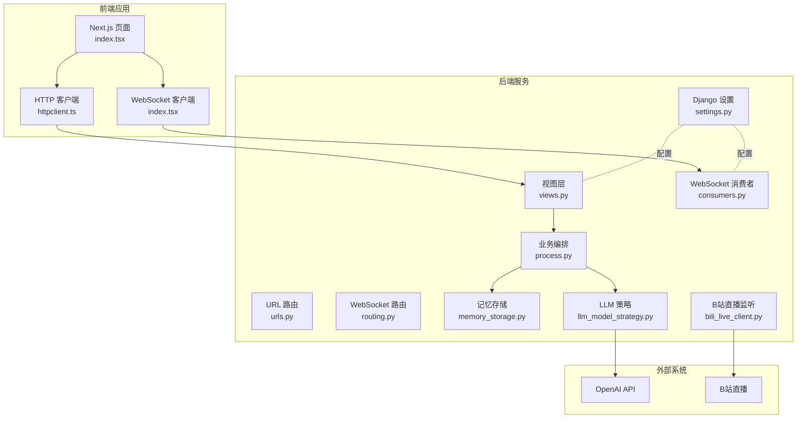
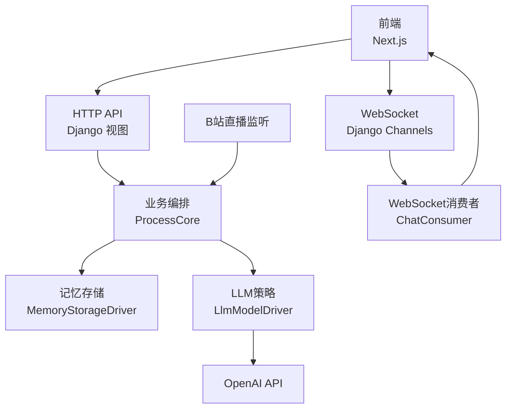
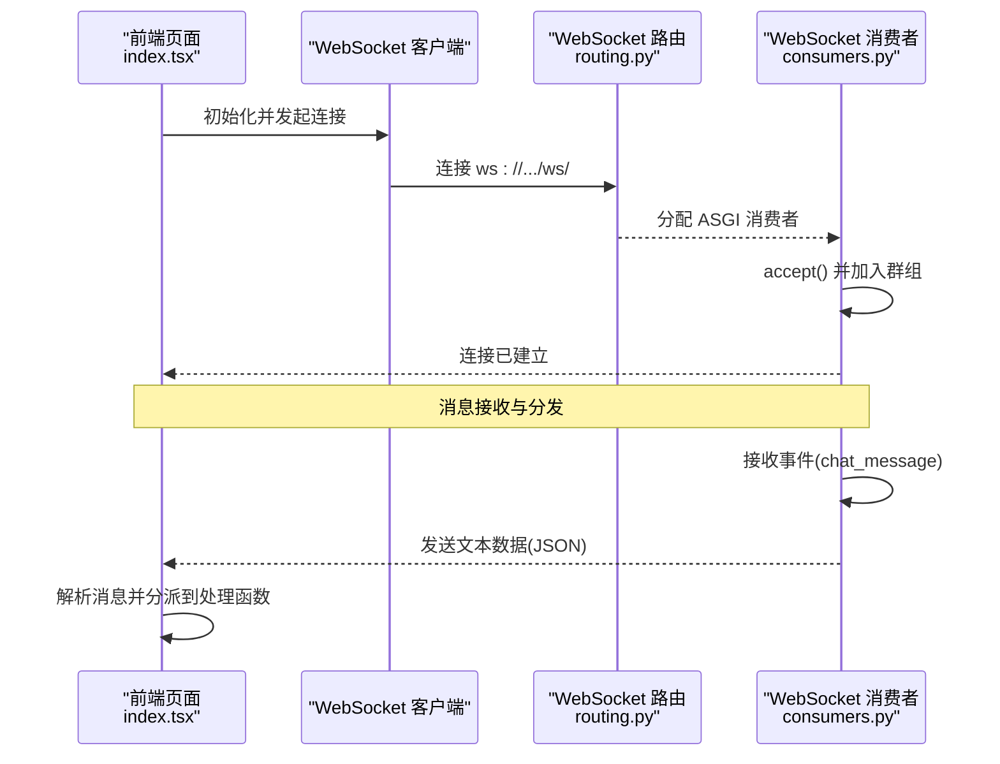
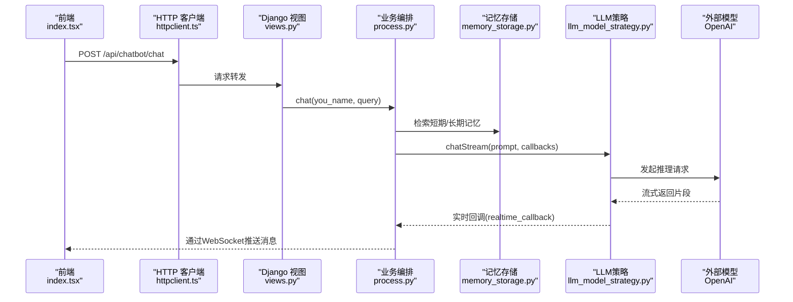
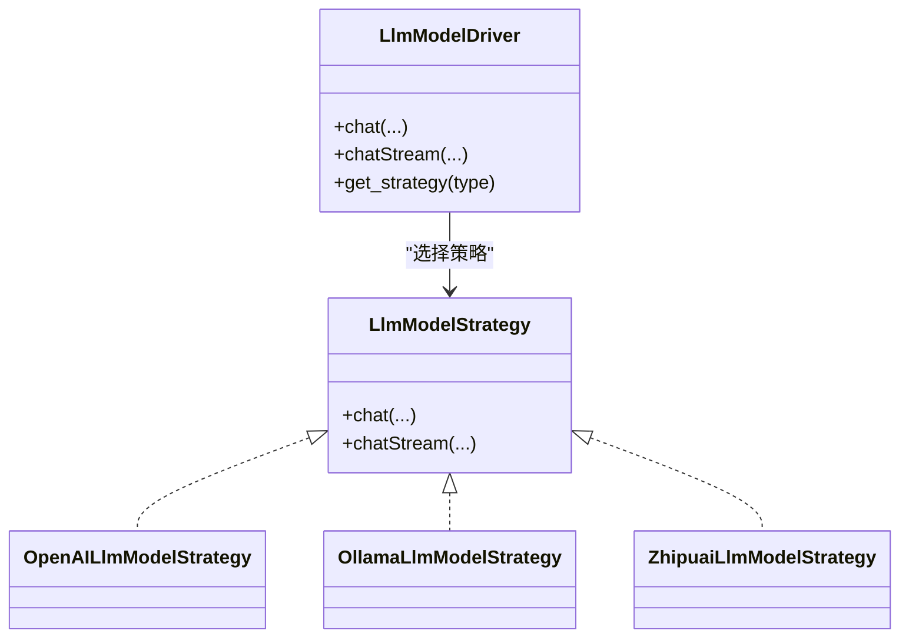
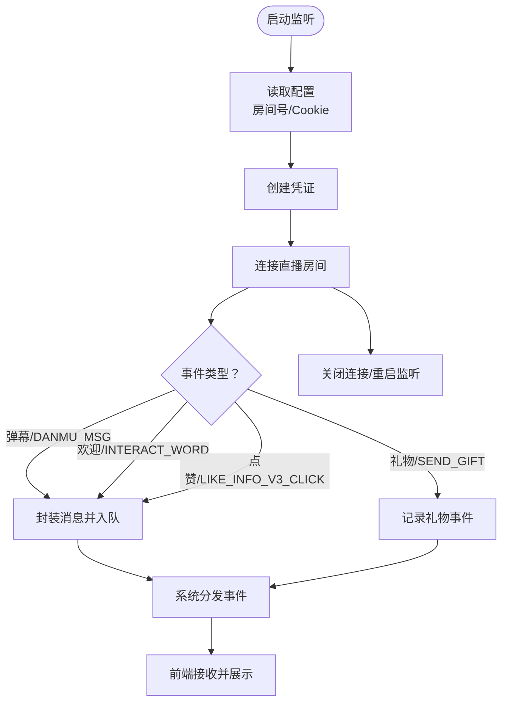
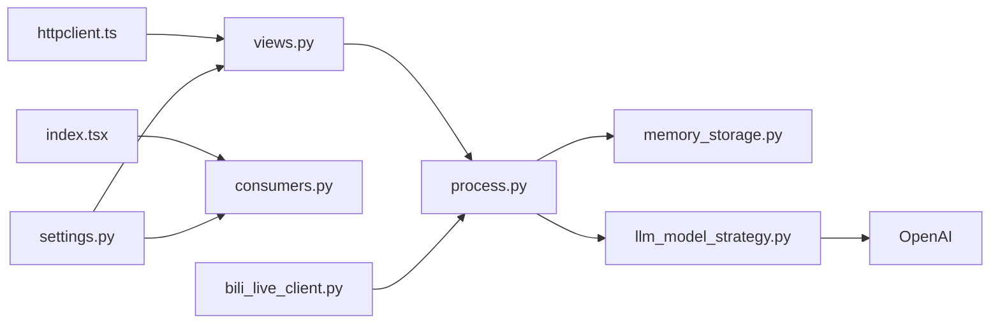

# 组件交互关系

<cite>
**本文引用的文件**
- [settings.py](file://domain-chatbot/VirtualWife/settings.py)
- [urls.py](file://domain-chatbot/apps/chatbot/urls.py)
- [views.py](file://domain-chatbot/apps/chatbot/views.py)
- [routing.py](file://domain-chatbot/apps/chatbot/output/routing.py)
- [consumers.py](file://domain-chatbot/apps/chatbot/output/consumers.py)
- [process.py](file://domain-chatbot/apps/chatbot/process/process.py)
- [llm_model_strategy.py](file://domain-chatbot/apps/chatbot/llms/llm_model_strategy.py)
- [memory_storage.py](file://domain-chatbot/apps/chatbot/memory/memory_storage.py)
- [bili_live_client.py](file://domain-chatbot/apps/chatbot/insight/bilibili_api/bili_live_client.py)
- [chat.ts](file://domain-chatvrm/src/pages/api/chat.ts)
- [messages.ts](file://domain-chatvrm/src/features/messages/messages.ts)
- [ttsApi.ts](file://domain-chatvrm/src/features/tts/ttsApi.ts)
- [httpclient.ts](file://domain-chatvrm/src/features/httpclient/httpclient.ts)
- [index.tsx](file://domain-chatvrm/src/pages/index.tsx)
</cite>

## 目录
1. [简介](#简介)
2. [项目结构](#项目结构)
3. [核心组件](#核心组件)
4. [架构总览](#架构总览)
5. [详细组件分析](#详细组件分析)
6. [依赖分析](#依赖分析)
7. [性能考虑](#性能考虑)
8. [故障排查指南](#故障排查指南)
9. [结论](#结论)
10. [附录](#附录)

## 简介
本文件聚焦VirtualWife系统的组件交互关系，覆盖前端应用（React/Next.js）、后端服务（Django+Channels）、AI模型（多策略适配）、数据库与媒体存储、以及外部API（如B站直播弹幕）之间的交互流程。重点说明：
- WebSocket连接建立与消息路由机制
- 实时数据传输方式与事件分发
- API调用链路：从浏览器请求到后端处理再到AI模型推理的完整路径
- 组件解耦设计：依赖注入、接口抽象、事件驱动
- 提供交互序列图与时序图，帮助开发者理解系统运行时行为

## 项目结构
系统采用前后端分离架构：
- 前端：Next.js应用，负责UI渲染、用户输入、WebSocket接收、TTS与VRM动画控制
- 后端：Django应用，提供REST API与WebSocket通道，协调LLM推理、记忆检索、外部直播监听等
- AI模型：通过策略模式统一接入不同模型（OpenAI/Ollama/智谱）
- 存储：SQLite（默认）用于配置与元数据；可选Milvus用于长期记忆
- 外部集成：B站直播弹幕监听，通过线程池与异步事件驱动

图表来源
- [settings.py](file://domain-chatbot/VirtualWife/settings.py#L146-L152)
- [urls.py](file://domain-chatbot/apps/chatbot/urls.py#L1-L26)
- [views.py](file://domain-chatbot/apps/chatbot/views.py#L20-L31)
- [routing.py](file://domain-chatbot/apps/chatbot/output/routing.py#L1-L9)
- [consumers.py](file://domain-chatbot/apps/chatbot/output/consumers.py#L10-L38)
- [process.py](file://domain-chatbot/apps/chatbot/process/process.py#L33-L77)
- [memory_storage.py](file://domain-chatbot/apps/chatbot/memory/memory_storage.py#L14-L107)
- [llm_model_strategy.py](file://domain-chatbot/apps/chatbot/llms/llm_model_strategy.py#L107-L149)
- [bili_live_client.py](file://domain-chatbot/apps/chatbot/insight/bilibili_api/bili_live_client.py#L110-L139)

章节来源
- [settings.py](file://domain-chatbot/VirtualWife/settings.py#L146-L152)
- [urls.py](file://domain-chatbot/apps/chatbot/urls.py#L1-L26)
- [views.py](file://domain-chatbot/apps/chatbot/views.py#L20-L31)
- [routing.py](file://domain-chatbot/apps/chatbot/output/routing.py#L1-L9)
- [consumers.py](file://domain-chatbot/apps/chatbot/output/consumers.py#L10-L38)
- [process.py](file://domain-chatbot/apps/chatbot/process/process.py#L33-L77)
- [memory_storage.py](file://domain-chatbot/apps/chatbot/memory/memory_storage.py#L14-L107)
- [llm_model_strategy.py](file://domain-chatbot/apps/chatbot/llms/llm_model_strategy.py#L107-L149)
- [bili_live_client.py](file://domain-chatbot/apps/chatbot/insight/bilibili_api/bili_live_client.py#L110-L139)

## 核心组件
- 前端组件
  - 页面与上下文：负责VRM模型展示、字幕滚动、表情与动作控制
  - HTTP客户端：封装开发/生产环境下的API基础地址，统一POST/GET请求
  - WebSocket客户端：建立与后端的实时消息通道，接收“用户消息”“行为动作”“弹幕/欢迎语”等事件
- 后端组件
  - Django设置：启用Channels、CORS、日志、SQLite数据库等
  - URL路由：REST API与WebSocket路由注册
  - 视图层：接收聊天请求，触发业务编排
  - WebSocket消费者：加入/离开群组，接收事件并广播消息
  - 业务编排：拼装角色prompt、检索短期/长期记忆、调用LLM流式生成、回调实时消息
  - 记忆存储：短期本地存储与长期Milvus存储，支持摘要与重要性评分
  - LLM策略：抽象统一接口，按类型选择OpenAI/Ollama/智谱实现
  - B站直播监听：异步连接房间，线程池执行，事件入队并转发至系统

章节来源
- [httpclient.ts](file://domain-chatvrm/src/features/httpclient/httpclient.ts#L11-L19)
- [index.tsx](file://domain-chatvrm/src/pages/index.tsx#L326-L337)
- [settings.py](file://domain-chatbot/VirtualWife/settings.py#L37-L50)
- [urls.py](file://domain-chatbot/apps/chatbot/urls.py#L1-L26)
- [views.py](file://domain-chatbot/apps/chatbot/views.py#L20-L31)
- [routing.py](file://domain-chatbot/apps/chatbot/output/routing.py#L1-L9)
- [consumers.py](file://domain-chatbot/apps/chatbot/output/consumers.py#L10-L38)
- [process.py](file://domain-chatbot/apps/chatbot/process/process.py#L33-L77)
- [memory_storage.py](file://domain-chatbot/apps/chatbot/memory/memory_storage.py#L14-L107)
- [llm_model_strategy.py](file://domain-chatbot/apps/chatbot/llms/llm_model_strategy.py#L107-L149)
- [bili_live_client.py](file://domain-chatbot/apps/chatbot/insight/bilibili_api/bili_live_client.py#L110-L139)

## 架构总览
系统采用“前端-后端-外部”的三层交互：
- 前端通过HTTP与WebSocket与后端通信
- 后端通过内存通道与LLM策略对接，并访问本地/远程存储
- 外部系统（OpenAI、B站直播）通过API或事件驱动参与

图表来源
- [httpclient.ts](file://domain-chatvrm/src/features/httpclient/httpclient.ts#L21-L25)
- [index.tsx](file://domain-chatvrm/src/pages/index.tsx#L326-L337)
- [views.py](file://domain-chatbot/apps/chatbot/views.py#L20-L31)
- [process.py](file://domain-chatbot/apps/chatbot/process/process.py#L33-L77)
- [memory_storage.py](file://domain-chatbot/apps/chatbot/memory/memory_storage.py#L14-L107)
- [llm_model_strategy.py](file://domain-chatbot/apps/chatbot/llms/llm_model_strategy.py#L107-L149)
- [bili_live_client.py](file://domain-chatbot/apps/chatbot/insight/bilibili_api/bili_live_client.py#L110-L139)
- [consumers.py](file://domain-chatbot/apps/chatbot/output/consumers.py#L10-L38)

## 详细组件分析

### WebSocket连接与消息路由
- 建立流程
  - 前端在页面挂载时初始化WebSocket连接，绑定onmessage/onclose
  - 后端WebSocket路由注册到特定URL模式，消费者接受连接并加入群组
- 消息路由
  - 消费者将事件广播到指定群组，前端按消息类型分发到不同处理逻辑
  - 类型包括：用户消息、行为动作、弹幕/欢迎语等

图表来源
- [routing.py](file://domain-chatbot/apps/chatbot/output/routing.py#L6-L8)
- [consumers.py](file://domain-chatbot/apps/chatbot/output/consumers.py#L12-L37)
- [index.tsx](file://domain-chatvrm/src/pages/index.tsx#L326-L337)

章节来源
- [routing.py](file://domain-chatbot/apps/chatbot/output/routing.py#L1-L9)
- [consumers.py](file://domain-chatbot/apps/chatbot/output/consumers.py#L10-L38)
- [index.tsx](file://domain-chatvrm/src/pages/index.tsx#L326-L337)

### API调用链路（浏览器到AI推理）
- 前端HTTP请求
  - 前端通过HTTP客户端向后端发送聊天请求
- 后端处理
  - 视图层接收请求，调用业务编排模块
  - 编排模块拼装prompt、检索短期/长期记忆
  - 调用LLM策略进行流式生成，回调实时消息
- AI模型推理
  - 策略模式按类型选择具体实现（OpenAI/Ollama/智谱）
  - 流式回调通过WebSocket推送到前端

图表来源
- [httpclient.ts](file://domain-chatvrm/src/features/httpclient/httpclient.ts#L21-L25)
- [views.py](file://domain-chatbot/apps/chatbot/views.py#L20-L31)
- [process.py](file://domain-chatbot/apps/chatbot/process/process.py#L33-L77)
- [memory_storage.py](file://domain-chatbot/apps/chatbot/memory/memory_storage.py#L26-L54)
- [llm_model_strategy.py](file://domain-chatbot/apps/chatbot/llms/llm_model_strategy.py#L122-L138)

章节来源
- [httpclient.ts](file://domain-chatvrm/src/features/httpclient/httpclient.ts#L11-L19)
- [views.py](file://domain-chatbot/apps/chatbot/views.py#L20-L31)
- [process.py](file://domain-chatbot/apps/chatbot/process/process.py#L33-L77)
- [memory_storage.py](file://domain-chatbot/apps/chatbot/memory/memory_storage.py#L26-L54)
- [llm_model_strategy.py](file://domain-chatbot/apps/chatbot/llms/llm_model_strategy.py#L122-L138)

### 组件解耦设计
- 依赖注入
  - Django设置集中管理通道层、CORS、日志等基础设施
  - 业务编排通过全局配置对象访问LLM驱动与记忆驱动
- 接口抽象
  - LLM策略定义统一接口，具体实现按类型注入
  - 记忆存储抽象短期/长期存储，按配置启用
- 事件驱动
  - WebSocket消费者基于群组广播事件
  - B站直播监听使用异步事件与线程池，事件入队后由系统统一处理

图表来源
- [llm_model_strategy.py](file://domain-chatbot/apps/chatbot/llms/llm_model_strategy.py#L13-L149)

章节来源
- [settings.py](file://domain-chatbot/VirtualWife/settings.py#L146-L152)
- [process.py](file://domain-chatbot/apps/chatbot/process/process.py#L23-L32)
- [memory_storage.py](file://domain-chatbot/apps/chatbot/memory/memory_storage.py#L14-L25)
- [llm_model_strategy.py](file://domain-chatbot/apps/chatbot/llms/llm_model_strategy.py#L107-L149)
- [consumers.py](file://domain-chatbot/apps/chatbot/output/consumers.py#L10-L18)

### 外部API与直播集成
- B站直播监听
  - 通过配置加载Cookie与房间号，创建凭证并连接房间
  - 异步事件捕获弹幕、礼物、进入直播间等，封装为系统消息并入队
  - 使用线程池管理生命周期，支持热切换与优雅关闭
- 前端弹幕/互动展示
  - WebSocket接收“danmaku”“welcome”等事件，触发字幕与动作播放

图表来源
- [bili_live_client.py](file://domain-chatbot/apps/chatbot/insight/bilibili_api/bili_live_client.py#L16-L78)
- [bili_live_client.py](file://domain-chatbot/apps/chatbot/insight/bilibili_api/bili_live_client.py#L110-L139)
- [index.tsx](file://domain-chatvrm/src/pages/index.tsx#L296-L324)

章节来源
- [bili_live_client.py](file://domain-chatbot/apps/chatbot/insight/bilibili_api/bili_live_client.py#L110-L139)
- [index.tsx](file://domain-chatvrm/src/pages/index.tsx#L296-L324)

## 依赖分析
- 前端到后端
  - HTTP：通过httpclient.ts在开发/生产环境自动切换基础URL
  - WebSocket：index.tsx维护单一连接实例，onclose自动重连
- 后端内部
  - 视图层依赖业务编排；编排层依赖记忆与LLM策略
  - WebSocket路由与消费者依赖通道层配置
- 外部依赖
  - OpenAI API：通过LLM策略调用
  - B站直播：通过第三方SDK与线程池

图表来源
- [httpclient.ts](file://domain-chatvrm/src/features/httpclient/httpclient.ts#L11-L19)
- [views.py](file://domain-chatbot/apps/chatbot/views.py#L20-L31)
- [index.tsx](file://domain-chatvrm/src/pages/index.tsx#L326-L337)
- [consumers.py](file://domain-chatbot/apps/chatbot/output/consumers.py#L10-L38)
- [process.py](file://domain-chatbot/apps/chatbot/process/process.py#L33-L77)
- [memory_storage.py](file://domain-chatbot/apps/chatbot/memory/memory_storage.py#L14-L107)
- [llm_model_strategy.py](file://domain-chatbot/apps/chatbot/llms/llm_model_strategy.py#L107-L149)
- [bili_live_client.py](file://domain-chatbot/apps/chatbot/insight/bilibili_api/bili_live_client.py#L110-L139)
- [settings.py](file://domain-chatbot/VirtualWife/settings.py#L146-L152)

章节来源
- [httpclient.ts](file://domain-chatvrm/src/features/httpclient/httpclient.ts#L11-L19)
- [views.py](file://domain-chatbot/apps/chatbot/views.py#L20-L31)
- [index.tsx](file://domain-chatvrm/src/pages/index.tsx#L326-L337)
- [consumers.py](file://domain-chatbot/apps/chatbot/output/consumers.py#L10-L38)
- [process.py](file://domain-chatbot/apps/chatbot/process/process.py#L33-L77)
- [memory_storage.py](file://domain-chatbot/apps/chatbot/memory/memory_storage.py#L14-L107)
- [llm_model_strategy.py](file://domain-chatbot/apps/chatbot/llms/llm_model_strategy.py#L107-L149)
- [bili_live_client.py](file://domain-chatbot/apps/chatbot/insight/bilibili_api/bili_live_client.py#L110-L139)
- [settings.py](file://domain-chatbot/VirtualWife/settings.py#L146-L152)

## 性能考虑
- WebSocket长连接
  - 前端仅维护单一连接实例，避免重复握手开销
  - onclose自动重连，提升鲁棒性
- LLM流式输出
  - 通过回调实时推送，降低端到端延迟
  - 策略模式便于替换与扩展不同推理后端
- 记忆检索
  - 短期记忆本地缓存，长期记忆按需检索，减少网络往返
- 外部监听
  - 异步事件与线程池解耦IO阻塞，支持热切换

## 故障排查指南
- WebSocket无法连接
  - 检查路由是否正确注册与URL模式匹配
  - 查看消费者accept与群组加入日志
- 消息未到达前端
  - 确认事件广播到正确的群组名称
  - 检查前端onmessage绑定与JSON解析
- HTTP请求失败
  - 核对httpclient.ts的基础URL与环境变量
  - 检查Django CORS配置与跨域头
- LLM推理异常
  - 检查LLM策略类型与驱动初始化
  - 关注流式回调错误与异常分支
- B站直播监听
  - 核对Cookie有效性与房间号
  - 检查线程池生命周期与异常关闭

章节来源
- [routing.py](file://domain-chatbot/apps/chatbot/output/routing.py#L6-L8)
- [consumers.py](file://domain-chatbot/apps/chatbot/output/consumers.py#L12-L37)
- [httpclient.ts](file://domain-chatvrm/src/features/httpclient/httpclient.ts#L11-L19)
- [llm_model_strategy.py](file://domain-chatbot/apps/chatbot/llms/llm_model_strategy.py#L140-L149)
- [bili_live_client.py](file://domain-chatbot/apps/chatbot/insight/bilibili_api/bili_live_client.py#L110-L139)

## 结论
本系统通过清晰的前后端边界、策略化的LLM接入、事件驱动的WebSocket与线程池监听，实现了低耦合、高扩展的虚拟女友交互平台。建议在生产环境中进一步完善：
- WebSocket鉴权与限流
- LLM推理超时与重试策略
- 记忆检索的缓存与索引优化
- 外部API的熔断与降级

## 附录
- 前端OpenAI代理示例（Next.js API Route）
  - 该接口演示如何在Next.js中封装OpenAI调用，便于前端统一请求路径
  - 适用于需要在前端直接调用OpenAI的场景（非本项目主推理路径）

章节来源
- [chat.ts](file://domain-chatvrm/src/pages/api/chat.ts#L1-L39)