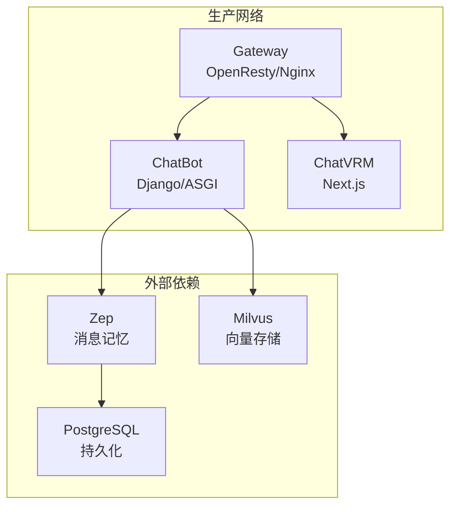
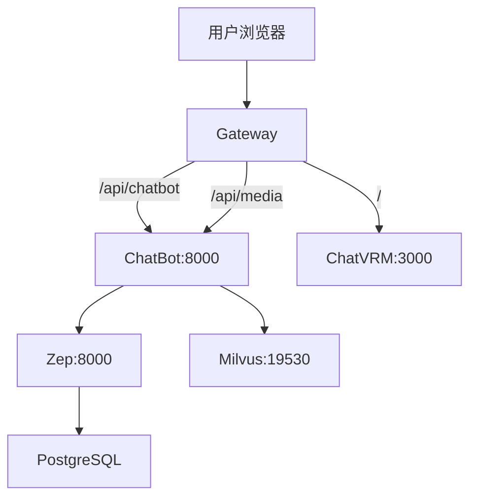
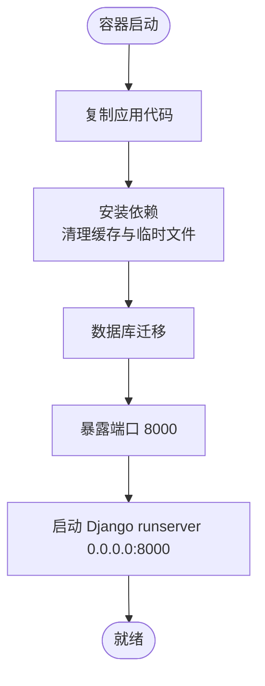
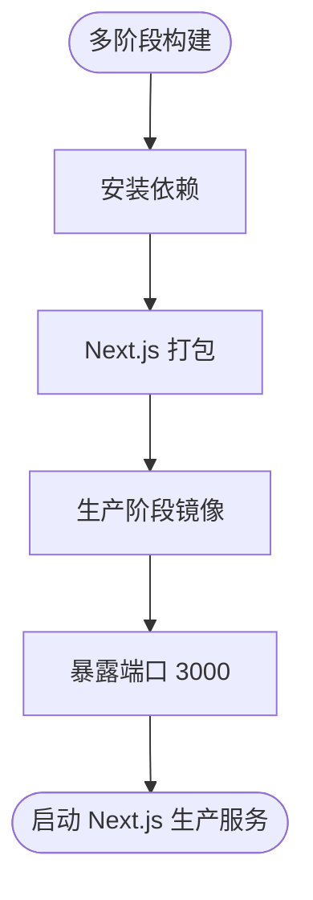
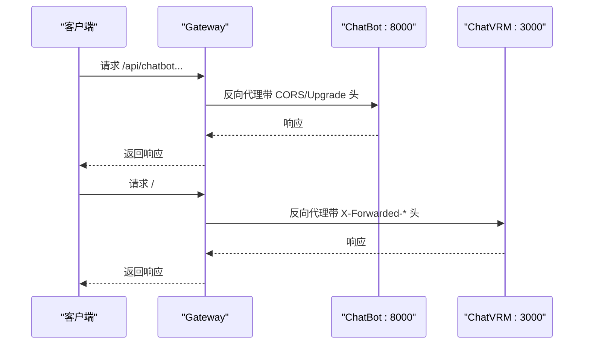
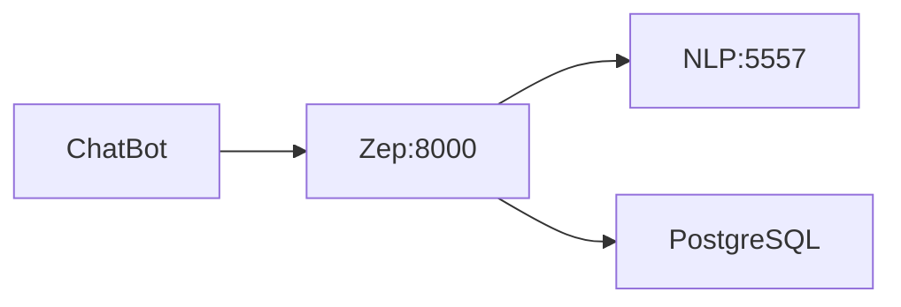
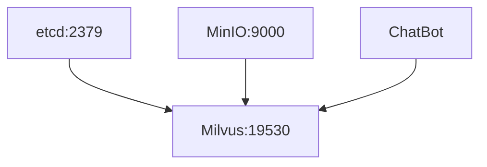
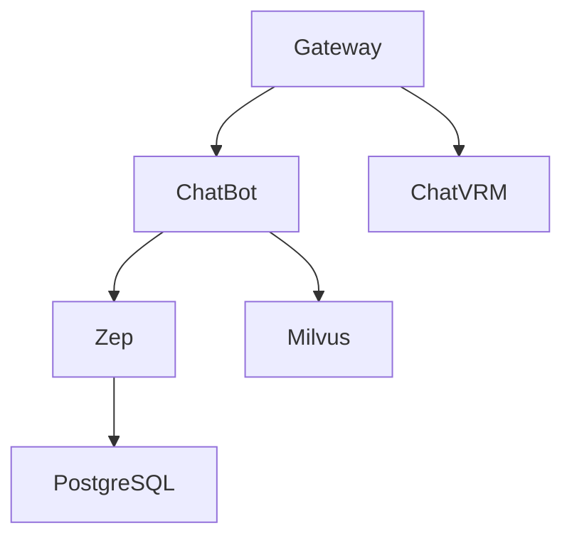

# 部署拓扑

<cite>
**本文引用的文件**
- [docker-compose.yaml](file://installer/docker-compose.yaml)
- [Dockerfile.ChatBot](file://infrastructure-packaging/Dockerfile.ChatBot)
- [Dockerfile.ChatVRM](file://infrastructure-packaging/Dockerfile.ChatVRM)
- [Dockerfile.Gateway](file://infrastructure-packaging/Dockerfile.Gateway)
- [default.conf](file://infrastructure-gateway/conf.d/default.conf)
- [chatbot.conf](file://infrastructure-gateway/conf.d/server/chatbot.conf)
- [chatvrm.conf](file://infrastructure-gateway/conf.d/server/chatvrm.conf)
- [ups-chatbot.conf](file://infrastructure-gateway/conf.d/upstream/ups-chatbot.conf)
- [ups-chatvrm.conf](file://infrastructure-gateway/conf.d/upstream/ups-chatvrm.conf)
- [docker-compose-dev.yaml](file://installer/experiment/docker-compose-dev.yaml)
- [requirements.txt](file://domain-chatbot/requirements.txt)
- [package.json](file://domain-chatvrm/package.json)
- [docker-compose.yml](file://installer/milvus/docker-compose.yml)
- [upload.sh](file://installer/zep/upload.sh)
- [develop.md](file://develop.md)
</cite>

## 目录
1. [简介](#简介)
2. [项目结构](#项目结构)
3. [核心组件](#核心组件)
4. [架构总览](#架构总览)
5. [组件详细分析](#组件详细分析)
6. [依赖关系分析](#依赖关系分析)
7. [性能与可扩展性](#性能与可扩展性)
8. [故障排查指南](#故障排查指南)
9. [结论](#结论)
10. [附录](#附录)

## 简介
本文件面向生产环境，系统化阐述 VirtualWife 的部署拓扑与容器编排方案，覆盖以下要点：
- Docker 容器编排与网络隔离
- Nginx/OpenResty 反向代理与路由规则
- 负载均衡策略与高可用设计建议
- 微服务间通信、服务发现与健康检查
- 环境变量管理、配置文件组织与密钥安全
- 外部依赖集成：数据库、向量存储、AI 服务
- 部署拓扑图与容器间依赖关系图

## 项目结构
VirtualWife 采用多模块分层与容器化部署：
- 前端应用：ChatVRM（Next.js）运行于 Node.js
- 后端服务：ChatBot（Django/ASGI）提供对话、记忆、媒体等能力
- 网关：Gateway（OpenResty/Nginx）统一入口与反向代理
- 外部依赖：Zep（消息记忆）、Milvus（向量检索）、PostgreSQL（持久化）

图表来源
- [docker-compose.yaml](file://installer/docker-compose.yaml#L1-L44)
- [default.conf](file://infrastructure-gateway/conf.d/default.conf#L38-L56)
- [chatbot.conf](file://infrastructure-gateway/conf.d/server/chatbot.conf#L1-L22)
- [chatvrm.conf](file://infrastructure-gateway/conf.d/server/chatvrm.conf#L1-L16)
- [ups-chatbot.conf](file://infrastructure-gateway/conf.d/upstream/ups-chatbot.conf#L1-L4)
- [ups-chatvrm.conf](file://infrastructure-gateway/conf.d/upstream/ups-chatvrm.conf#L1-L4)

章节来源
- [docker-compose.yaml](file://installer/docker-compose.yaml#L1-L44)
- [Dockerfile.ChatBot](file://infrastructure-packaging/Dockerfile.ChatBot#L1-L31)
- [Dockerfile.ChatVRM](file://infrastructure-packaging/Dockerfile.ChatVRM#L1-L29)
- [Dockerfile.Gateway](file://infrastructure-packaging/Dockerfile.Gateway#L1-L4)

## 核心组件
- ChatBot（后端 API 与实时能力）
  - 容器镜像：okapi0129/virtualwife-chatbot
  - 端口：8000
  - 依赖：Zep（消息记忆）、Milvus（向量检索）、外部 LLM 服务（如 OpenAI）
  - 关键运行参数：时区、环境变量文件
- ChatVRM（前端交互）
  - 容器镜像：okapi0129/virtualwife-chatvrm
  - 端口：3000
  - 依赖：后端 API（通过 Gateway 路由）
- Gateway（反向代理与入口）
  - 容器镜像：okapi0129/virtualwife-gateway
  - 端口：80/443（可配置）
  - 功能：路由分发、CORS、缓存、WebSocket 升级、日志格式化
- 外部依赖
  - Zep：消息记忆与嵌入抽取（含 NLP 服务）
  - Milvus：向量相似度检索
  - PostgreSQL：Zep 数据持久化

章节来源
- [docker-compose.yaml](file://installer/docker-compose.yaml#L5-L39)
- [Dockerfile.ChatBot](file://infrastructure-packaging/Dockerfile.ChatBot#L1-L31)
- [Dockerfile.ChatVRM](file://infrastructure-packaging/Dockerfile.ChatVRM#L1-L29)
- [Dockerfile.Gateway](file://infrastructure-packaging/Dockerfile.Gateway#L1-L4)
- [requirements.txt](file://domain-chatbot/requirements.txt#L1-L33)
- [package.json](file://domain-chatvrm/package.json#L1-L51)

## 架构总览
生产环境采用单机或集群编排（Compose/Docker Swarm/Kubernetes），核心原则：
- 网络隔离：服务置于同一自定义桥接网络，确保内部可达
- 统一入口：Gateway 负责对外暴露与路由
- 无状态前端：ChatVRM 无状态，便于横向扩展
- 有状态后端：ChatBot 通过环境变量与外部依赖协作
- 外部依赖独立编排：Zep/Milvus/PostgreSQL 作为独立服务

图表来源
- [docker-compose.yaml](file://installer/docker-compose.yaml#L3-L43)
- [chatbot.conf](file://infrastructure-gateway/conf.d/server/chatbot.conf#L1-L22)
- [chatvrm.conf](file://infrastructure-gateway/conf.d/server/chatvrm.conf#L1-L16)
- [ups-chatbot.conf](file://infrastructure-gateway/conf.d/upstream/ups-chatbot.conf#L1-L4)
- [ups-chatvrm.conf](file://infrastructure-gateway/conf.d/upstream/ups-chatvrm.conf#L1-L4)

## 组件详细分析

### ChatBot 容器化与运行参数
- 基础镜像与构建
  - Python 3.10.12 基础镜像
  - 复制应用代码并安装依赖（使用国内镜像源）
  - 清理缓存与临时文件，减少镜像体积
- 运行时
  - 端口暴露：8000
  - 默认启动命令：Django runserver 绑定 0.0.0.0:8000
  - 关键环境变量：OPENAI_API_KEY、B_STATION_ID、B_UID、TIMEZONE
- 依赖与能力
  - LLM 接入：OpenAI、Zhipu、Ollama 等
  - 记忆与向量：Zep、Milvus
  - 实时通信：WebSocket（Channels/Daphne）
  - 多媒体：TTS、翻译、B站直播集成

图表来源
- [Dockerfile.ChatBot](file://infrastructure-packaging/Dockerfile.ChatBot#L1-L31)
- [requirements.txt](file://domain-chatbot/requirements.txt#L1-L33)

章节来源
- [Dockerfile.ChatBot](file://infrastructure-packaging/Dockerfile.ChatBot#L1-L31)
- [requirements.txt](file://domain-chatbot/requirements.txt#L1-L33)

### ChatVRM 容器化与运行参数
- 构建流程
  - 多阶段构建：构建阶段安装依赖并打包 Next.js；生产阶段仅运行时依赖
  - 使用国内 npm 镜像加速
- 运行时
  - 端口暴露：3000
  - 启动命令：npm run start（Next.js 生产模式）
- 依赖与能力
  - React/Three.js/VRM 动画渲染
  - 与后端 API 通信（通过 Gateway）

图表来源
- [Dockerfile.ChatVRM](file://infrastructure-packaging/Dockerfile.ChatVRM#L1-L29)
- [package.json](file://domain-chatvrm/package.json#L1-L51)

章节来源
- [Dockerfile.ChatVRM](file://infrastructure-packaging/Dockerfile.ChatVRM#L1-L29)
- [package.json](file://domain-chatvrm/package.json#L1-L51)

### Gateway（Nginx/OpenResty）反向代理与路由
- 全局配置
  - 日志格式化为 JSON，输出到 stdout
  - 缓存配置：proxy_cache_path、buffer 大小
  - WebSocket 支持：map $http_upgrade $connection_upgrade
- 虚拟主机与路由
  - ChatBot 路由：/api/chatbot、/api/media → upstream chatbot
  - ChatVRM 路由：根路径 / → upstream chatvrm
  - CORS 头注入：允许跨域、凭证传递
- 上游服务
  - chatbot:8000
  - chatvrm:3000

图表来源
- [default.conf](file://infrastructure-gateway/conf.d/default.conf#L1-L56)
- [chatbot.conf](file://infrastructure-gateway/conf.d/server/chatbot.conf#L1-L22)
- [chatvrm.conf](file://infrastructure-gateway/conf.d/server/chatvrm.conf#L1-L16)
- [ups-chatbot.conf](file://infrastructure-gateway/conf.d/upstream/ups-chatbot.conf#L1-L4)
- [ups-chatvrm.conf](file://infrastructure-gateway/conf.d/upstream/ups-chatvrm.conf#L1-L4)

章节来源
- [default.conf](file://infrastructure-gateway/conf.d/default.conf#L1-L56)
- [chatbot.conf](file://infrastructure-gateway/conf.d/server/chatbot.conf#L1-L22)
- [chatvrm.conf](file://infrastructure-gateway/conf.d/server/chatvrm.conf#L1-L16)
- [ups-chatbot.conf](file://infrastructure-gateway/conf.d/upstream/ups-chatbot.conf#L1-L4)
- [ups-chatvrm.conf](file://infrastructure-gateway/conf.d/upstream/ups-chatvrm.conf#L1-L4)

### 外部依赖集成

#### Zep（消息记忆与嵌入抽取）
- 服务组成
  - Zep：主服务，监听 8000
  - NLP：嵌入抽取服务，监听 5557
  - Postgres：数据持久化
- 依赖关系
  - Zep 依赖 Postgres 与 NLP
  - ChatBot 通过环境变量连接 Zep
- 健康检查
  - Zep：TCP 8000
  - NLP：TCP 5557
  - Postgres：pg_isready

图表来源
- [docker-compose-dev.yaml](file://installer/experiment/docker-compose-dev.yaml#L3-L77)

章节来源
- [docker-compose-dev.yaml](file://installer/experiment/docker-compose-dev.yaml#L1-L77)

#### Milvus（向量存储）
- 服务组成
  - etcd：KV 存储
  - minio：对象存储
  - standalone：Milvus 主服务
- 端口映射
  - 19530：客户端连接
  - 9091：监控
- 依赖关系
  - Milvus 依赖 etcd 与 minio
  - ChatBot 通过环境变量连接 Milvus

图表来源
- [docker-compose.yml](file://installer/milvus/docker-compose.yml#L1-L49)

章节来源
- [docker-compose.yml](file://installer/milvus/docker-compose.yml#L1-L49)

## 依赖关系分析
- 容器间依赖
  - ChatBot 依赖 Zep、Milvus、外部 LLM 服务
  - ChatVRM 依赖 ChatBot（通过 Gateway）
  - Gateway 依赖 ChatBot 与 ChatVRM
- 网络依赖
  - 所有服务位于同一自定义桥接网络，内部通过服务名访问
- 环境变量与密钥
  - 通过 env_file 引用 .env 文件
  - 敏感信息（如 API Key）集中于 .env 并由编排工具注入

图表来源
- [docker-compose.yaml](file://installer/docker-compose.yaml#L3-L43)
- [docker-compose-dev.yaml](file://installer/experiment/docker-compose-dev.yaml#L3-L77)
- [docker-compose.yml](file://installer/milvus/docker-compose.yml#L1-L49)

章节来源
- [docker-compose.yaml](file://installer/docker-compose.yaml#L1-L44)
- [docker-compose-dev.yaml](file://installer/experiment/docker-compose-dev.yaml#L1-L77)
- [docker-compose.yml](file://installer/milvus/docker-compose.yml#L1-L49)

## 性能与可扩展性
- 负载均衡策略
  - 当前：单实例上游，无内置负载均衡
  - 建议：在 Gateway 层引入 upstream 多实例或使用外部 LB（如 HAProxy、K8s Service）
- 缓存与静态资源
  - Gateway 已启用 proxy_cache_path，可按需调整缓存键与过期策略
- 并发与线程
  - ChatBot 使用 gunicorn+gevent，适合 I/O 密集型
  - ChatVRM 使用 Next.js 生产模式，具备良好并发能力
- 网络与超时
  - ChatVRM 路由设置了较长的 proxy_connect_timeout，适配多媒体处理场景
- 健康检查
  - Zep、NLP、Postgres 提供健康检查，建议在编排平台启用重启策略与探针

章节来源
- [default.conf](file://infrastructure-gateway/conf.d/default.conf#L25-L30)
- [chatvrm.conf](file://infrastructure-gateway/conf.d/server/chatvrm.conf#L7-L12)
- [docker-compose-dev.yaml](file://installer/experiment/docker-compose-dev.yaml#L18-L68)

## 故障排查指南
- 网络连通性
  - ChatBot 无法访问 Zep/Milvus：确认容器网络、服务名与端口映射
  - ChatVRM 无法访问 ChatBot：确认 Gateway 路由与上游配置
- 健康检查失败
  - Zep：检查 NLP 是否就绪、Postgres 是否可用
  - Milvus：检查 etcd 与 minio 健康状态
- 日志定位
  - Gateway 使用 JSON 日志格式输出到 stdout，便于集中采集
- 环境变量问题
  - 确认 .env 文件存在且被正确挂载
  - 特别关注敏感信息（如 OPENAI_API_KEY、B 站相关配置）

章节来源
- [default.conf](file://infrastructure-gateway/conf.d/default.conf#L22-L23)
- [docker-compose-dev.yaml](file://installer/experiment/docker-compose-dev.yaml#L18-L68)
- [docker-compose.yml](file://installer/milvus/docker-compose.yml#L25-L29)

## 结论
本部署拓扑以 Gateway 为统一入口，ChatBot 与 ChatVRM 分别承担后端 API 与前端交互职责，外部依赖通过独立容器编排实现解耦。建议在生产环境中引入多实例上游、外部负载均衡与集中式日志/监控，以进一步提升可用性与可观测性。

## 附录

### 环境变量与配置文件组织
- 环境变量
  - 通过 env_file 引用 .env，支持时区、端口、密钥等
  - ChatBot 镜像内预设部分默认值（如 TIMEZONE），可在编排中覆盖
- 配置文件
  - ChatBot：settings.py、sys_config.json 等
  - ChatVRM：next.config.js、tailwind.config.js 等
  - Gateway：OpenResty 配置位于 conf.d 下，按功能拆分

章节来源
- [docker-compose.yaml](file://installer/docker-compose.yaml#L12-L15)
- [Dockerfile.ChatBot](file://infrastructure-packaging/Dockerfile.ChatBot#L22-L25)
- [develop.md](file://develop.md#L34-L37)

### 开发与本地验证参考
- 本地开发步骤（ChatBot/ChatVRM）可参考开发文档，用于验证环境变量与依赖加载

章节来源
- [develop.md](file://develop.md#L22-L71)