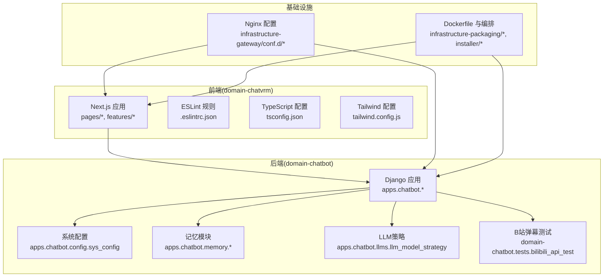
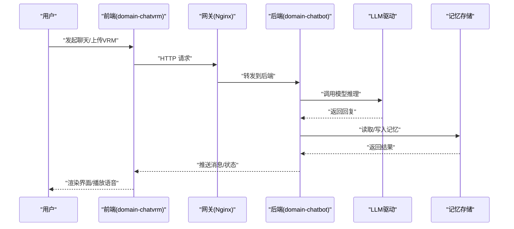
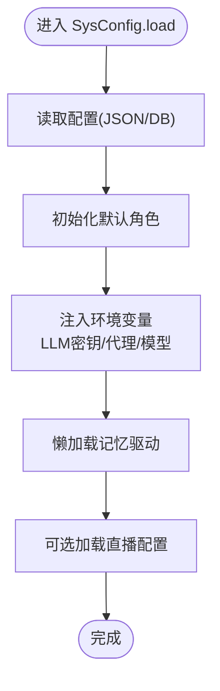
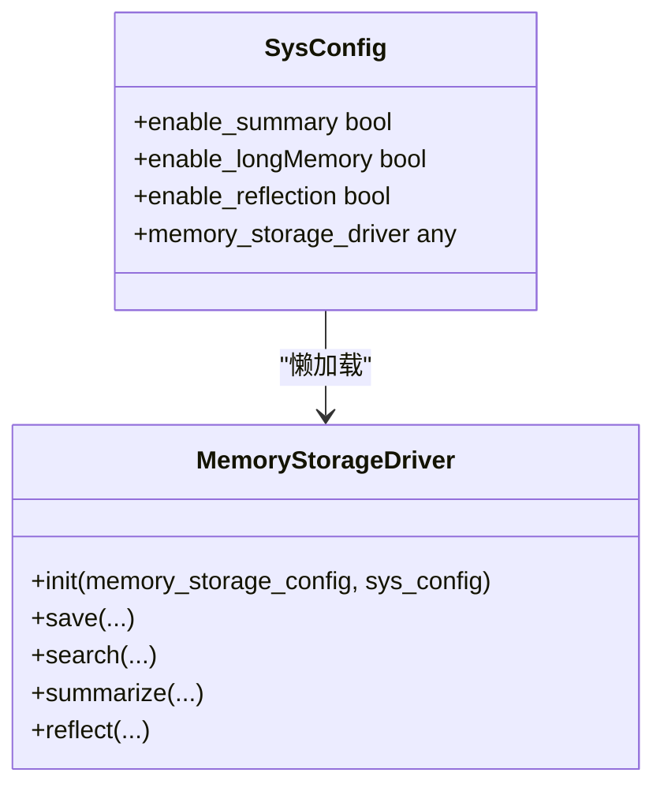
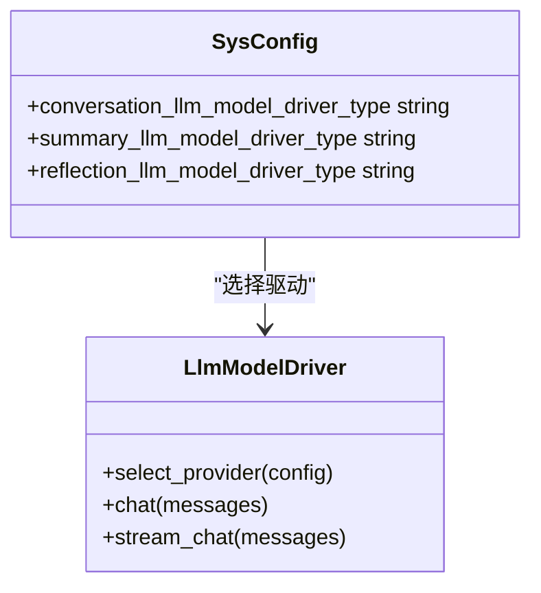
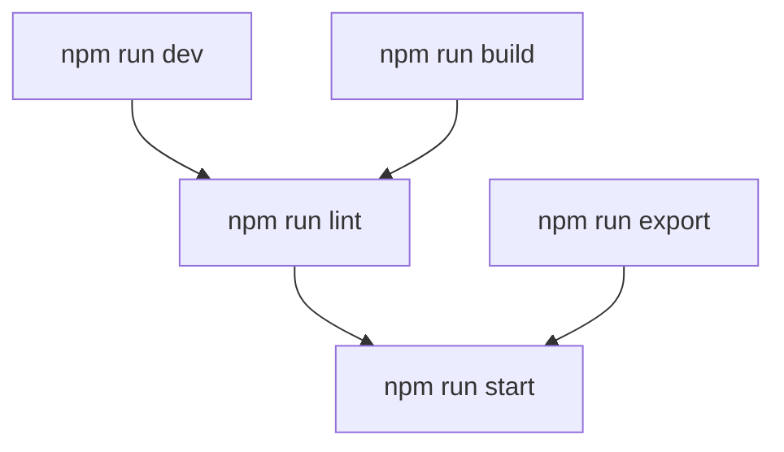
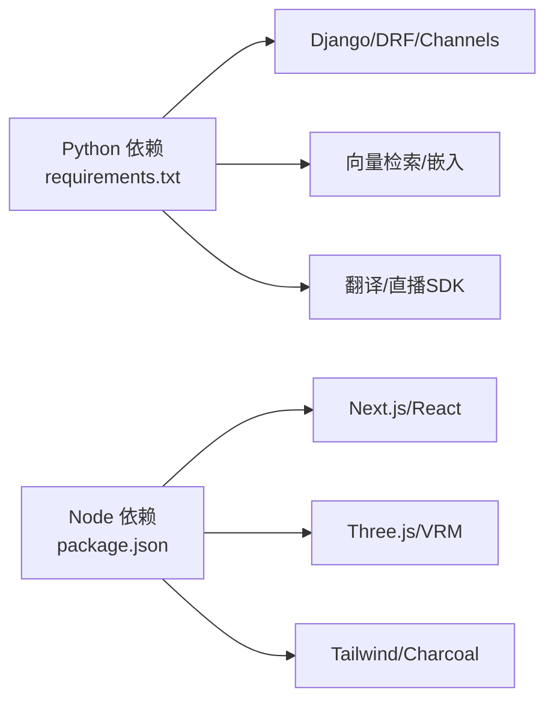
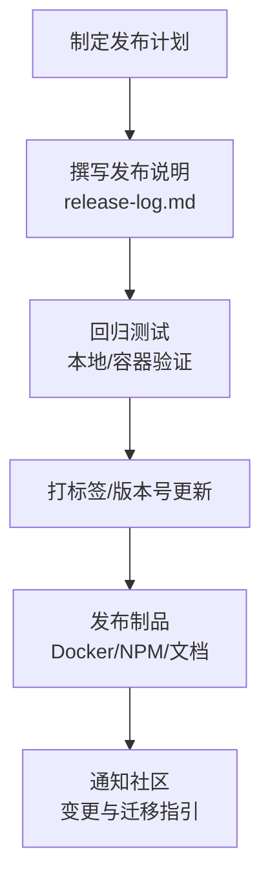

# 贡献指南

<cite>
**本文引用的文件**
- [develop.md](file://develop.md)
- [FAQ.md](file://FAQ.md)
- [release-log.md](file://release-log.md)
- [product.md](file://product.md)
- [requirements.txt](file://domain-chatbot/requirements.txt)
- [settings.py](file://domain-chatbot/VirtualWife/settings.py)
- [sys_config.py](file://domain-chatbot/apps/chatbot/config/sys_config.py)
- [manage.py](file://domain-chatbot/manage.py)
- [package.json](file://domain-chatvrm/package.json)
- [.eslintrc.json](file://domain-chatvrm/.eslintrc.json)
- [tsconfig.json](file://domain-chatvrm/tsconfig.json)
- [tailwind.config.js](file://domain-chatvrm/tailwind.config.js)
- [bilibili_api_test.py](file://domain-chatbot/tests/bilibili_api_test.py)
- [README.md](file://installer/README.md)
</cite>

## 目录
1. 引言
2. 项目结构
3. 核心组件
4. 架构总览
5. 详细组件分析
6. 依赖关系分析
7. 性能考虑
8. 故障排除指南
9. 版本发布流程
10. 社区参与与协作
11. 新贡献者入门
12. 结论

## 引言
本贡献指南面向开源贡献者，提供VirtualWife项目的开发流程、代码规范、提交规范、分支管理策略、代码审查流程、版本发布流程、社区参与方式以及新贡献者入门指导。文档基于仓库现有文件整理，确保内容可追溯至实际源文件。

## 项目结构
VirtualWife采用多模块架构：
- domain-chatbot：基于Django/Channels的后端服务，包含聊天机器人、角色、记忆、LLM接入、弹幕监听等子域。
- domain-chatvrm：基于Next.js/TypeScript的前端应用，负责VRM交互、TTS、翻译、直播弹幕展示等。
- infrastructure-gateway：Nginx配置，用于反向代理与上游服务路由。
- infrastructure-packaging：容器化构建脚本，分别打包ChatBot、ChatVRM与Gateway。
- installer：安装器与部署说明，包含docker-compose编排、启动脚本与环境变量模板。
- docs：文档资源与截图。

图表来源
- [settings.py](file://domain-chatbot/VirtualWife/settings.py#L37-L50)
- [sys_config.py](file://domain-chatbot/apps/chatbot/config/sys_config.py#L32-L51)
- [package.json](file://domain-chatvrm/package.json#L1-L51)
- [.eslintrc.json](file://domain-chatvrm/.eslintrc.json#L1-L4)
- [tsconfig.json](file://domain-chatvrm/tsconfig.json#L1-L25)
- [tailwind.config.js](file://domain-chatvrm/tailwind.config.js#L1-L39)

章节来源
- [develop.md](file://develop.md#L1-L73)
- [product.md](file://product.md#L1-L15)

## 核心组件
- 系统配置与运行时注入：系统配置通过JSON文件与数据库双轨持久化，并在启动时注入环境变量（如LLM密钥、代理、模型参数）。该组件负责懒加载记忆存储驱动与初始化默认角色。
- 记忆模块：支持本地与外部存储（Milvus/Zep），并提供摘要与反思能力开关。
- LLM策略：统一抽象不同模型驱动（OpenAI/Ollama/智谱），按配置动态切换。
- 前端配置：Next.js + TypeScript + Tailwind + ESLint，遵循Next.js核心Web Vitals规则，路径别名@/*映射至src。

章节来源
- [sys_config.py](file://domain-chatbot/apps/chatbot/config/sys_config.py#L32-L208)
- [settings.py](file://domain-chatbot/VirtualWife/settings.py#L95-L104)
- [package.json](file://domain-chatvrm/package.json#L1-L51)
- [.eslintrc.json](file://domain-chatvrm/.eslintrc.json#L1-L4)
- [tsconfig.json](file://domain-chatvrm/tsconfig.json#L18-L21)

## 架构总览
后端通过Django Channels提供WebSocket与异步任务能力；前端通过Next.js提供实时消息队列消费与VRM交互；Nginx作为网关统一入口；Docker编排实现服务解耦与扩展。

图表来源
- [settings.py](file://domain-chatbot/VirtualWife/settings.py#L146-L152)
- [sys_config.py](file://domain-chatbot/apps/chatbot/config/sys_config.py#L17-L29)
- [package.json](file://domain-chatvrm/package.json#L5-L12)

## 详细组件分析

### 系统配置组件
- 职责：加载/保存系统配置，注入环境变量，初始化默认角色，懒加载记忆驱动。
- 关键点：配置来源优先级、异常回退、代理与模型参数注入、日志输出。
- 复杂度：O(1)读取/保存，初始化阶段存在数据库与文件IO开销。

图表来源
- [sys_config.py](file://domain-chatbot/apps/chatbot/config/sys_config.py#L83-L208)

章节来源
- [sys_config.py](file://domain-chatbot/apps/chatbot/config/sys_config.py#L32-L208)

### 记忆模块组件
- 职责：封装本地与外部存储（Milvus/Zep），提供检索、摘要与反思能力。
- 关键点：配置项与驱动解耦、异常处理、性能与容量规划。
- 复杂度：检索复杂度取决于向量库实现，建议结合索引与过滤策略。

图表来源
- [sys_config.py](file://domain-chatbot/apps/chatbot/config/sys_config.py#L17-L29)

章节来源
- [sys_config.py](file://domain-chatbot/apps/chatbot/config/sys_config.py#L17-L29)

### LLM策略组件
- 职责：统一抽象不同模型驱动，按配置选择OpenAI/Ollama/智谱等。
- 关键点：环境变量注入、模型切换、流式响应支持。
- 复杂度：调用链路为O(1)，主要受网络与模型响应时间影响。

图表来源
- [sys_config.py](file://domain-chatbot/apps/chatbot/config/sys_config.py#L159-L183)

章节来源
- [sys_config.py](file://domain-chatbot/apps/chatbot/config/sys_config.py#L159-L183)

### 前端组件与配置
- ESLint：继承Next.js核心Web Vitals规则，保证代码风格与性能基线。
- TypeScript：严格模式、路径别名@/*、增量编译。
- Tailwind：主题预设与暗色模式、字体与颜色扩展。
- Next.js：开发/构建/打包/校验脚本，支持lint集成。

图表来源
- [package.json](file://domain-chatvrm/package.json#L5-L12)
- [.eslintrc.json](file://domain-chatvrm/.eslintrc.json#L1-L4)
- [tsconfig.json](file://domain-chatvrm/tsconfig.json#L18-L21)
- [tailwind.config.js](file://domain-chatvrm/tailwind.config.js#L1-L39)

章节来源
- [package.json](file://domain-chatvrm/package.json#L1-L51)
- [.eslintrc.json](file://domain-chatvrm/.eslintrc.json#L1-L4)
- [tsconfig.json](file://domain-chatvrm/tsconfig.json#L1-L25)
- [tailwind.config.js](file://domain-chatvrm/tailwind.config.js#L1-L39)

## 依赖关系分析
- Python后端依赖集中在requirements.txt，涵盖Django生态、REST框架、Channels、向量检索、翻译与直播SDK等。
- Node前端依赖集中在package.json，包含Next.js、React、Three.js、Tailwind与类型声明。
- 运行时环境：Python 3.10.12、Node 16.14.2（前端工程引擎要求）。

图表来源
- [requirements.txt](file://domain-chatbot/requirements.txt#L1-L33)
- [package.json](file://domain-chatvrm/package.json#L13-L33)

章节来源
- [requirements.txt](file://domain-chatbot/requirements.txt#L1-L33)
- [package.json](file://domain-chatvrm/package.json#L1-L51)

## 性能考虑
- 日志轮转：Django日志配置包含文件轮转与编码设置，避免中文乱码与磁盘膨胀。
- 线程与并发：系统配置中禁用tokenizer并行，减少多进程竞争；Channels提供异步消息层。
- 前端构建：TypeScript增量编译与Next.js构建缓存，提升迭代效率。
- 记忆检索：建议结合索引策略与过滤条件，降低检索延迟。

章节来源
- [settings.py](file://domain-chatbot/VirtualWife/settings.py#L160-L207)
- [sys_config.py](file://domain-chatbot/apps/chatbot/config/sys_config.py#L90-L90)

## 故障排除指南
- OpenAI访问问题（Docker环境）：检查代理设置与宿主DNS解析，必要时开启HTTP代理。
- Milvus安装：确保版本与编排文件一致，提前安装Docker与Compose。
- npm run dev 报错：删除锁文件后重新安装依赖。
- B站弹幕监听：核对房间ID与Cookie完整性，确保复制完整字段。

章节来源
- [FAQ.md](file://FAQ.md#L42-L49)
- [FAQ.md](file://FAQ.md#L34-L40)
- [FAQ.md](file://FAQ.md#L56-L69)
- [FAQ.md](file://FAQ.md#L71-L85)

## 版本发布流程
- 版本号管理：前端使用package.json中的version字段；后端版本未在当前仓库显式暴露，建议通过Git标签与发布说明同步。
- 变更日志维护：release-log.md按版本维护“发布内容/修复/已知问题”清单，便于追踪。
- 发布说明编写：建议在GitHub Releases中同步release-log.md内容，补充迁移步骤与依赖更新提示。
- 数据库迁移：若涉及模型变更，需执行迁移命令并附带迁移脚本说明。

图表来源
- [release-log.md](file://release-log.md#L1-L115)

章节来源
- [release-log.md](file://release-log.md#L1-L115)
- [package.json](file://domain-chatvrm/package.json#L3-L3)

## 社区参与与协作
- Issue报告：遇到问题先查阅FAQ与发布日志，确认是否为已知问题；复现步骤、环境信息、日志片段越详细越好。
- 功能请求：描述使用场景、期望行为与验收标准，必要时附上原型图或Mockup。
- 讨论参与：关注Release Log中的“待确定/计划”条目，参与设计评审与技术选型讨论。
- Pull Request：遵循分支管理策略，提交前确保通过本地与CI校验（lint/build/test），并在PR中说明变更动机、影响范围与回滚预案。

## 新贡献者入门
- 环境搭建：参考本地开发文档，准备Python 3.10.12与Node 16.14.2，使用conda创建隔离环境。
- 启动后端：安装依赖、初始化数据库、运行Django开发服务器。
- 启动前端：清理锁文件、安装依赖、启动Next.js开发服务器。
- 熟悉项目结构：从apps/chatbot与domain-chatvrm入手，理解配置、记忆、LLM与前端交互。
- 设计原则：统一抽象LLM驱动、最小化配置耦合、日志可观测性、前后端职责分离。
- 开源协作：遵循PR流程、保持沟通透明、尊重审查意见、及时更新文档。

章节来源
- [develop.md](file://develop.md#L1-L73)
- [product.md](file://product.md#L1-L15)

## 结论
本指南基于仓库现有文件梳理了VirtualWife的开发与发布流程、代码规范与协作方式。建议在后续迭代中补充：
- 明确分支命名与保护规则；
- 增加CI/CD流水线与自动化测试；
- 统一许可证与贡献者协议说明；
- 完善API文档与SDK示例。