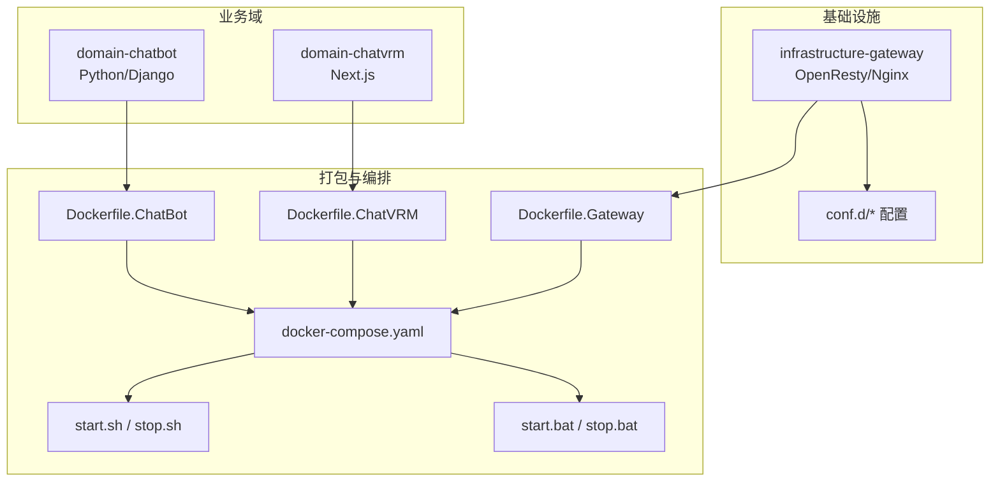
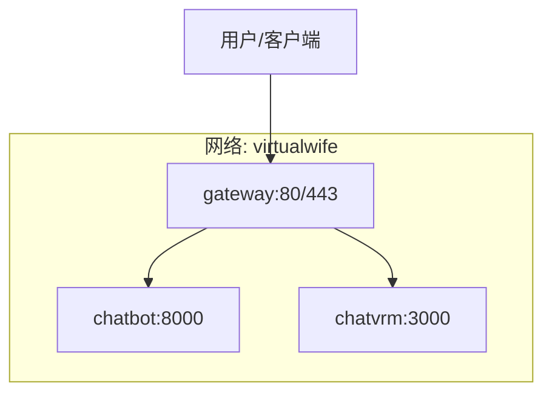
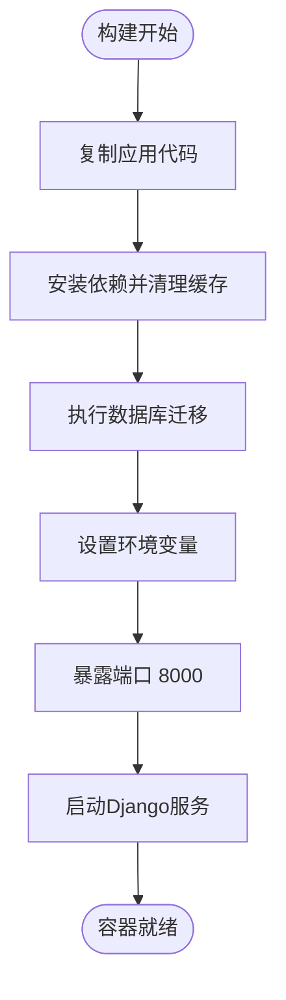
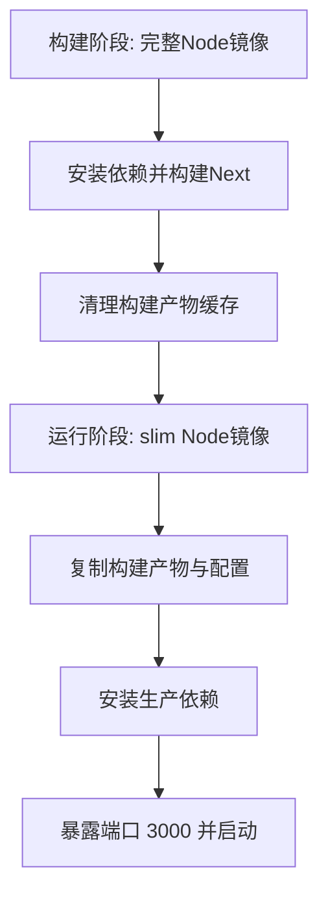
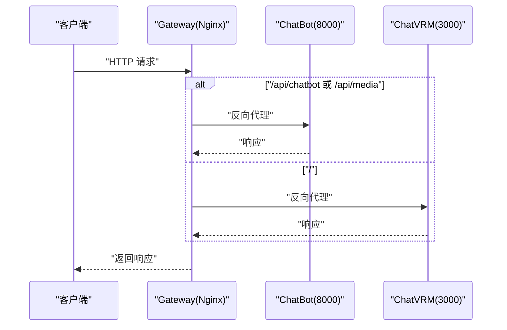
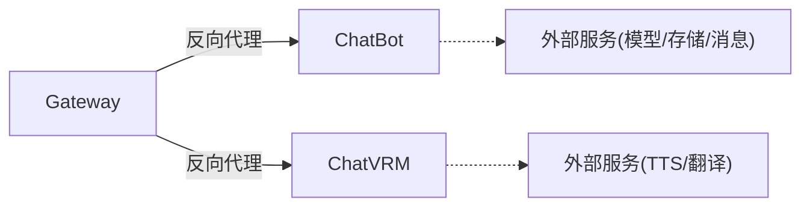

# Docker容器化部署

<cite>
**本文引用的文件**
- [Dockerfile.ChatBot](file://infrastructure-packaging/Dockerfile.ChatBot)
- [Dockerfile.ChatVRM](file://infrastructure-packaging/Dockerfile.ChatVRM)
- [Dockerfile.Gateway](file://infrastructure-packaging/Dockerfile.Gateway)
- [docker-compose.yaml](file://installer/docker-compose.yaml)
- [start.sh](file://installer/linux/start.sh)
- [stop.sh](file://installer/linux/stop.sh)
- [start.bat](file://installer/windows/start.bat)
- [stop.bat](file://installer/windows/stop.bat)
- [requirements.txt](file://domain-chatbot/requirements.txt)
- [package.json](file://domain-chatvrm/package.json)
- [manage.py](file://domain-chatbot/manage.py)
- [next.config.js](file://domain-chatvrm/next.config.js)
- [default.conf](file://infrastructure-gateway/conf.d/default.conf)
- [chatbot.conf](file://infrastructure-gateway/conf.d/server/chatbot.conf)
- [chatvrm.conf](file://infrastructure-gateway/conf.d/server/chatvrm.conf)
- [ups-chatbot.conf](file://infrastructure-gateway/conf.d/upstream/ups-chatbot.conf)
</cite>

## 目录
1. [简介](#简介)
2. [项目结构](#项目结构)
3. [核心组件](#核心组件)
4. [架构总览](#架构总览)
5. [详细组件分析](#详细组件分析)
6. [依赖关系分析](#依赖关系分析)
7. [性能考虑](#性能考虑)
8. [故障排查指南](#故障排查指南)
9. [结论](#结论)
10. [附录](#附录)

## 简介
本文件为VirtualWife项目的Docker容器化部署操作手册，面向DevOps工程师与运维人员。内容涵盖三类服务（ChatBot、ChatVRM、Gateway）的镜像构建流程、docker-compose编排文件详解、跨平台启动/停止脚本使用、容器间通信机制、健康检查与重启策略建议、资源限制与安全配置、日志与调试方法以及性能监控要点。文档同时提供可视化图示帮助理解系统架构与数据流。

## 项目结构
VirtualWife采用多模块分层设计：业务域位于domain-*目录，基础设施位于infrastructure-*目录，打包与编排位于installer与infrastructure-packaging目录。Docker相关文件主要分布在以下位置：
- ChatBot服务：基于Python/Django，入口通过Django管理命令运行。
- ChatVRM服务：基于Next.js前端应用，生产模式启动。
- Gateway服务：基于OpenResty/Nginx，负责反向代理与上游路由。
- 编排与脚本：docker-compose.yaml及跨平台启动/停止脚本。

图表来源
- [Dockerfile.ChatBot](file://infrastructure-packaging/Dockerfile.ChatBot#L1-L31)
- [Dockerfile.ChatVRM](file://infrastructure-packaging/Dockerfile.ChatVRM#L1-L29)
- [Dockerfile.Gateway](file://infrastructure-packaging/Dockerfile.Gateway#L1-L4)
- [docker-compose.yaml](file://installer/docker-compose.yaml#L1-L44)
- [start.sh](file://installer/linux/start.sh#L1-L2)
- [stop.sh](file://installer/linux/stop.sh#L1-L2)
- [start.bat](file://installer/windows/start.bat#L1-L3)
- [stop.bat](file://installer/windows/stop.bat#L1-L4)

章节来源
- [Dockerfile.ChatBot](file://infrastructure-packaging/Dockerfile.ChatBot#L1-L31)
- [Dockerfile.ChatVRM](file://infrastructure-packaging/Dockerfile.ChatVRM#L1-L29)
- [Dockerfile.Gateway](file://infrastructure-packaging/Dockerfile.Gateway#L1-L4)
- [docker-compose.yaml](file://installer/docker-compose.yaml#L1-L44)

## 核心组件
本节对三个核心服务进行容器化实现要点说明。

- ChatBot（Python/Django）
  - 基础镜像：官方Python运行时。
  - 工作目录与依赖：复制应用代码后，使用国内镜像源安装依赖；清理缓存与临时文件；执行数据库迁移。
  - 环境变量：预设多个API密钥与站点参数，实际部署建议通过环境文件覆盖。
  - 端口暴露与启动：对外暴露8000端口，使用Django管理命令在0.0.0.0:8000启动。
  - 依赖清单：包含Django、REST框架、Channels、Milvus、Zep等。

- ChatVRM（Next.js）
  - 多阶段构建：第一阶段使用完整Node镜像安装依赖并构建；第二阶段使用精简镜像仅保留运行时产物。
  - 运行时配置：生产模式启动Next.js应用，支持基础路径与反向代理场景。
  - 端口暴露与启动：对外暴露3000端口，使用Next启动命令。

- Gateway（OpenResty/Nginx）
  - 基础镜像：Fat Alpine版OpenResty，内置常用模块。
  - 配置组织：集中于conf.d目录，包含默认配置、vhost与上游配置，启用JSON访问日志与缓存。
  - 路由规则：分别针对ChatBot与ChatVRM的服务端点进行代理与CORS处理，支持WebSocket升级。

章节来源
- [Dockerfile.ChatBot](file://infrastructure-packaging/Dockerfile.ChatBot#L1-L31)
- [requirements.txt](file://domain-chatbot/requirements.txt#L1-L33)
- [Dockerfile.ChatVRM](file://infrastructure-packaging/Dockerfile.ChatVRM#L1-L29)
- [package.json](file://domain-chatvrm/package.json#L1-L51)
- [Dockerfile.Gateway](file://infrastructure-packaging/Dockerfile.Gateway#L1-L4)
- [default.conf](file://infrastructure-gateway/conf.d/default.conf#L1-L56)
- [chatbot.conf](file://infrastructure-gateway/conf.d/server/chatbot.conf#L1-L22)
- [chatvrm.conf](file://infrastructure-gateway/conf.d/server/chatvrm.conf#L1-L16)
- [ups-chatbot.conf](file://infrastructure-gateway/conf.d/upstream/ups-chatbot.conf#L1-L4)

## 架构总览
下图展示容器化后的整体拓扑：Gateway作为统一入口，将请求分发至ChatBot与ChatVRM；三者均加入同一bridge网络以实现服务发现与互通。

图表来源
- [docker-compose.yaml](file://installer/docker-compose.yaml#L3-L44)
- [default.conf](file://infrastructure-gateway/conf.d/default.conf#L38-L53)
- [chatbot.conf](file://infrastructure-gateway/conf.d/server/chatbot.conf#L1-L22)
- [chatvrm.conf](file://infrastructure-gateway/conf.d/server/chatvrm.conf#L1-L16)
- [ups-chatbot.conf](file://infrastructure-gateway/conf.d/upstream/ups-chatbot.conf#L1-L4)

## 详细组件分析

### ChatBot服务容器化
- 镜像构建要点
  - 复制应用根目录，安装依赖并清理缓存与临时文件，降低镜像体积。
  - 执行数据库迁移，确保首次启动即具备可用Schema。
  - 预设环境变量用于API密钥与站点参数，建议通过外部环境文件覆盖。
  - 暴露8000端口并以Django管理命令启动。

- 端口与网络
  - 映射主机8000端口至容器8000。
  - 加入自定义bridge网络virtualwife，便于服务间解析。

- 数据与持久化
  - 当前镜像未声明卷挂载；如需持久化数据库或日志，请在compose中添加卷映射。

- 环境变量与配置
  - 支持通过env_file加载外部环境变量，TZ用于时区设置。
  - Django入口通过管理命令启动，可结合gunicorn/ASGI服务器优化生产部署。

图表来源
- [Dockerfile.ChatBot](file://infrastructure-packaging/Dockerfile.ChatBot#L6-L20)
- [Dockerfile.ChatBot](file://infrastructure-packaging/Dockerfile.ChatBot#L22-L31)

章节来源
- [Dockerfile.ChatBot](file://infrastructure-packaging/Dockerfile.ChatBot#L1-L31)
- [requirements.txt](file://domain-chatbot/requirements.txt#L1-L33)
- [manage.py](file://domain-chatbot/manage.py#L1-L28)

### ChatVRM服务容器化
- 镜像构建要点
  - 多阶段构建：先完整Node镜像安装依赖并构建Next应用，再将产物复制到精简运行时镜像。
  - 清理.next与node_modules目录，减少最终镜像体积。
  - 生产模式启动Next应用，支持BASE_PATH等运行时配置。

- 端口与网络
  - 暴露3000端口，加入virtualwife网络。
  - 通过Gateway统一入口对外提供服务。

- 运行时配置
  - BASE_PATH可通过环境变量控制，适配反向代理场景。

图表来源
- [Dockerfile.ChatVRM](file://infrastructure-packaging/Dockerfile.ChatVRM#L1-L29)
- [package.json](file://domain-chatvrm/package.json#L1-L51)
- [next.config.js](file://domain-chatvrm/next.config.js#L1-L13)

章节来源
- [Dockerfile.ChatVRM](file://infrastructure-packaging/Dockerfile.ChatVRM#L1-L29)
- [package.json](file://domain-chatvrm/package.json#L1-L51)
- [next.config.js](file://domain-chatvrm/next.config.js#L1-L13)

### Gateway服务容器化
- 镜像构建要点
  - 基于fat Alpine OpenResty镜像，内置常用模块。
  - 将conf.d目录整体复制到容器内，集中管理vhost与上游配置。

- 路由与代理
  - ChatBot：代理/api/chatbot与/api/media，设置CORS头，支持WebSocket升级。
  - ChatVRM：代理根路径，设置转发头，禁用缓存头以避免静态资源缓存问题。
  - 上游：chatbot:8000，chatvrm:3000。

- 日志与缓存
  - 访问日志输出到标准输出，格式为JSON，便于日志聚合。
  - 启用代理缓存，配置缓存路径、层级与容量。

图表来源
- [default.conf](file://infrastructure-gateway/conf.d/default.conf#L38-L53)
- [chatbot.conf](file://infrastructure-gateway/conf.d/server/chatbot.conf#L1-L22)
- [chatvrm.conf](file://infrastructure-gateway/conf.d/server/chatvrm.conf#L1-L16)
- [ups-chatbot.conf](file://infrastructure-gateway/conf.d/upstream/ups-chatbot.conf#L1-L4)

章节来源
- [Dockerfile.Gateway](file://infrastructure-packaging/Dockerfile.Gateway#L1-L4)
- [default.conf](file://infrastructure-gateway/conf.d/default.conf#L1-L56)
- [chatbot.conf](file://infrastructure-gateway/conf.d/server/chatbot.conf#L1-L22)
- [chatvrm.conf](file://infrastructure-gateway/conf.d/server/chatvrm.conf#L1-L16)
- [ups-chatbot.conf](file://infrastructure-gateway/conf.d/upstream/ups-chatbot.conf#L1-L4)

## 依赖关系分析
- 组件耦合
  - ChatBot与ChatVRM通过Gateway统一入口对外提供服务，内部通过自定义bridge网络互通。
  - Gateway依赖上游配置文件定义的upstream与location规则。
- 外部依赖
  - ChatBot依赖LLM、向量库、消息队列等外部服务（具体取决于配置），需在部署环境中准备。
  - ChatVRM依赖TTS、翻译等外部服务，需在部署环境中准备。

图表来源
- [docker-compose.yaml](file://installer/docker-compose.yaml#L3-L44)
- [default.conf](file://infrastructure-gateway/conf.d/default.conf#L38-L53)
- [chatbot.conf](file://infrastructure-gateway/conf.d/server/chatbot.conf#L1-L22)
- [chatvrm.conf](file://infrastructure-gateway/conf.d/server/chatvrm.conf#L1-L16)

章节来源
- [docker-compose.yaml](file://installer/docker-compose.yaml#L1-L44)

## 性能考虑
- 缓存策略
  - Gateway启用了代理缓存，建议根据业务特性调整缓存键与过期时间，避免静态资源与接口缓存不一致。
- 日志与可观测性
  - Gateway访问日志输出为JSON，建议接入日志收集系统（如Filebeat/Fluent Bit）统一采集与索引。
- 端口与带宽
  - ChatVRM媒体资源较多，建议在Nginx侧开启gzip压缩与合理的超时配置，避免长连接阻塞。
- 资源限制
  - 建议在docker-compose中为各服务设置内存与CPU限制，防止资源争抢影响稳定性。

## 故障排查指南
- 启动/停止脚本
  - Linux：使用start.sh与stop.sh，分别调用docker-compose up -d与stop+rm组合。
  - Windows：使用start.bat与stop.bat，行为与Linux脚本一致。
- 常见问题定位
  - 网络连通：确认容器均加入virtualwife网络，Gateway能解析chatbot与chatvrm域名。
  - 端口占用：检查宿主机80/443/8000/3000是否被占用。
  - CORS与WebSocket：确认Gateway对ChatBot的CORS头与WebSocket升级配置正确。
  - 日志查看：Gateway访问日志输出到stdout，可通过docker logs查看；ChatBot/ChatVRM的日志可通过容器日志查看。
- 调试技巧
  - 临时进入容器：docker exec -it <container> /bin/sh，检查进程、端口监听与配置文件。
  - 网络抓包：使用tcpdump或curl测试上游可达性。
- 性能监控
  - 使用Docker stats观察CPU/内存；结合Gateway日志统计QPS与错误率。

章节来源
- [start.sh](file://installer/linux/start.sh#L1-L2)
- [stop.sh](file://installer/linux/stop.sh#L1-L2)
- [start.bat](file://installer/windows/start.bat#L1-L3)
- [stop.bat](file://installer/windows/stop.bat#L1-L4)
- [default.conf](file://infrastructure-gateway/conf.d/default.conf#L22-L22)

## 结论
本部署方案通过三类Dockerfile完成ChatBot、ChatVRM与Gateway的容器化，配合docker-compose实现服务编排与网络互通。Gateway作为统一入口，承担反向代理、CORS与WebSocket升级职责。建议在生产环境中补充健康检查、重启策略、资源限制与安全加固措施，并建立完善的日志与监控体系以保障系统稳定运行。

## 附录

### docker-compose编排详解
- 服务定义
  - chatbot：镜像tag可由环境变量覆盖，默认latest；映射8000端口；加入virtualwife网络；通过env_file加载环境变量。
  - chatvrm：镜像tag可由环境变量覆盖，默认latest；加入virtualwife网络；通过env_file加载环境变量。
  - gateway：镜像tag可由环境变量覆盖，默认latest；端口映射80/443；always重启策略；加入virtualwife网络；通过env_file加载环境变量。
- 网络配置
  - 自定义bridge网络virtualwife，容器间通过服务名互通。
- 卷挂载
  - 当前版本未声明卷挂载；如需持久化数据库或日志，请在compose中添加卷映射。
- 环境变量
  - TIMEZONE用于时区；ENV_FILE指向环境文件；部分服务预设了API密钥等敏感参数，建议通过env_file覆盖。

章节来源
- [docker-compose.yaml](file://installer/docker-compose.yaml#L1-L44)

### 跨平台部署指南
- Linux
  - 启动：./start.sh
  - 停止：./stop.sh
- Windows
  - 启动：start.bat
  - 停止：stop.bat

章节来源
- [start.sh](file://installer/linux/start.sh#L1-L2)
- [stop.sh](file://installer/linux/stop.sh#L1-L2)
- [start.bat](file://installer/windows/start.bat#L1-L3)
- [stop.bat](file://installer/windows/stop.bat#L1-L4)

### 容器间通信机制
- 服务发现
  - 通过服务名（chatbot、chatvrm）在Gateway中进行upstream解析。
- 端口映射
  - Gateway：80/443 -> 80/443；ChatBot：8000 -> 8000；ChatVRM：3000 -> 3000。
- 数据卷管理
  - 当前未声明卷；如需持久化数据库或日志，请在compose中添加卷映射。

章节来源
- [docker-compose.yaml](file://installer/docker-compose.yaml#L10-L39)
- [ups-chatbot.conf](file://infrastructure-gateway/conf.d/upstream/ups-chatbot.conf#L1-L4)

### 健康检查、重启策略与资源限制建议
- 健康检查
  - ChatBot/ChatVRM：建议在compose中添加healthcheck，探测HTTP端点或TCP端口。
  - Gateway：建议探测HTTP 200或反代上游状态。
- 重启策略
  - Gateway已设置always；可根据业务需求为其他服务设置unless-stopped或on-failure。
- 资源限制
  - 建议为ChatBot/ChatVRM设置memory限制，避免LLM推理导致内存溢出。

### 容器安全配置与最佳实践
- 网络隔离
  - 使用自定义bridge网络virtualwife，避免与宿主网络直接互通。
- 权限管理
  - 以非root用户运行（如需）并最小化容器内文件权限。
- 环境变量与密钥
  - 将敏感参数移出Dockerfile，统一通过env_file注入。
- 只读根文件系统
  - 对无需写盘的服务启用只读根文件系统，提升安全性。
- 入口与出口控制
  - 仅开放必要端口；在宿主防火墙或安全组中限制访问范围。