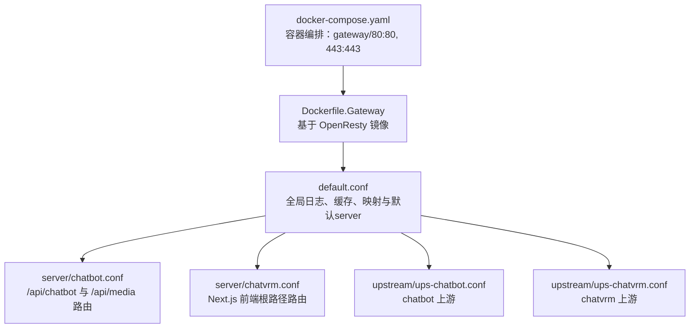
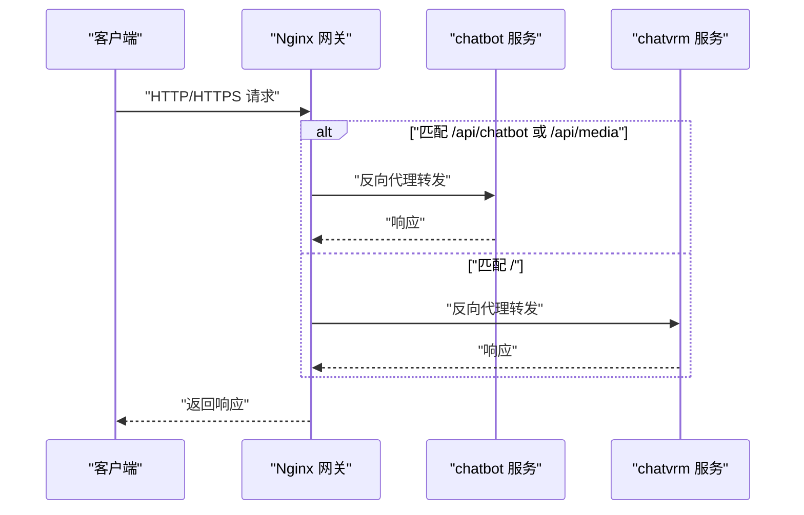
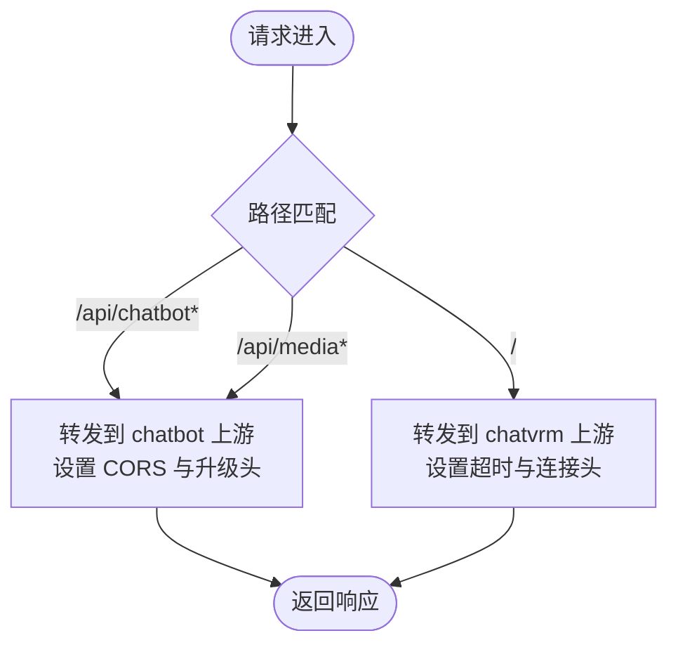
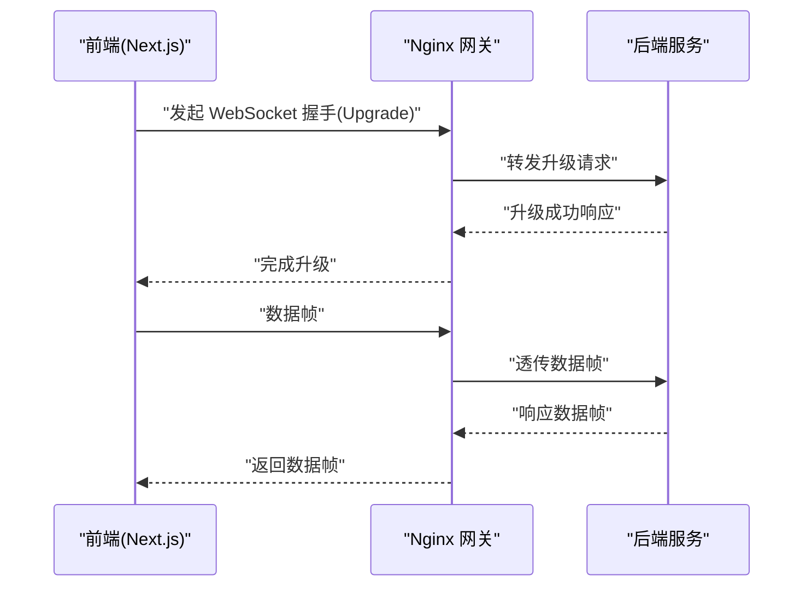
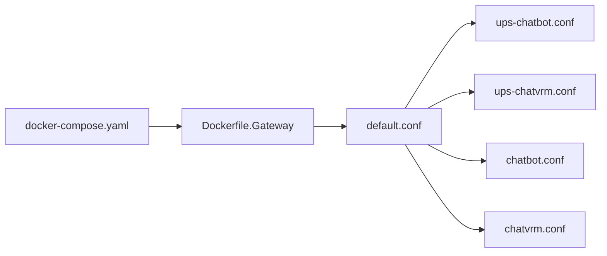

# Nginx网关配置

<cite>
**本文引用的文件**
- [default.conf](file://infrastructure-gateway/conf.d/default.conf)
- [chatbot.conf](file://infrastructure-gateway/conf.d/server/chatbot.conf)
- [chatvrm.conf](file://infrastructure-gateway/conf.d/server/chatvrm.conf)
- [ups-chatbot.conf](file://infrastructure-gateway/conf.d/upstream/ups-chatbot.conf)
- [ups-chatvrm.conf](file://infrastructure-gateway/conf.d/upstream/ups-chatvrm.conf)
- [Dockerfile.Gateway](file://infrastructure-packaging/Dockerfile.Gateway)
- [docker-compose.yaml](file://installer/docker-compose.yaml)
- [blivedm.ts](file://domain-chatvrm/src/features/blivedm/blivedm.ts)
- [index.tsx](file://domain-chatvrm/src/pages/index.tsx)
- [client.py](file://domain-chatbot/apps/chatbot/insight/bilibili/sdk/client.py)
</cite>

## 目录
1. [简介](#简介)
2. [项目结构](#项目结构)
3. [核心组件](#核心组件)
4. [架构总览](#架构总览)
5. [详细组件分析](#详细组件分析)
6. [依赖关系分析](#依赖关系分析)
7. [性能考虑](#性能考虑)
8. [故障排查指南](#故障排查指南)
9. [结论](#结论)
10. [附录](#附录)

## 简介
本文件为 VirtualWife 项目的 Nginx 网关配置专业参考，面向网络工程师与系统管理员。内容涵盖反向代理与路由规则、负载均衡策略、健康检查建议、静态资源处理（缓存与压缩）、SSL/TLS 与 HTTPS 重定向、WebSocket 支持、限流与防护、性能优化、以及配置验证、热重载与故障切换等运维实践。

## 项目结构
网关配置采用模块化组织，通过 include 方式加载上游与虚拟主机配置，便于扩展与维护。

**图表来源**
- [default.conf](file://infrastructure-gateway/conf.d/default.conf#L22-L55)
- [chatbot.conf](file://infrastructure-gateway/conf.d/server/chatbot.conf#L1-L22)
- [chatvrm.conf](file://infrastructure-gateway/conf.d/server/chatvrm.conf#L1-L16)
- [ups-chatbot.conf](file://infrastructure-gateway/conf.d/upstream/ups-chatbot.conf#L1-L4)
- [ups-chatvrm.conf](file://infrastructure-gateway/conf.d/upstream/ups-chatvrm.conf#L1-L4)
- [Dockerfile.Gateway](file://infrastructure-packaging/Dockerfile.Gateway#L1-L4)
- [docker-compose.yaml](file://installer/docker-compose.yaml#L27-L40)

**章节来源**
- [default.conf](file://infrastructure-gateway/conf.d/default.conf#L22-L55)
- [chatbot.conf](file://infrastructure-gateway/conf.d/server/chatbot.conf#L1-L22)
- [chatvrm.conf](file://infrastructure-gateway/conf.d/server/chatvrm.conf#L1-L16)
- [ups-chatbot.conf](file://infrastructure-gateway/conf.d/upstream/ups-chatbot.conf#L1-L4)
- [ups-chatvrm.conf](file://infrastructure-gateway/conf.d/upstream/ups-chatvrm.conf#L1-L4)
- [Dockerfile.Gateway](file://infrastructure-packaging/Dockerfile.Gateway#L1-L4)
- [docker-compose.yaml](file://installer/docker-compose.yaml#L27-L40)

## 核心组件
- 全局配置与通用行为
  - 日志格式与输出：使用 JSON 结构化日志并输出到标准输出，便于集中采集与分析。
  - 服务器头隐藏与安全头：关闭 server_tokens，添加自定义响应头以增强安全性与可追溯性。
  - 缓存与代理缓冲：配置代理缓冲大小与缓存路径，提升大文件与高并发场景下的稳定性。
  - WebSocket 升级映射：通过 map 将 $http_upgrade 映射为 $connection_upgrade，确保升级成功。
  - 默认 server：监听 80 端口，设置字符集、错误页与转发头，统一入口与跨域策略。

- 服务路由与反向代理
  - chatbot 服务：/api/chatbot 与 /api/media 路由，透传至 chatbot 上游；启用 CORS 头与 WebSocket 升级。
  - chatvrm 服务：根路径 / 路由，透传至 chatvrm 上游；设置连接超时、HTTP 版本与禁用分块传输编码，同时添加无缓存响应头。

- 上游集群
  - chatbot：单节点上游，监听 8000 端口。
  - chatvrm：单节点上游，监听 3000 端口。

**章节来源**
- [default.conf](file://infrastructure-gateway/conf.d/default.conf#L2-L55)
- [chatbot.conf](file://infrastructure-gateway/conf.d/server/chatbot.conf#L1-L22)
- [chatvrm.conf](file://infrastructure-gateway/conf.d/server/chatvrm.conf#L1-L16)
- [ups-chatbot.conf](file://infrastructure-gateway/conf.d/upstream/ups-chatbot.conf#L1-L4)
- [ups-chatvrm.conf](file://infrastructure-gateway/conf.d/upstream/ups-chatvrm.conf#L1-L4)

## 架构总览
下图展示从客户端到后端服务的请求路径与关键处理点。

**图表来源**
- [default.conf](file://infrastructure-gateway/conf.d/default.conf#L32-L55)
- [chatbot.conf](file://infrastructure-gateway/conf.d/server/chatbot.conf#L1-L22)
- [chatvrm.conf](file://infrastructure-gateway/conf.d/server/chatvrm.conf#L1-L16)

## 详细组件分析

### 反向代理与路由规则
- chatbot 路由
  - /api/chatbot：去除前缀后转发至 chatbot 上游；设置跨域相关头，支持 WebSocket 升级。
  - /api/media：媒体接口转发至 chatbot 上游；同样设置跨域与升级头。
- chatvrm 路由
  - /：根路径转发至 chatvrm 上游；设置连接超时、HTTP 版本与连接头，禁用分块传输编码，添加无缓存响应头。

**图表来源**
- [chatbot.conf](file://infrastructure-gateway/conf.d/server/chatbot.conf#L1-L22)
- [chatvrm.conf](file://infrastructure-gateway/conf.d/server/chatvrm.conf#L1-L16)

**章节来源**
- [chatbot.conf](file://infrastructure-gateway/conf.d/server/chatbot.conf#L1-L22)
- [chatvrm.conf](file://infrastructure-gateway/conf.d/server/chatvrm.conf#L1-L16)

### 负载均衡策略
- 当前实现
  - chatbot 与 chatvrm 均为单节点上游，未配置多后端实例。
- 扩展建议
  - 在对应 ups-*.conf 中增加多个 upstream server，结合轮询或加权策略提升可用性与吞吐。
  - 结合外部健康检查（如探针）与 Nginx upstream 健康状态管理，实现故障摘除与自动恢复。

**章节来源**
- [ups-chatbot.conf](file://infrastructure-gateway/conf.d/upstream/ups-chatbot.conf#L1-L4)
- [ups-chatvrm.conf](file://infrastructure-gateway/conf.d/upstream/ups-chatvrm.conf#L1-L4)

### 健康检查配置
- 当前实现
  - 未在配置中显式声明健康检查指令。
- 建议方案
  - 使用 Nginx Plus 的 health checks 或通过外部探针（如 kubelet probe、Prometheus Probe）配合 Nginx upstream 状态控制。
  - 对于开源版 Nginx，可通过第三方模块或外部脚本定期探测后端存活状态，并动态调整 upstream 状态。

[本节为通用建议，不直接分析具体文件]

### 静态资源处理
- 缓存策略
  - 已配置代理缓存路径与键空间，适用于代理层缓存场景；对于前端静态资源，建议在上游 Next.js 层或 CDN 层配置更强的缓存策略。
- 压缩与传输
  - 未在网关层启用 gzip；可在 default.conf 中按需开启 gzip 并配置类型与级别，减少带宽占用。
- CDN 集成
  - 建议将静态资源交由 CDN 分发，网关仅作为反向代理与路由入口，降低边缘延迟。

**章节来源**
- [default.conf](file://infrastructure-gateway/conf.d/default.conf#L25-L30)

### SSL/TLS 与 HTTPS 重定向
- 当前实现
  - docker-compose 暴露 443 端口映射，但未在 conf.d 中看到证书与 TLS 指令。
- 实施建议
  - 在 default.conf 或 vhost 目录新增 server 块监听 443，配置 ssl_certificate、ssl_certificate_key、ssl_protocols、ssl_ciphers 等。
  - 启用 HTTP 到 HTTPS 重定向，确保全站加密。
  - 结合 ACME 自动签发与续期（如 certbot），实现证书自动化生命周期管理。

**章节来源**
- [docker-compose.yaml](file://installer/docker-compose.yaml#L31-L33)

### WebSocket 支持
- 升级机制
  - 通过 map 将 $http_upgrade 映射为 $connection_upgrade，配合 proxy_set_header Upgrade 与 Connection，确保 WebSocket 升级成功。
- 超时与缓冲
  - chatvrm 路由设置了较长的 proxy_connect_timeout，适合长连接场景；chatbot 路由已启用 proxy_http_version 1.1 与升级头。
- 客户端示例
  - chatvrm 前端通过 blivedm.ts 建立 ws:// 连接，网关需确保 WebSocket 流量正确转发至后端。

**图表来源**
- [default.conf](file://infrastructure-gateway/conf.d/default.conf#L33-L36)
- [chatbot.conf](file://infrastructure-gateway/conf.d/server/chatbot.conf#L8-L11)
- [chatvrm.conf](file://infrastructure-gateway/conf.d/server/chatvrm.conf#L7-L12)
- [blivedm.ts](file://domain-chatvrm/src/features/blivedm/blivedm.ts#L15-L31)

**章节来源**
- [default.conf](file://infrastructure-gateway/conf.d/default.conf#L33-L36)
- [chatbot.conf](file://infrastructure-gateway/conf.d/server/chatbot.conf#L8-L11)
- [chatvrm.conf](file://infrastructure-gateway/conf.d/server/chatvrm.conf#L7-L12)
- [blivedm.ts](file://domain-chatvrm/src/features/blivedm/blivedm.ts#L15-L31)

### 限流与防护
- IP 白名单
  - 可在 default.conf 中使用 geo、geoip 或 map 模块定义允许范围，结合 limit_except 或 http2/ssl 层前置拦截。
- 请求频率限制
  - 使用 limit_req_zone 与 limit_req 指令对 /api/chatbot 与 /api/media 等热点路径进行限速，避免突发流量冲击。
- DDoS 防护
  - 结合外部 WAF/CDN（Cloudflare/Aliyun WAF）与 Nginx 限流、连接数限制、请求体大小限制等综合手段。

**章节来源**
- [default.conf](file://infrastructure-gateway/conf.d/default.conf#L42-L49)

### 性能优化
- 连接与缓冲
  - 已设置合理的 proxy_buffer_size、proxy_buffers、proxy_busy_buffers_size，适合大响应与高并发。
  - chatvrm 路由禁用分块传输编码，有助于减少中间层拆包带来的额外开销。
- 缓存策略
  - 代理层缓存已启用，建议结合上游缓存与 CDN 缓存形成多级缓存体系。
- 压缩
  - 建议在 default.conf 中启用 gzip 并限定压缩类型，平衡 CPU 与带宽。

**章节来源**
- [default.conf](file://infrastructure-gateway/conf.d/default.conf#L27-L30)
- [chatvrm.conf](file://infrastructure-gateway/conf.d/server/chatvrm.conf#L9-L12)

### 运维操作指南
- 配置验证
  - 使用 docker-compose 运行时挂载 conf.d 目录，通过容器内执行 nginx -t 验证语法；或在构建镜像前本地验证。
- 热重载
  - 修改 conf.d 后，通过 nginx -s reload 触发热加载；在容器环境中可向进程发送信号或重启容器。
- 故障切换
  - 在 ups-*.conf 中增加备用节点，结合健康检查与 fail_timeout/max_fails 实现自动切换。
  - 对外暴露 443 端口并配置证书，确保服务可用性与安全性。

**章节来源**
- [Dockerfile.Gateway](file://infrastructure-packaging/Dockerfile.Gateway#L1-L4)
- [docker-compose.yaml](file://installer/docker-compose.yaml#L27-L40)

## 依赖关系分析
- 组件耦合
  - default.conf 作为入口，集中加载 upstream 与 server 配置，耦合度低、扩展性强。
  - chatbot 与 chatvrm 的路由与上游分离，便于独立扩容与替换。
- 外部依赖
  - OpenResty 基础镜像提供 Nginx 与 Lua 扩展能力。
  - Docker Compose 提供容器编排与端口映射。

**图表来源**
- [default.conf](file://infrastructure-gateway/conf.d/default.conf#L32-L55)
- [ups-chatbot.conf](file://infrastructure-gateway/conf.d/upstream/ups-chatbot.conf#L1-L4)
- [ups-chatvrm.conf](file://infrastructure-gateway/conf.d/upstream/ups-chatvrm.conf#L1-L4)
- [chatbot.conf](file://infrastructure-gateway/conf.d/server/chatbot.conf#L1-L22)
- [chatvrm.conf](file://infrastructure-gateway/conf.d/server/chatvrm.conf#L1-L16)
- [Dockerfile.Gateway](file://infrastructure-packaging/Dockerfile.Gateway#L1-L4)
- [docker-compose.yaml](file://installer/docker-compose.yaml#L27-L40)

**章节来源**
- [default.conf](file://infrastructure-gateway/conf.d/default.conf#L32-L55)
- [Dockerfile.Gateway](file://infrastructure-packaging/Dockerfile.Gateway#L1-L4)
- [docker-compose.yaml](file://installer/docker-compose.yaml#L27-L40)

## 性能考虑
- 代理缓冲与缓存
  - 合理设置缓冲区大小与缓存路径，避免内存压力与频繁磁盘 IO。
- 超时与连接
  - 针对长连接场景（如 WebSocket）适当提高超时时间，避免误判断开。
- 压缩与传输
  - 在 default.conf 中启用 gzip 并限定类型，减少带宽占用，提升首屏速度。
- 并发与限流
  - 对热点接口进行限流，防止突发流量导致下游过载。

[本节提供通用指导，不直接分析具体文件]

## 故障排查指南
- 常见问题定位
  - 访问日志：使用 JSON 格式日志字段快速定位异常请求与上游状态。
  - 升级失败：检查 $http_upgrade 与 $connection_upgrade 映射是否生效，确认后端是否支持 WebSocket。
  - 跨域问题：核对 CORS 相关头是否正确传递与设置。
- 建议流程
  - 启用详细访问日志与错误页，逐步缩小问题范围。
  - 对比上游服务日志，确认是网关转发问题还是后端服务异常。
  - 临时关闭限流与缓存验证链路，排除策略干扰。

**章节来源**
- [default.conf](file://infrastructure-gateway/conf.d/default.conf#L2-L23)
- [chatbot.conf](file://infrastructure-gateway/conf.d/server/chatbot.conf#L4-L11)
- [chatvrm.conf](file://infrastructure-gateway/conf.d/server/chatvrm.conf#L2-L12)

## 结论
当前网关配置以 OpenResty 为基础，实现了基础的反向代理、跨域与 WebSocket 支持，并具备良好的可扩展性。建议后续补充 HTTPS 证书与重定向、CDN 集成、限流与健康检查、以及 gzip 压缩等能力，以满足生产环境的安全性、可靠性与性能要求。

## 附录
- 端口与服务映射
  - gateway:80:80、gateway:443:443
- 上游服务
  - chatbot:8000
  - chatvrm:3000
- 容器镜像
  - 基于 openresty/openresty:1.21.4.2-0-alpine-fat

**章节来源**
- [docker-compose.yaml](file://installer/docker-compose.yaml#L31-L33)
- [ups-chatbot.conf](file://infrastructure-gateway/conf.d/upstream/ups-chatbot.conf#L2)
- [ups-chatvrm.conf](file://infrastructure-gateway/conf.d/upstream/ups-chatvrm.conf#L2)
- [Dockerfile.Gateway](file://infrastructure-packaging/Dockerfile.Gateway#L1-L4)