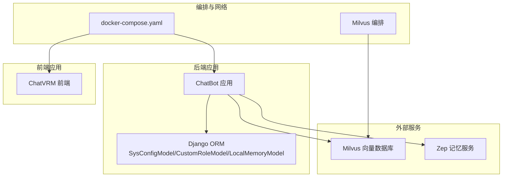
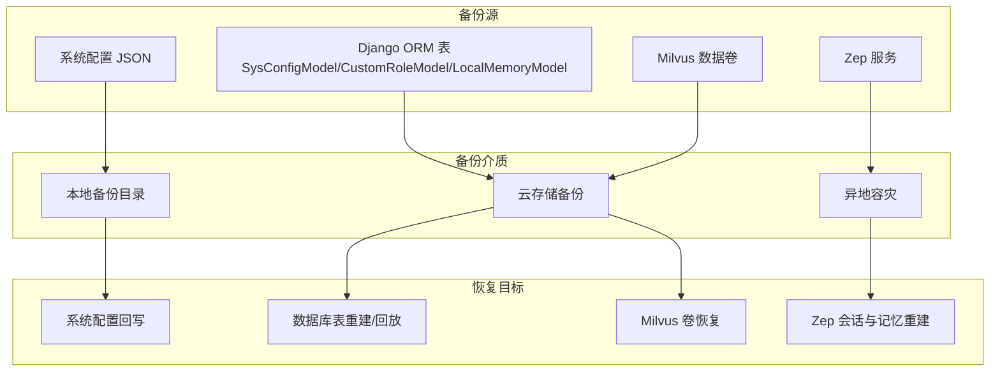
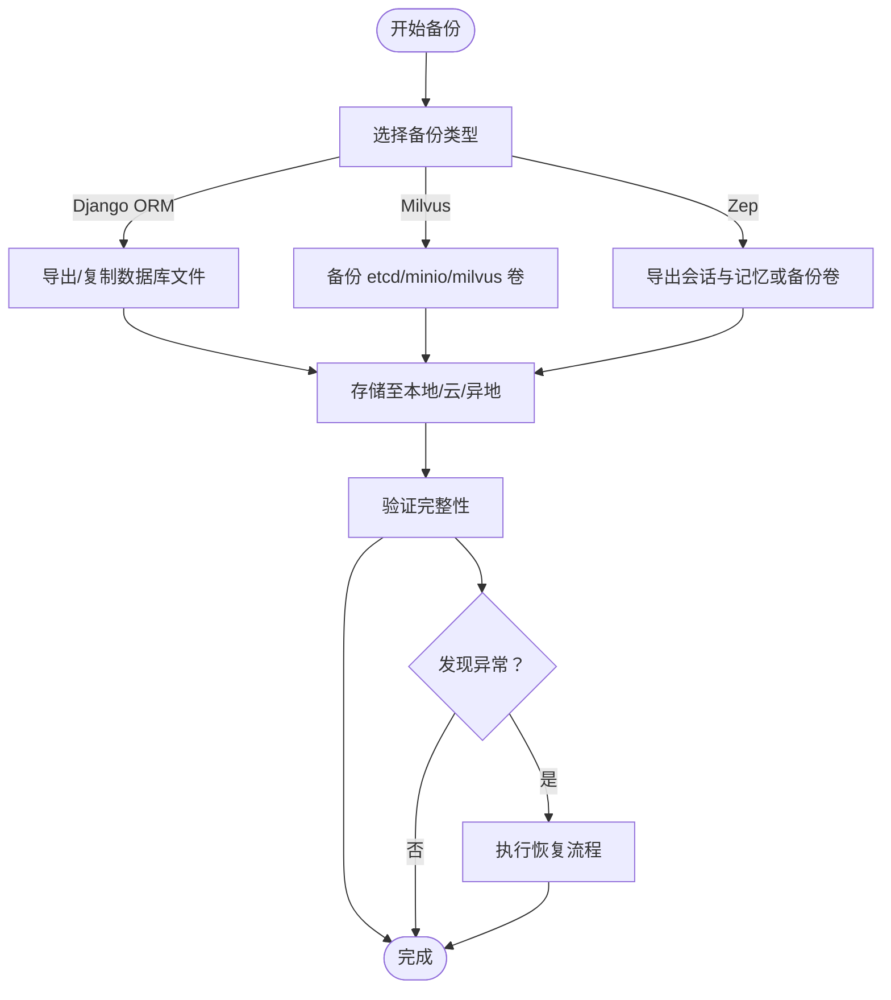
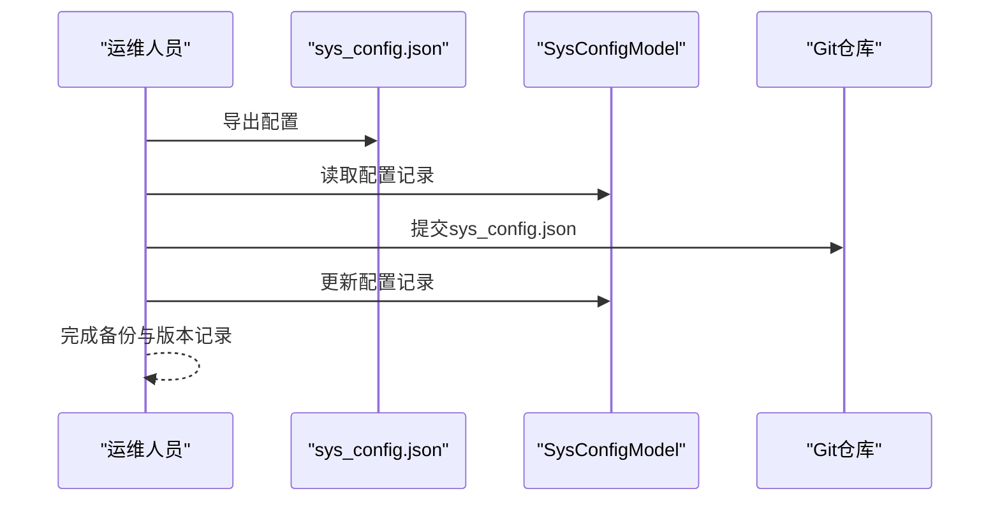
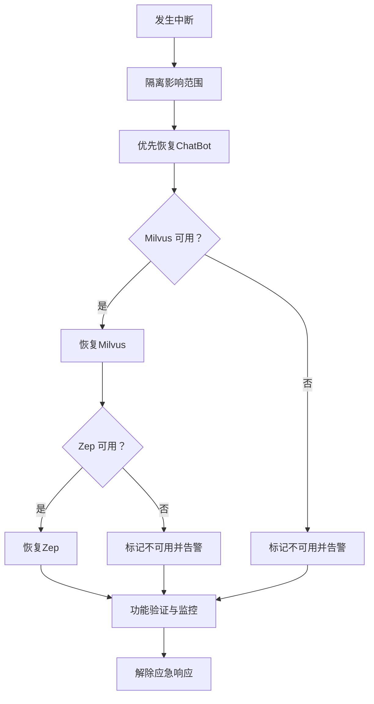
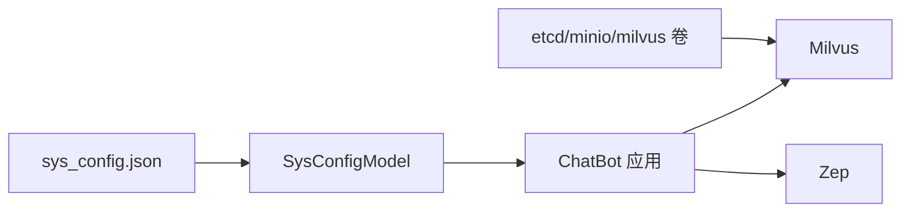

# 备份与恢复策略

<cite>
**本文引用的文件**
- [sys_config.json](file://domain-chatbot/apps/chatbot/config/sys_config.json)
- [sys_config.py](file://domain-chatbot/apps/chatbot/config/sys_config.py)
- [models.py](file://domain-chatbot/apps/chatbot/models.py)
- [0001_initial.py](file://domain-chatbot/apps/migrations/0001_initial.py)
- [milvus_storage_impl.py](file://domain-chatbot/apps/chatbot/memory/milvus/milvus_storage_impl.py)
- [milvus_memory.py](file://domain-chatbot/apps/chatbot/memory/milvus/milvus_memory.py)
- [milvus/docker-compose.yml](file://installer/milvus/docker-compose.yml)
- [zep_memory.py](file://domain-chatbot/apps/chatbot/memory/zep/zep_memory.py)
- [local_storage_impl.py](file://domain-chatbot/apps/chatbot/memory/local/local_storage_impl.py)
- [memory_storage.py](file://domain-chatbot/apps/chatbot/memory/memory_storage.py)
- [docker-compose.yaml](file://installer/docker-compose.yaml)
- [start.sh](file://installer/linux/start.sh)
- [start.bat](file://installer/windows/start.bat)
- [README.md（安装器）](file://installer/README.md)
- [settings.tsx（前端设置）](file://domain-chatvrm/src/components/settings.tsx)
- [README.md（模型目录）](file://domain-chatbot/models/README.md)
</cite>

## 目录
1. [引言](#引言)
2. [项目结构](#项目结构)
3. [核心组件](#核心组件)
4. [架构总览](#架构总览)
5. [详细组件分析](#详细组件分析)
6. [依赖分析](#依赖分析)
7. [性能考虑](#性能考虑)
8. [故障排查指南](#故障排查指南)
9. [结论](#结论)
10. [附录](#附录)

## 引言
本策略文档面向数据管理员与运维工程师，围绕VirtualWife项目的数据库与配置备份、向量数据库与记忆数据库备份、配置文件版本控制、跨环境数据同步与迁移、灾难恢复流程、备份存储策略、备份验证与测试、自动化脚本与监控告警、以及恢复演练流程进行全面设计，确保系统在服务中断或数据损坏情况下能够快速恢复并保障业务连续性。

## 项目结构
VirtualWife由后端ChatBot应用、前端ChatVRM应用、网关与基础设施编排组成。后端通过Django ORM持久化系统配置、角色模板与短期记忆；Milvus作为长期记忆向量数据库；Zep提供会话与记忆检索能力；安装器通过docker-compose编排服务并挂载卷实现数据持久化。

图表来源
- [docker-compose.yaml](file://installer/docker-compose.yaml#L1-L44)
- [milvus/docker-compose.yml](file://installer/milvus/docker-compose.yml#L1-L49)

章节来源
- [docker-compose.yaml](file://installer/docker-compose.yaml#L1-L44)
- [milvus/docker-compose.yml](file://installer/milvus/docker-compose.yml#L1-L49)

## 核心组件
- 系统配置与角色模板
  - 系统配置：通过JSON文件与Django模型共同管理，支持运行时读取与持久化。
  - 角色模板：以模型形式存储，包含角色元数据与对话样例等。
- 记忆存储
  - 短期记忆：基于Django ORM的本地模型，按会话与所有者维度存储。
  - 长期记忆：基于Milvus向量数据库，支持相似度检索与重排序。
  - Zep记忆：基于Zep服务的会话与记忆检索接口。
- 外部依赖
  - Milvus：通过独立编排文件启动，使用卷挂载实现数据持久化。
  - Zep：通过URL与可选API Key连接，提供记忆检索与会话管理。

章节来源
- [sys_config.json](file://domain-chatbot/apps/chatbot/config/sys_config.json#L1-L60)
- [sys_config.py](file://domain-chatbot/apps/chatbot/config/sys_config.py#L52-L192)
- [models.py](file://domain-chatbot/apps/chatbot/models.py#L16-L92)
- [local_storage_impl.py](file://domain-chatbot/apps/chatbot/memory/local/local_storage_impl.py#L14-L71)
- [milvus_storage_impl.py](file://domain-chatbot/apps/chatbot/memory/milvus/milvus_storage_impl.py#L5-L31)
- [milvus/docker-compose.yml](file://installer/milvus/docker-compose.yml#L1-L49)
- [zep_memory.py](file://domain-chatbot/apps/chatbot/memory/zep/zep_memory.py#L20-L169)

## 架构总览
下图展示备份与恢复涉及的关键数据流与组件交互，强调备份点位与恢复路径。

图表来源
- [sys_config.json](file://domain-chatbot/apps/chatbot/config/sys_config.json#L1-L60)
- [models.py](file://domain-chatbot/apps/chatbot/models.py#L39-L66)
- [milvus/docker-compose.yml](file://installer/milvus/docker-compose.yml#L38-L45)
- [zep_memory.py](file://domain-chatbot/apps/chatbot/memory/zep/zep_memory.py#L20-L169)

## 详细组件分析

### 数据库备份方案
- SQLite数据库备份（Django ORM）
  - 备份范围：SysConfigModel、CustomRoleModel、LocalMemoryModel等。
  - 备份方式：逻辑备份（导出SQL或序列化数据），或物理备份（停止服务后复制数据文件）。
  - 恢复方式：导入SQL或回放序列化数据，重建表结构后写入。
  - 运维要点：生产环境建议停机窗口内执行物理备份；开发/测试环境可采用逻辑备份。
- Milvus向量数据库备份
  - 备份范围：etcd、minio与milvus数据卷。
  - 备份方式：定期快照或tar归档数据卷目录；etcd与minio需配合其官方备份策略。
  - 恢复方式：容器重建后挂载相同数据卷，或从快照恢复。
  - 运维要点：关注压缩与保留策略，避免磁盘空间耗尽。
- Zep记忆数据库备份
  - 备份范围：Zep服务端数据（会话与记忆）。
  - 备份方式：通过Zep提供的API导出会话与记忆；或在容器层面备份其数据卷。
  - 恢复方式：重建Zep服务后，通过API或数据卷恢复会话与记忆。
  - 运维要点：注意API速率限制与数据一致性校验。

图表来源
- [models.py](file://domain-chatbot/apps/chatbot/models.py#L39-L66)
- [milvus/docker-compose.yml](file://installer/milvus/docker-compose.yml#L12-L45)
- [zep_memory.py](file://domain-chatbot/apps/chatbot/memory/zep/zep_memory.py#L105-L135)

章节来源
- [models.py](file://domain-chatbot/apps/chatbot/models.py#L39-L66)
- [milvus/docker-compose.yml](file://installer/milvus/docker-compose.yml#L12-L45)
- [zep_memory.py](file://domain-chatbot/apps/chatbot/memory/zep/zep_memory.py#L20-L169)

### 配置文件备份管理与版本控制
- 系统配置（sys_config.json）
  - 备份：定期导出sys_config.json与Django SysConfigModel中的配置记录。
  - 版本控制：将sys_config.json纳入Git仓库，结合Django模型的配置记录实现双轨备份。
  - 回滚：通过Git标签与Django模型回滚到历史版本。
- 角色模板（CustomRoleModel）
  - 备份：导出角色模板数据，或通过Django迁移文件管理结构变更。
  - 版本控制：角色模板变更纳入版本控制，配合迁移文件保证结构一致性。
- LLM模型配置
  - 备份：记录各模型的API Key、Base URL、模型名称等环境变量。
  - 版本控制：通过环境变量文件与Django模型共同管理，确保可追溯与可回滚。
- 前端设置（Milvus配置）
  - 备份：前端设置中包含Milvus host/port/user/password/dbName等字段，需纳入备份与版本控制。

图表来源
- [sys_config.json](file://domain-chatbot/apps/chatbot/config/sys_config.json#L1-L60)
- [sys_config.py](file://domain-chatbot/apps/chatbot/config/sys_config.py#L57-L81)
- [settings.tsx（前端设置）](file://domain-chatvrm/src/components/settings.tsx#L579-L618)

章节来源
- [sys_config.json](file://domain-chatbot/apps/chatbot/config/sys_config.json#L1-L60)
- [sys_config.py](file://domain-chatbot/apps/chatbot/config/sys_config.py#L57-L81)
- [settings.tsx（前端设置）](file://domain-chatvrm/src/components/settings.tsx#L579-L618)

### 数据迁移策略
- 跨环境数据同步
  - Django ORM：通过迁移文件与数据导出/导入实现结构与数据同步。
  - Milvus：通过数据卷快照或备份工具在不同环境间迁移。
  - Zep：通过API导出/导入或数据卷迁移。
- 增量备份
  - Django ORM：基于时间戳或变更日志的增量导出。
  - Milvus：基于卷级别的增量快照。
  - Zep：基于会话与消息的时间戳增量导出。
- 全量备份计划
  - 建议每日全量+每周增量，保留N个周期的历史备份。

章节来源
- [0001_initial.py](file://domain-chatbot/apps/migrations/0001_initial.py#L1-L81)
- [milvus/docker-compose.yml](file://installer/milvus/docker-compose.yml#L38-L45)
- [zep_memory.py](file://domain-chatbot/apps/chatbot/memory/zep/zep_memory.py#L105-L135)

### 灾难恢复流程
- 服务中断应急响应
  - 快速评估：确认受影响组件（ChatBot、Milvus、Zep）状态。
  - 降级策略：优先恢复ChatBot与本地短期记忆，逐步恢复Milvus与Zep。
- 数据恢复步骤
  - ChatBot：恢复Django ORM数据与配置，重启服务。
  - Milvus：恢复etcd/minio/milvus卷，检查服务健康。
  - Zep：恢复会话与记忆数据，验证检索功能。
- 业务连续性保障
  - 热备/冷备：Milvus与Zep建议热备，ChatBot可采用快速回滚。
  - 监控告警：对关键组件健康状态与备份任务执行情况进行监控。

图表来源
- [docker-compose.yaml](file://installer/docker-compose.yaml#L1-L44)
- [milvus/docker-compose.yml](file://installer/milvus/docker-compose.yml#L1-L49)
- [zep_memory.py](file://domain-chatbot/apps/chatbot/memory/zep/zep_memory.py#L20-L169)

章节来源
- [docker-compose.yaml](file://installer/docker-compose.yaml#L1-L44)
- [milvus/docker-compose.yml](file://installer/milvus/docker-compose.yml#L1-L49)
- [zep_memory.py](file://domain-chatbot/apps/chatbot/memory/zep/zep_memory.py#L20-L169)

### 备份存储策略
- 本地备份
  - 适用：小规模或开发环境，便于快速恢复。
  - 建议：定期清理过期备份，保留最近N次。
- 云存储备份
  - 适用：生产环境，具备高可用与扩展性。
  - 建议：使用对象存储的多版本与生命周期策略。
- 异地容灾
  - 适用：关键业务，满足RPO/RTO要求。
  - 建议：跨区域同步，定期演练恢复。

章节来源
- [milvus/docker-compose.yml](file://installer/milvus/docker-compose.yml#L12-L45)

### 备份验证与测试程序
- 验证清单
  - 配置文件完整性：校验sys_config.json与SysConfigModel一致性。
  - 数据库一致性：比对导出/导入前后记录数与关键字段。
  - Milvus可用性：验证向量检索与聚合查询。
  - Zep可用性：验证会话与记忆检索。
- 测试程序
  - 自动化脚本：编写备份与恢复的端到端测试脚本，覆盖ChatBot、Milvus、Zep。
  - 回归测试：在预生产环境执行恢复演练，验证业务功能。

章节来源
- [sys_config.py](file://domain-chatbot/apps/chatbot/config/sys_config.py#L57-L81)
- [milvus_storage_impl.py](file://domain-chatbot/apps/chatbot/memory/milvus/milvus_storage_impl.py#L18-L31)
- [zep_memory.py](file://domain-chatbot/apps/chatbot/memory/zep/zep_memory.py#L111-L135)

### 备份自动化脚本、监控告警与恢复演练
- 自动化脚本
  - ChatBot：导出Django ORM数据与sys_config.json，打包归档。
  - Milvus：调用卷快照或tar命令，上传至云存储。
  - Zep：调用API导出会话与记忆，打包归档。
- 监控告警
  - 备份任务失败告警：邮件/IM通知。
  - 组件健康告警：Milvus与Zep服务状态监控。
- 恢复演练
  - 定期演练：按月/季度执行恢复演练，记录耗时与问题。
  - 持续改进：根据演练反馈优化备份策略与恢复流程。

章节来源
- [docker-compose.yaml](file://installer/docker-compose.yaml#L1-L44)
- [milvus/docker-compose.yml](file://installer/milvus/docker-compose.yml#L1-L49)
- [README.md（安装器）](file://installer/README.md#L1-L21)

## 依赖分析
- 组件耦合
  - ChatBot依赖Django ORM与外部Milvus/Zep服务。
  - Milvus通过数据卷实现持久化，依赖etcd与minio。
  - Zep通过URL与可选API Key连接，数据存储于其服务端。
- 依赖链
  - 启动顺序：etcd → minio → milvus → chatbot → chatvrm → gateway。
  - 配置依赖：sys_config.json与SysConfigModel共同决定运行参数。

图表来源
- [sys_config.json](file://domain-chatbot/apps/chatbot/config/sys_config.json#L1-L60)
- [sys_config.py](file://domain-chatbot/apps/chatbot/config/sys_config.py#L57-L81)
- [milvus/docker-compose.yml](file://installer/milvus/docker-compose.yml#L3-L45)

章节来源
- [sys_config.py](file://domain-chatbot/apps/chatbot/config/sys_config.py#L57-L81)
- [milvus/docker-compose.yml](file://installer/milvus/docker-compose.yml#L3-L45)

## 性能考虑
- 备份窗口：在业务低峰期执行全量备份，减少对在线服务的影响。
- 并发控制：避免同时对Milvus与Zep执行大规模写入操作。
- 存储带宽：云存储备份需考虑带宽与成本，合理规划压缩与去重。

## 故障排查指南
- ChatBot无法启动
  - 检查sys_config.json与SysConfigModel是否一致。
  - 检查数据库连接与迁移是否完成。
- Milvus异常
  - 检查etcd与minio健康状态，确认数据卷挂载正确。
  - 查看Milvus日志，定位索引与查询异常。
- Zep异常
  - 检查Zep服务URL与API Key，确认会话与记忆接口可用。
  - 验证导出/导入数据的完整性与一致性。

章节来源
- [sys_config.py](file://domain-chatbot/apps/chatbot/config/sys_config.py#L57-L81)
- [milvus/docker-compose.yml](file://installer/milvus/docker-compose.yml#L25-L30)
- [zep_memory.py](file://domain-chatbot/apps/chatbot/memory/zep/zep_memory.py#L20-L28)

## 结论
通过构建“配置文件+数据库+向量数据库+记忆服务”的全栈备份体系，并配套自动化脚本、监控告警与定期恢复演练，VirtualWife能够在服务中断或数据损坏情况下快速恢复，保障业务连续性。建议在生产环境中实施严格的备份策略与演练机制，持续优化恢复流程与性能表现。

## 附录
- 启动与停止
  - Linux：通过脚本启动/停止容器编排。
  - Windows：通过批处理脚本启动/停止容器编排。
- 环境变量与配置
  - 安装器README说明了.env文件的重要性与编排文件的使用方法。
- 模型目录
  - 模型目录README提供了向量化模型的下载与放置位置说明。

章节来源
- [start.sh](file://installer/linux/start.sh#L1-L2)
- [start.bat](file://installer/windows/start.bat#L1-L3)
- [README.md（安装器）](file://installer/README.md#L1-L21)
- [README.md（模型目录）](file://domain-chatbot/models/README.md#L1-L14)