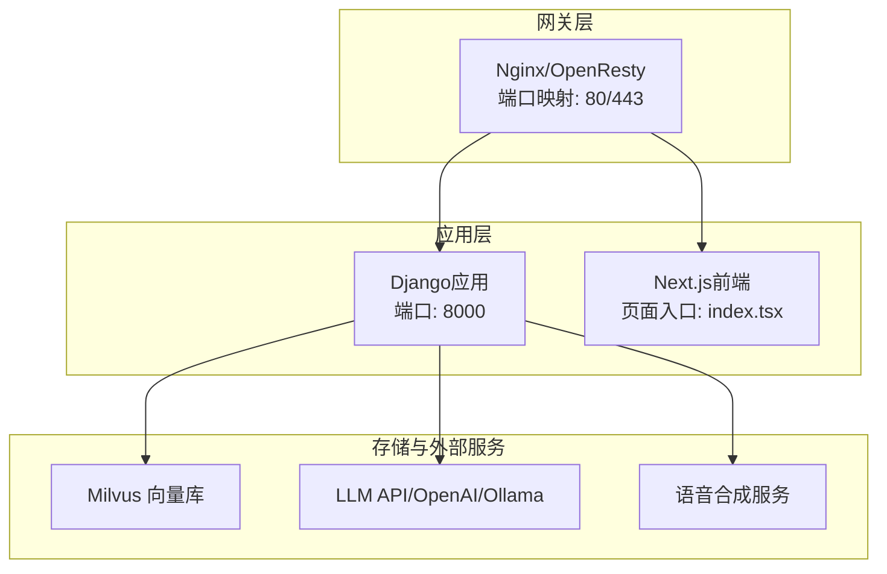
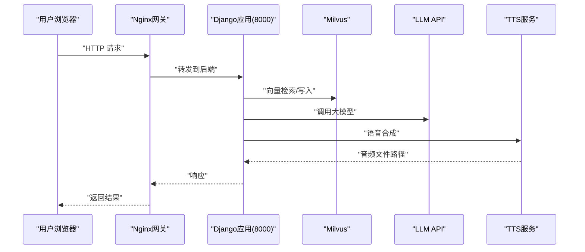
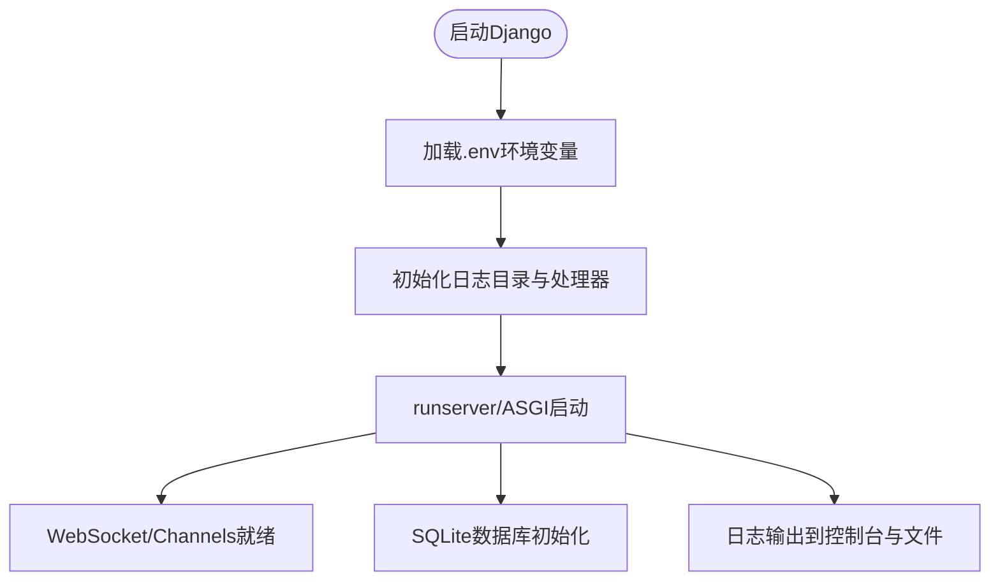
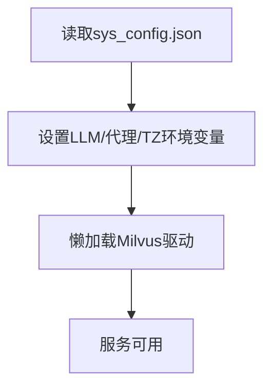
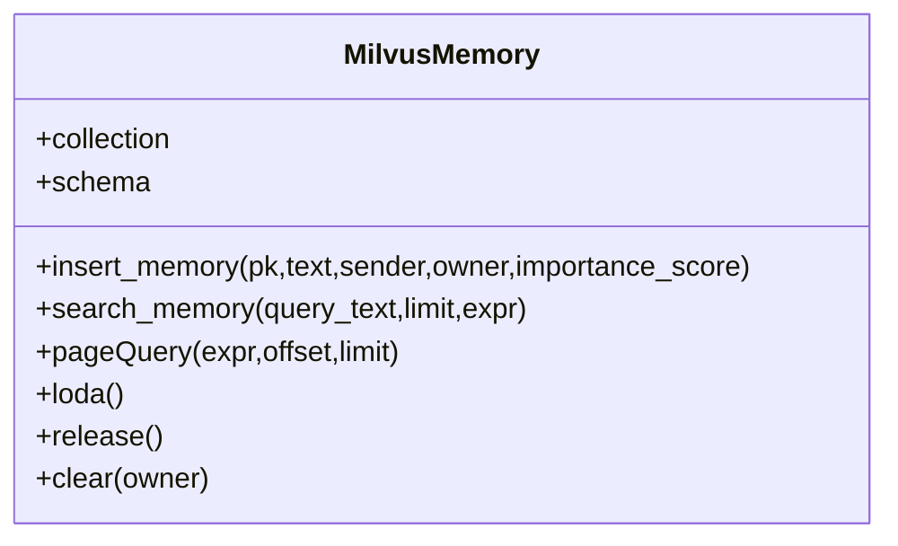
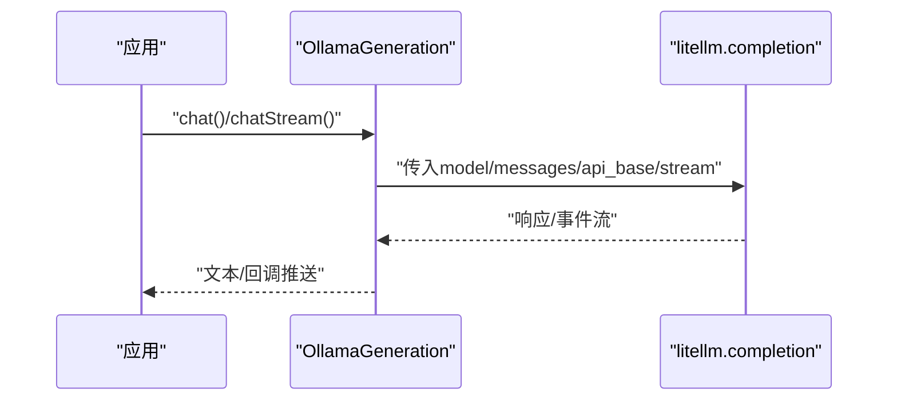
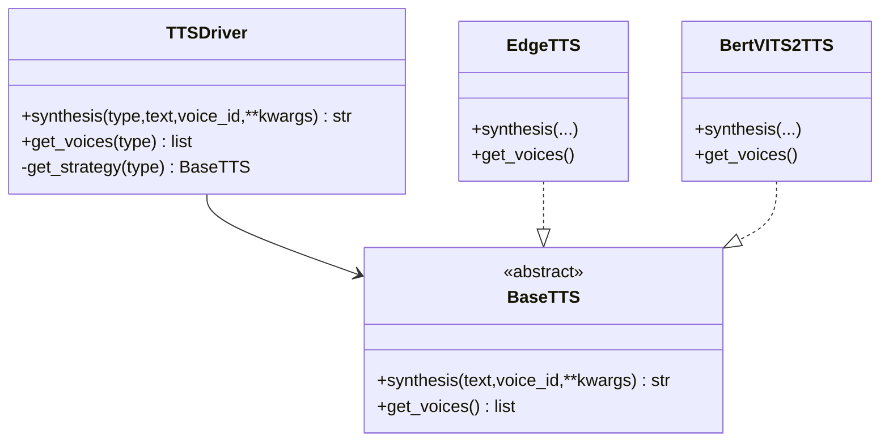
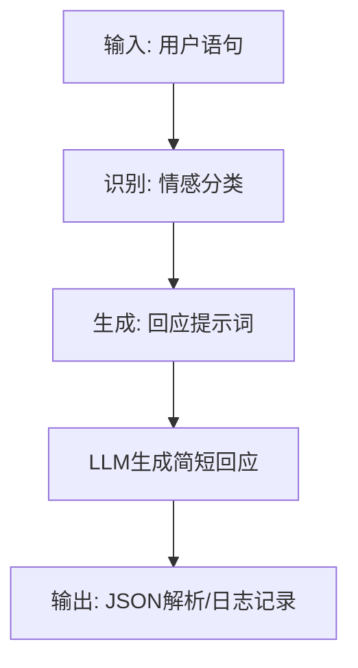
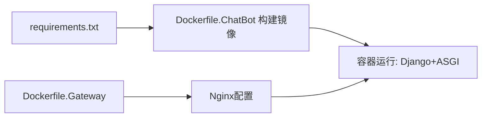

# 故障排除指南

<cite>
**本文引用的文件**
- [docker-compose.yaml](file://installer/docker-compose.yaml)
- [start.sh](file://installer/linux/start.sh)
- [start.bat](file://installer/windows/start.bat)
- [Dockerfile.ChatBot](file://infrastructure-packaging/Dockerfile.ChatBot)
- [Dockerfile.Gateway](file://infrastructure-packaging/Dockerfile.Gateway)
- [settings.py](file://domain-chatbot/VirtualWife/settings.py)
- [requirements.txt](file://domain-chatbot/requirements.txt)
- [manage.py](file://domain-chatbot/manage.py)
- [sys_config.py](file://domain-chatbot/apps/chatbot/config/sys_config.py)
- [milvus_memory.py](file://domain-chatbot/apps/chatbot/memory/milvus/milvus_memory.py)
- [ollama_chat_robot.py](file://domain-chatbot/apps/chatbot/llms/ollama/ollama_chat_robot.py)
- [tts_driver.py](file://domain-chatbot/apps/speech/tts/tts_driver.py)
- [emotion_manage.py](file://domain-chatbot/apps/chatbot/emotion/emotion_manage.py)
- [chat_service.py](file://domain-chatbot/apps/chatbot/chat/chat_service.py)
- [datatime_utils.py](file://domain-chatbot/apps/chatbot/utils/datatime_utils.py)
- [snowflake_utils.py](file://domain-chatbot/apps/chatbot/utils/snowflake_utils.py)
</cite>

## 目录
1. [简介](#简介)
2. [项目结构](#项目结构)
3. [核心组件](#核心组件)
4. [架构总览](#架构总览)
5. [详细组件分析](#详细组件分析)
6. [依赖关系分析](#依赖关系分析)
7. [性能考虑](#性能考虑)
8. [故障排除指南](#故障排除指南)
9. [结论](#结论)
10. [附录](#附录)

## 简介
本指南面向运维工程师与技术支持人员，聚焦VirtualWife项目的部署与运行期故障排查，覆盖Docker容器启动失败、端口冲突、网络连接异常、权限不足、性能瓶颈（内存泄漏、数据库查询、WebSocket、API响应慢）、日志分析、第三方服务依赖（LLM API、Milvus、语音合成）问题处理，以及系统资源监控与紧急处置流程。内容基于仓库中的配置与代码实现进行归纳总结，帮助快速定位与解决问题。

## 项目结构
项目采用多服务分层与容器化部署：
- 前端聊天界面位于domain-chatvrm（Next.js），通过网关转发至后端服务。
- 后端服务由Django Channels应用domain-chatbot提供，包含聊天、记忆、情感、语音等功能模块。
- 网关使用OpenResty/Nginx，通过Docker Compose编排。
- 依赖管理与镜像构建分别在requirements.txt与Dockerfile中定义。

图表来源
- [docker-compose.yaml](file://installer/docker-compose.yaml#L1-L44)
- [Dockerfile.Gateway](file://infrastructure-packaging/Dockerfile.Gateway#L1-L4)
- [Dockerfile.ChatBot](file://infrastructure-packaging/Dockerfile.ChatBot#L1-L31)

章节来源
- [docker-compose.yaml](file://installer/docker-compose.yaml#L1-L44)
- [start.sh](file://installer/linux/start.sh#L1-L2)
- [start.bat](file://installer/windows/start.bat#L1-L3)
- [Dockerfile.ChatBot](file://infrastructure-packaging/Dockerfile.ChatBot#L1-L31)
- [Dockerfile.Gateway](file://infrastructure-packaging/Dockerfile.Gateway#L1-L4)

## 核心组件
- 网关与编排：Nginx作为反向代理，暴露80/443端口；Docker Compose负责服务编排与网络隔离。
- Django应用：提供REST接口、WebSocket通道、日志与数据库配置。
- 记忆与检索：基于Milvus的向量检索与索引。
- 大模型接入：OpenAI、Ollama、Zhipu等LLM驱动。
- 语音合成：Edge TTS与Bert-VITS2双栈TTS驱动。
- 情感识别与响应：基于LLM的意图识别与情感回应生成。
- 时间与ID生成：时区控制与雪花ID生成器。

章节来源
- [settings.py](file://domain-chatbot/VirtualWife/settings.py#L154-L207)
- [requirements.txt](file://domain-chatbot/requirements.txt#L1-L33)
- [sys_config.py](file://domain-chatbot/apps/chatbot/config/sys_config.py#L17-L29)
- [milvus_memory.py](file://domain-chatbot/apps/chatbot/memory/milvus/milvus_memory.py#L15-L53)
- [ollama_chat_robot.py](file://domain-chatbot/apps/chatbot/llms/ollama/ollama_chat_robot.py#L14-L43)
- [tts_driver.py](file://domain-chatbot/apps/speech/tts/tts_driver.py#L54-L74)
- [emotion_manage.py](file://domain-chatbot/apps/chatbot/emotion/emotion_manage.py#L9-L78)
- [datatime_utils.py](file://domain-chatbot/apps/chatbot/utils/datatime_utils.py#L5-L11)
- [snowflake_utils.py](file://domain-chatbot/apps/chatbot/utils/snowflake_utils.py#L23-L97)

## 架构总览
下图展示容器间通信与典型请求路径，便于定位端口、网络与上游服务问题。

图表来源
- [docker-compose.yaml](file://installer/docker-compose.yaml#L5-L39)
- [milvus_memory.py](file://domain-chatbot/apps/chatbot/memory/milvus/milvus_memory.py#L24-L52)
- [ollama_chat_robot.py](file://domain-chatbot/apps/chatbot/llms/ollama/ollama_chat_robot.py#L25-L43)
- [tts_driver.py](file://domain-chatbot/apps/speech/tts/tts_driver.py#L57-L61)

## 详细组件分析

### 组件A：Django应用与日志配置
- 关键点
  - ASGI/Channels启用，WebSocket可用。
  - 日志目录与轮转策略，控制台与文件同时输出。
  - SQLite默认数据库，生产环境建议替换为PostgreSQL/MySQL。
- 常见问题
  - 日志未落盘：确认日志目录存在且可写。
  - CORS跨域：已允许全部来源与方法，若仍异常需检查具体请求头与预检。
  - 时区与时标：时区变量影响时间显示与定时任务。

图表来源
- [settings.py](file://domain-chatbot/VirtualWife/settings.py#L154-L207)
- [manage.py](file://domain-chatbot/manage.py#L7-L18)

章节来源
- [settings.py](file://domain-chatbot/VirtualWife/settings.py#L146-L207)
- [manage.py](file://domain-chatbot/manage.py#L7-L18)

### 组件B：系统配置与外部服务参数
- 关键点
  - LLM参数：OpenAI API Key/Base URL、Ollama Base与模型名、Zhipu AI Key。
  - 代理开关：HTTP/HTTPS/SOCKS5代理环境变量。
  - 记忆模块：Milvus连接参数懒加载。
- 常见问题
  - API Key缺失导致LLM调用失败。
  - 代理配置错误导致外网访问异常。
  - Milvus连接失败：核对主机、端口、用户名、密码、数据库名。

图表来源
- [sys_config.py](file://domain-chatbot/apps/chatbot/config/sys_config.py#L78-L192)

章节来源
- [sys_config.py](file://domain-chatbot/apps/chatbot/config/sys_config.py#L17-L29)
- [sys_config.py](file://domain-chatbot/apps/chatbot/config/sys_config.py#L122-L156)
- [sys_config.py](file://domain-chatbot/apps/chatbot/config/sys_config.py#L186-L191)

### 组件C：Milvus向量检索
- 关键点
  - 连接建立、集合Schema、索引创建（IVF_SQ8/L2）。
  - 插入/搜索/分页查询/释放/清空。
- 常见问题
  - 连接失败：核对host/port/user/password/db_name。
  - 查询慢：检查nprobe、索引类型与维度。
  - 内存占用高：适当降低nlist/nprobe或分页limit。

图表来源
- [milvus_memory.py](file://domain-chatbot/apps/chatbot/memory/milvus/milvus_memory.py#L15-L53)

章节来源
- [milvus_memory.py](file://domain-chatbot/apps/chatbot/memory/milvus/milvus_memory.py#L22-L53)
- [milvus_memory.py](file://domain-chatbot/apps/chatbot/memory/milvus/milvus_memory.py#L88-L116)
- [milvus_memory.py](file://domain-chatbot/apps/chatbot/memory/milvus/milvus_memory.py#L130-L154)

### 组件D：Ollama与LLM调用
- 关键点
  - 通过litellm封装completion，支持流式与非流式。
  - 读取OLLAMA_API_BASE与模型名环境变量。
- 常见问题
  - Ollama未启动或端口不一致。
  - 模型未下载或名称错误。
  - 流式回调未触发：检查api_base与stream参数。

图表来源
- [ollama_chat_robot.py](file://domain-chatbot/apps/chatbot/llms/ollama/ollama_chat_robot.py#L25-L43)
- [ollama_chat_robot.py](file://domain-chatbot/apps/chatbot/llms/ollama/ollama_chat_robot.py#L45-L99)

章节来源
- [ollama_chat_robot.py](file://domain-chatbot/apps/chatbot/llms/ollama/ollama_chat_robot.py#L19-L43)
- [ollama_chat_robot.py](file://domain-chatbot/apps/chatbot/llms/ollama/ollama_chat_robot.py#L63-L77)

### 组件E：语音合成驱动
- 关键点
  - EdgeTTS与Bert-VITS2双策略，统一TTSDriver接口。
  - 参数噪声、音色等可调。
- 常见问题
  - Edge服务不可达或鉴权失败。
  - Bert-VITS2服务未启动或端口不一致。
  - 返回音频路径为空：检查TTS服务健康与输出目录权限。

图表来源
- [tts_driver.py](file://domain-chatbot/apps/speech/tts/tts_driver.py#L54-L74)

章节来源
- [tts_driver.py](file://domain-chatbot/apps/speech/tts/tts_driver.py#L54-L74)

### 组件F：情感识别与响应
- 关键点
  - 基于LLM识别情感类别，再生成简短回应提示词。
  - 输出严格JSON解析，异常时记录警告/错误。
- 常见问题
  - LLM返回非JSON：需调整提示词或模型参数。
  - 情感分类偏差：可通过微调提示词或切换模型。

图表来源
- [emotion_manage.py](file://domain-chatbot/apps/chatbot/emotion/emotion_manage.py#L62-L78)
- [emotion_manage.py](file://domain-chatbot/apps/chatbot/emotion/emotion_manage.py#L105-L121)

章节来源
- [emotion_manage.py](file://domain-chatbot/apps/chatbot/emotion/emotion_manage.py#L14-L78)
- [emotion_manage.py](file://domain-chatbot/apps/chatbot/emotion/emotion_manage.py#L81-L121)
- [emotion_manage.py](file://domain-chatbot/apps/chatbot/emotion/emotion_manage.py#L138-L179)

### 组件G：时间与ID生成
- 关键点
  - 时区来自环境变量，默认Asia/Shanghai。
  - 雪花ID生成器，含时钟回拨保护。
- 常见问题
  - 服务器时间不同步导致ID异常。
  - 时钟回拨：抛出异常并记录日志。

章节来源
- [datatime_utils.py](file://domain-chatbot/apps/chatbot/utils/datatime_utils.py#L5-L11)
- [snowflake_utils.py](file://domain-chatbot/apps/chatbot/utils/snowflake_utils.py#L75-L78)
- [snowflake_utils.py](file://domain-chatbot/apps/chatbot/utils/snowflake_utils.py#L99-L107)

## 依赖关系分析
- Python依赖集中在requirements.txt，包含Django、Channels、Milvus SDK、TTS、LLM封装等。
- Docker镜像构建按Dockerfile执行，ChatBot镜像包含迁移与初始化步骤。
- 网关镜像直接复制配置目录，确保Nginx配置生效。

图表来源
- [requirements.txt](file://domain-chatbot/requirements.txt#L1-L33)
- [Dockerfile.ChatBot](file://infrastructure-packaging/Dockerfile.ChatBot#L1-L31)
- [Dockerfile.Gateway](file://infrastructure-packaging/Dockerfile.Gateway#L1-L4)

章节来源
- [requirements.txt](file://domain-chatbot/requirements.txt#L1-L33)
- [Dockerfile.ChatBot](file://infrastructure-packaging/Dockerfile.ChatBot#L1-L31)
- [Dockerfile.Gateway](file://infrastructure-packaging/Dockerfile.Gateway#L1-L4)

## 性能考虑
- 内存与向量检索
  - Milvus索引类型与nprobe直接影响查询延迟；建议结合业务调优。
  - 合理设置分页limit与过滤条件，避免全表扫描。
- LLM调用
  - OpenAI/Ollama均支持流式响应，注意客户端缓冲与回调处理。
  - 控制上下文长度与温度参数，平衡质量与延迟。
- WebSocket与并发
  - Channels默认内存通道层，生产建议替换为Redis等持久化后端。
- 日志与I/O
  - 日志轮转与文件系统I/O开销，建议分离日志盘与应用盘。
- 数据库
  - SQLite适合开发测试，生产建议迁移到高性能数据库并启用连接池。

章节来源
- [milvus_memory.py](file://domain-chatbot/apps/chatbot/memory/milvus/milvus_memory.py#L46-L52)
- [milvus_memory.py](file://domain-chatbot/apps/chatbot/memory/milvus/milvus_memory.py#L88-L116)
- [settings.py](file://domain-chatbot/VirtualWife/settings.py#L146-L152)
- [settings.py](file://domain-chatbot/VirtualWife/settings.py#L179-L193)

## 故障排除指南

### 一、Docker容器启动失败
- 症状
  - 容器启动即退出或无法访问80/443端口。
- 诊断步骤
  - 查看容器日志：docker logs <container_name>。
  - 确认端口占用：netstat/lsof查看80/443/8000。
  - 环境变量：确认.env文件存在且包含必要变量（如OPENAI_API_KEY、OLLAMA_API_BASE等）。
  - 网络：确认容器网络virtualwife连通。
- 解决方案
  - 释放被占用端口或修改映射端口。
  - 修正.env与环境变量，确保ChatBot镜像构建时迁移成功。
  - 重启网关与应用容器，观察日志。

章节来源
- [docker-compose.yaml](file://installer/docker-compose.yaml#L10-L16)
- [docker-compose.yaml](file://installer/docker-compose.yaml#L31-L37)
- [Dockerfile.ChatBot](file://infrastructure-packaging/Dockerfile.ChatBot#L11-L20)
- [start.sh](file://installer/linux/start.sh#L1-L2)
- [start.bat](file://installer/windows/start.bat#L1-L3)

### 二、端口冲突
- 症状
  - 启动失败或服务不可达。
- 诊断与解决
  - 修改docker-compose中端口映射或宿主机端口。
  - 使用其他端口并同步更新网关配置。

章节来源
- [docker-compose.yaml](file://installer/docker-compose.yaml#L10-L11)
- [docker-compose.yaml](file://installer/docker-compose.yaml#L32-L33)

### 三、网络连接异常
- 症状
  - ChatBot无法访问Milvus/LLM/TTS。
- 诊断与解决
  - ChatBot容器与Milvus在同一bridge网络，确认host/port/user/password/db_name正确。
  - LLM侧检查OPENAI_API_KEY、OPENAI_BASE_URL或OLLAMA_API_BASE是否配置。
  - TTS侧检查Edge/Bert-VITS2服务可达性与端口。

章节来源
- [sys_config.py](file://domain-chatbot/apps/chatbot/config/sys_config.py#L20-L26)
- [milvus_memory.py](file://domain-chatbot/apps/chatbot/memory/milvus/milvus_memory.py#L24-L30)
- [ollama_chat_robot.py](file://domain-chatbot/apps/chatbot/llms/ollama/ollama_chat_robot.py#L22-L23)
- [tts_driver.py](file://domain-chatbot/apps/speech/tts/tts_driver.py#L67-L73)

### 四、权限不足
- 症状
  - 日志目录创建失败、文件写入失败。
- 诊断与解决
  - 确认logs目录存在且具备写权限。
  - Docker卷挂载时检查宿主机目录权限。

章节来源
- [settings.py](file://domain-chatbot/VirtualWife/settings.py#L154-L157)

### 五、性能问题排查
- 内存泄漏检测
  - 观察容器RSS/CPU持续增长；结合日志定位高频调用链路。
  - 检查向量化与嵌入模型是否重复初始化。
- 数据库查询优化
  - SQLite在高并发下表现有限，建议迁移至高性能数据库。
  - 对Milvus查询增加过滤条件与limit，减少nprobe。
- WebSocket连接问题
  - 确认ASGI/Channels配置与路由正确。
  - 生产环境更换通道层为Redis。
- API响应缓慢
  - LLM调用耗时：缩短上下文、降低温度、选择更小模型。
  - TTS合成耗时：优化服务端点与并发策略。

章节来源
- [settings.py](file://domain-chatbot/VirtualWife/settings.py#L146-L152)
- [milvus_memory.py](file://domain-chatbot/apps/chatbot/memory/milvus/milvus_memory.py#L92-L105)
- [requirements.txt](file://domain-chatbot/requirements.txt#L1-L33)

### 六、日志分析技巧
- 错误日志解读
  - 关注INFO/DEBUG/ERROR级别日志，定位异常堆栈。
  - 特别关注Milvus连接、LLM调用、TTS合成、雪花ID生成等模块。
- 调试信息提取
  - 使用简单格式化器输出文件名与行号，便于快速定位。
- 关键错误定位
  - DisallowedHost、AdminEmailHandler等配置有助于区分非法请求与内部错误。
- 根因分析方法
  - 串联请求链路：Nginx → Django → Milvus/LLM/TTS → 响应。
  - 逐步缩小范围：先验证上游服务健康，再检查中间件与配置。

章节来源
- [settings.py](file://domain-chatbot/VirtualWife/settings.py#L160-L207)

### 七、服务依赖问题
- LLM API连接失败
  - 核对OPENAI_API_KEY、OPENAI_BASE_URL或OLLAMA_API_BASE。
  - 检查代理设置（HTTP/HTTPS/SOCKS5）。
- Milvus数据库连接异常
  - 核对host/port/user/password/db_name。
  - 确认集合已创建并加载索引。
- 语音合成服务不可用
  - Edge服务可达性与鉴权。
  - Bert-VITS2服务端口与模型加载。

章节来源
- [sys_config.py](file://domain-chatbot/apps/chatbot/config/sys_config.py#L122-L156)
- [milvus_memory.py](file://domain-chatbot/apps/chatbot/memory/milvus/milvus_memory.py#L24-L52)
- [tts_driver.py](file://domain-chatbot/apps/speech/tts/tts_driver.py#L67-L73)

### 八、系统资源监控与优化
- CPU使用率过高
  - 降低并发、合并请求、优化LLM与向量检索参数。
- 内存不足
  - 减少Milvus nprobe与分页limit；关闭不必要的功能模块。
- 磁盘空间告警
  - 清理日志轮转文件、删除历史音频与媒体缓存。
- 预防与建议
  - 生产环境使用独立数据库与向量库，启用连接池与索引优化。
  - 使用Redis作为Channels后端，提升稳定性。

章节来源
- [milvus_memory.py](file://domain-chatbot/apps/chatbot/memory/milvus/milvus_memory.py#L46-L52)
- [settings.py](file://domain-chatbot/VirtualWife/settings.py#L179-L193)

### 九、紧急故障处理流程
- 快速止损
  - 停止异常容器，保留日志与快照。
  - 回滚到上一个稳定镜像标签。
- 临时解决方案
  - 降级功能：禁用情感/记忆/语音等模块，优先保证聊天核心链路。
  - 切换到本地LLM（Ollama）或简化提示词。
- 回滚策略
  - 固定docker-compose中的镜像标签（CHATBOT_TAG/GATEWAY_TAG），回滚时统一版本。
- 临时恢复
  - 修复端口/网络/权限后重启服务，观察日志直至恢复正常。

章节来源
- [docker-compose.yaml](file://installer/docker-compose.yaml#L7-L8)
- [docker-compose.yaml](file://installer/docker-compose.yaml#L29-L30)

## 结论
本指南围绕VirtualWife的容器化部署与运行期问题，提供了从端口、网络、权限到性能与第三方服务的系统化排查方法。建议在生产环境中完善日志与监控、替换默认数据库与通道层、优化Milvus与LLM参数，并制定标准化的回滚与应急流程，以保障系统的稳定性与可维护性。

## 附录
- 常用命令
  - 启动：docker-compose -f ../docker-compose.yaml up -d
  - 查看日志：docker logs -f <container_name>
  - 进入容器：docker exec -it <container_name> /bin/sh
- 关键配置文件路径
  - docker-compose.yaml
  - .env（示例：OPENAI_API_KEY、OLLAMA_API_BASE、TIMEZONE）
  - Django settings.py（日志、数据库、ASGI）