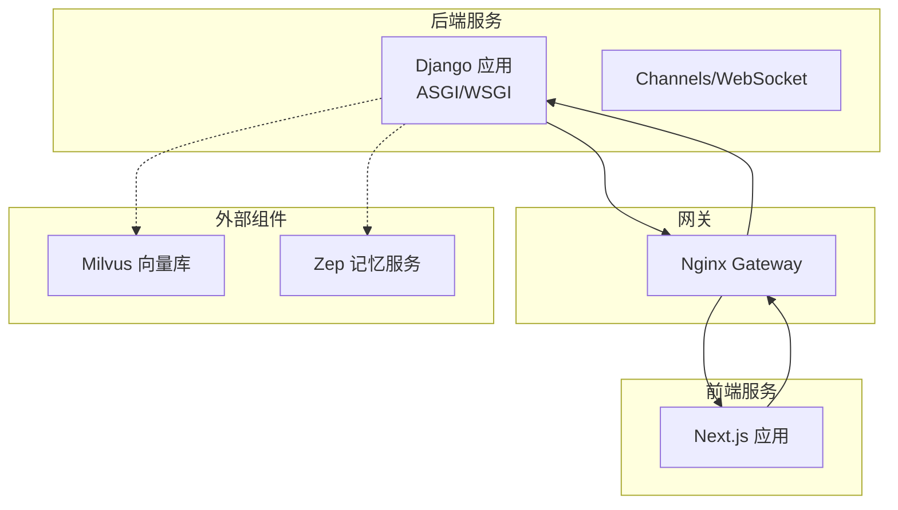
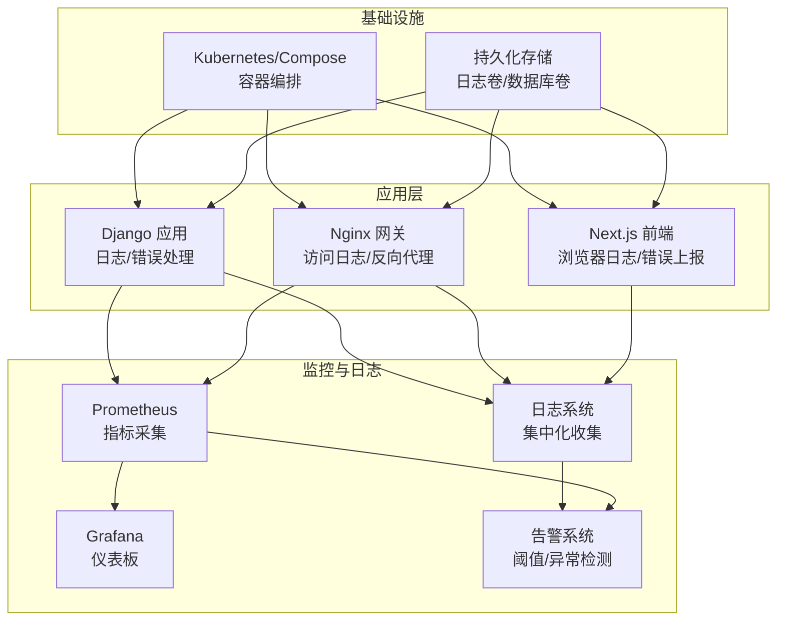
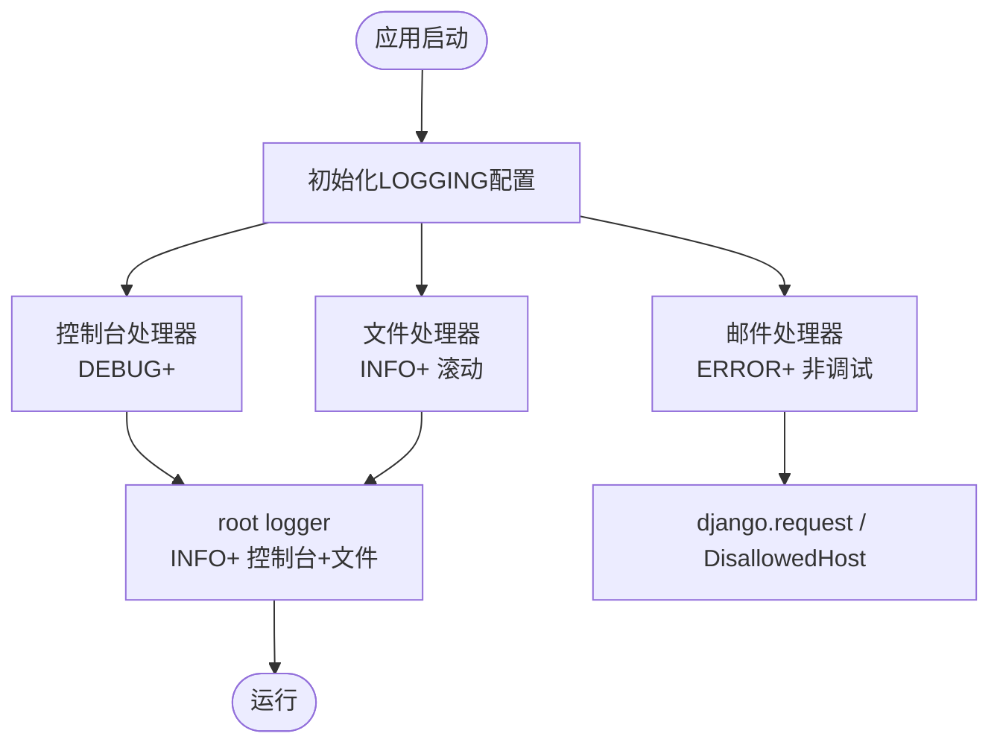
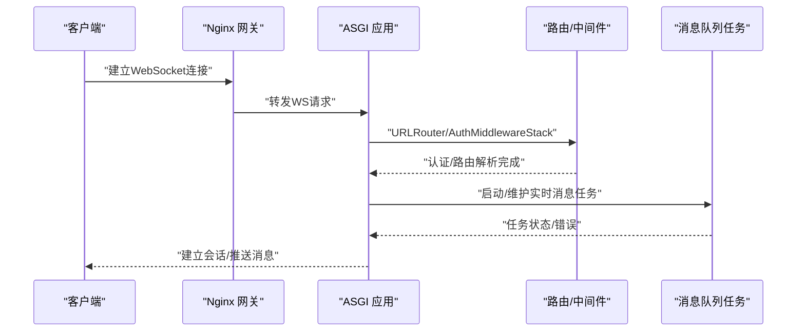
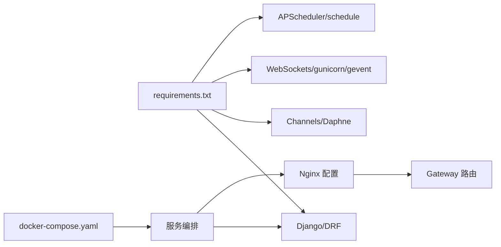

# 监控与日志管理

<cite>
**本文引用的文件**
- [settings.py](file://domain-chatbot/VirtualWife/settings.py)
- [asgi.py](file://domain-chatbot/VirtualWife/asgi.py)
- [wsgi.py](file://domain-chatbot/VirtualWife/wsgi.py)
- [requirements.txt](file://domain-chatbot/requirements.txt)
- [views.py](file://domain-chatbot/apps/chatbot/views.py)
- [urls.py](file://domain-chatbot/apps/chatbot/urls.py)
- [models.py](file://domain-chatbot/apps/chatbot/models.py)
- [datatime_utils.py](file://domain-chatbot/apps/chatbot/utils/datatime_utils.py)
- [snowflake_utils.py](file://domain-chatbot/apps/chatbot/utils/snowflake_utils.py)
- [docker-compose.yaml](file://installer/docker-compose.yaml)
- [experiment/docker-compose-dev.yaml](file://installer/experiment/docker-compose-dev.yaml)
- [milvus/docker-compose.yml](file://installer/milvus/docker-compose.yml)
- [zep/Dockerfile](file://installer/zep/Dockerfile)
- [zep/upload.sh](file://installer/zep/upload.sh)
- [conf.d/default.conf](file://infrastructure-gateway/conf.d/default.conf)
- [conf.d/server/chatbot.conf](file://infrastructure-gateway/conf.d/server/chatbot.conf)
- [conf.d/upstream/ups-chatbot.conf](file://infrastructure-gateway/conf.d/upstream/ups-chatbot.conf)
- [conf.d/server/chatvrm.conf](file://infrastructure-gateway/conf.d/server/chatvrm.conf)
- [conf.d/upstream/ups-chatvrm.conf](file://infrastructure-gateway/conf.d/upstream/ups-chatvrm.conf)
- [Dockerfile.ChatBot](file://infrastructure-packaging/Dockerfile.ChatBot)
- [Dockerfile.ChatVRM](file://infrastructure-packaging/Dockerfile.ChatVRM)
- [Dockerfile.Gateway](file://infrastructure-packaging/Dockerfile.Gateway)
</cite>

## 目录
1. [简介](#简介)
2. [项目结构](#项目结构)
3. [核心组件](#核心组件)
4. [架构总览](#架构总览)
5. [详细组件分析](#详细组件分析)
6. [依赖分析](#依赖分析)
7. [性能考虑](#性能考虑)
8. [故障排查指南](#故障排查指南)
9. [结论](#结论)
10. [附录](#附录)

## 简介
本文件面向运维团队，提供VirtualWife项目的监控与日志管理体系建设方案。内容覆盖：
- 应用日志收集配置：Django日志设置、前端日志记录、错误追踪机制
- 性能指标监控：CPU/内存、数据库连接数、API响应时间、WebSocket连接状态
- 日志分析与告警：日志轮转、集中式日志收集、异常检测、阈值告警
- 系统监控指标：容器资源、网络流量、磁盘空间、数据库性能
- 分布式追踪：请求链路跟踪、跨服务调用监控、性能瓶颈定位
- 监控仪表板：Grafana仪表板、Prometheus指标、自定义报表
- 日志搜索与分析技巧、性能调优建议、容量规划指导

## 项目结构
VirtualWife采用多模块架构：
- 后端服务（Django + Channels）：domain-chatbot
- 前端服务（Next.js）：domain-chatvrm
- 网关（Nginx）：infrastructure-gateway
- 容器编排：docker-compose与实验环境compose
- 外部组件：Milvus（向量库）、Zep（记忆）等

图表来源
- [asgi.py](file://domain-chatbot/VirtualWife/asgi.py#L36-L41)
- [wsgi.py](file://domain-chatbot/VirtualWife/wsgi.py#L10-L17)
- [conf.d/default.conf](file://infrastructure-gateway/conf.d/default.conf)
- [conf.d/server/chatbot.conf](file://infrastructure-gateway/conf.d/server/chatbot.conf)
- [conf.d/server/chatvrm.conf](file://infrastructure-gateway/conf.d/server/chatvrm.conf)

章节来源
- [asgi.py](file://domain-chatbot/VirtualWife/asgi.py#L1-L42)
- [wsgi.py](file://domain-chatbot/VirtualWife/wsgi.py#L1-L18)
- [conf.d/default.conf](file://infrastructure-gateway/conf.d/default.conf)
- [conf.d/server/chatbot.conf](file://infrastructure-gateway/conf.d/server/chatbot.conf)
- [conf.d/server/chatvrm.conf](file://infrastructure-gateway/conf.d/server/chatvrm.conf)

## 核心组件
- Django日志系统：基于settings中的LOGGING配置，启用控制台与滚动文件处理器，并对特定logger进行差异化处理。
- WebSocket与ASGI路由：通过Channels实现WebSocket通信，支持实时消息队列任务启动。
- 前端日志记录：Next.js应用可集成浏览器端日志上报与错误追踪SDK。
- 错误追踪机制：结合Django Admin邮件通知与第三方错误平台（如Sentry）接入。
- 性能监控：结合Prometheus/Grafana采集系统与应用指标。

章节来源
- [settings.py](file://domain-chatbot/VirtualWife/settings.py#L159-L207)
- [asgi.py](file://domain-chatbot/VirtualWife/asgi.py#L28-L30)
- [views.py](file://domain-chatbot/apps/chatbot/views.py#L1-L346)

## 架构总览
下图展示日志与监控在整体架构中的位置与交互：

图表来源
- [settings.py](file://domain-chatbot/VirtualWife/settings.py#L159-L207)
- [asgi.py](file://domain-chatbot/VirtualWife/asgi.py#L36-L41)
- [conf.d/default.conf](file://infrastructure-gateway/conf.d/default.conf)

## 详细组件分析

### Django日志与错误追踪
- 日志配置要点
  - 控制台输出：用于开发调试，级别为DEBUG。
  - 文件滚动：INFO及以上级别写入滚动文件，单文件大小与备份数量按需调整。
  - 特定logger：对请求错误与主机校验失败进行差异化处理。
- 错误追踪
  - Admin邮件通知：仅在非调试模式下触发，适合紧急告警。
  - 建议接入Sentry或类似平台，统一收集异常堆栈与上下文。
- 日志轮转策略
  - 基于RotatingFileHandler，建议结合logrotate或容器侧挂载卷实现长期留存与压缩。

图表来源
- [settings.py](file://domain-chatbot/VirtualWife/settings.py#L159-L207)

章节来源
- [settings.py](file://domain-chatbot/VirtualWife/settings.py#L159-L207)

### WebSocket与实时消息队列
- ASGI路由
  - 支持HTTP与WebSocket协议类型，WebSocket路由由URLRouter与AuthMiddlewareStack组合。
  - 启动实时消息队列任务，确保消息分发与历史消息查询任务持续运行。
- 监控关注点
  - 连接数与活跃会话统计
  - 消息吞吐与延迟
  - 异常断连与重连次数

图表来源
- [asgi.py](file://domain-chatbot/VirtualWife/asgi.py#L36-L41)
- [asgi.py](file://domain-chatbot/VirtualWife/asgi.py#L28-L30)

章节来源
- [asgi.py](file://domain-chatbot/VirtualWife/asgi.py#L1-L42)

### 前端日志记录与错误上报
- 浏览器端日志
  - 建议在Next.js应用中集成轻量日志SDK，将用户行为、错误信息与性能指标上报至集中式日志系统。
- 错误追踪
  - 接入Sentry或自建错误收集服务，捕获前端异常与堆栈。
- 用户体验监控
  - 关注首屏加载、交互延迟、WebSocket连接成功率等指标。

章节来源
- [urls.py](file://domain-chatbot/apps/chatbot/urls.py#L1-L26)
- [views.py](file://domain-chatbot/apps/chatbot/views.py#L1-L346)

### 数据库与存储监控
- SQLite默认配置
  - 当前使用SQLite作为默认数据库，适用于开发与小规模场景；生产建议迁移到PostgreSQL/MySQL并开启连接池与慢查询日志。
- 外部存储
  - Milvus用于向量检索，建议监控其健康状态、索引构建进度与查询延迟。
  - Zep用于记忆管理，关注写入延迟与查询性能。

章节来源
- [settings.py](file://domain-chatbot/VirtualWife/settings.py#L95-L100)
- [models.py](file://domain-chatbot/apps/chatbot/models.py#L1-L92)
- [milvus/docker-compose.yml](file://installer/milvus/docker-compose.yml)
- [zep/Dockerfile](file://installer/zep/Dockerfile)

### API接口与响应时间
- 接口范围
  - 包含聊天、配置管理、文件上传/下载、VRM模型管理等REST接口。
- 监控建议
  - 为每个接口记录请求耗时、错误率、吞吐量，区分不同业务域（聊天、配置、媒体）。
  - 结合Nginx访问日志与应用日志进行聚合分析。

章节来源
- [urls.py](file://domain-chatbot/apps/chatbot/urls.py#L1-L26)
- [views.py](file://domain-chatbot/apps/chatbot/views.py#L1-L346)

### 时间与ID生成工具
- 时间工具
  - 提供带时区的时间字符串格式化，便于日志与审计记录。
- SnowFlake ID
  - 分布式ID生成器，包含时钟回拨检测逻辑，异常时记录错误日志。

章节来源
- [datatime_utils.py](file://domain-chatbot/apps/chatbot/utils/datatime_utils.py#L1-L11)
- [snowflake_utils.py](file://domain-chatbot/apps/chatbot/utils/snowflake_utils.py#L1-L107)

## 依赖分析
- 后端依赖
  - Django、Channels、Daphne、gunicorn、gevent、drf、schedule、APScheduler等。
- 前端依赖
  - Next.js、React、TypeScript及相关功能模块。
- 网关与容器
  - Nginx配置与Docker镜像构建文件，支持多服务编排。

图表来源
- [requirements.txt](file://domain-chatbot/requirements.txt#L1-L33)
- [conf.d/default.conf](file://infrastructure-gateway/conf.d/default.conf)
- [docker-compose.yaml](file://installer/docker-compose.yaml)

章节来源
- [requirements.txt](file://domain-chatbot/requirements.txt#L1-L33)
- [conf.d/default.conf](file://infrastructure-gateway/conf.d/default.conf)
- [docker-compose.yaml](file://installer/docker-compose.yaml)

## 性能考虑
- CPU/内存
  - 使用容器资源限制与HPA（若部署在Kubernetes），结合Prometheus节点级指标观察峰值与趋势。
- 数据库
  - SQLite适用于小规模，建议迁移至PostgreSQL并启用连接池、慢查询日志与索引优化。
- API响应时间
  - 为关键接口埋点，统计P50/P95/P99延迟，识别慢调用链路。
- WebSocket
  - 监控连接数、消息积压、断连率；对高并发场景评估升级为Redis Channel Layers或集群部署。

章节来源
- [settings.py](file://domain-chatbot/VirtualWife/settings.py#L95-L100)
- [asgi.py](file://domain-chatbot/VirtualWife/asgi.py#L36-L41)

## 故障排查指南
- 常见问题定位
  - 日志轮转未生效：检查文件权限与挂载卷，确认滚动条件与编码设置。
  - WebSocket断连：检查Nginx WS配置、超时设置与后端任务状态。
  - 前端错误：通过浏览器开发者工具Network/Console定位，结合后端日志交叉验证。
- 建议流程
  - 快速恢复：重启异常容器/进程，回滚最近变更。
  - 根因分析：收集前后端日志、指标与链路追踪，定位瓶颈。
  - 预防措施：完善告警阈值、自动化巡检与容量预警。

章节来源
- [settings.py](file://domain-chatbot/VirtualWife/settings.py#L159-L207)
- [asgi.py](file://domain-chatbot/VirtualWife/asgi.py#L36-L41)

## 结论
通过完善的日志体系、性能指标监控与告警机制，VirtualWife可在开发与生产环境中实现可观测性闭环。建议优先落地Django日志与Nginx访问日志集中化、关键接口与WebSocket指标采集、以及Sentry错误追踪接入，再逐步扩展到分布式追踪与自定义仪表板。

## 附录

### 日志收集与轮转配置清单
- Django日志
  - 控制台：DEBUG级别
  - 文件：INFO级别，滚动文件，UTF-8编码
  - 邮件：ERROR级别（非调试）
- Nginx访问日志
  - 开启access_log，按天滚动
- 前端日志
  - 浏览器端上报至集中式日志系统
- 外部组件
  - Milvus/Zep分别配置独立日志与健康检查

章节来源
- [settings.py](file://domain-chatbot/VirtualWife/settings.py#L159-L207)
- [conf.d/default.conf](file://infrastructure-gateway/conf.d/default.conf)

### 监控仪表板与指标建议
- Prometheus指标
  - 应用：HTTP请求数/错误数/响应时间、WebSocket连接数、任务队列长度
  - 系统：CPU/内存/磁盘IO、网络接收/发送、文件句柄数
  - 数据库：连接数、慢查询、锁等待
  - 外部：Milvus查询延迟、Zep写入延迟
- Grafana仪表板
  - 分层视图：总览页（系统与应用）、业务页（聊天/配置/媒体）、告警页（阈值/异常）

章节来源
- [requirements.txt](file://domain-chatbot/requirements.txt#L1-L33)
- [milvus/docker-compose.yml](file://installer/milvus/docker-compose.yml)
- [zep/Dockerfile](file://installer/zep/Dockerfile)

### 告警配置建议
- 阈值类
  - HTTP错误率、P95/P99延迟、连接数峰值、磁盘使用率、内存占用
- 异常类
  - 未捕获异常、WebSocket断连、外部服务不可用
- 通知渠道
  - 邮件、IM机器人、电话（严重级别）

章节来源
- [settings.py](file://domain-chatbot/VirtualWife/settings.py#L196-L206)

### 分布式追踪配置
- 链路维度
  - 请求入口（Nginx → Django/Next.js）→ 视图处理 → LLM调用 → 向量检索 → WebSocket推送
- 工具建议
  - OpenTelemetry或Jaeger，为关键Span命名与标签标准化
- 瓶颈定位
  - 重点观察LLM推理耗时、Milvus查询耗时、WebSocket推送延迟

章节来源
- [asgi.py](file://domain-chatbot/VirtualWife/asgi.py#L36-L41)
- [views.py](file://domain-chatbot/apps/chatbot/views.py#L20-L31)
- [milvus/docker-compose.yml](file://installer/milvus/docker-compose.yml)

### 日志搜索与分析技巧
- 关键词过滤：按模块（chatbot、websocket、milvus）、时间窗口、错误级别
- 上下文关联：结合请求ID、用户ID、会话ID进行跨源关联
- 趋势分析：按小时/天观察错误率与延迟变化，识别回归与突增

章节来源
- [settings.py](file://domain-chatbot/VirtualWife/settings.py#L164-L192)
- [datatime_utils.py](file://domain-chatbot/apps/chatbot/utils/datatime_utils.py#L5-L10)

### 性能调优建议
- 应用层
  - 缓存热点数据、减少ORM N+1查询、异步处理耗时任务
- 网络层
  - 合理设置Nginx超时与缓冲，启用gzip压缩
- 存储层
  - 为常用查询建立索引，定期清理无用文件与日志

章节来源
- [views.py](file://domain-chatbot/apps/chatbot/views.py#L1-L346)
- [conf.d/default.conf](file://infrastructure-gateway/conf.d/default.conf)

### 容量规划指导
- 估算规则
  - 按峰值QPS与平均响应时间估算后端CPU/内存需求
  - 按并发WebSocket连接数与消息吞吐量估算带宽与存储
  - 为日志与指标保留至少3倍冗余空间
- 进阶
  - 建立容量基线与增长预测模型，结合弹性伸缩策略

章节来源
- [asgi.py](file://domain-chatbot/VirtualWife/asgi.py#L36-L41)
- [requirements.txt](file://domain-chatbot/requirements.txt#L1-L33)