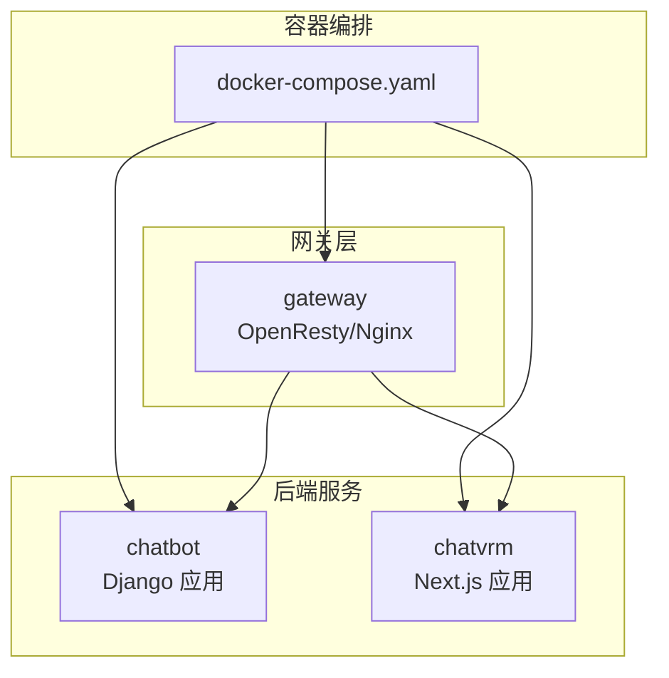
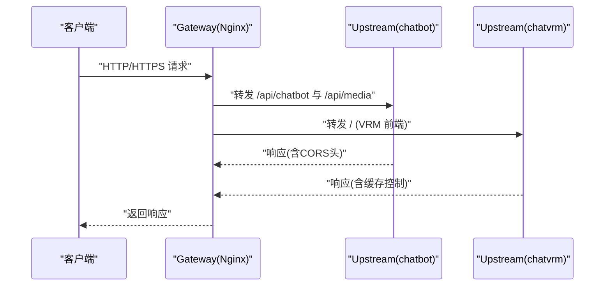
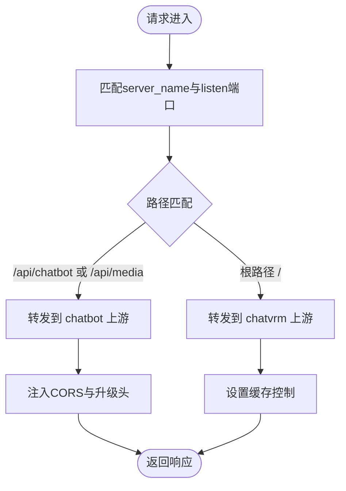
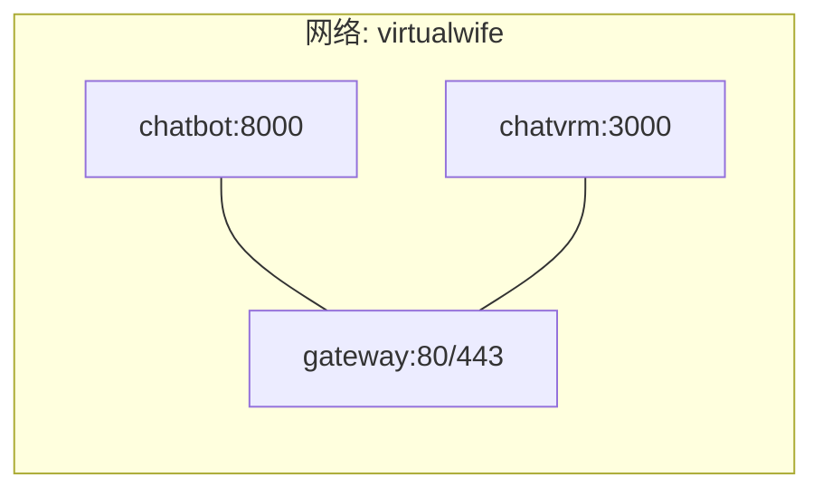
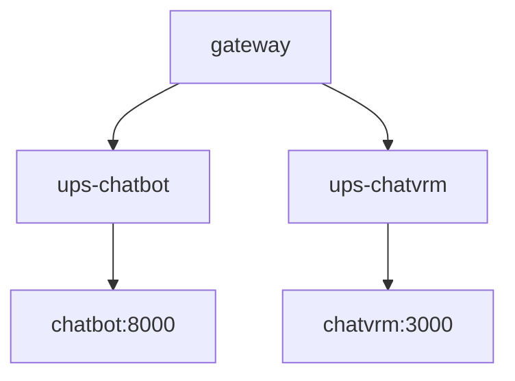

# 部署与运维

<cite>
**本文引用的文件**
- [docker-compose.yaml](file://installer/docker-compose.yaml)
- [Dockerfile.ChatBot](file://infrastructure-packaging/Dockerfile.ChatBot)
- [Dockerfile.ChatVRM](file://infrastructure-packaging/Dockerfile.ChatVRM)
- [Dockerfile.Gateway](file://infrastructure-packaging/Dockerfile.Gateway)
- [default.conf](file://infrastructure-gateway/conf.d/default.conf)
- [chatbot.conf](file://infrastructure-gateway/conf.d/server/chatbot.conf)
- [chatvrm.conf](file://infrastructure-gateway/conf.d/server/chatvrm.conf)
- [ups-chatbot.conf](file://infrastructure-gateway/conf.d/upstream/ups-chatbot.conf)
- [ups-chatvrm.conf](file://infrastructure-gateway/conf.d/upstream/ups-chatvrm.conf)
- [start.sh](file://installer/linux/start.sh)
- [stop.sh](file://installer/linux/stop.sh)
- [start.bat](file://installer/windows/start.bat)
- [stop.bat](file://installer/windows/stop.bat)
- [build.sh](file://build.sh)
- [upload.sh](file://upload.sh)
</cite>

## 目录
1. [简介](#简介)
2. [项目结构](#项目结构)
3. [核心组件](#核心组件)
4. [架构总览](#架构总览)
5. [详细组件分析](#详细组件分析)
6. [依赖关系分析](#依赖关系分析)
7. [性能考虑](#性能考虑)
8. [故障排除指南](#故障排除指南)
9. [结论](#结论)
10. [附录](#附录)

## 简介
本文件面向运维工程师与DevOps团队，提供VirtualWife项目的完整部署与运维指南。内容覆盖Docker容器化部署、镜像构建、服务编排、Nginx网关配置、负载均衡与服务发现、SSL与证书、数据持久化、监控与日志、备份与恢复、自动化脚本与CI/CD集成等主题，帮助在生产环境中稳定运行该系统。

## 项目结构
VirtualWife采用多模块架构：后端聊天机器人服务（Django）、前端VRM交互页面（Next.js）、以及基于OpenResty的Nginx网关。部署通过docker-compose进行编排，分别构建三个独立镜像：chatbot、chatvrm、gateway。

图表来源
- [docker-compose.yaml](file://installer/docker-compose.yaml#L1-L44)

章节来源
- [docker-compose.yaml](file://installer/docker-compose.yaml#L1-L44)

## 核心组件
- Chatbot服务（Django）：提供聊天接口、媒体接口、角色与记忆管理等能力，容器暴露8000端口。
- ChatVRM服务（Next.js）：提供VRM交互界面与实时消息通道，容器暴露3000端口。
- Gateway网关（OpenResty/Nginx）：统一入口，负责反向代理、跨域头注入、WebSocket升级、缓存与日志格式化。

章节来源
- [Dockerfile.ChatBot](file://infrastructure-packaging/Dockerfile.ChatBot#L1-L31)
- [Dockerfile.ChatVRM](file://infrastructure-packaging/Dockerfile.ChatVRM#L1-L29)
- [Dockerfile.Gateway](file://infrastructure-packaging/Dockerfile.Gateway#L1-L4)

## 架构总览
下图展示从客户端到后端服务的请求路径与组件交互：

图表来源
- [default.conf](file://infrastructure-gateway/conf.d/default.conf#L38-L53)
- [chatbot.conf](file://infrastructure-gateway/conf.d/server/chatbot.conf#L1-L22)
- [chatvrm.conf](file://infrastructure-gateway/conf.d/server/chatvrm.conf#L1-L16)
- [ups-chatbot.conf](file://infrastructure-gateway/conf.d/upstream/ups-chatbot.conf#L1-L4)
- [ups-chatvrm.conf](file://infrastructure-gateway/conf.d/upstream/ups-chatvrm.conf#L1-L4)

## 详细组件分析

### Dockerfile 分析
- Chatbot镜像（Python/Django）
  - 基于官方Python镜像，复制后端代码，安装依赖并执行迁移。
  - 默认暴露8000端口，启动命令为Django runserver绑定0.0.0.0。
  - 环境变量示例包含API密钥与时区，实际部署应通过.env注入。
- ChatVRM镜像（Node/Next.js）
  - 多阶段构建：先在构建阶段安装依赖并打包.next，再在精简运行时镜像中仅保留产物与生产依赖。
  - 默认暴露3000端口，启动命令为生产启动。
- Gateway镜像（OpenResty）
  - 基于openresty镜像，直接拷贝conf.d配置目录，便于热加载与维护。

章节来源
- [Dockerfile.ChatBot](file://infrastructure-packaging/Dockerfile.ChatBot#L1-L31)
- [Dockerfile.ChatVRM](file://infrastructure-packaging/Dockerfile.ChatVRM#L1-L29)
- [Dockerfile.Gateway](file://infrastructure-packaging/Dockerfile.Gateway#L1-L4)

### Nginx 网关配置
- 日志格式与输出
  - 自定义json_combined日志格式，输出至stdout，便于容器日志采集。
- 缓存策略
  - 配置proxy缓存路径、尺寸与过期时间；缓冲区参数按大流量场景优化。
- 跨域与WebSocket
  - 在chatbot路由注入CORS头；通过map对$connection_upgrade进行升级处理，支持WebSocket。
- 虚拟主机与上游
  - default.conf集中listen与include server与upstream配置。
  - chatbot.conf与chatvrm.conf分别定义location块与缓存控制头。
  - ups-*配置定义后端服务实例地址与端口。

图表来源
- [default.conf](file://infrastructure-gateway/conf.d/default.conf#L38-L53)
- [chatbot.conf](file://infrastructure-gateway/conf.d/server/chatbot.conf#L1-L22)
- [chatvrm.conf](file://infrastructure-gateway/conf.d/server/chatvrm.conf#L1-L16)
- [ups-chatbot.conf](file://infrastructure-gateway/conf.d/upstream/ups-chatbot.conf#L1-L4)
- [ups-chatvrm.conf](file://infrastructure-gateway/conf.d/upstream/ups-chatvrm.conf#L1-L4)

章节来源
- [default.conf](file://infrastructure-gateway/conf.d/default.conf#L1-L56)
- [chatbot.conf](file://infrastructure-gateway/conf.d/server/chatbot.conf#L1-L22)
- [chatvrm.conf](file://infrastructure-gateway/conf.d/server/chatvrm.conf#L1-L16)
- [ups-chatbot.conf](file://infrastructure-gateway/conf.d/upstream/ups-chatbot.conf#L1-L4)
- [ups-chatvrm.conf](file://infrastructure-gateway/conf.d/upstream/ups-chatvrm.conf#L1-L4)

### docker-compose 编排
- 服务定义
  - chatbot：映射8000端口，挂载环境文件，加入自定义bridge网络。
  - chatvrm：映射3000端口，挂载环境文件，加入自定义bridge网络。
  - gateway：映射80/443端口，重启策略always，挂载环境文件，加入自定义bridge网络。
- 网络
  - 使用自定义bridge网络virtualwife，实现服务间DNS解析与互通。

图表来源
- [docker-compose.yaml](file://installer/docker-compose.yaml#L3-L43)

章节来源
- [docker-compose.yaml](file://installer/docker-compose.yaml#L1-L44)

### Linux/Windows 启停脚本
- Linux：通过docker-compose启动与停止，并在停止后移除容器。
- Windows：同Linux逻辑，适用于Windows环境。

章节来源
- [start.sh](file://installer/linux/start.sh#L1-L2)
- [stop.sh](file://installer/linux/stop.sh#L1-L2)
- [start.bat](file://installer/windows/start.bat#L1-L3)
- [stop.bat](file://installer/windows/stop.bat#L1-L4)

### 构建与发布脚本
- build.sh：清理旧镜像并使用buildx bake进行本地构建。
- upload.sh：打标签并推送release镜像到仓库。

章节来源
- [build.sh](file://build.sh#L1-L5)
- [upload.sh](file://upload.sh#L1-L4)

## 依赖关系分析
- 组件耦合
  - chatbot与chatvrm通过gateway进行统一入口访问，彼此解耦。
  - gateway依赖upstream配置进行服务发现与负载均衡。
- 外部依赖
  - Python依赖通过requirements.txt管理；Node依赖通过package.json管理。
  - OpenResty镜像自带Nginx与常用模块，减少额外依赖。

图表来源
- [ups-chatbot.conf](file://infrastructure-gateway/conf.d/upstream/ups-chatbot.conf#L1-L4)
- [ups-chatvrm.conf](file://infrastructure-gateway/conf.d/upstream/ups-chatvrm.conf#L1-L4)

## 性能考虑
- 网关缓存
  - 已启用proxy缓存路径与缓冲参数，建议结合业务特性调整缓存键与失效策略。
- 日志与可观测性
  - 访问日志输出为JSON格式，便于集中采集与检索。
- WebSocket
  - 已配置升级头与连接保持，确保实时通信稳定性。
- 资源限制
  - 建议在生产环境中为容器设置CPU/内存限制与健康检查，避免资源争抢。

## 故障排除指南
- 网关无法访问后端
  - 检查gateway是否正确include upstream与server配置。
  - 确认chatbot与chatvrm容器已启动且端口可达。
- CORS错误
  - 确认chatbot路由已注入必要的CORS头。
- WebSocket不生效
  - 检查map对$connection_upgrade的处理与代理头设置。
- 日志为空或格式异常
  - 确认access_log指向stdout且容器日志驱动正常。
- 启停失败
  - 使用提供的start/stop脚本，确认docker-compose文件路径与权限。

章节来源
- [default.conf](file://infrastructure-gateway/conf.d/default.conf#L38-L53)
- [chatbot.conf](file://infrastructure-gateway/conf.d/server/chatbot.conf#L1-L22)
- [chatvrm.conf](file://infrastructure-gateway/conf.d/server/chatvrm.conf#L1-L16)
- [start.sh](file://installer/linux/start.sh#L1-L2)
- [stop.sh](file://installer/linux/stop.sh#L1-L2)
- [start.bat](file://installer/windows/start.bat#L1-L3)
- [stop.bat](file://installer/windows/stop.bat#L1-L4)

## 结论
本部署方案以Docker为核心，通过docker-compose实现服务编排，结合OpenResty网关完成统一入口、反向代理、缓存与日志采集。建议在生产环境中补充SSL证书、数据持久化、监控告警与备份恢复机制，并通过CI/CD自动化镜像构建与发布流程，确保系统的高可用与可维护性。

## 附录

### 生产环境部署清单
- SSL与证书
  - 在gateway层配置HTTPS监听与证书路径，或前置负载均衡器/反向代理。
- 数据持久化
  - 将chatbot的数据库文件与日志目录映射到宿主机卷，确保数据安全与可回滚。
- 负载均衡与服务发现
  - 在upstream中添加多个后端实例，结合Nginx upstream策略实现高可用。
- 监控与日志
  - 使用集中式日志系统采集gateway访问日志；为chatbot与chatvrm增加应用级指标导出。
- 备份与恢复
  - 定期备份数据库与配置文件；制定演练计划验证恢复流程。
- CI/CD集成
  - 使用build.sh与upload.sh作为流水线步骤，自动构建与推送镜像。

### 自动化与运维脚本
- 构建与发布
  - 本地构建：执行构建脚本。
  - 推送镜像：执行上传脚本。
- 启停运维
  - Linux：使用start.sh与stop.sh。
  - Windows：使用start.bat与stop.bat。

章节来源
- [build.sh](file://build.sh#L1-L5)
- [upload.sh](file://upload.sh#L1-L4)
- [start.sh](file://installer/linux/start.sh#L1-L2)
- [stop.sh](file://installer/linux/stop.sh#L1-L2)
- [start.bat](file://installer/windows/start.bat#L1-L3)
- [stop.bat](file://installer/windows/stop.bat#L1-L4)