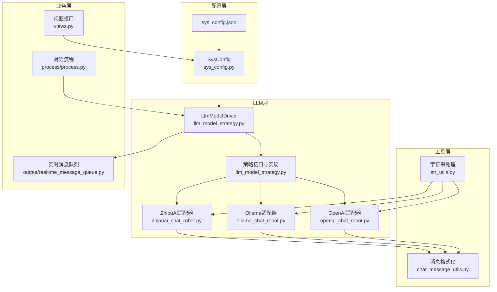
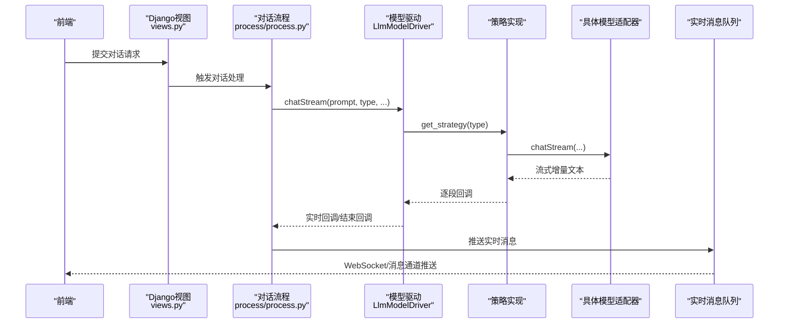
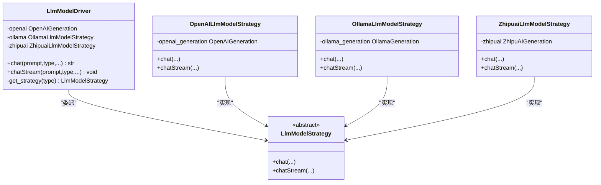
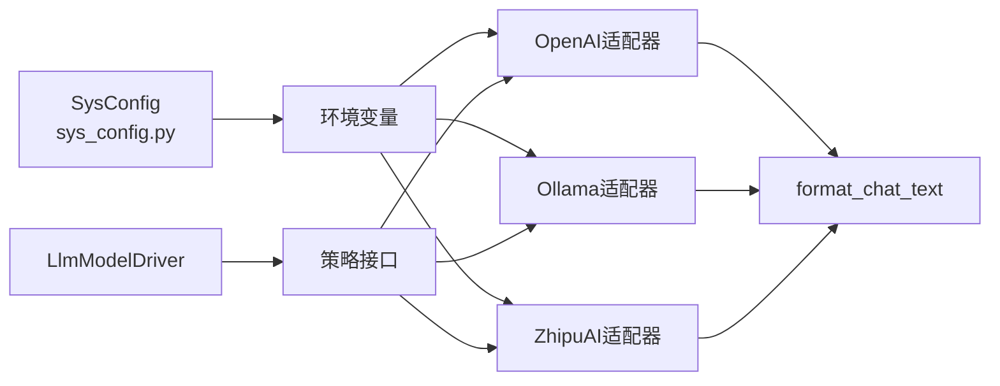

# LLM模型配置

<cite>
**本文引用的文件**
- [domain-chatbot/apps/chatbot/llms/llm_model_strategy.py](file://domain-chatbot/apps/chatbot/llms/llm_model_strategy.py)
- [domain-chatbot/apps/chatbot/llms/openai/openai_chat_robot.py](file://domain-chatbot/apps/chatbot/llms/openai/openai_chat_robot.py)
- [domain-chatbot/apps/chatbot/llms/ollama/ollama_chat_robot.py](file://domain-chatbot/apps/chatbot/llms/ollama/ollama_chat_robot.py)
- [domain-chatbot/apps/chatbot/llms/zhipuai/zhipuai_chat_robot.py](file://domain-chatbot/apps/chatbot/llms/zhipuai/zhipuai_chat_robot.py)
- [domain-chatbot/apps/chatbot/config/sys_config.py](file://domain-chatbot/apps/chatbot/config/sys_config.py)
- [domain-chatbot/apps/chatbot/config/sys_config.json](file://domain-chatbot/apps/chatbot/config/sys_config.json)
- [domain-chatbot/apps/chatbot/utils/chat_message_utils.py](file://domain-chatbot/apps/chatbot/utils/chat_message_utils.py)
- [domain-chatbot/apps/chatbot/utils/str_utils.py](file://domain-chatbot/apps/chatbot/utils/str_utils.py)
- [domain-chatbot/apps/chatbot/process/process.py](file://domain-chatbot/apps/chatbot/process/process.py)
- [domain-chatbot/apps/chatbot/views.py](file://domain-chatbot/apps/chatbot/views.py)
- [domain-chatbot/apps/chatbot/output/realtime_message_queue.py](file://domain-chatbot/apps/chatbot/output/realtime_message_queue.py)
</cite>

## 目录
1. [简介](#简介)
2. [项目结构](#项目结构)
3. [核心组件](#核心组件)
4. [架构总览](#架构总览)
5. [详细组件分析](#详细组件分析)
6. [依赖关系分析](#依赖关系分析)
7. [性能考虑](#性能考虑)
8. [故障排查指南](#故障排查指南)
9. [结论](#结论)
10. [附录](#附录)

## 简介
本文件面向开发者，系统化梳理 VirtualWife 项目中的多模型 LLM 配置与运行机制，覆盖以下方面：
- 多模型支持架构：OpenAI API、智谱清言（ZhipuAI）、Ollama 本地部署
- 环境变量与系统配置：OPENAI_API_KEY、OPENAI_BASE_URL、OLLAMA_API_BASE、OLLAMA_API_MODEL_NAME、ZHIPUAI_API_KEY 等
- 模型切换机制：LlmModelDriver 的工作原理、策略模式与模型类型映射
- 配置差异：API 端点、认证方式、请求参数、响应格式
- 性能优化：并发控制、超时、重试、代理配置
- 高级能力：可用性检查、故障转移、负载均衡建议
- 集成流程：从前端到后端的完整调用链路

## 项目结构
围绕 LLM 配置与调用的关键目录与文件如下：
- 配置层：系统配置加载与环境变量注入
- LLM 层：各模型适配器与策略分发
- 工具层：消息格式化与字符串处理
- 业务层：对话流程编排与实时回调

图表来源
- [domain-chatbot/apps/chatbot/config/sys_config.py](file://domain-chatbot/apps/chatbot/config/sys_config.py#L122-L156)
- [domain-chatbot/apps/chatbot/llms/llm_model_strategy.py](file://domain-chatbot/apps/chatbot/llms/llm_model_strategy.py#L107-L149)
- [domain-chatbot/apps/chatbot/llms/openai/openai_chat_robot.py](file://domain-chatbot/apps/chatbot/llms/openai/openai_chat_robot.py#L14-L44)
- [domain-chatbot/apps/chatbot/llms/ollama/ollama_chat_robot.py](file://domain-chatbot/apps/chatbot/llms/ollama/ollama_chat_robot.py#L14-L43)
- [domain-chatbot/apps/chatbot/llms/zhipuai/zhipuai_chat_robot.py](file://domain-chatbot/apps/chatbot/llms/zhipuai/zhipuai_chat_robot.py#L13-L36)
- [domain-chatbot/apps/chatbot/utils/chat_message_utils.py](file://domain-chatbot/apps/chatbot/utils/chat_message_utils.py#L4-L22)
- [domain-chatbot/apps/chatbot/utils/str_utils.py](file://domain-chatbot/apps/chatbot/utils/str_utils.py#L21-L23)
- [domain-chatbot/apps/chatbot/process/process.py](file://domain-chatbot/apps/chatbot/process/process.py#L33-L70)
- [domain-chatbot/apps/chatbot/views.py](file://domain-chatbot/apps/chatbot/views.py#L34-L50)
- [domain-chatbot/apps/chatbot/output/realtime_message_queue.py](file://domain-chatbot/apps/chatbot/output/realtime_message_queue.py#L49-L83)

章节来源
- [domain-chatbot/apps/chatbot/config/sys_config.py](file://domain-chatbot/apps/chatbot/config/sys_config.py#L122-L156)
- [domain-chatbot/apps/chatbot/llms/llm_model_strategy.py](file://domain-chatbot/apps/chatbot/llms/llm_model_strategy.py#L107-L149)

## 核心组件
- LlmModelDriver：统一入口，负责根据类型选择具体策略并调度同步/异步对话
- 策略接口与实现：抽象出统一的 chat/chatStream 接口，分别由 OpenAI、Ollama、ZhipuAI 策略实现
- 各模型适配器：封装各自 SDK/HTTP 客户端、环境变量读取、消息构建与流式回调
- 系统配置：集中管理 OPENAI_*、OLLAMA_*、ZHIPUAI_* 等环境变量，以及代理配置
- 工具函数：消息格式化与字符串清洗，保障输出稳定性

章节来源
- [domain-chatbot/apps/chatbot/llms/llm_model_strategy.py](file://domain-chatbot/apps/chatbot/llms/llm_model_strategy.py#L13-L29)
- [domain-chatbot/apps/chatbot/llms/llm_model_strategy.py](file://domain-chatbot/apps/chatbot/llms/llm_model_strategy.py#L107-L149)
- [domain-chatbot/apps/chatbot/config/sys_config.py](file://domain-chatbot/apps/chatbot/config/sys_config.py#L122-L156)

## 架构总览
下图展示了从系统配置到模型调用、再到实时输出的完整链路。

图表来源
- [domain-chatbot/apps/chatbot/views.py](file://domain-chatbot/apps/chatbot/views.py#L20-L31)
- [domain-chatbot/apps/chatbot/process/process.py](file://domain-chatbot/apps/chatbot/process/process.py#L33-L70)
- [domain-chatbot/apps/chatbot/llms/llm_model_strategy.py](file://domain-chatbot/apps/chatbot/llms/llm_model_strategy.py#L122-L138)
- [domain-chatbot/apps/chatbot/output/realtime_message_queue.py](file://domain-chatbot/apps/chatbot/output/realtime_message_queue.py#L49-L83)

## 详细组件分析

### LlmModelDriver 与策略模式
- 统一入口：根据 type 参数返回对应策略（openai/ollama/zhipuai），并提供同步 chat 与异步 chatStream
- 线程与协程：chatStream 内部通过 asyncio.run 调度策略的异步实现
- 锁机制：持有 chat_stream_lock，用于串行化流式对话，避免并发冲突

图表来源
- [domain-chatbot/apps/chatbot/llms/llm_model_strategy.py](file://domain-chatbot/apps/chatbot/llms/llm_model_strategy.py#L107-L149)
- [domain-chatbot/apps/chatbot/llms/llm_model_strategy.py](file://domain-chatbot/apps/chatbot/llms/llm_model_strategy.py#L32-L104)

章节来源
- [domain-chatbot/apps/chatbot/llms/llm_model_strategy.py](file://domain-chatbot/apps/chatbot/llms/llm_model_strategy.py#L107-L149)

### OpenAI 配置与调用
- 环境变量
  - OPENAI_API_KEY：用于鉴权
  - OPENAI_BASE_URL：可选，自定义网关/代理端点
- 请求参数
  - model：默认 gpt-3.5-turbo
  - temperature：默认 0.7
  - 支持 api_base 自定义端点
- 响应格式
  - 非流式：返回 choices[0].message.content
  - 流式：遍历 choices[0].delta.content，过滤空白字符后实时回调
- 消息格式化
  - 使用 format_chat_text 移除多余标记与角色提示

章节来源
- [domain-chatbot/apps/chatbot/llms/openai/openai_chat_robot.py](file://domain-chatbot/apps/chatbot/llms/openai/openai_chat_robot.py#L14-L44)
- [domain-chatbot/apps/chatbot/llms/openai/openai_chat_robot.py](file://domain-chatbot/apps/chatbot/llms/openai/openai_chat_robot.py#L46-L100)
- [domain-chatbot/apps/chatbot/utils/chat_message_utils.py](file://domain-chatbot/apps/chatbot/utils/chat_message_utils.py#L4-L22)

### Ollama 本地部署配置与调用
- 环境变量
  - OLLAMA_API_BASE：默认 http://localhost:11434
  - OLLAMA_API_MODEL_NAME：默认 qwen:7b
  - 注意：内部会拼接为 "ollama/{MODEL_NAME}"
- 请求参数
  - model：格式为 "ollama/<MODEL_NAME>"
  - temperature：默认 0.7
  - 支持 api_base 自定义端点
- 响应格式
  - 非流式/流式一致，逐块增量输出，过滤空白字符后实时回调
- 消息格式化
  - 同 OpenAI 适配器

章节来源
- [domain-chatbot/apps/chatbot/llms/ollama/ollama_chat_robot.py](file://domain-chatbot/apps/chatbot/llms/ollama/ollama_chat_robot.py#L14-L43)
- [domain-chatbot/apps/chatbot/llms/ollama/ollama_chat_robot.py](file://domain-chatbot/apps/chatbot/llms/ollama/ollama_chat_robot.py#L45-L99)
- [domain-chatbot/apps/chatbot/utils/chat_message_utils.py](file://domain-chatbot/apps/chatbot/utils/chat_message_utils.py#L4-L22)

### 智谱清言（ZhipuAI）配置与调用
- 环境变量
  - ZHIPUAI_API_KEY：用于鉴权
- 请求参数
  - model：默认 glm-4
  - temperature：默认 0.7
  - 流式：使用 client.chat.completions.create(stream=True)
- 响应格式
  - 遍历 chunk.choices[0].delta.content，过滤空白字符后实时回调
- 消息格式化
  - 同 OpenAI 适配器

章节来源
- [domain-chatbot/apps/chatbot/llms/zhipuai/zhipuai_chat_robot.py](file://domain-chatbot/apps/chatbot/llms/zhipuai/zhipuai_chat_robot.py#L13-L36)
- [domain-chatbot/apps/chatbot/llms/zhipuai/zhipuai_chat_robot.py](file://domain-chatbot/apps/chatbot/llms/zhipuai/zhipuai_chat_robot.py#L38-L70)
- [domain-chatbot/apps/chatbot/utils/chat_message_utils.py](file://domain-chatbot/apps/chatbot/utils/chat_message_utils.py#L4-L22)

### 系统配置与环境变量注入
- OPENAI_* 注入
  - OPENAI_API_KEY、OPENAI_BASE_URL 从 sys_config.json.languageModelConfig.openai 中读取并写入环境变量
- OLLAMA_* 注入
  - OLLAMA_API_BASE、OLLAMA_API_MODEL_NAME 从 sys_config.json.languageModelConfig.ollama 读取，默认值见配置文件
- ZHIPUAI_* 注入
  - ZHIPUAI_API_KEY 从 sys_config.json.languageModelConfig.zhipuai 读取，默认值见配置文件
- 代理配置
  - enableProxy 控制是否启用代理；若启用，则写入 HTTP_PROXY、HTTPS_PROXY、SOCKS5_PROXY 环境变量
- 模型类型选择
  - conversationConfig.languageModel 指定当前对话使用的模型类型（openai/ollama/zhipuai）

章节来源
- [domain-chatbot/apps/chatbot/config/sys_config.py](file://domain-chatbot/apps/chatbot/config/sys_config.py#L122-L156)
- [domain-chatbot/apps/chatbot/config/sys_config.json](file://domain-chatbot/apps/chatbot/config/sys_config.json#L11-L23)
- [domain-chatbot/apps/chatbot/views.py](file://domain-chatbot/apps/chatbot/views.py#L34-L50)

### 字符串处理与消息格式化
- remove_spaces_and_tabs：过滤空白与制表符，保证流式输出的连续性
- format_chat_text：移除角色标记、星号、方括号等干扰字符，提升 TTS 与显示质量

章节来源
- [domain-chatbot/apps/chatbot/utils/str_utils.py](file://domain-chatbot/apps/chatbot/utils/str_utils.py#L21-L23)
- [domain-chatbot/apps/chatbot/utils/chat_message_utils.py](file://domain-chatbot/apps/chatbot/utils/chat_message_utils.py#L4-L22)

### 对话流程与实时回调
- ProcessCore 在对话前构造 Prompt、检索短期/长期记忆，然后调用 LlmModelDriver.chatStream
- 实时回调与结束回调分别推送至 WebSocket/消息通道，供前端展示与语音合成

章节来源
- [domain-chatbot/apps/chatbot/process/process.py](file://domain-chatbot/apps/chatbot/process/process.py#L33-L70)
- [domain-chatbot/apps/chatbot/output/realtime_message_queue.py](file://domain-chatbot/apps/chatbot/output/realtime_message_queue.py#L49-L83)

## 依赖关系分析
- 模块耦合
  - LlmModelDriver 与各策略实现松耦合，通过统一接口解耦
  - 各模型适配器依赖环境变量与第三方 SDK（litellm、zhipuai）
  - SysConfig 负责集中注入环境变量，降低各适配器对配置源的感知
- 外部依赖
  - litellm：统一 OpenAI/Ollama 的 completion 接口
  - zhipuai：官方 Python SDK
  - Django/REST：配置读写与对话触发接口

图表来源
- [domain-chatbot/apps/chatbot/config/sys_config.py](file://domain-chatbot/apps/chatbot/config/sys_config.py#L122-L156)
- [domain-chatbot/apps/chatbot/llms/llm_model_strategy.py](file://domain-chatbot/apps/chatbot/llms/llm_model_strategy.py#L107-L149)
- [domain-chatbot/apps/chatbot/utils/chat_message_utils.py](file://domain-chatbot/apps/chatbot/utils/chat_message_utils.py#L4-L22)

章节来源
- [domain-chatbot/apps/chatbot/llms/llm_model_strategy.py](file://domain-chatbot/apps/chatbot/llms/llm_model_strategy.py#L107-L149)
- [domain-chatbot/apps/chatbot/config/sys_config.py](file://domain-chatbot/apps/chatbot/config/sys_config.py#L122-L156)

## 性能考虑
- 并发与锁
  - LlmModelDriver 持有 chat_stream_lock，确保同一时间仅有一个流式对话在进行，避免竞争条件
- 流式输出
  - 各模型均采用流式接口，结合 remove_spaces_and_tabs 过滤空白，减少前端渲染压力
- 代理与网络
  - 通过环境变量注入 HTTP/HTTPS/SOCKS5 代理，便于在受限网络环境下稳定访问
- 温度与稳定性
  - temperature 默认 0.7，兼顾创造性与稳定性；可根据场景调整
- 建议
  - 在高并发场景下，建议引入连接池与超时控制（如通过 litellm 或 SDK 层面配置）
  - 对于 Ollama，建议在本地 SSD 上拉起模型，避免磁盘 IO 影响响应
  - 对于 ZhipuAI，建议监控配额与速率限制，必要时增加重试与退避策略

章节来源
- [domain-chatbot/apps/chatbot/llms/llm_model_strategy.py](file://domain-chatbot/apps/chatbot/llms/llm_model_strategy.py#L113-L113)
- [domain-chatbot/apps/chatbot/config/sys_config.py](file://domain-chatbot/apps/chatbot/config/sys_config.py#L142-L156)

## 故障排查指南
- 常见错误定位
  - OpenAI：检查 OPENAI_API_KEY 是否正确，OPENAI_BASE_URL 是否可达
  - Ollama：确认 OLLAMA_API_BASE 与 OLLAMA_API_MODEL_NAME 是否匹配本地已下载模型
  - ZhipuAI：核对 ZHIPUAI_API_KEY 是否有效
- 代理问题
  - 若 enableProxy=true，确认 HTTP_PROXY/HTTPS_PROXY/SOCKS5_PROXY 格式与目标可达
- 流式输出异常
  - 检查 remove_spaces_and_tabs 是否导致内容被过度过滤；必要时在适配器中放宽过滤规则
- 实时消息未推送
  - 确认 realtime_callback 与 conversation_end_callback 的回调链路是否正常，WebSocket/消息通道是否启用
- 配置更新不生效
  - 通过 save_config 接口保存并重新 load，确保环境变量已注入

章节来源
- [domain-chatbot/apps/chatbot/config/sys_config.py](file://domain-chatbot/apps/chatbot/config/sys_config.py#L122-L156)
- [domain-chatbot/apps/chatbot/views.py](file://domain-chatbot/apps/chatbot/views.py#L34-L50)
- [domain-chatbot/apps/chatbot/output/realtime_message_queue.py](file://domain-chatbot/apps/chatbot/output/realtime_message_queue.py#L49-L83)

## 结论
本项目通过 LlmModelDriver 与策略模式实现了对 OpenAI、Ollama、ZhipuAI 的统一接入，配合 SysConfig 的集中配置与环境变量注入，提供了灵活、可扩展的多模型支持方案。开发者可在不修改上层调用逻辑的前提下，自由切换模型与部署方式，并通过代理、温度、流式输出等手段优化体验与性能。

## 附录

### 环境变量与配置项对照
- OPENAI_API_KEY：OpenAI 鉴权密钥
- OPENAI_BASE_URL：OpenAI 兼容端点（可为空）
- OLLAMA_API_BASE：Ollama 服务地址（默认 http://localhost:11434）
- OLLAMA_API_MODEL_NAME：Ollama 模型名称（默认 qwen:7b）
- ZHIPUAI_API_KEY：智谱清言 API 密钥
- HTTP_PROXY/HTTPS_PROXY/SOCKS5_PROXY：代理配置（可选）

章节来源
- [domain-chatbot/apps/chatbot/config/sys_config.py](file://domain-chatbot/apps/chatbot/config/sys_config.py#L122-L156)
- [domain-chatbot/apps/chatbot/config/sys_config.json](file://domain-chatbot/apps/chatbot/config/sys_config.json#L6-L23)

### 模型类型枚举与选择
- 类型枚举：openai、ollama、zhipuai
- 选择依据：conversationConfig.languageModel

章节来源
- [domain-chatbot/apps/chatbot/llms/llm_model_strategy.py](file://domain-chatbot/apps/chatbot/llms/llm_model_strategy.py#L140-L148)
- [domain-chatbot/apps/chatbot/config/sys_config.json](file://domain-chatbot/apps/chatbot/config/sys_config.json#L31-L34)

### 配置差异对比
- 认证方式
  - OpenAI：OPENAI_API_KEY
  - Ollama：无需鉴权（本地部署）
  - ZhipuAI：ZHIPUAI_API_KEY
- 端点设置
  - OpenAI：OPENAI_BASE_URL 可选
  - Ollama：OLLAMA_API_BASE 必填
  - ZhipuAI：官方 SDK 默认端点
- 请求参数
  - temperature：三者默认均为 0.7
  - OpenAI/Ollama：可通过 litellm 的 completion 统一传参
  - ZhipuAI：通过 client.chat.completions.create 传参
- 响应格式
  - 三者均支持流式输出，增量内容经清洗后回调

章节来源
- [domain-chatbot/apps/chatbot/llms/openai/openai_chat_robot.py](file://domain-chatbot/apps/chatbot/llms/openai/openai_chat_robot.py#L14-L44)
- [domain-chatbot/apps/chatbot/llms/ollama/ollama_chat_robot.py](file://domain-chatbot/apps/chatbot/llms/ollama/ollama_chat_robot.py#L14-L43)
- [domain-chatbot/apps/chatbot/llms/zhipuai/zhipuai_chat_robot.py](file://domain-chatbot/apps/chatbot/llms/zhipuai/zhipuai_chat_robot.py#L13-L36)

### 高级配置建议
- 可用性检查
  - OpenAI：发起一次最小化 completion 请求验证连通性
  - Ollama：通过列出模型或简单推理判断服务状态
  - ZhipuAI：使用 SDK 的健康检查接口或最小请求
- 故障转移
  - 当主模型失败时，按优先级回退到备选模型（需在策略层增加重试与降级逻辑）
- 负载均衡
  - 多实例部署时，通过网关或反向代理实现轮询或权重分配（本项目未内置 LB，建议在网关层实现）

[本节为通用实践建议，不直接分析具体文件，故无“章节来源”]