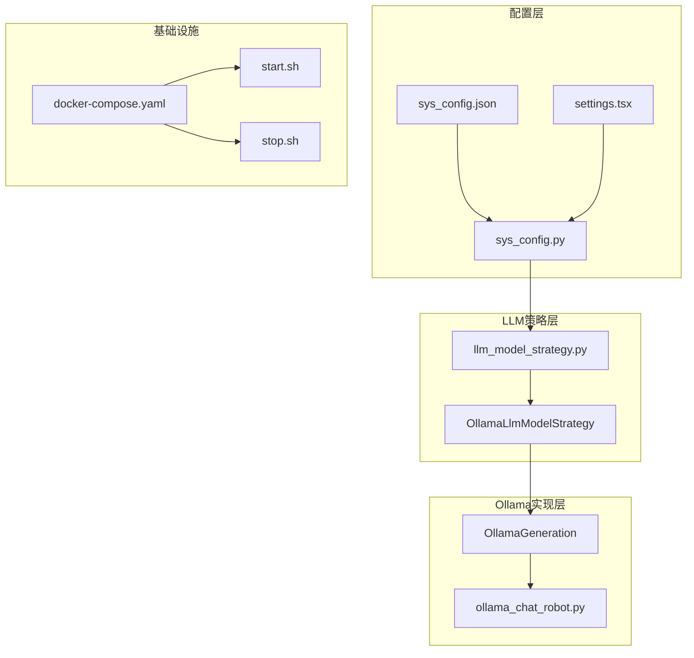
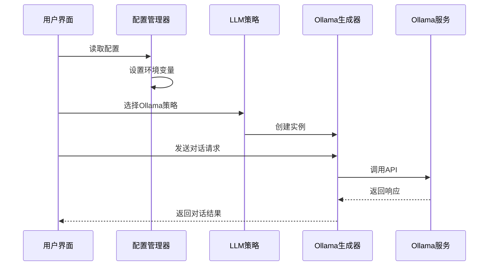
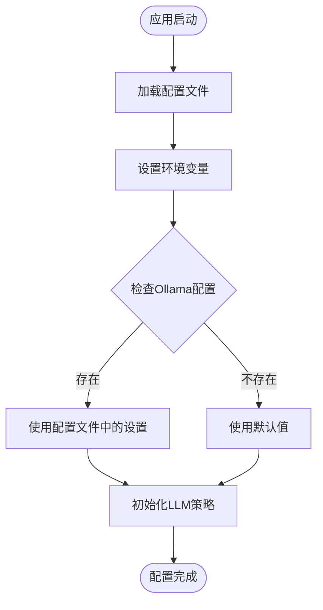
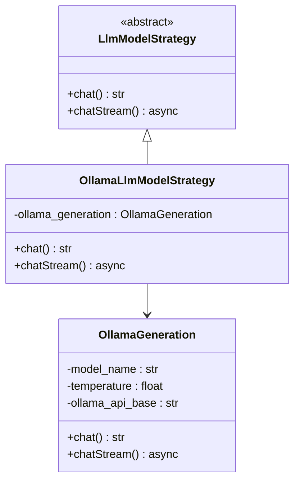
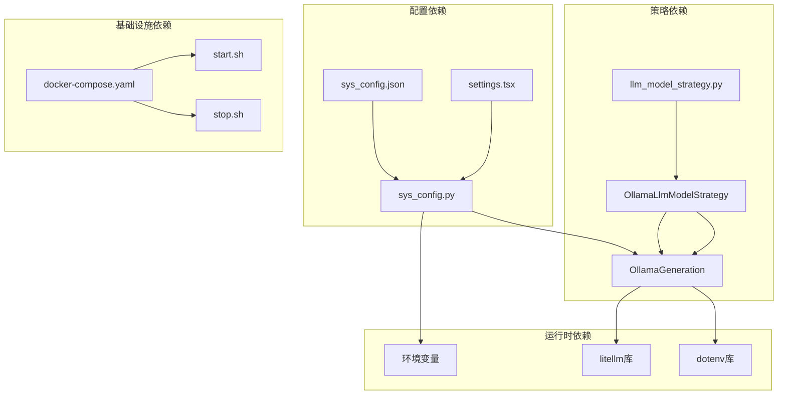

# Ollama本地模型配置

<cite>
**本文档引用的文件**
- [ollama_chat_robot.py](file://domain-chatbot/apps/chatbot/llms/ollama/ollama_chat_robot.py)
- [sys_config.py](file://domain-chatbot/apps/chatbot/config/sys_config.py)
- [sys_config.json](file://domain-chatbot/apps/chatbot/config/sys_config.json)
- [llm_model_strategy.py](file://domain-chatbot/apps/chatbot/llms/llm_model_strategy.py)
- [settings.tsx](file://domain-chatvrm/src/components/settings.tsx)
- [docker-compose.yaml](file://installer/docker-compose.yaml)
- [env_example](file://installer/env_example)
- [start.sh](file://installer/linux/start.sh)
- [stop.sh](file://installer/linux/stop.sh)
- [docker-compose-dev.yaml](file://installer/experiment/docker-compose-dev.yaml)
</cite>

## 目录
1. [简介](#简介)
2. [项目结构](#项目结构)
3. [核心组件](#核心组件)
4. [架构概览](#架构概览)
5. [详细组件分析](#详细组件分析)
6. [依赖关系分析](#依赖关系分析)
7. [性能考虑](#性能考虑)
8. [故障排除指南](#故障排除指南)
9. [结论](#结论)

## 简介

本文档为Ollama本地模型配置的完整技术文档，基于VirtualWife项目的实际代码实现。Ollama是一个开源的大语言模型推理引擎，支持多种主流开源模型，包括Qwen系列、Llama系列等。本文档详细介绍了如何在VirtualWife项目中配置和使用Ollama本地部署，涵盖环境变量设置、模型选择、服务安装启动、模型管理、性能优化以及监控维护等方面。

## 项目结构

VirtualWife项目采用多模块架构设计，其中Ollama配置主要涉及以下关键组件：



**图表来源**
- [sys_config.py](file://domain-chatbot/apps/chatbot/config/sys_config.py#L32-L192)
- [llm_model_strategy.py](file://domain-chatbot/apps/chatbot/llms/llm_model_strategy.py#L63-L90)
- [ollama_chat_robot.py](file://domain-chatbot/apps/chatbot/llms/ollama/ollama_chat_robot.py#L14-L43)

**章节来源**
- [sys_config.py](file://domain-chatbot/apps/chatbot/config/sys_config.py#L1-L208)
- [docker-compose.yaml](file://installer/docker-compose.yaml#L1-L44)

## 核心组件

### 系统配置管理器

系统配置管理器负责统一管理所有语言模型相关的配置参数，包括Ollama的API基础地址和模型名称。

**章节来源**
- [sys_config.py](file://domain-chatbot/apps/chatbot/config/sys_config.py#L122-L133)
- [sys_config.json](file://domain-chatbot/apps/chatbot/config/sys_config.json#L16-L19)

### LLM模型策略模式

项目采用策略模式实现多语言模型的统一接口，Ollama作为其中一个策略实现。

**章节来源**
- [llm_model_strategy.py](file://domain-chatbot/apps/chatbot/llms/llm_model_strategy.py#L63-L90)

### Ollama生成器

OllamaGeneration类封装了与Ollama服务交互的具体实现，包括同步和异步对话功能。

**章节来源**
- [ollama_chat_robot.py](file://domain-chatbot/apps/chatbot/llms/ollama/ollama_chat_robot.py#L14-L100)

## 架构概览



**图表来源**
- [sys_config.py](file://domain-chatbot/apps/chatbot/config/sys_config.py#L126-L133)
- [llm_model_strategy.py](file://domain-chatbot/apps/chatbot/llms/llm_model_strategy.py#L63-L90)
- [ollama_chat_robot.py](file://domain-chatbot/apps/chatbot/llms/ollama/ollama_chat_robot.py#L25-L43)

## 详细组件分析

### 环境变量配置

系统通过环境变量管理Ollama的关键配置参数：

#### OLLAMA_API_BASE
- 默认值：`http://localhost:11434`
- 作用：指定Ollama服务的API基础URL
- 配置位置：系统配置文件和前端设置界面

#### OLLAMA_API_MODEL_NAME
- 默认值：`qwen:7b`
- 作用：指定要使用的具体模型名称
- 支持的模型格式：`model_name:version`（如`qwen:7b`、`llama3:8b`）

**章节来源**
- [sys_config.py](file://domain-chatbot/apps/chatbot/config/sys_config.py#L128-L132)
- [sys_config.json](file://domain-chatbot/apps/chatbot/config/sys_config.json#L17-L18)
- [settings.tsx](file://domain-chatvrm/src/components/settings.tsx#L490-L507)

### 配置加载流程



**图表来源**
- [sys_config.py](file://domain-chatbot/apps/chatbot/config/sys_config.py#L83-L133)

**章节来源**
- [sys_config.py](file://domain-chatbot/apps/chatbot/config/sys_config.py#L83-L133)

### LLM策略实现



**图表来源**
- [llm_model_strategy.py](file://domain-chatbot/apps/chatbot/llms/llm_model_strategy.py#L13-L90)
- [ollama_chat_robot.py](file://domain-chatbot/apps/chatbot/llms/ollama/ollama_chat_robot.py#L14-L43)

**章节来源**
- [llm_model_strategy.py](file://domain-chatbot/apps/chatbot/llms/llm_model_strategy.py#L63-L90)
- [ollama_chat_robot.py](file://domain-chatbot/apps/chatbot/llms/ollama/ollama_chat_robot.py#L14-L43)

### 前端配置界面

前端提供了直观的配置界面，允许用户修改Ollama的相关设置：

- **OLLAMA_API_URL**：Ollama服务地址，默认为`http://localhost:11434`
- **OLLAMA_API_MODEL_NAME**：模型名称，默认为`qwen:7b`

**章节来源**
- [settings.tsx](file://domain-chatvrm/src/components/settings.tsx#L488-L508)

## 依赖关系分析

### 组件依赖图



**图表来源**
- [sys_config.py](file://domain-chatbot/apps/chatbot/config/sys_config.py#L1-L208)
- [llm_model_strategy.py](file://domain-chatbot/apps/chatbot/llms/llm_model_strategy.py#L1-L149)
- [ollama_chat_robot.py](file://domain-chatbot/apps/chatbot/llms/ollama/ollama_chat_robot.py#L1-L100)

### 外部依赖

项目对外部依赖的管理：

**章节来源**
- [ollama_chat_robot.py](file://domain-chatbot/apps/chatbot/llms/ollama/ollama_chat_robot.py#L1-L11)

## 性能考虑

### 内存和并发优化

系统在配置阶段设置了重要的性能参数：

#### 线程并行控制
- `TOKENIZERS_PARALLELISM=false`：禁用分词器的并行处理，避免与Ollama的并发处理冲突

#### 并发处理机制
- 使用`threading.Lock()`保护流式对话的并发访问
- 异步处理支持非阻塞的实时对话体验

**章节来源**
- [sys_config.py](file://domain-chatbot/apps/chatbot/config/sys_config.py#L90)
- [llm_model_strategy.py](file://domain-chatbot/apps/chatbot/llms/llm_model_strategy.py#L113)

### GPU加速配置

虽然当前代码未直接实现GPU配置，但Ollama本身支持GPU加速。建议的配置方式：

1. **硬件要求**：NVIDIA GPU（推荐16GB显存以上）
2. **驱动要求**：NVIDIA驱动版本需满足CUDA兼容性
3. **内存分配**：根据模型大小合理分配显存
4. **并发控制**：通过环境变量控制并发请求数量

### 模型选择建议

基于项目默认配置，推荐以下模型选择：

#### 中文场景优先
- `qwen:7b`：阿里巴巴开源的中文能力强
- `qwen:14b`：更高参数规模，适合复杂任务
- `chatglm3:6b`：智谱AI的中文优化模型

#### 英文场景选择
- `llama3:8b`：Meta开源的高性能模型
- `mistral:7b`：专注于推理能力的模型
- `gemma:2b`：Google的轻量级模型

**章节来源**
- [sys_config.json](file://domain-chatbot/apps/chatbot/config/sys_config.json#L18)

## 故障排除指南

### 常见问题诊断

#### 1. Ollama服务连接失败

**症状**：应用无法连接到Ollama服务
**排查步骤**：
1. 检查Ollama服务是否正常运行
2. 验证`OLLAMA_API_BASE`配置是否正确
3. 确认防火墙设置允许本地连接

**章节来源**
- [ollama_chat_robot.py](file://domain-chatbot/apps/chatbot/llms/ollama/ollama_chat_robot.py#L29-L41)

#### 2. 模型加载失败

**症状**：提示模型不存在或加载错误
**排查步骤**：
1. 使用`ollama list`检查可用模型
2. 确认`OLLAMA_API_MODEL_NAME`配置正确
3. 检查磁盘空间是否充足

#### 3. 性能问题

**症状**：响应缓慢或内存占用过高
**排查步骤**：
1. 检查`TOKENIZERS_PARALLELISM`设置
2. 监控GPU/CPU使用率
3. 调整并发连接数

### 监控和维护

#### 服务状态检查
```bash
# 检查Ollama服务状态
ollama serve

# 查看模型列表
ollama list

# 检查系统资源使用
htop
```

#### 日志监控
- 应用日志：查看Python后端的日志输出
- 前端日志：浏览器开发者工具中的网络请求
- Docker日志：`docker-compose logs chatbot`

#### 磁盘空间管理
- 定期清理不需要的模型
- 监控容器磁盘使用情况
- 备份重要配置文件

**章节来源**
- [docker-compose.yaml](file://installer/docker-compose.yaml#L1-L44)

## 结论

本文档详细介绍了在VirtualWife项目中配置和使用Ollama本地模型的完整方案。通过系统化的配置管理、清晰的策略模式实现以及完善的前端配置界面，项目实现了对Ollama服务的灵活集成。

关键要点总结：
1. **配置灵活性**：支持通过JSON配置文件和前端界面双重配置
2. **策略模式**：良好的扩展性，便于添加其他LLM提供商
3. **性能优化**：合理的并发控制和资源管理
4. **监控维护**：完整的故障排除和性能监控方案

建议在生产环境中：
- 定期更新模型版本
- 监控资源使用情况
- 建立备份和恢复机制
- 根据实际需求调整性能参数