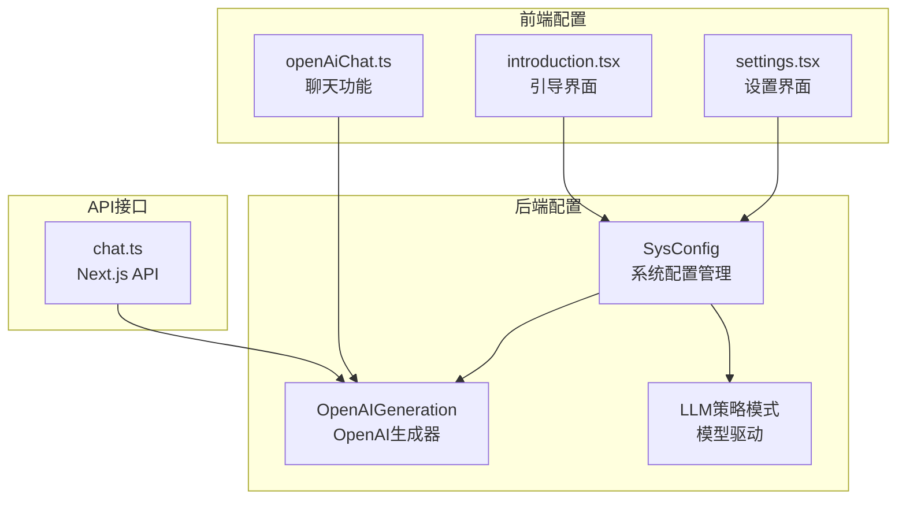
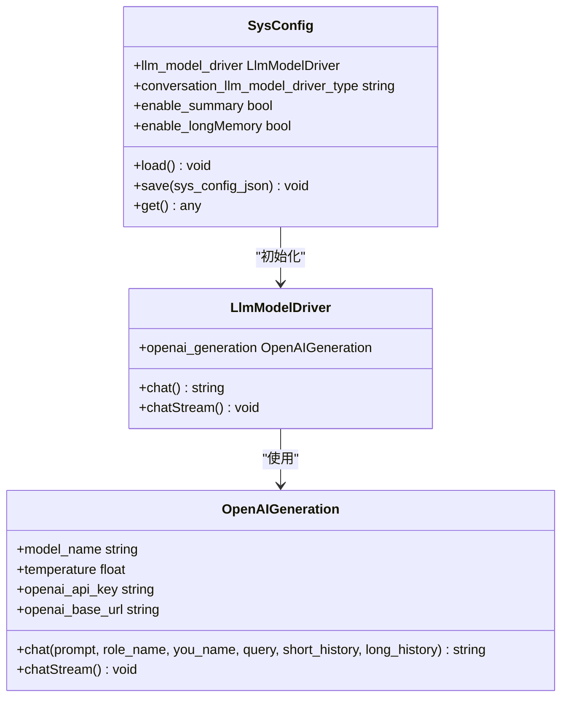
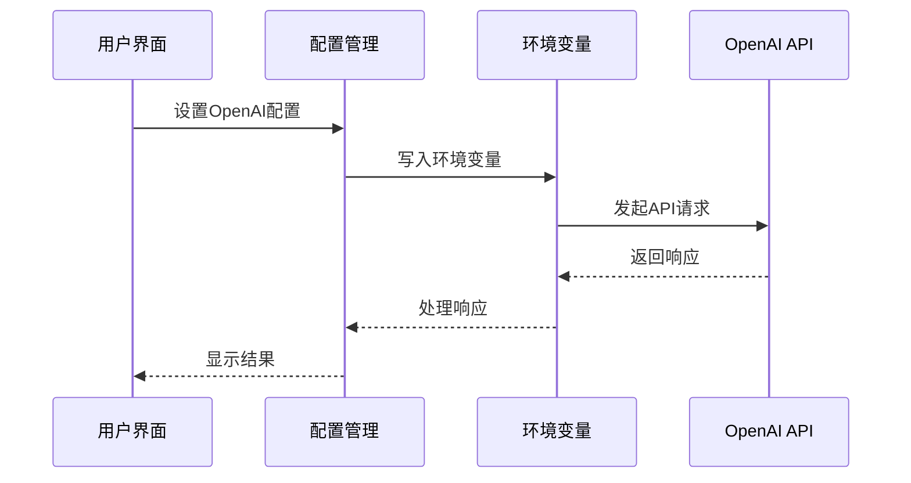
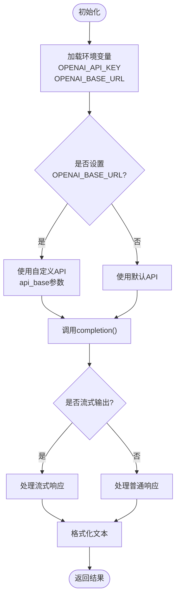
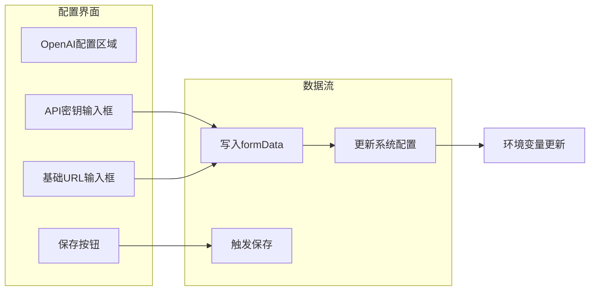
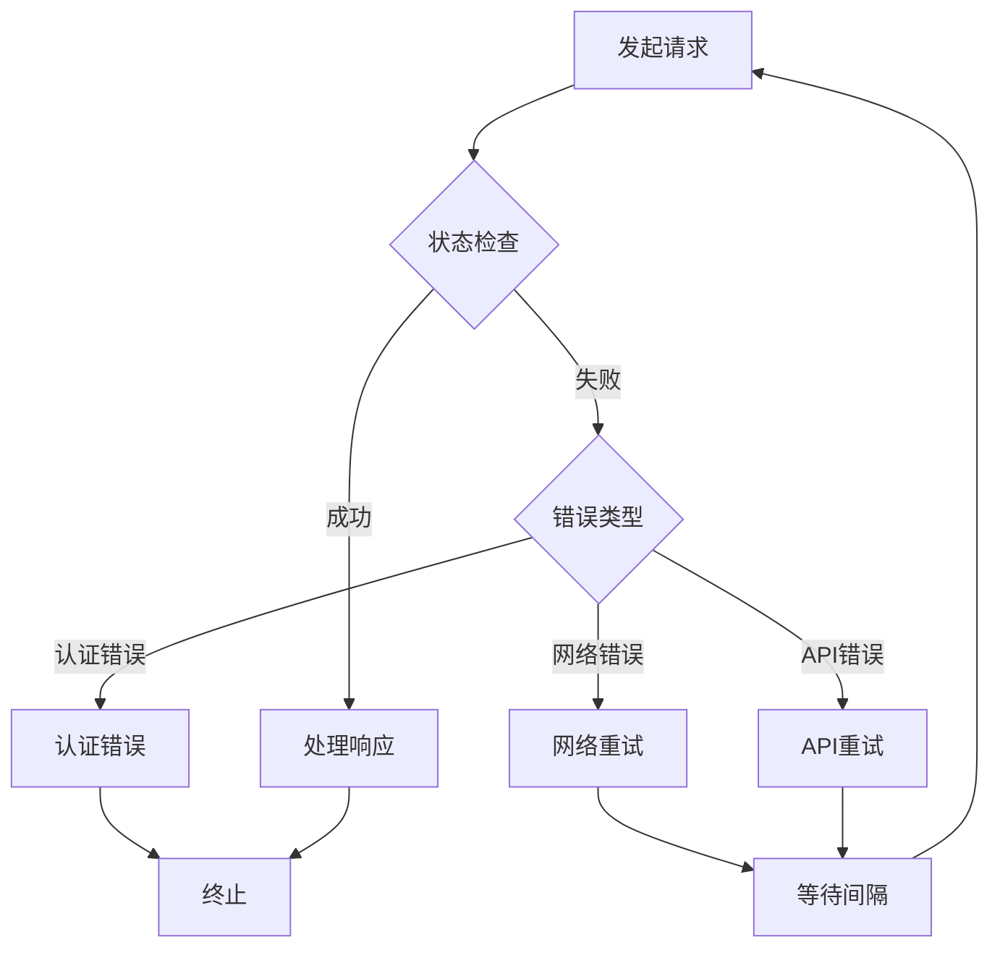

# OpenAI模型配置

<cite>
**本文档引用的文件**
- [openai_chat_robot.py](file://domain-chatbot/apps/chatbot/llms/openai/openai_chat_robot.py)
- [sys_config.py](file://domain-chatbot/apps/chatbot/config/sys_config.py)
- [sys_config.json](file://domain-chatbot/apps/chatbot/config/sys_config.json)
- [llm_model_strategy.py](file://domain-chatbot/apps/chatbot/llms/llm_model_strategy.py)
- [openAiChat.ts](file://domain-chatvrm/src/features/chat/openAiChat.ts)
- [settings.tsx](file://domain-chatvrm/src/components/settings.tsx)
- [introduction.tsx](file://domain-chatvrm/src/components/introduction.tsx)
- [chat.ts](file://domain-chatvrm/src/pages/api/chat.ts)
- [chat_message_utils.py](file://domain-chatbot/apps/chatbot/utils/chat_message_utils.py)
- [str_utils.py](file://domain-chatbot/apps/chatbot/utils/str_utils.py)
</cite>

## 目录
1. [简介](#简介)
2. [项目结构](#项目结构)
3. [核心组件](#核心组件)
4. [架构概览](#架构概览)
5. [详细组件分析](#详细组件分析)
6. [依赖关系分析](#依赖关系分析)
7. [性能考虑](#性能考虑)
8. [故障排除指南](#故障排除指南)
9. [结论](#结论)

## 简介

本文件为OpenAI模型配置的详细技术文档，涵盖OpenAI API的完整配置流程、环境变量设置、参数调优以及性能优化策略。文档基于代码库中的实际实现，提供可操作的配置指南和最佳实践。

## 项目结构

OpenAI配置涉及前后端两个主要部分：



**图表来源**
- [sys_config.py](file://domain-chatbot/apps/chatbot/config/sys_config.py#L122-L156)
- [openai_chat_robot.py](file://domain-chatbot/apps/chatbot/llms/openai/openai_chat_robot.py#L14-L44)
- [settings.tsx](file://domain-chatvrm/src/components/settings.tsx#L450-L473)

**章节来源**
- [sys_config.py](file://domain-chatbot/apps/chatbot/config/sys_config.py#L122-L156)
- [openai_chat_robot.py](file://domain-chatbot/apps/chatbot/llms/openai/openai_chat_robot.py#L14-L44)

## 核心组件

### 系统配置管理

系统配置通过`SysConfig`类统一管理所有语言模型相关的环境变量：



**图表来源**
- [sys_config.py](file://domain-chatbot/apps/chatbot/config/sys_config.py#L32-L50)
- [openai_chat_robot.py](file://domain-chatbot/apps/chatbot/llms/openai/openai_chat_robot.py#L14-L25)
- [llm_model_strategy.py](file://domain-chatbot/apps/chatbot/llm_model_strategy.py#L36-L60)

### 配置数据结构

系统配置采用JSON格式存储，包含完整的OpenAI配置信息：

| 配置项 | 类型 | 默认值 | 描述 |
|--------|------|--------|------|
| OPENAI_API_KEY | string | "sk-" | OpenAI API密钥 |
| OPENAI_BASE_URL | string | "" | 自定义API基础URL |
| enableProxy | boolean | false | 是否启用代理 |
| httpProxy | string | "" | HTTP代理地址 |
| httpsProxy | string | "" | HTTPS代理地址 |
| socks5Proxy | string | "" | SOCKS5代理地址 |

**章节来源**
- [sys_config.json](file://domain-chatbot/apps/chatbot/config/sys_config.json#L11-L23)
- [sys_config.py](file://domain-chatbot/apps/chatbot/config/sys_config.py#L122-L156)

## 架构概览

OpenAI配置架构分为三层：配置层、服务层和应用层。



**图表来源**
- [sys_config.py](file://domain-chatbot/apps/chatbot/config/sys_config.py#L122-L156)
- [openai_chat_robot.py](file://domain-chatbot/apps/chatbot/llms/openai/openai_chat_robot.py#L20-L44)

## 详细组件分析

### OpenAI生成器实现

OpenAIGeneration类是OpenAI集成的核心组件：



**图表来源**
- [openai_chat_robot.py](file://domain-chatbot/apps/chatbot/llms/openai/openai_chat_robot.py#L20-L44)
- [openai_chat_robot.py](file://domain-chatbot/apps/chatbot/llms/openai/openai_chat_robot.py#L64-L78)

### 前端配置界面

前端提供了直观的配置界面：



**图表来源**
- [settings.tsx](file://domain-chatvrm/src/components/settings.tsx#L450-L473)
- [introduction.tsx](file://domain-chatvrm/src/components/introduction.tsx#L68-L74)

**章节来源**
- [openai_chat_robot.py](file://domain-chatbot/apps/chatbot/llms/openai/openai_chat_robot.py#L14-L44)
- [settings.tsx](file://domain-chatvrm/src/components/settings.tsx#L450-L473)

### API集成实现

系统支持多种API集成方式：

| 集成方式 | 文件位置 | 特点 |
|----------|----------|------|
| Python客户端 | openai_chat_robot.py | 使用litellm封装 |
| 浏览器客户端 | openAiChat.ts | 直接HTTP请求 |
| Next.js API | chat.ts | 服务器端代理 |

**章节来源**
- [openai_chat_robot.py](file://domain-chatbot/apps/chatbot/llms/openai/openai_chat_robot.py#L31-L42)
- [openAiChat.ts](file://domain-chatvrm/src/features/chat/openAiChat.ts#L5-L27)
- [chat.ts](file://domain-chatvrm/src/pages/api/chat.ts#L9-L37)

## 依赖关系分析

```mermaid
graph TB
subgraph "Python依赖"
A[litellm] --> B[completion函数]
C[python-dotenv] --> D[环境变量加载]
E[typing] --> F[类型提示]
end
subgraph "前端依赖"
G[openai@3.3.0] --> H[Configuration]
I[axios] --> J[HTTP请求]
K[form-data] --> L[表单数据]
end
subgraph "工具函数"
M[chat_message_utils] --> N[文本格式化]
O[str_utils] --> P[字符串处理]
end
A --> M
G --> I
```

**图表来源**
- [openai_chat_robot.py](file://domain-chatbot/apps/chatbot/llms/openai/openai_chat_robot.py#L1-L9)
- [openAiChat.ts](file://domain-chatvrm/src/features/chat/openAiChat.ts#L1)

**章节来源**
- [openai_chat_robot.py](file://domain-chatbot/apps/chatbot/llms/openai/openai_chat_robot.py#L1-L9)
- [openAiChat.ts](file://domain-chatvrm/src/features/chat/openAiChat.ts#L1)

## 性能考虑

### 并发控制策略

系统通过以下机制实现并发控制：

1. **流式处理优化**
   - 实时回调机制减少内存占用
   - 分块传输避免大响应阻塞

2. **代理配置**
   - 支持HTTP/HTTPS/SOCKS5代理
   - 动态代理切换能力

3. **缓存策略**
   - 环境变量缓存避免重复读取
   - 响应内容格式化缓存

### 错误重试机制



**图表来源**
- [openai_chat_robot.py](file://domain-chatbot/apps/chatbot/llms/openai/openai_chat_robot.py#L80-L96)

### 速率限制处理

系统通过以下方式处理速率限制：

1. **请求节流**
   - 流式输出减少请求频率
   - 批量处理优化网络使用

2. **超时配置**
   - 可配置的请求超时时间
   - 连接池管理

## 故障排除指南

### 常见问题及解决方案

| 问题类型 | 症状 | 解决方案 |
|----------|------|----------|
| API密钥无效 | 认证失败，返回401错误 | 检查OPENAI_API_KEY格式，确认密钥有效 |
| 网络连接失败 | 请求超时，连接被拒绝 | 验证网络连通性，检查防火墙设置 |
| 模型不可用 | 404错误，模型不存在 | 确认模型名称正确，检查账户权限 |
| 代理配置错误 | 请求被代理服务器拒绝 | 验证代理地址格式，检查认证信息 |

### 调试步骤

1. **验证环境变量**
   ```bash
   echo $OPENAI_API_KEY
   echo $OPENAI_BASE_URL
   ```

2. **测试API连通性**
   ```bash
   curl -X POST https://api.openai.com/v1/chat/completions \
     -H "Authorization: Bearer $OPENAI_API_KEY" \
     -H "Content-Type: application/json" \
     -d '{"model":"gpt-3.5-turbo","messages":[{"role":"user","content":"test"}]}'
   ```

3. **检查代理设置**
   ```bash
   echo $HTTP_PROXY
   echo $HTTPS_PROXY
   echo $SOCKS5_PROXY
   ```

**章节来源**
- [openAiChat.ts](file://domain-chatvrm/src/features/chat/openAiChat.ts#L6-L8)
- [sys_config.py](file://domain-chatbot/apps/chatbot/config/sys_config.py#L141-L156)

## 结论

本OpenAI模型配置文档提供了从环境变量设置到参数调优的完整指导。通过系统化的配置管理和优化策略，可以确保OpenAI API的稳定运行和最佳性能表现。建议在生产环境中实施严格的配置管理和监控机制，以保证系统的可靠性和安全性。