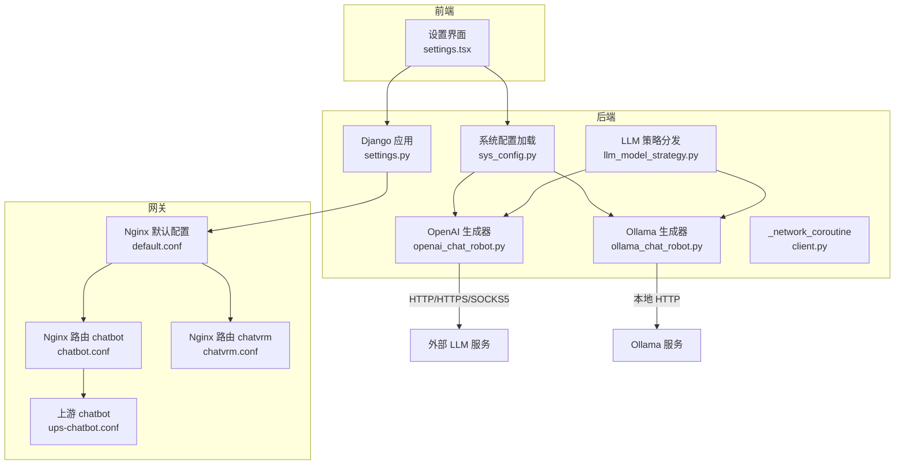
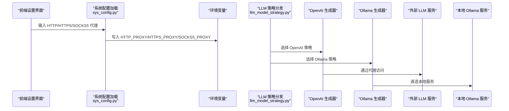
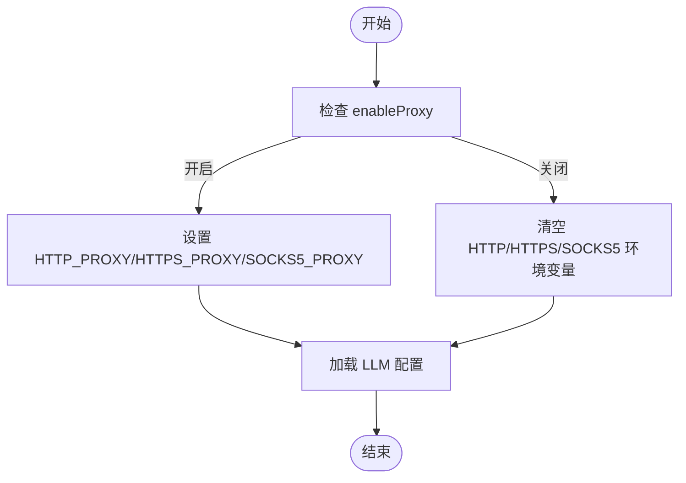
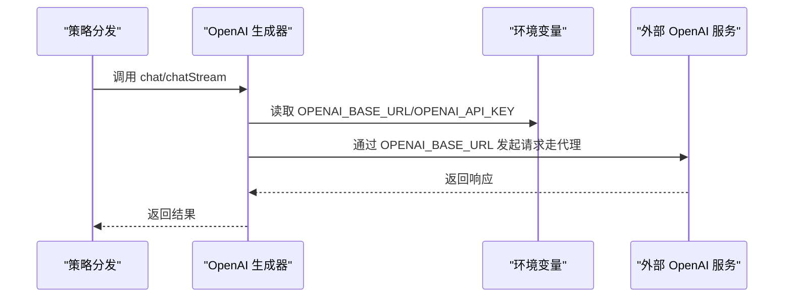
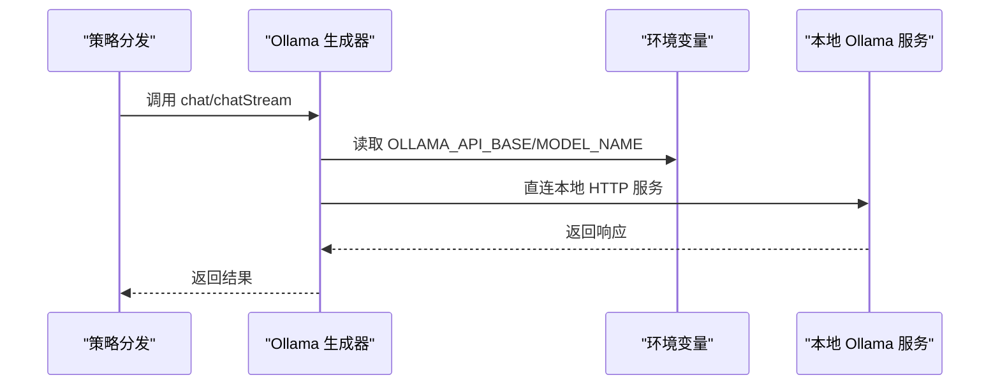
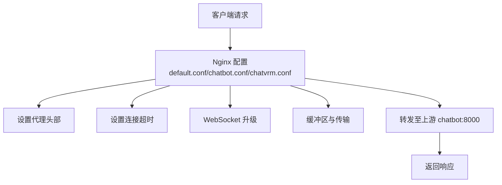
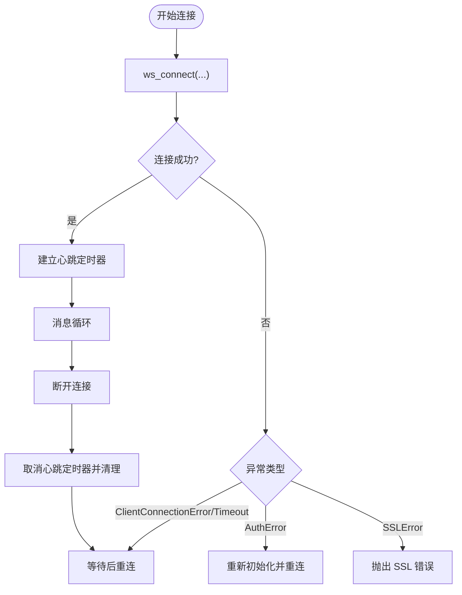
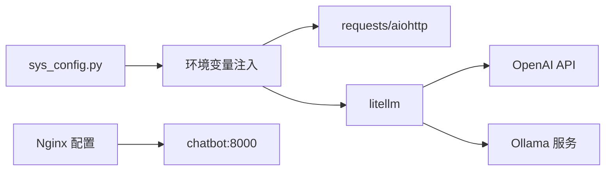

# 代理和网络配置

<cite>
**本文档引用的文件**
- [settings.py](file://domain-chatbot/VirtualWife/settings.py)
- [sys_config.py](file://domain-chatbot/apps/chatbot/config/sys_config.py)
- [sys_config.json](file://domain-chatbot/apps/chatbot/config/sys_config.json)
- [openai_chat_robot.py](file://domain-chatbot/apps/chatbot/llms/openai/openai_chat_robot.py)
- [ollama_chat_robot.py](file://domain-chatbot/apps/chatbot/llms/ollama/ollama_chat_robot.py)
- [llm_model_strategy.py](file://domain-chatbot/apps/chatbot/llms/llm_model_strategy.py)
- [client.py](file://domain-chatbot/apps/chatbot/insight/bilibili/sdk/client.py)
- [chatbot.conf](file://infrastructure-gateway/conf.d/server/chatbot.conf)
- [chatvrm.conf](file://infrastructure-gateway/conf.d/server/chatvrm.conf)
- [default.conf](file://infrastructure-gateway/conf.d/default.conf)
- [ups-chatbot.conf](file://infrastructure-gateway/conf.d/upstream/ups-chatbot.conf)
- [requirements.txt](file://domain-chatbot/requirements.txt)
</cite>

## 目录
1. [简介](#简介)
2. [项目结构](#项目结构)
3. [核心组件](#核心组件)
4. [架构总览](#架构总览)
5. [详细组件分析](#详细组件分析)
6. [依赖关系分析](#依赖关系分析)
7. [性能考量](#性能考量)
8. [故障排查指南](#故障排查指南)
9. [结论](#结论)
10. [附录](#附录)

## 简介
本文件系统性地梳理并文档化本项目的代理与网络配置方案，覆盖以下主题：
- HTTP_PROXY、HTTPS_PROXY、SOCKS5_PROXY 的配置方法与使用场景
- 代理服务器选择与设置：公共代理、企业代理、代理链配置
- 网络连接优化：超时设置、重试机制、连接池管理
- 代理配置对不同模型的影响：OpenAI API 通过代理访问、Ollama 本地模型的网络隔离
- 网络故障排查：连接超时、DNS 解析、SSL 证书问题
- 网络安全考虑：代理认证、数据加密、隐私保护

## 项目结构
本项目由后端 Django 应用与前端 Next.js 应用组成，并通过 Nginx 网关进行反向代理与上游服务路由。网络相关的关键位置包括：
- 后端应用：读取系统环境变量中的代理配置，用于 OpenAI、Ollama 等外部服务调用
- 前端应用：提供代理配置界面，支持用户输入 HTTP/HTTPS/SOCKS5 代理地址
- 网关层：Nginx 配置代理头部、超时、WebSocket 升级等参数

图表来源
- [settings.py](file://domain-chatbot/VirtualWife/settings.py#L1-L208)
- [sys_config.py](file://domain-chatbot/apps/chatbot/config/sys_config.py#L1-L208)
- [openai_chat_robot.py](file://domain-chatbot/apps/chatbot/llms/openai/openai_chat_robot.py#L1-L101)
- [ollama_chat_robot.py](file://domain-chatbot/apps/chatbot/llms/ollama/ollama_chat_robot.py#L1-L100)
- [llm_model_strategy.py](file://domain-chatbot/apps/chatbot/llms/llm_model_strategy.py#L1-L149)
- [client.py](file://domain-chatbot/apps/chatbot/insight/bilibili/sdk/client.py#L362-L445)
- [chatbot.conf](file://infrastructure-gateway/conf.d/server/chatbot.conf#L1-L21)
- [chatvrm.conf](file://infrastructure-gateway/conf.d/server/chatvrm.conf#L1-L13)
- [default.conf](file://infrastructure-gateway/conf.d/default.conf#L2-L55)
- [ups-chatbot.conf](file://infrastructure-gateway/conf.d/upstream/ups-chatbot.conf#L1-L4)

章节来源
- [settings.py](file://domain-chatbot/VirtualWife/settings.py#L1-L208)
- [sys_config.py](file://domain-chatbot/apps/chatbot/config/sys_config.py#L1-L208)
- [sys_config.json](file://domain-chatbot/apps/chatbot/config/sys_config.json#L1-L60)
- [openai_chat_robot.py](file://domain-chatbot/apps/chatbot/llms/openai/openai_chat_robot.py#L1-L101)
- [ollama_chat_robot.py](file://domain-chatbot/apps/chatbot/llms/ollama/ollama_chat_robot.py#L1-L100)
- [llm_model_strategy.py](file://domain-chatbot/apps/chatbot/llms/llm_model_strategy.py#L1-L149)
- [client.py](file://domain-chatbot/apps/chatbot/insight/bilibili/sdk/client.py#L362-L445)
- [chatbot.conf](file://infrastructure-gateway/conf.d/server/chatbot.conf#L1-L21)
- [chatvrm.conf](file://infrastructure-gateway/conf.d/server/chatvrm.conf#L1-L13)
- [default.conf](file://infrastructure-gateway/conf.d/default.conf#L2-L55)
- [ups-chatbot.conf](file://infrastructure-gateway/conf.d/upstream/ups-chatbot.conf#L1-L4)

## 核心组件
- 系统配置加载与代理注入：从 JSON 配置中读取代理开关与代理地址，写入环境变量，供后续模块使用
- LLM 策略分发：根据配置选择 OpenAI 或 Ollama 等模型策略
- OpenAI 生成器：通过 litellm 调用 OpenAI API，支持自定义 base_url，从而走代理
- Ollama 生成器：通过 litellm 调用本地 Ollama 服务，不依赖外部代理
- 网关层：Nginx 配置代理头部、超时、WebSocket 升级与缓存参数

章节来源
- [sys_config.py](file://domain-chatbot/apps/chatbot/config/sys_config.py#L141-L156)
- [sys_config.json](file://domain-chatbot/apps/chatbot/config/sys_config.json#L6-L10)
- [llm_model_strategy.py](file://domain-chatbot/apps/chatbot/llms/llm_model_strategy.py#L107-L149)
- [openai_chat_robot.py](file://domain-chatbot/apps/chatbot/llms/openai/openai_chat_robot.py#L20-L44)
- [ollama_chat_robot.py](file://domain-chatbot/apps/chatbot/llms/ollama/ollama_chat_robot.py#L19-L43)
- [default.conf](file://infrastructure-gateway/conf.d/default.conf#L22-L55)

## 架构总览
下图展示代理与网络配置在系统中的作用路径：前端设置 → 后端加载 → 环境变量注入 → LLM 调用 → 外部服务或本地服务。

图表来源
- [sys_config.py](file://domain-chatbot/apps/chatbot/config/sys_config.py#L141-L156)
- [llm_model_strategy.py](file://domain-chatbot/apps/chatbot/llms/llm_model_strategy.py#L107-L149)
- [openai_chat_robot.py](file://domain-chatbot/apps/chatbot/llms/openai/openai_chat_robot.py#L20-L44)
- [ollama_chat_robot.py](file://domain-chatbot/apps/chatbot/llms/ollama/ollama_chat_robot.py#L19-L43)

## 详细组件分析

### 代理配置加载与注入
- 开关控制：enableProxy 控制是否启用代理
- 代理地址：httpProxy、httpsProxy、socks5Proxy 三类代理地址
- 注入时机：加载系统配置时写入环境变量，供后续模块读取
- 生效范围：OpenAI 通过 OPENAI_BASE_URL 与环境变量共同生效；Ollama 通过 OLLAMA_API_BASE 生效

图表来源
- [sys_config.py](file://domain-chatbot/apps/chatbot/config/sys_config.py#L141-L156)
- [sys_config.json](file://domain-chatbot/apps/chatbot/config/sys_config.json#L6-L10)

章节来源
- [sys_config.py](file://domain-chatbot/apps/chatbot/config/sys_config.py#L141-L156)
- [sys_config.json](file://domain-chatbot/apps/chatbot/config/sys_config.json#L6-L10)

### OpenAI 代理访问
- 关键点：OpenAI 生成器读取 OPENAI_BASE_URL 与 OPENAI_API_KEY，若 OPENAI_BASE_URL 非空，则通过该 base_url 发起请求，从而走代理
- 代理类型：HTTP/HTTPS/SOCKS5 均可，取决于环境变量设置
- 场景：需要在受限网络环境下访问 OpenAI API

图表来源
- [openai_chat_robot.py](file://domain-chatbot/apps/chatbot/llms/openai/openai_chat_robot.py#L20-L44)
- [sys_config.py](file://domain-chatbot/apps/chatbot/config/sys_config.py#L123-L124)

章节来源
- [openai_chat_robot.py](file://domain-chatbot/apps/chatbot/llms/openai/openai_chat_robot.py#L20-L44)
- [sys_config.py](file://domain-chatbot/apps/chatbot/config/sys_config.py#L123-L124)

### Ollama 本地模型网络隔离
- 关键点：Ollama 生成器读取 OLLAMA_API_BASE 与 OLLAMA_API_MODEL_NAME，直接访问本地服务
- 代理影响：不受 HTTP_PROXY/HTTPS_PROXY/SOCKS5_PROXY 影响，天然网络隔离
- 场景：内网部署、离线可用、隐私敏感

图表来源
- [ollama_chat_robot.py](file://domain-chatbot/apps/chatbot/llms/ollama/ollama_chat_robot.py#L19-L43)
- [sys_config.py](file://domain-chatbot/apps/chatbot/config/sys_config.py#L127-L132)

章节来源
- [ollama_chat_robot.py](file://domain-chatbot/apps/chatbot/llms/ollama/ollama_chat_robot.py#L19-L43)
- [sys_config.py](file://domain-chatbot/apps/chatbot/config/sys_config.py#L127-L132)

### 网关层网络优化与安全
- 代理头部：设置 Host、X-Real-IP、X-Forwarded-For、X-Forwarded-Proto 等
- 超时与升级：proxy_connect_timeout、proxy_http_version、Connection 升级头
- 缓存与传输：proxy_buffer_*、chunked_transfer_encoding、Cache-Control
- 上游服务：chatbot:8000

图表来源
- [default.conf](file://infrastructure-gateway/conf.d/default.conf#L2-L55)
- [chatbot.conf](file://infrastructure-gateway/conf.d/server/chatbot.conf#L1-L21)
- [chatvrm.conf](file://infrastructure-gateway/conf.d/server/chatvrm.conf#L1-L13)
- [ups-chatbot.conf](file://infrastructure-gateway/conf.d/upstream/ups-chatbot.conf#L1-L4)

章节来源
- [default.conf](file://infrastructure-gateway/conf.d/default.conf#L2-L55)
- [chatbot.conf](file://infrastructure-gateway/conf.d/server/chatbot.conf#L1-L21)
- [chatvrm.conf](file://infrastructure-gateway/conf.d/server/chatvrm.conf#L1-L13)
- [ups-chatbot.conf](file://infrastructure-gateway/conf.d/upstream/ups-chatbot.conf#L1-L4)

### 网络连接重试与异常处理
- WebSocket 连接：在连接错误、超时、认证失败、SSL 错误等情况下进行重连与异常记录
- 心跳与关闭：连接建立后启动心跳定时器，断开时取消并清理资源
- 重连策略：指数退避式重连，避免频繁重试导致资源浪费

图表来源
- [client.py](file://domain-chatbot/apps/chatbot/insight/bilibili/sdk/client.py#L362-L445)

章节来源
- [client.py](file://domain-chatbot/apps/chatbot/insight/bilibili/sdk/client.py#L362-L445)

## 依赖关系分析
- Python 依赖：requests、aiohttp、litellm 等用于 HTTP/HTTPS 请求与流式处理
- 环境变量：HTTP_PROXY/HTTPS_PROXY/SOCKS5_PROXY 由系统配置注入，影响 requests/aiohttp/litellm 的网络行为
- 网关依赖：Nginx 作为统一入口，负责代理头部、超时、升级与缓存

图表来源
- [sys_config.py](file://domain-chatbot/apps/chatbot/config/sys_config.py#L141-L156)
- [requirements.txt](file://domain-chatbot/requirements.txt#L1-L33)
- [default.conf](file://infrastructure-gateway/conf.d/default.conf#L22-L55)
- [ups-chatbot.conf](file://infrastructure-gateway/conf.d/upstream/ups-chatbot.conf#L1-L4)

章节来源
- [requirements.txt](file://domain-chatbot/requirements.txt#L1-L33)
- [default.conf](file://infrastructure-gateway/conf.d/default.conf#L22-L55)
- [ups-chatbot.conf](file://infrastructure-gateway/conf.d/upstream/ups-chatbot.conf#L1-L4)

## 性能考量
- 连接池与并发：通过上游 chatbot:8000 的并发能力与 Nginx 的缓冲区配置提升吞吐
- 超时设置：Nginx 层设置 proxy_connect_timeout，降低慢连接占用资源
- 流式输出：OpenAI/Ollama 的流式接口减少首字节延迟
- 缓存策略：Nginx 缓存配置与 Cache-Control 头部控制静态资源缓存

章节来源
- [default.conf](file://infrastructure-gateway/conf.d/default.conf#L27-L30)
- [chatbot.conf](file://infrastructure-gateway/conf.d/server/chatbot.conf#L7-L11)
- [openai_chat_robot.py](file://domain-chatbot/apps/chatbot/llms/openai/openai_chat_robot.py#L64-L78)
- [ollama_chat_robot.py](file://domain-chatbot/apps/chatbot/llms/ollama/ollama_chat_robot.py#L63-L77)

## 故障排查指南
- 连接超时
  - 现象：请求长时间无响应
  - 排查：检查 Nginx proxy_connect_timeout 设置；确认代理服务器可达性
  - 参考：网关配置中的连接超时参数
- DNS 解析问题
  - 现象：域名无法解析
  - 排查：确认代理服务器 DNS 配置；检查系统解析顺序
  - 参考：代理注入位置与上游服务地址
- SSL 证书问题
  - 现象：SSL 握手失败
  - 排查：检查代理服务器证书链；必要时禁用严格校验（仅限测试）
  - 参考：WebSocket 层面对 SSL 错误的处理
- 代理认证失败
  - 现象：407 代理认证错误
  - 排查：确认代理用户名密码；确保代理支持所需认证方式
  - 参考：环境变量注入与外部服务访问路径
- OpenAI 访问异常
  - 现象：API 调用失败或被限流
  - 排查：确认 OPENAI_BASE_URL 与 OPENAI_API_KEY；检查代理是否允许目标域名
- Ollama 本地模型不可达
  - 现象：本地服务无法访问
  - 排查：确认 OLLAMA_API_BASE 与本地服务监听地址；检查防火墙与端口

章节来源
- [default.conf](file://infrastructure-gateway/conf.d/default.conf#L22-L55)
- [client.py](file://domain-chatbot/apps/chatbot/insight/bilibili/sdk/client.py#L418-L420)
- [openai_chat_robot.py](file://domain-chatbot/apps/chatbot/llms/openai/openai_chat_robot.py#L30-L42)
- [ollama_chat_robot.py](file://domain-chatbot/apps/chatbot/llms/ollama/ollama_chat_robot.py#L29-L41)

## 结论
本项目通过“系统配置 → 环境变量注入 → LLM 调用”的链路实现了灵活的代理与网络控制。OpenAI 通过代理访问，Ollama 则保持本地隔离。网关层提供了完善的头部、超时、升级与缓存配置，满足生产环境的稳定性与性能需求。结合本文提供的故障排查与安全建议，可在复杂网络环境中可靠运行。

## 附录
- 代理配置示例（来自系统配置文件）
  - enableProxy：是否启用代理
  - httpProxy：HTTP 代理地址
  - httpsProxy：HTTPS 代理地址
  - socks5Proxy：SOCKS5 代理地址
- LLM 配置示例（来自系统配置文件）
  - OpenAI：OPENAI_API_KEY、OPENAI_BASE_URL
  - Ollama：OLLAMA_API_BASE、OLLAMA_API_MODEL_NAME
- 网关配置要点
  - 代理头部设置
  - 连接超时与 WebSocket 升级
  - 缓冲区与传输优化
  - 上游服务地址

章节来源
- [sys_config.json](file://domain-chatbot/apps/chatbot/config/sys_config.json#L6-L23)
- [default.conf](file://infrastructure-gateway/conf.d/default.conf#L2-L55)
- [chatbot.conf](file://infrastructure-gateway/conf.d/server/chatbot.conf#L1-L21)
- [ups-chatbot.conf](file://infrastructure-gateway/conf.d/upstream/ups-chatbot.conf#L1-L4)