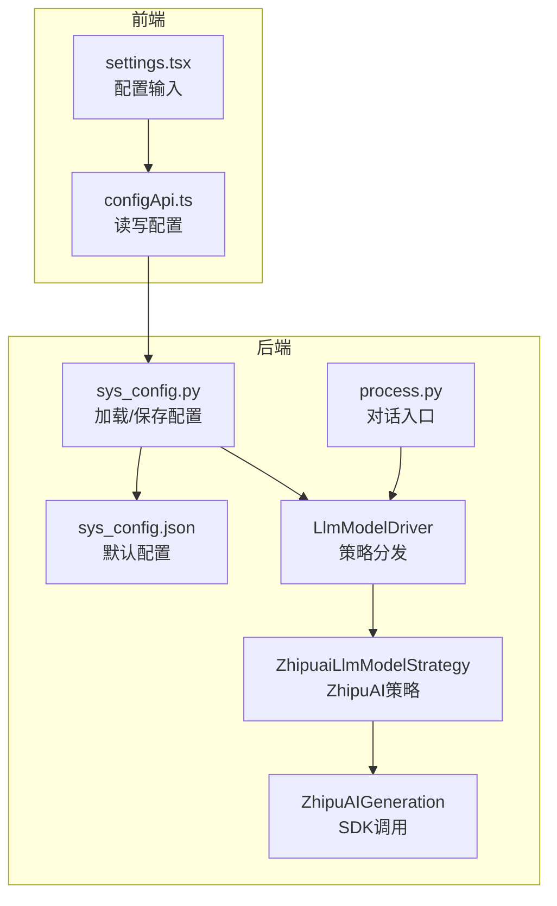
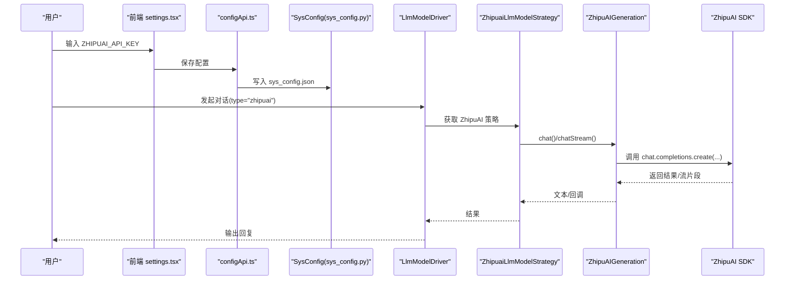
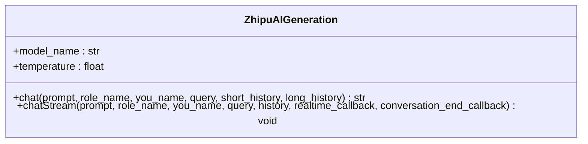
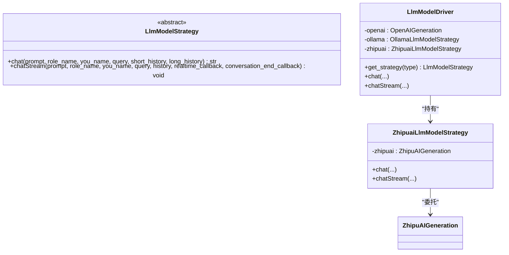
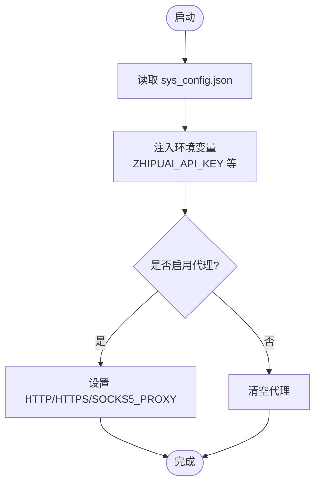
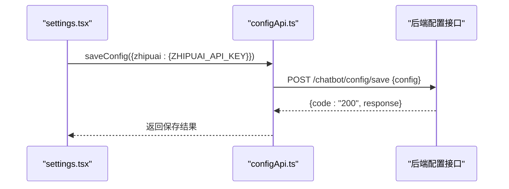
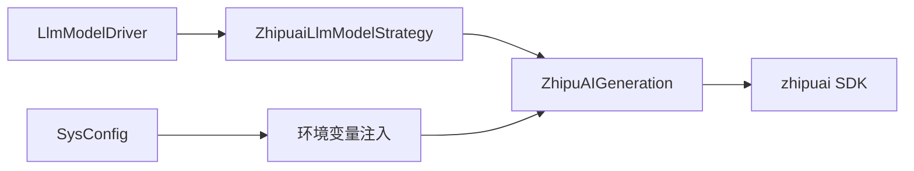

# 智谱清言模型配置

<cite>
**本文引用的文件**
- [zhipuai_chat_robot.py](file://domain-chatbot/apps/chatbot/llms/zhipuai/zhipuai_chat_robot.py)
- [llm_model_strategy.py](file://domain-chatbot/apps/chatbot/llms/llm_model_strategy.py)
- [sys_config.py](file://domain-chatbot/apps/chatbot/config/sys_config.py)
- [sys_config.json](file://domain-chatbot/apps/chatbot/config/sys_config.json)
- [process.py](file://domain-chatbot/apps/chatbot/process/process.py)
- [settings.tsx](file://domain-chatvrm/src/components/settings.tsx)
- [configApi.ts](file://domain-chatvrm/src/features/config/configApi.ts)
- [openai_chat_robot.py](file://domain-chatbot/apps/chatbot/llms/openai/openai_chat_robot.py)
- [ollama_chat_robot.py](file://domain-chatbot/apps/chatbot/llms/ollama/ollama_chat_robot.py)
</cite>

## 目录
1. [简介](#简介)
2. [项目结构](#项目结构)
3. [核心组件](#核心组件)
4. [架构总览](#架构总览)
5. [详细组件分析](#详细组件分析)
6. [依赖关系分析](#依赖关系分析)
7. [性能与成本考量](#性能与成本考量)
8. [故障排查指南](#故障排查指南)
9. [结论](#结论)
10. [附录](#附录)

## 简介
本文件面向“智谱清言”（ZhipuAI）模型在本项目的配置与使用，系统性说明以下内容：
- API 密钥申请与配置流程
- API 端点与模型选择
- 支持的模型类型与适用场景（以当前实现为准）
- 参数配置要点（温度、采样等）
- 认证机制与请求格式（SDK 使用方式）
- 响应解析与回调处理
- 中文对话优化建议（提示词工程、上下文管理、多轮对话保持）
- 性能特征与成本对比（基于实现与通用实践）

## 项目结构
围绕智谱清言的配置与调用，涉及后端 Python 与前端 React 两部分：
- 后端 Python
  - 模型封装与调用：zhipuai_chat_robot.py
  - 模型策略与路由：llm_model_strategy.py
  - 全局配置加载与环境变量注入：sys_config.py、sys_config.json
  - 对话流程入口：process.py
- 前端 React
  - 配置界面：settings.tsx
  - 配置读写接口：configApi.ts

图表来源
- [sys_config.py](file://domain-chatbot/apps/chatbot/config/sys_config.py#L134-L139)
- [sys_config.json](file://domain-chatbot/apps/chatbot/config/sys_config.json#L20-L22)
- [llm_model_strategy.py](file://domain-chatbot/apps/chatbot/llms/llm_model_strategy.py#L107-L148)
- [zhipuai_chat_robot.py](file://domain-chatbot/apps/chatbot/llms/zhipuai/zhipuai_chat_robot.py#L13-L36)
- [process.py](file://domain-chatbot/apps/chatbot/process/process.py#L63-L70)

章节来源
- [sys_config.py](file://domain-chatbot/apps/chatbot/config/sys_config.py#L134-L139)
- [sys_config.json](file://domain-chatbot/apps/chatbot/config/sys_config.json#L20-L22)
- [llm_model_strategy.py](file://domain-chatbot/apps/chatbot/llms/llm_model_strategy.py#L107-L148)
- [zhipuai_chat_robot.py](file://domain-chatbot/apps/chatbot/llms/zhipuai/zhipuai_chat_robot.py#L13-L36)
- [process.py](file://domain-chatbot/apps/chatbot/process/process.py#L63-L70)

## 核心组件
- ZhipuAIGeneration：封装智谱清言 SDK 调用，负责同步与流式对话生成
- ZhipuaiLlmModelStrategy：ZhipuAI 的策略实现，对接 LlmModelDriver
- LlmModelDriver：统一的模型驱动器，按类型分发到不同策略
- SysConfig：全局配置加载与环境变量注入，含 ZHIPUAI_API_KEY
- 前端 settings.tsx 与 configApi.ts：提供配置项输入与持久化

章节来源
- [zhipuai_chat_robot.py](file://domain-chatbot/apps/chatbot/llms/zhipuai/zhipuai_chat_robot.py#L13-L36)
- [llm_model_strategy.py](file://domain-chatbot/apps/chatbot/llms/llm_model_strategy.py#L92-L104)
- [llm_model_strategy.py](file://domain-chatbot/apps/chatbot/llms/llm_model_strategy.py#L107-L148)
- [sys_config.py](file://domain-chatbot/apps/chatbot/config/sys_config.py#L134-L139)
- [settings.tsx](file://domain-chatvrm/src/components/settings.tsx#L476-L485)
- [configApi.ts](file://domain-chatvrm/src/features/config/configApi.ts#L68-L100)

## 架构总览
下图展示从用户输入到智谱清言模型调用的关键链路。

图表来源
- [settings.tsx](file://domain-chatvrm/src/components/settings.tsx#L476-L485)
- [configApi.ts](file://domain-chatvrm/src/features/config/configApi.ts#L82-L100)
- [sys_config.py](file://domain-chatbot/apps/chatbot/config/sys_config.py#L134-L139)
- [llm_model_strategy.py](file://domain-chatbot/apps/chatbot/llms/llm_model_strategy.py#L140-L148)
- [zhipuai_chat_robot.py](file://domain-chatbot/apps/chatbot/llms/zhipuai/zhipuai_chat_robot.py#L24-L36)

## 详细组件分析

### ZhipuAIGeneration 组件
- 角色与职责
  - 负责通过 SDK 调用智谱清言模型
  - 提供同步与流式两种对话生成方式
- 关键点
  - 默认模型名称与温度参数在类内定义
  - 从环境变量读取 API Key 并初始化客户端
  - 流式输出逐块拼接，并对空字符进行过滤
  - 对最终文本进行格式化处理

图表来源
- [zhipuai_chat_robot.py](file://domain-chatbot/apps/chatbot/llms/zhipuai/zhipuai_chat_robot.py#L13-L36)
- [zhipuai_chat_robot.py](file://domain-chatbot/apps/chatbot/llms/zhipuai/zhipuai_chat_robot.py#L38-L71)

章节来源
- [zhipuai_chat_robot.py](file://domain-chatbot/apps/chatbot/llms/zhipuai/zhipuai_chat_robot.py#L13-L36)
- [zhipuai_chat_robot.py](file://domain-chatbot/apps/chatbot/llms/zhipuai/zhipuai_chat_robot.py#L38-L71)

### ZhipuaiLlmModelStrategy 与 LlmModelDriver
- 角色与职责
  - ZhipuaiLlmModelStrategy：将 LlmModelDriver 的调用转发给 ZhipuAIGeneration
  - LlmModelDriver：按类型选择策略；当前支持 openai、ollama、zhipuai
- 关键点
  - get_strategy(type) 根据传入类型返回对应策略
  - chatStream 使用异步运行策略的 chatStream

图表来源
- [llm_model_strategy.py](file://domain-chatbot/apps/chatbot/llms/llm_model_strategy.py#L13-L29)
- [llm_model_strategy.py](file://domain-chatbot/apps/chatbot/llms/llm_model_strategy.py#L92-L104)
- [llm_model_strategy.py](file://domain-chatbot/apps/chatbot/llms/llm_model_strategy.py#L107-L148)

章节来源
- [llm_model_strategy.py](file://domain-chatbot/apps/chatbot/llms/llm_model_strategy.py#L92-L104)
- [llm_model_strategy.py](file://domain-chatbot/apps/chatbot/llms/llm_model_strategy.py#L107-L148)

### 全局配置与环境变量注入（SysConfig）
- 角色与职责
  - 从 sys_config.json 读取配置并注入环境变量
  - 为 ZhipuAI 注入 ZHIPUAI_API_KEY
  - 可选代理配置注入 HTTP_PROXY/HTTPS_PROXY/SOCKS5_PROXY
- 关键点
  - 若未提供 zhipuai 配置，默认值为 "SK-"
  - 会将配置持久化到数据库中的 SysConfigModel

图表来源
- [sys_config.py](file://domain-chatbot/apps/chatbot/config/sys_config.py#L83-L151)
- [sys_config.json](file://domain-chatbot/apps/chatbot/config/sys_config.json#L20-L22)

章节来源
- [sys_config.py](file://domain-chatbot/apps/chatbot/config/sys_config.py#L134-L139)
- [sys_config.json](file://domain-chatbot/apps/chatbot/config/sys_config.json#L20-L22)

### 前端配置与保存（settings.tsx 与 configApi.ts）
- 角色与职责
  - settings.tsx 提供 ZHIPUAI_API_KEY 输入框
  - configApi.ts 提供 getConfig/saveConfig 接口，与后端交互
- 关键点
  - 保存时将配置对象包装为 { config: payload }
  - 读取时校验响应码为 200

图表来源
- [settings.tsx](file://domain-chatvrm/src/components/settings.tsx#L476-L485)
- [configApi.ts](file://domain-chatvrm/src/features/config/configApi.ts#L82-L100)

章节来源
- [settings.tsx](file://domain-chatvrm/src/components/settings.tsx#L476-L485)
- [configApi.ts](file://domain-chatvrm/src/features/config/configApi.ts#L68-L100)

### 对话流程入口（process.py）
- 角色与职责
  - 在对话发起时，调用 LlmModelDriver.chatStream
  - 传入当前对话类型（conversation_llm_model_driver_type），由 LlmModelDriver 分发到对应策略
- 关键点
  - 当前实现中，若类型为 "zhipuai"，将走 ZhipuaiLlmModelStrategy

章节来源
- [process.py](file://domain-chatbot/apps/chatbot/process/process.py#L63-L70)

## 依赖关系分析
- 模块耦合
  - LlmModelDriver 与各策略解耦，通过 get_strategy(type) 动态选择
  - ZhipuAIGeneration 仅依赖 SDK 与工具函数，内聚度高
- 外部依赖
  - zhipuai SDK：用于调用智谱清言模型
  - 环境变量：ZHIPUAI_API_KEY 由 SysConfig 注入
- 循环依赖
  - 未发现循环导入；策略与驱动采用单向依赖

图表来源
- [llm_model_strategy.py](file://domain-chatbot/apps/chatbot/llms/llm_model_strategy.py#L107-L148)
- [zhipuai_chat_robot.py](file://domain-chatbot/apps/chatbot/llms/zhipuai/zhipuai_chat_robot.py#L13-L36)
- [sys_config.py](file://domain-chatbot/apps/chatbot/config/sys_config.py#L134-L139)

章节来源
- [llm_model_strategy.py](file://domain-chatbot/apps/chatbot/llms/llm_model_strategy.py#L107-L148)
- [zhipuai_chat_robot.py](file://domain-chatbot/apps/chatbot/llms/zhipuai/zhipuai_chat_robot.py#L13-L36)
- [sys_config.py](file://domain-chatbot/apps/chatbot/config/sys_config.py#L134-L139)

## 性能与成本考量
- 实现层面的性能特征
  - 同步与流式两种模式：流式可降低首字延迟，提升交互体验
  - 温度参数固定为 0.7，属于中性偏创造性，适合日常对话
  - 未见显式的并发控制或限流逻辑，需结合实际部署规模评估
- 成本对比
  - 本仓库未包含计费与用量统计逻辑，无法直接给出成本数据
  - 建议结合智谱清言官方定价与项目实际调用量进行估算
- 优化建议
  - 合理设置温度与采样参数，平衡创造性与稳定性
  - 对长上下文进行截断或摘要，避免超出上下文长度限制
  - 使用流式输出提升感知延迟表现

[本节为通用指导，不直接分析具体文件]

## 故障排查指南
- API 密钥无效
  - 检查前端 settings.tsx 是否正确填写 ZHIPUAI_API_KEY
  - 确认 configApi.ts 保存成功且后端 sys_config.py 已注入环境变量
- 请求失败或无响应
  - 查看流式回调是否被正确触发（ZhipuAIGeneration.chatStream）
  - 确认网络代理设置（SysConfig 注入的代理变量）
- 上下文异常
  - 确认历史消息拼接顺序与格式（system + user/assistant 交替）
  - 检查最终文本格式化与空字符过滤逻辑

章节来源
- [settings.tsx](file://domain-chatvrm/src/components/settings.tsx#L476-L485)
- [configApi.ts](file://domain-chatvrm/src/features/config/configApi.ts#L82-L100)
- [sys_config.py](file://domain-chatbot/apps/chatbot/config/sys_config.py#L134-L139)
- [zhipuai_chat_robot.py](file://domain-chatbot/apps/chatbot/llms/zhipuai/zhipuai_chat_robot.py#L38-L71)

## 结论
本项目对智谱清言的集成采用“策略 + 驱动”的清晰架构：前端负责配置输入与保存，后端通过 SysConfig 注入环境变量，再由 LlmModelDriver 将请求路由至 ZhipuaiLlmModelStrategy，最终由 ZhipuAIGeneration 调用 SDK 完成对话生成。当前实现默认使用 glm-4 模型与固定温度参数，具备同步与流式两种输出模式，满足中文对话的基本需求。建议在生产环境中结合代理、上下文管理与流式输出进一步优化体验与成本。

[本节为总结，不直接分析具体文件]

## 附录

### API 密钥申请与配置步骤
- 在前端 settings.tsx 中填写 ZHIPUAI_API_KEY
- 通过 configApi.ts 保存配置
- 后端 sys_config.py 读取配置并注入环境变量
- process.py 发起对话时指定 type="zhipuai" 即可使用

章节来源
- [settings.tsx](file://domain-chatvrm/src/components/settings.tsx#L476-L485)
- [configApi.ts](file://domain-chatvrm/src/features/config/configApi.ts#L82-L100)
- [sys_config.py](file://domain-chatbot/apps/chatbot/config/sys_config.py#L134-L139)
- [process.py](file://domain-chatbot/apps/chatbot/process/process.py#L63-L70)

### 支持的模型类型与适用场景
- 当前实现默认模型名称为 "glm-4"，适用于通用中文对话
- 如需切换其他模型，可在 ZhipuAIGeneration 类中调整 model_name 字段

章节来源
- [zhipuai_chat_robot.py](file://domain-chatbot/apps/chatbot/llms/zhipuai/zhipuai_chat_robot.py#L14)

### 参数配置要点
- 温度（temperature）：当前实现固定为 0.7，适合中性到稍具创造性的回复
- 采样参数：当前实现未暴露 top_k、do_sample 等参数
- 建议：如需更精细控制，可在 ZhipuAIGeneration.chat/completions.create 中增加相应参数

章节来源
- [zhipuai_chat_robot.py](file://domain-chatbot/apps/chatbot/llms/zhipuai/zhipuai_chat_robot.py#L28-L33)

### 认证机制与请求格式
- 认证：通过环境变量 ZHIPUAI_API_KEY 注入 SDK
- 请求：使用 SDK 的 chat.completions.create 方法
- 响应：同步模式返回完整文本；流式模式逐块推送 delta 内容

章节来源
- [sys_config.py](file://domain-chatbot/apps/chatbot/config/sys_config.py#L134-L139)
- [zhipuai_chat_robot.py](file://domain-chatbot/apps/chatbot/llms/zhipuai/zhipuai_chat_robot.py#L24-L36)
- [zhipuai_chat_robot.py](file://domain-chatbot/apps/chatbot/llms/zhipuai/zhipuai_chat_robot.py#L38-L71)

### 中文对话优化建议
- 提示词工程：明确角色设定、语气与风格，减少歧义
- 上下文管理：合理截断与摘要，避免过长上下文导致性能下降
- 多轮对话保持：确保 system 与 user/assistant 交替消息顺序正确

章节来源
- [zhipuai_chat_robot.py](file://domain-chatbot/apps/chatbot/llms/zhipuai/zhipuai_chat_robot.py#L41-L45)