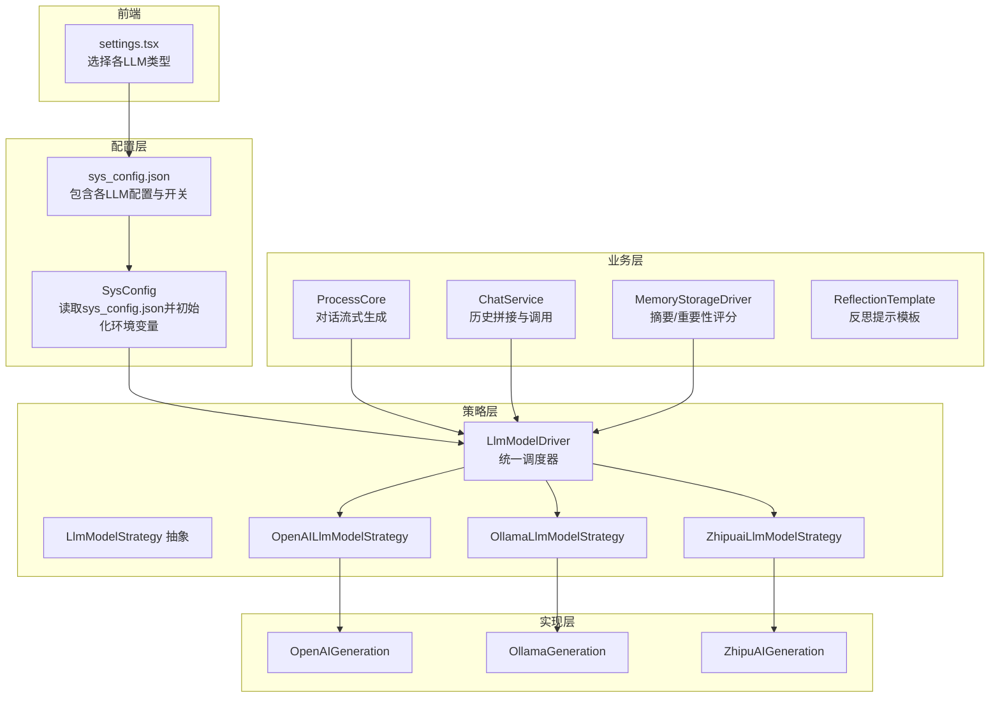
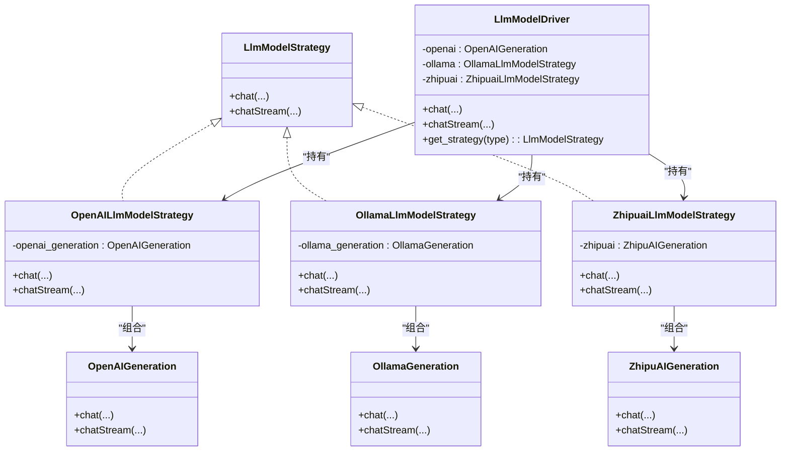
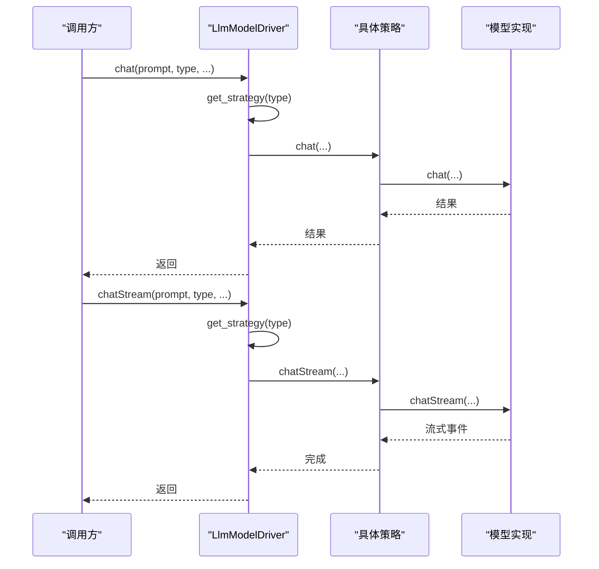
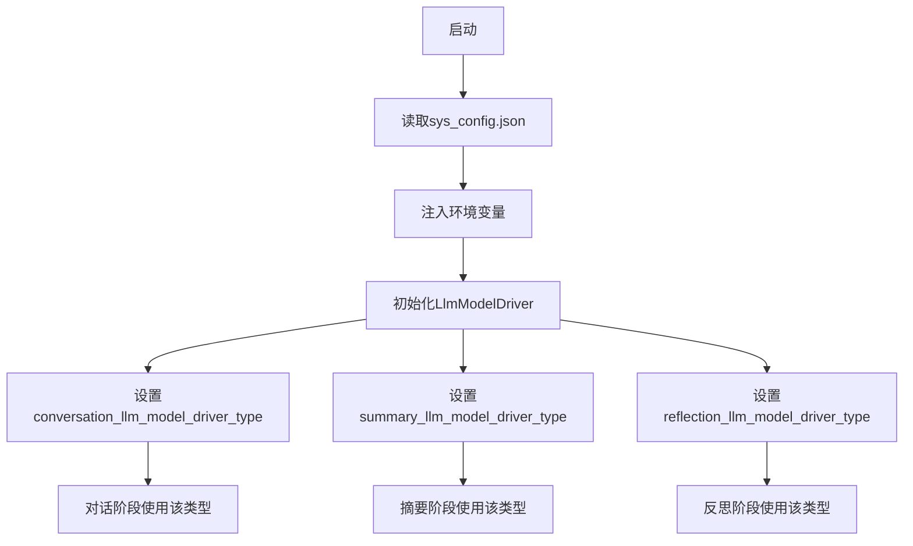
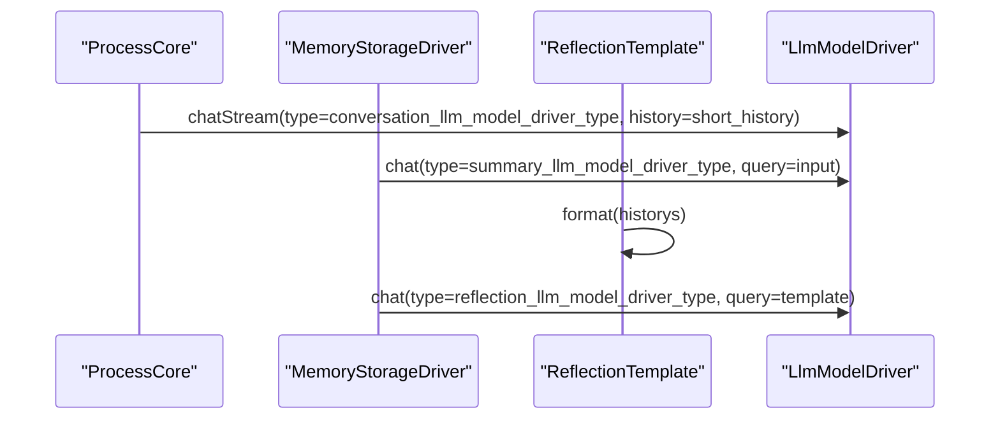
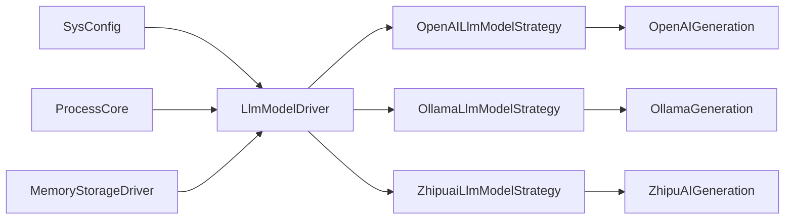

# 模型切换机制

<cite>
**本文引用的文件**
- [llm_model_strategy.py](file://domain-chatbot/apps/chatbot/llms/llm_model_strategy.py)
- [openai_chat_robot.py](file://domain-chatbot/apps/chatbot/llms/openai/openai_chat_robot.py)
- [ollama_chat_robot.py](file://domain-chatbot/apps/chatbot/llms/ollama/ollama_chat_robot.py)
- [zhipuai_chat_robot.py](file://domain-chatbot/apps/chatbot/llms/zhipuai/zhipuai_chat_robot.py)
- [sys_config.py](file://domain-chatbot/apps/chatbot/config/sys_config.py)
- [sys_config.json](file://domain-chatbot/apps/chatbot/config/sys_config.json)
- [process.py](file://domain-chatbot/apps/chatbot/process/process.py)
- [chat_service.py](file://domain-chatbot/apps/chatbot/chat/chat_service.py)
- [memory_storage.py](file://domain-chatbot/apps/chatbot/memory/memory_storage.py)
- [reflection_template.py](file://domain-chatbot/apps/chatbot/reflection/reflection_template.py)
- [settings.tsx](file://domain-chatvrm/src/components/settings.tsx)
</cite>

## 目录
1. [简介](#简介)
2. [项目结构](#项目结构)
3. [核心组件](#核心组件)
4. [架构总览](#架构总览)
5. [组件详解](#组件详解)
6. [依赖关系分析](#依赖关系分析)
7. [性能考量](#性能考量)
8. [故障排查指南](#故障排查指南)
9. [结论](#结论)
10. [附录](#附录)

## 简介
本文件系统性阐述聊天机器人中“LLM模型切换机制”的设计与实现，重点覆盖以下方面：
- 策略模式在模型切换中的应用
- 不同模型类型（OpenAI、Ollama、智谱）的实例化与调用流程
- 配置项 conversation_llm_model_driver_type、summary_llm_model_driver_type、reflection_llm_model_driver_type 的作用域与使用场景
- 模型注册与管理机制（新增模型接入、配置校验、运行时切换）
- 性能影响与最佳实践（内存管理、缓存策略、资源释放）
- 调试与监控（日志、指标、错误处理）
- 故障恢复（自动降级、回滚、健康检查）

## 项目结构
围绕模型切换机制的关键目录与文件如下：
- LLM策略与实现：domain-chatbot/apps/chatbot/llms
- 系统配置与运行时切换：domain-chatbot/apps/chatbot/config
- 业务流程入口（对话、摘要、反思）：domain-chatbot/apps/chatbot/process、domain-chatbot/apps/chatbot/chat、domain-chatbot/apps/chatbot/memory
- 前端配置界面：domain-chatvrm/src/components/settings.tsx

图表来源
- [sys_config.py](file://domain-chatbot/apps/chatbot/config/sys_config.py#L157-L192)
- [llm_model_strategy.py](file://domain-chatbot/apps/chatbot/llms/llm_model_strategy.py#L107-L149)
- [openai_chat_robot.py](file://domain-chatbot/apps/chatbot/llms/openai/openai_chat_robot.py#L14-L44)
- [ollama_chat_robot.py](file://domain-chatbot/apps/chatbot/llms/ollama/ollama_chat_robot.py#L14-L43)
- [zhipuai_chat_robot.py](file://domain-chatbot/apps/chatbot/llms/zhipuai/zhipuai_chat_robot.py#L13-L36)
- [process.py](file://domain-chatbot/apps/chatbot/process/process.py#L58-L76)
- [chat_service.py](file://domain-chatbot/apps/chatbot/chat/chat_service.py#L27-L45)
- [memory_storage.py](file://domain-chatbot/apps/chatbot/memory/memory_storage.py#L126-L142)
- [settings.tsx](file://domain-chatvrm/src/components/settings.tsx#L296-L310)

章节来源
- [sys_config.py](file://domain-chatbot/apps/chatbot/config/sys_config.py#L157-L192)
- [sys_config.json](file://domain-chatbot/apps/chatbot/config/sys_config.json#L31-L52)
- [llm_model_strategy.py](file://domain-chatbot/apps/chatbot/llms/llm_model_strategy.py#L107-L149)

## 核心组件
- LlmModelStrategy：定义统一接口（同步与异步），屏蔽不同模型实现差异
- 具体策略类：OpenAILlmModelStrategy、OllamaLlmModelStrategy、ZhipuaiLlmModelStrategy
- LlmModelDriver：持有各策略实例，按类型选择并转发调用
- 各模型实现类：OpenAIGeneration、OllamaGeneration、ZhipuAIGeneration
- SysConfig：从配置文件加载环境变量与开关，初始化LlmModelDriver及各LLM类型字段
- 业务入口：ProcessCore（对话）、MemoryStorageDriver（摘要/重要性）、ReflectionTemplate（反思）

章节来源
- [llm_model_strategy.py](file://domain-chatbot/apps/chatbot/llms/llm_model_strategy.py#L13-L149)
- [openai_chat_robot.py](file://domain-chatbot/apps/chatbot/llms/openai/openai_chat_robot.py#L14-L101)
- [ollama_chat_robot.py](file://domain-chatbot/apps/chatbot/llms/ollama/ollama_chat_robot.py#L14-L100)
- [zhipuai_chat_robot.py](file://domain-chatbot/apps/chatbot/llms/zhipuai/zhipuai_chat_robot.py#L13-L71)
- [sys_config.py](file://domain-chatbot/apps/chatbot/config/sys_config.py#L32-L192)

## 架构总览
模型切换采用策略模式，通过LlmModelDriver集中调度。SysConfig负责从配置文件读取并注入环境变量，决定运行时使用的模型类型；业务层在不同阶段（对话、摘要、反思）分别使用对应的类型字段。

图表来源
- [llm_model_strategy.py](file://domain-chatbot/apps/chatbot/llms/llm_model_strategy.py#L13-L149)
- [openai_chat_robot.py](file://domain-chatbot/apps/chatbot/llms/openai/openai_chat_robot.py#L14-L101)
- [ollama_chat_robot.py](file://domain-chatbot/apps/chatbot/llms/ollama/ollama_chat_robot.py#L14-L100)
- [zhipuai_chat_robot.py](file://domain-chatbot/apps/chatbot/llms/zhipuai/zhipuai_chat_robot.py#L13-L71)

## 组件详解

### 策略模式与LlmModelDriver
- 设计要点
  - LlmModelStrategy定义统一接口，确保不同模型实现可互换
  - LlmModelDriver内部持有各策略实例，提供统一入口
  - get_strategy根据type选择对应策略，支持openai/ollama/zhipuai
- 实现细节
  - 同步chat：委托到具体策略的chat
  - 异步chatStream：委托到具体策略的chatStream，并在driver层封装事件循环
  - 线程安全：为流式对话引入锁，避免并发冲突

图表来源
- [llm_model_strategy.py](file://domain-chatbot/apps/chatbot/llms/llm_model_strategy.py#L107-L149)
- [openai_chat_robot.py](file://domain-chatbot/apps/chatbot/llms/openai/openai_chat_robot.py#L26-L44)
- [ollama_chat_robot.py](file://domain-chatbot/apps/chatbot/llms/ollama/ollama_chat_robot.py#L25-L43)
- [zhipuai_chat_robot.py](file://domain-chatbot/apps/chatbot/llms/zhipuai/zhipuai_chat_robot.py#L24-L36)

章节来源
- [llm_model_strategy.py](file://domain-chatbot/apps/chatbot/llms/llm_model_strategy.py#L107-L149)

### 模型类型与实例化
- OpenAI
  - OpenAIGeneration从环境变量读取API密钥与基础URL，构造请求
  - 支持同步与流式两种调用方式
- Ollama
  - OllamaGeneration从环境变量读取服务地址与模型名，构造本地推理请求
  - 同步与流式实现与OpenAI一致
- 智谱
  - ZhipuAIGeneration使用官方SDK，支持同步与流式
  - 通过环境变量注入API密钥

章节来源
- [openai_chat_robot.py](file://domain-chatbot/apps/chatbot/llms/openai/openai_chat_robot.py#L14-L101)
- [ollama_chat_robot.py](file://domain-chatbot/apps/chatbot/llms/ollama/ollama_chat_robot.py#L14-L100)
- [zhipuai_chat_robot.py](file://domain-chatbot/apps/chatbot/llms/zhipuai/zhipuai_chat_robot.py#L13-L71)

### 配置与运行时切换
- 配置文件（sys_config.json）
  - conversationConfig.languageModel：对话阶段使用的模型类型
  - memoryStorageConfig.languageModelForSummary：摘要阶段使用的模型类型
  - memoryStorageConfig.languageModelForReflection：反思阶段使用的模型类型
- SysConfig加载流程
  - 从数据库或默认文件读取配置
  - 注入环境变量（OPENAI_*、OLLAMA_*、ZHIPUAI_*）
  - 初始化LlmModelDriver，并设置各类型字段
- 前端设置
  - settings.tsx提供下拉框选择上述三个类型字段，便于在线切换

图表来源
- [sys_config.py](file://domain-chatbot/apps/chatbot/config/sys_config.py#L157-L192)
- [sys_config.json](file://domain-chatbot/apps/chatbot/config/sys_config.json#L31-L52)
- [settings.tsx](file://domain-chatvrm/src/components/settings.tsx#L296-L310)

章节来源
- [sys_config.py](file://domain-chatbot/apps/chatbot/config/sys_config.py#L157-L192)
- [sys_config.json](file://domain-chatbot/apps/chatbot/config/sys_config.json#L31-L52)
- [settings.tsx](file://domain-chatvrm/src/components/settings.tsx#L296-L310)

### 业务场景中的模型切换
- 对话阶段（ProcessCore）
  - 使用conversation_llm_model_driver_type进行流式生成
  - 将历史短列表作为上下文传入
- 摘要阶段（MemoryStorageDriver.summary）
  - 使用summary_llm_model_driver_type生成JSON格式摘要
  - 提取JSON中的Summary字段
- 反思阶段（ReflectionTemplate）
  - 通过模板生成提示词，结合历史洞察进行反思
  - 由reflection_llm_model_driver_type执行推理

图表来源
- [process.py](file://domain-chatbot/apps/chatbot/process/process.py#L58-L76)
- [memory_storage.py](file://domain-chatbot/apps/chatbot/memory/memory_storage.py#L126-L142)
- [reflection_template.py](file://domain-chatbot/apps/chatbot/reflection/reflection_template.py#L17-L29)

章节来源
- [process.py](file://domain-chatbot/apps/chatbot/process/process.py#L58-L76)
- [memory_storage.py](file://domain-chatbot/apps/chatbot/memory/memory_storage.py#L126-L142)
- [reflection_template.py](file://domain-chatbot/apps/chatbot/reflection/reflection_template.py#L17-L29)

### 新模型接入流程
- 新增实现类
  - 在对应目录新增模型实现类（如xxx_chat_robot.py），实现chat与chatStream
- 新增策略类
  - 在llm_model_strategy.py中新增策略类，组合新实现类
- 注册到调度器
  - 在LlmModelDriver.__init__中注册新策略实例
  - 在get_strategy中添加分支映射
- 配置与前端
  - 在sys_config.json中添加新模型的环境变量配置
  - 在settings.tsx中将新类型加入枚举与下拉框
- 验证与测试
  - 通过SysConfig加载后，确认环境变量生效
  - 通过前端切换到新类型，验证对话/摘要/反思流程

章节来源
- [llm_model_strategy.py](file://domain-chatbot/apps/chatbot/llms/llm_model_strategy.py#L107-L149)
- [sys_config.json](file://domain-chatbot/apps/chatbot/config/sys_config.json#L11-L23)
- [settings.tsx](file://domain-chatvrm/src/components/settings.tsx#L296-L310)

## 依赖关系分析
- 组件耦合
  - LlmModelDriver对各策略强聚合，策略对实现弱聚合（组合关系）
  - SysConfig对LlmModelDriver强依赖，驱动运行时类型选择
  - 业务层（ProcessCore/MemoryStorageDriver）仅依赖LlmModelDriver
- 外部依赖
  - OpenAI/Ollama通过litellm调用
  - 智谱通过官方SDK调用
- 潜在风险
  - 环境变量缺失可能导致初始化失败
  - 流式调用需注意线程安全与事件循环

图表来源
- [sys_config.py](file://domain-chatbot/apps/chatbot/config/sys_config.py#L157-L192)
- [llm_model_strategy.py](file://domain-chatbot/apps/chatbot/llms/llm_model_strategy.py#L107-L149)
- [process.py](file://domain-chatbot/apps/chatbot/process/process.py#L58-L76)
- [memory_storage.py](file://domain-chatbot/apps/chatbot/memory/memory_storage.py#L126-L142)

章节来源
- [sys_config.py](file://domain-chatbot/apps/chatbot/config/sys_config.py#L157-L192)
- [llm_model_strategy.py](file://domain-chatbot/apps/chatbot/llms/llm_model_strategy.py#L107-L149)

## 性能考量
- 内存管理
  - 各模型实现均在初始化时读取环境变量并建立连接，建议在SysConfig加载阶段集中初始化，避免重复创建
  - 对于长会话，建议限制历史长度，减少上下文开销
- 缓存策略
  - 对于重复的提示词或相似输入，可在业务层增加去重与缓存（需自行扩展）
  - 流式输出时，注意回调频率与UI渲染压力
- 资源释放
  - OpenAI/Ollama通过外部SDK/服务调用，无需手动释放；但应避免频繁重建客户端
  - 智谱SDK为本地SDK，注意异常时的资源清理
- 并发与锁
  - driver层已为流式对话引入锁，避免并发冲突；建议在高并发场景下进一步隔离不同类型模型的锁粒度

[本节为通用性能建议，不直接分析特定文件]

## 故障排查指南
- 常见错误与定位
  - 环境变量缺失：检查OPENAI_API_KEY、OLLAMA_API_BASE、OLLAMA_API_MODEL_NAME、ZHIPUAI_API_KEY是否正确注入
  - 类型未知：当type不在openai/ollama/zhipuai范围内，会抛出异常；检查SysConfig中类型字段
  - 流式回调异常：检查realtime_callback/conversation_end_callback的实现
- 日志与监控
  - 各模型实现均使用标准日志记录；建议在SysConfig与业务层增加关键路径日志
  - 可在LlmModelDriver中埋点统计各类型调用次数与耗时
- 自动降级与回滚
  - 当某类型调用失败时，可临时切换到其他类型（在SysConfig中修改类型字段并重启或热更新）
  - 建议在前端settings.tsx中提供一键切换按钮
- 健康检查
  - 对外服务可通过ping/health接口探测可用性
  - 对本地服务（如Ollama）可通过访问其基础URL判断连通性

章节来源
- [llm_model_strategy.py](file://domain-chatbot/apps/chatbot/llms/llm_model_strategy.py#L140-L148)
- [sys_config.py](file://domain-chatbot/apps/chatbot/config/sys_config.py#L122-L139)
- [process.py](file://domain-chatbot/apps/chatbot/process/process.py#L71-L76)

## 结论
本项目通过策略模式实现了LLM模型的灵活切换，配合SysConfig与前端设置，可在不改动业务代码的情况下完成运行时切换。建议在生产环境中完善配置校验、日志埋点与健康检查，并在高并发场景下优化锁粒度与缓存策略，以获得更稳定的性能表现。

[本节为总结性内容，不直接分析特定文件]

## 附录

### 配置项速查
- 对话模型类型：conversationConfig.languageModel
- 摘要模型类型：memoryStorageConfig.languageModelForSummary
- 反思模型类型：memoryStorageConfig.languageModelForReflection

章节来源
- [sys_config.json](file://domain-chatbot/apps/chatbot/config/sys_config.json#L31-L52)