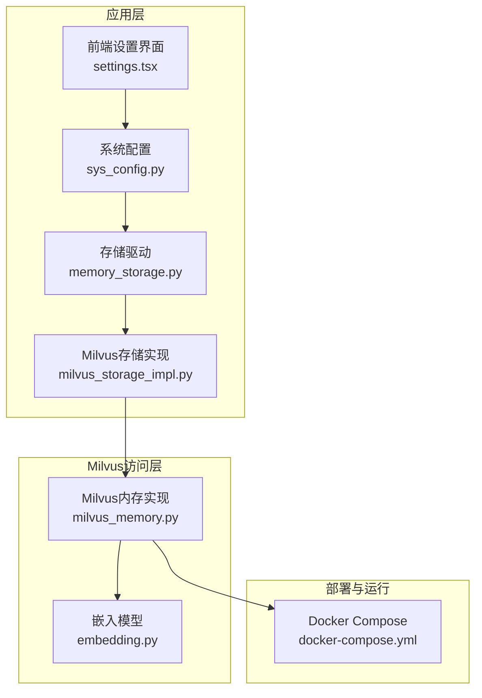
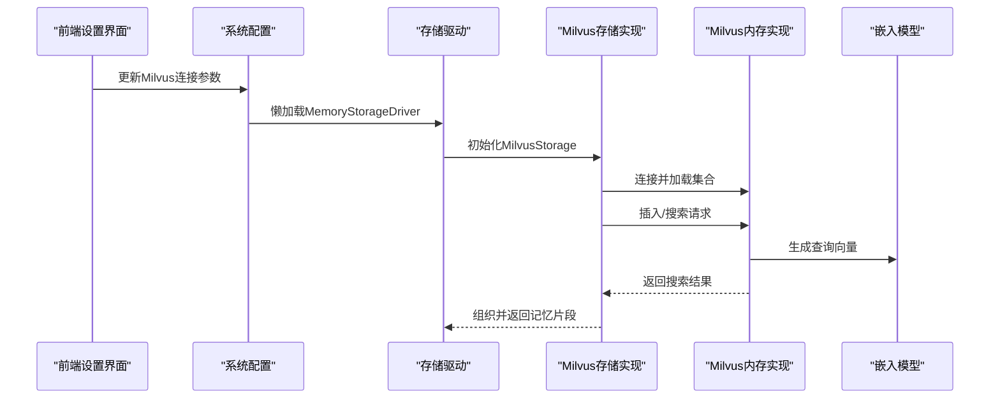
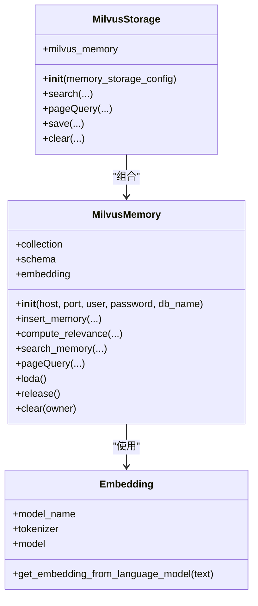
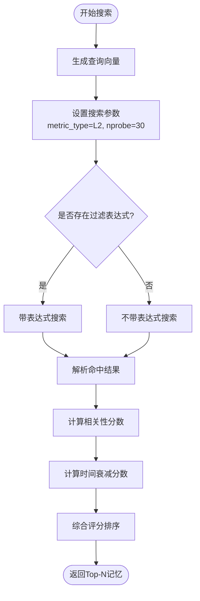
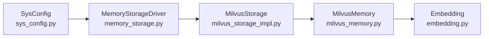

# Milvus向量数据库配置

<cite>
**本文档引用的文件**
- [milvus_memory.py](file://domain-chatbot/apps/chatbot/memory/milvus/milvus_memory.py)
- [milvus_storage_impl.py](file://domain-chatbot/apps/chatbot/memory/milvus/milvus_storage_impl.py)
- [sys_config.py](file://domain-chatbot/apps/chatbot/config/sys_config.py)
- [memory_storage.py](file://domain-chatbot/apps/chatbot/memory/memory_storage.py)
- [embedding.py](file://domain-chatbot/apps/chatbot/memory/embedding.py)
- [docker-compose.yml](file://installer/milvus/docker-compose.yml)
- [settings.tsx](file://domain-chatvrm/src/components/settings.tsx)
</cite>

## 目录
1. [简介](#简介)
2. [项目结构](#项目结构)
3. [核心组件](#核心组件)
4. [架构总览](#架构总览)
5. [详细组件分析](#详细组件分析)
6. [依赖关系分析](#依赖关系分析)
7. [性能考虑](#性能考虑)
8. [故障排查指南](#故障排查指南)
9. [结论](#结论)
10. [附录](#附录)

## 简介
本文件面向VirtualWife项目的Milvus向量数据库配置，系统性阐述连接参数、集合命名与向量维度、索引类型选择、相似度搜索配置、性能调优、集群部署、监控与故障排查以及数据迁移建议。文档以代码为依据，结合实际实现细节，帮助开发者快速理解并正确配置Milvus。

## 项目结构
与Milvus相关的代码主要分布在以下模块：
- 连接与集合：milvus_memory.py
- 存储驱动封装：milvus_storage_impl.py
- 系统配置与懒加载：sys_config.py、memory_storage.py
- 向量化模型：embedding.py
- 部署与运行：installer/milvus/docker-compose.yml
- 前端配置界面：domain-chatvrm/src/components/settings.tsx

图表来源
- [milvus_memory.py](file://domain-chatbot/apps/chatbot/memory/milvus/milvus_memory.py#L1-L184)
- [milvus_storage_impl.py](file://domain-chatbot/apps/chatbot/memory/milvus/milvus_storage_impl.py#L1-L61)
- [sys_config.py](file://domain-chatbot/apps/chatbot/config/sys_config.py#L17-L29)
- [memory_storage.py](file://domain-chatbot/apps/chatbot/memory/memory_storage.py#L14-L25)
- [embedding.py](file://domain-chatbot/apps/chatbot/memory/embedding.py#L1-L19)
- [docker-compose.yml](file://installer/milvus/docker-compose.yml#L1-L49)

章节来源
- [milvus_memory.py](file://domain-chatbot/apps/chatbot/memory/milvus/milvus_memory.py#L1-L184)
- [milvus_storage_impl.py](file://domain-chatbot/apps/chatbot/memory/milvus/milvus_storage_impl.py#L1-L61)
- [sys_config.py](file://domain-chatbot/apps/chatbot/config/sys_config.py#L17-L29)
- [memory_storage.py](file://domain-chatbot/apps/chatbot/memory/memory_storage.py#L14-L25)
- [embedding.py](file://domain-chatbot/apps/chatbot/memory/embedding.py#L1-L19)
- [docker-compose.yml](file://installer/milvus/docker-compose.yml#L1-L49)

## 核心组件
- MilvusMemory：负责连接Milvus、定义集合Schema、创建集合、构建索引、执行向量搜索与查询、加载/释放集合、清理数据。
- MilvusStorage：基于BaseStorage接口的实现，封装搜索、分页查询、保存与清理操作，负责在每次操作前后调用load/release。
- MemoryStorageDriver：根据系统配置决定是否启用长期记忆（Milvus），并协调短期（本地）与长期（Milvus）存储。
- SysConfig：从配置文件中读取Milvus连接参数，懒加载MemoryStorageDriver。
- Embedding：提供文本向量化能力，用于插入与查询时的向量生成。

章节来源
- [milvus_memory.py](file://domain-chatbot/apps/chatbot/memory/milvus/milvus_memory.py#L15-L184)
- [milvus_storage_impl.py](file://domain-chatbot/apps/chatbot/memory/milvus/milvus_storage_impl.py#L5-L61)
- [memory_storage.py](file://domain-chatbot/apps/chatbot/memory/memory_storage.py#L14-L55)
- [sys_config.py](file://domain-chatbot/apps/chatbot/config/sys_config.py#L17-L29)
- [embedding.py](file://domain-chatbot/apps/chatbot/memory/embedding.py#L4-L19)

## 架构总览
下图展示Milvus在VirtualWife中的整体交互流程：前端设置界面收集配置，系统配置模块读取并懒加载存储驱动，Milvus存储实现通过MilvusMemory完成连接、索引与查询，Embedding提供向量生成。

图表来源
- [settings.tsx](file://domain-chatvrm/src/components/settings.tsx#L579-L618)
- [sys_config.py](file://domain-chatbot/apps/chatbot/config/sys_config.py#L17-L29)
- [memory_storage.py](file://domain-chatbot/apps/chatbot/memory/memory_storage.py#L14-L25)
- [milvus_storage_impl.py](file://domain-chatbot/apps/chatbot/memory/milvus/milvus_storage_impl.py#L9-L16)
- [milvus_memory.py](file://domain-chatbot/apps/chatbot/memory/milvus/milvus_memory.py#L22-L30)
- [embedding.py](file://domain-chatbot/apps/chatbot/memory/embedding.py#L12-L18)

## 详细组件分析

### Milvus连接参数与集合配置
- 连接参数
  - 主机地址、端口、用户名、密码、数据库名均来自系统配置，由MilvusMemory在初始化时建立连接。
- 集合命名
  - 固定集合名为“virtual_wife_memory_v2”，所有写入与查询均作用于该集合。
- 向量维度
  - 集合字段中embedding向量维度为768，与所用嵌入模型输出一致。

章节来源
- [milvus_memory.py](file://domain-chatbot/apps/chatbot/memory/milvus/milvus_memory.py#L11-L11)
- [milvus_memory.py](file://domain-chatbot/apps/chatbot/memory/milvus/milvus_memory.py#L33-L44)
- [milvus_memory.py](file://domain-chatbot/apps/chatbot/memory/milvus/milvus_memory.py#L40-L41)
- [sys_config.py](file://domain-chatbot/apps/chatbot/config/sys_config.py#L20-L26)

### Milvus存储驱动初始化流程
- 连接建立：MilvusMemory在构造函数中调用连接方法，传入host、port、user、password、db_name。
- 集合创建：定义字段Schema并创建Collection。
- 索引构建：为embedding字段创建索引，类型为IVF_SQ8，度量方式为L2，nlist参数为768。
- 向量化模型：初始化Embedding实例，用于文本向量化。

图表来源
- [milvus_memory.py](file://domain-chatbot/apps/chatbot/memory/milvus/milvus_memory.py#L15-L56)
- [milvus_storage_impl.py](file://domain-chatbot/apps/chatbot/memory/milvus/milvus_storage_impl.py#L5-L16)
- [embedding.py](file://domain-chatbot/apps/chatbot/memory/embedding.py#L4-L19)

章节来源
- [milvus_memory.py](file://domain-chatbot/apps/chatbot/memory/milvus/milvus_memory.py#L22-L56)
- [milvus_storage_impl.py](file://domain-chatbot/apps/chatbot/memory/milvus/milvus_storage_impl.py#L9-L16)

### 向量相似度搜索配置
- 距离度量：索引与查询均采用L2距离。
- 查询参数：nprobe设置为30，控制倒排表扫描的粗粒度；limit限制返回结果数量。
- 表达式过滤：支持按owner与sender过滤，提升检索相关性。
- 结果处理：将向量距离转换为相关性分数，结合重要性与时间衰减后综合排序。

图表来源
- [milvus_memory.py](file://domain-chatbot/apps/chatbot/memory/milvus/milvus_memory.py#L88-L116)
- [milvus_memory.py](file://domain-chatbot/apps/chatbot/memory/milvus/milvus_memory.py#L118-L129)

章节来源
- [milvus_memory.py](file://domain-chatbot/apps/chatbot/memory/milvus/milvus_memory.py#L88-L129)

### 批量查询策略
- 分页查询：pageQuery支持offset与limit，按时间倒序返回指定范围的记忆。
- 搜索接口：search内部先load集合，执行相关性评分与排序，再release集合，避免常驻内存占用。

章节来源
- [milvus_storage_impl.py](file://domain-chatbot/apps/chatbot/memory/milvus/milvus_storage_impl.py#L42-L49)
- [milvus_storage_impl.py](file://domain-chatbot/apps/chatbot/memory/milvus/milvus_storage_impl.py#L18-L27)

### 数据清理与释放
- clear：查询owner非空的前N条记录，提取主键并删除。
- load/release：在每次写入/查询前后显式调用，确保集合处于可访问状态并释放资源。

章节来源
- [milvus_memory.py](file://domain-chatbot/apps/chatbot/memory/milvus/milvus_memory.py#L146-L154)
- [milvus_memory.py](file://domain-chatbot/apps/chatbot/memory/milvus/milvus_memory.py#L140-L144)

### 索引类型与参数选择
- 当前实现：IVF_SQ8 + L2 + nlist=768。
- 适用场景：中小规模数据、追求性价比的召回质量。
- 其他可选类型（概念性说明）：FLAT（精确但慢）、IVF_FLAT（平衡性能与精度）、HNSW（适合高维稀疏向量或需要高质量召回）。

章节来源
- [milvus_memory.py](file://domain-chatbot/apps/chatbot/memory/milvus/milvus_memory.py#L47-L51)

## 依赖关系分析
- 配置到驱动：SysConfig从配置文件中提取Milvus参数，懒加载MemoryStorageDriver。
- 驱动到实现：MemoryStorageDriver根据开关决定是否启用Milvus，MilvusStorage封装具体操作。
- 实现到Milvus：MilvusMemory负责连接、Schema、索引与查询。
- 实现到嵌入：Embedding提供向量生成。

图表来源
- [sys_config.py](file://domain-chatbot/apps/chatbot/config/sys_config.py#L17-L29)
- [memory_storage.py](file://domain-chatbot/apps/chatbot/memory/memory_storage.py#L14-L25)
- [milvus_storage_impl.py](file://domain-chatbot/apps/chatbot/memory/milvus/milvus_storage_impl.py#L5-L16)
- [milvus_memory.py](file://domain-chatbot/apps/chatbot/memory/milvus/milvus_memory.py#L15-L56)
- [embedding.py](file://domain-chatbot/apps/chatbot/memory/embedding.py#L4-L19)

章节来源
- [sys_config.py](file://domain-chatbot/apps/chatbot/config/sys_config.py#L17-L29)
- [memory_storage.py](file://domain-chatbot/apps/chatbot/memory/memory_storage.py#L14-L25)
- [milvus_storage_impl.py](file://domain-chatbot/apps/chatbot/memory/milvus/milvus_storage_impl.py#L5-L16)
- [milvus_memory.py](file://domain-chatbot/apps/chatbot/memory/milvus/milvus_memory.py#L15-L56)
- [embedding.py](file://domain-chatbot/apps/chatbot/memory/embedding.py#L4-L19)

## 性能考虑
- 索引构建参数
  - nlist：影响倒排簇数量，nlist越大召回越准但内存与构建时间越高；当前为768，适配768维向量。
  - 索引类型：IVF_SQ8在压缩与速度间取得平衡；如需更高精度可考虑IVF_FLAT或HNSW。
- 查询优化
  - nprobe：数值越大召回越全但延迟越高；建议根据QPS与P95延迟目标进行A/B测试确定最优值。
  - 输出字段裁剪：仅返回必要字段，减少网络与序列化开销。
- 缓存与资源管理
  - load/release：在高频写入/查询场景下，建议合并批量操作，减少load/release次数。
  - 集合预热：在业务低峰期提前load集合，降低首查询延迟。
- 内存与磁盘
  - 合理设置ETCD与MinIO容量与快照策略，避免元数据与对象存储成为瓶颈。
- 向量维度
  - 当前为768维，若更换模型需同步调整集合维度与索引参数。

章节来源
- [milvus_memory.py](file://domain-chatbot/apps/chatbot/memory/milvus/milvus_memory.py#L47-L51)
- [milvus_memory.py](file://domain-chatbot/apps/chatbot/memory/milvus/milvus_memory.py#L92-L92)
- [docker-compose.yml](file://installer/milvus/docker-compose.yml#L7-L11)

## 故障排查指南
- 连接失败
  - 检查host/port/user/password/db_name是否与部署一致。
  - 确认容器网络与端口映射正常（19530/tcp对外）。
- 集合不存在或字段不匹配
  - 首次运行会自动创建集合；若手动删除过集合，请确认Schema与向量维度一致。
- 查询无结果或延迟高
  - 调整nprobe至合适值；检查过滤表达式是否过于严格。
  - 确认集合已load，避免频繁load/release带来的抖动。
- 性能退化
  - 观察nq/s与P95延迟；适当增大nlist或切换更合适的索引类型。
  - 检查ETCD与MinIO健康状态与磁盘空间。
- 数据清理异常
  - 确认clear逻辑的表达式与主键范围；避免误删。

章节来源
- [milvus_memory.py](file://domain-chatbot/apps/chatbot/memory/milvus/milvus_memory.py#L24-L30)
- [milvus_memory.py](file://domain-chatbot/apps/chatbot/memory/milvus/milvus_memory.py#L140-L154)
- [docker-compose.yml](file://installer/milvus/docker-compose.yml#L40-L45)

## 结论
本配置文档基于项目现有实现，明确了Milvus连接参数、集合命名与维度、索引类型与查询参数，并提供了性能调优与故障排查建议。建议在生产环境中结合业务数据规模与SLA目标，持续迭代索引参数与查询策略，并配合监控体系进行观测与优化。

## 附录

### Milvus集群部署配置要点
- 单机部署：使用standalone模式，便于开发与测试。
- 元数据与对象存储：etcd与minio作为依赖服务，需关注压缩、快照与容量。
- 端口与网络：Milvus对外暴露19530/tcp，监控端口9091/tcp。
- 副本与分片：当前单机部署不涉及副本与分片；集群模式下需结合业务规模规划分片与副本策略。

章节来源
- [docker-compose.yml](file://installer/milvus/docker-compose.yml#L31-L45)

### 前端配置入口
- 前端设置界面提供host、port、user、password、dbName输入项，便于用户在UI中维护Milvus连接参数。

章节来源
- [settings.tsx](file://domain-chatvrm/src/components/settings.tsx#L579-L618)