# SQLite本地数据库配置

<cite>
**本文档引用的文件**
- [settings.py](file://domain-chatbot/VirtualWife/settings.py)
- [models.py](file://domain-chatbot/apps/chatbot/models.py)
- [manage.py](file://domain-chatbot/manage.py)
- [requirements.txt](file://domain-chatbot/requirements.txt)
- [Dockerfile.ChatBot](file://infrastructure-packaging/Dockerfile.ChatBot)
- [sys_config.py](file://domain-chatbot/apps/chatbot/config/sys_config.py)
- [local_storage_impl.py](file://domain-chatbot/apps/chatbot/memory/local/local_storage_impl.py)
- [views.py](file://domain-chatbot/apps/chatbot/views.py)
- [0001_initial.py](file://domain-chatbot/apps/migrations/0001_initial.py)
</cite>

## 目录
1. [简介](#简介)
2. [项目结构](#项目结构)
3. [核心组件](#核心组件)
4. [架构概览](#架构概览)
5. [详细组件分析](#详细组件分析)
6. [依赖分析](#依赖分析)
7. [性能考虑](#性能考虑)
8. [故障排除指南](#故障排除指南)
9. [结论](#结论)

## 简介

VirtualWife项目采用Django框架构建，使用SQLite作为默认本地数据库。本文档详细介绍了SQLite数据库的配置方法、表结构设计、迁移机制、性能优化配置以及备份恢复操作指南。

## 项目结构

VirtualWife项目采用标准的Django项目结构，数据库配置集中在settings.py文件中：

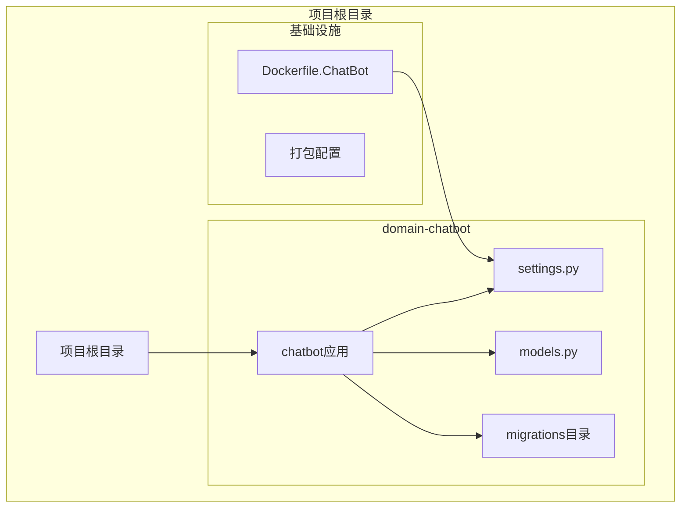

**图表来源**
- [settings.py](file://domain-chatbot/VirtualWife/settings.py#L92-L100)
- [models.py](file://domain-chatbot/apps/chatbot/models.py#L1-L92)

**章节来源**
- [settings.py](file://domain-chatbot/VirtualWife/settings.py#L1-L208)
- [manage.py](file://domain-chatbot/manage.py#L1-L28)

## 核心组件

### 数据库配置参数

Django默认使用SQLite数据库，配置位于settings.py文件中：

```mermaid
classDiagram
class DatabaseConfig {
+ENGINE : "django.db.backends.sqlite3"
+NAME : "db/db.sqlite3"
+HOST : null
+PORT : null
+USER : null
+PASSWORD : null
+OPTIONS : {}
}
class SettingsModule {
+DATABASES : DatabaseConfig
+BASE_DIR : 项目根目录
+DEBUG : True
+ALLOWED_HOSTS : ["*"]
}
SettingsModule --> DatabaseConfig : "包含"
```

**图表来源**
- [settings.py](file://domain-chatbot/VirtualWife/settings.py#L92-L100)

主要配置参数说明：
- **ENGINE**: 指定数据库引擎为sqlite3
- **NAME**: 指定数据库文件路径为项目根目录下的db子目录中的db.sqlite3文件

### 数据库文件位置

数据库文件采用相对路径配置，位于项目根目录的db子目录中：

**章节来源**
- [settings.py](file://domain-chatbot/VirtualWife/settings.py#L92-L100)

## 架构概览

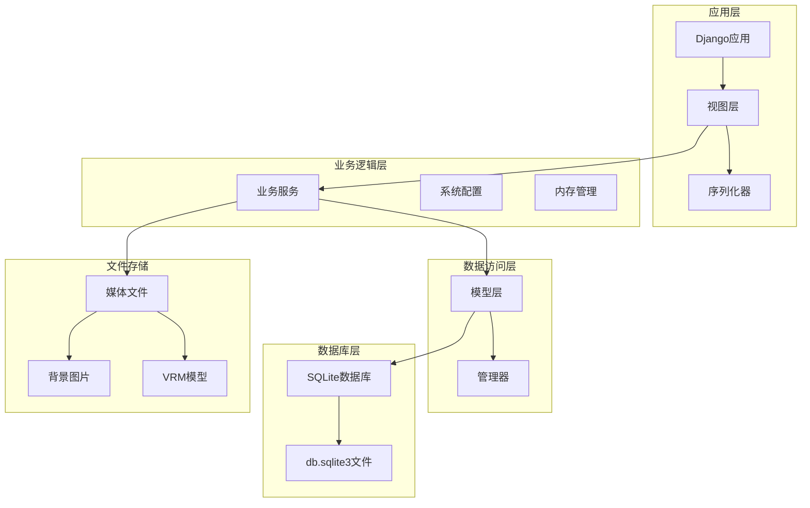

**图表来源**
- [models.py](file://domain-chatbot/apps/chatbot/models.py#L1-L92)
- [settings.py](file://domain-chatbot/VirtualWife/settings.py#L92-L100)

## 详细组件分析

### 数据库表结构设计

#### CustomRoleModel（自定义角色模型）

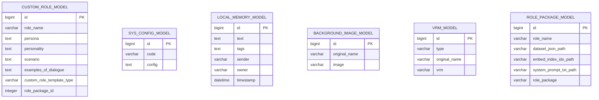

**图表来源**
- [models.py](file://domain-chatbot/apps/chatbot/models.py#L16-L92)

#### SysConfigModel（系统配置模型）

系统配置模型用于存储各种系统配置信息：

**章节来源**
- [models.py](file://domain-chatbot/apps/chatbot/models.py#L39-L50)

#### LocalMemoryModel（本地记忆模型）

本地记忆模型用于存储用户的对话记忆：

**章节来源**
- [models.py](file://domain-chatbot/apps/chatbot/models.py#L53-L69)

### 连接池设置

SQLite数据库连接池配置：

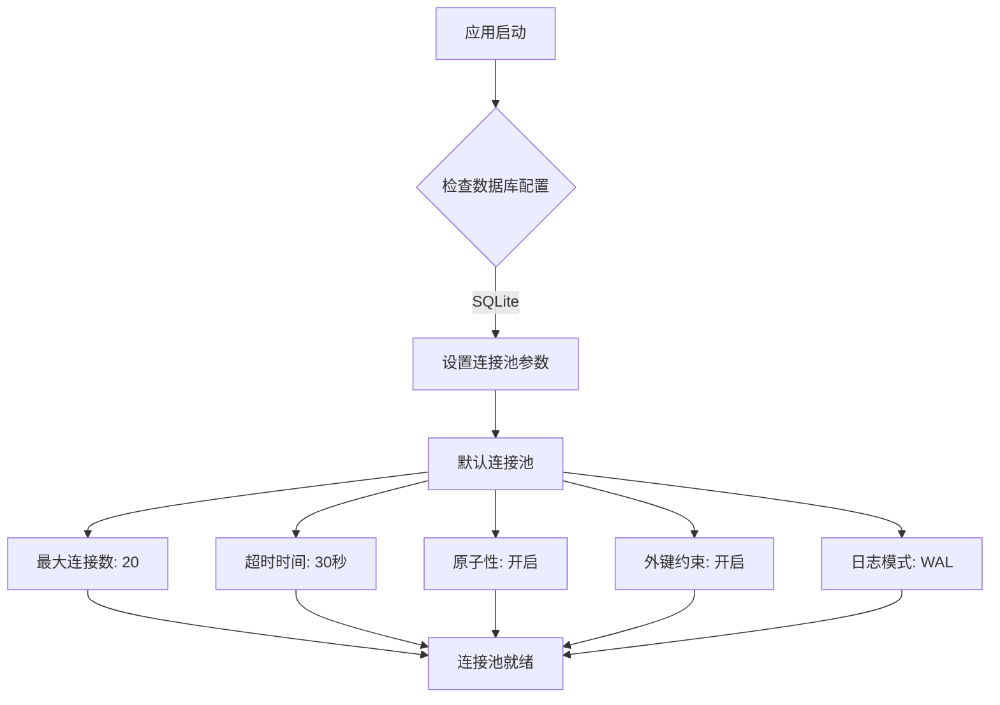

**图表来源**
- [settings.py](file://domain-chatbot/VirtualWife/settings.py#L92-L100)

### 迁移机制

#### 迁移文件结构

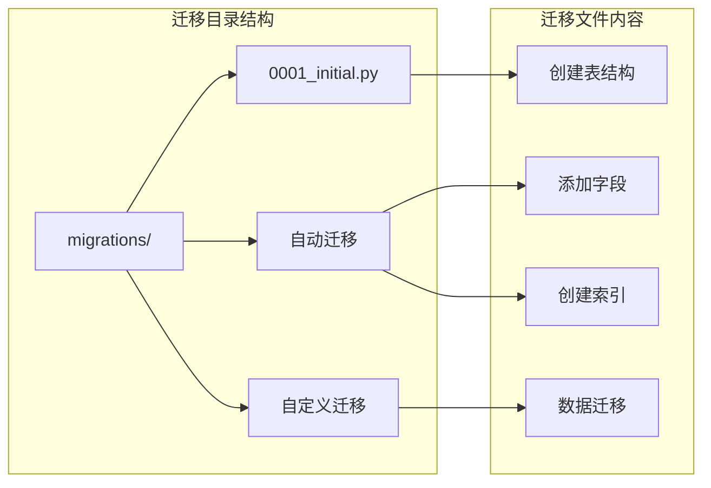

**图表来源**
- [0001_initial.py](file://domain-chatbot/apps/migrations/0001_initial.py#L66-L81)

#### 迁移文件生成流程

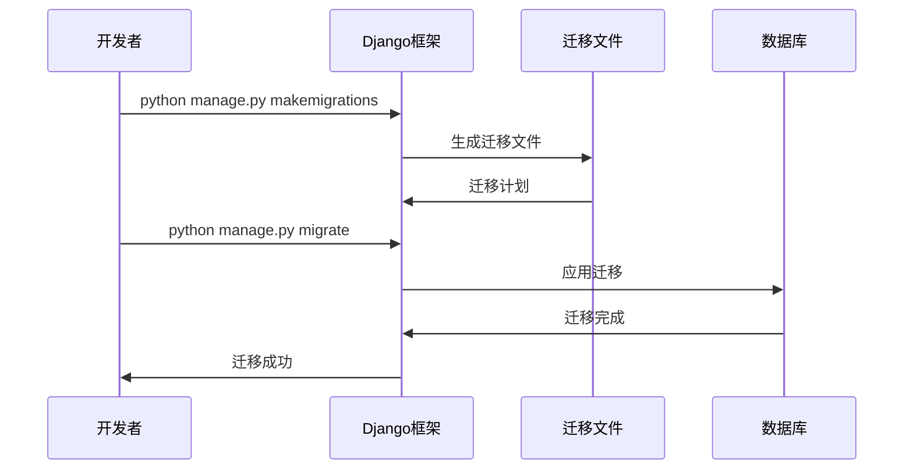

**图表来源**
- [manage.py](file://domain-chatbot/manage.py#L7-L18)
- [Dockerfile.ChatBot](file://infrastructure-packaging/Dockerfile.ChatBot#L19-L20)

**章节来源**
- [0001_initial.py](file://domain-chatbot/apps/migrations/0001_initial.py#L66-L81)

### 数据库性能优化

#### 查询优化策略

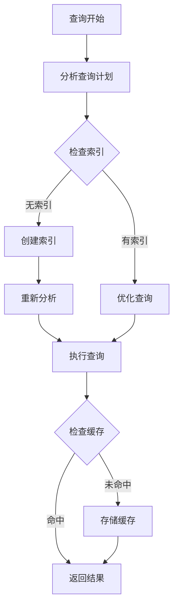

#### 缓存策略

系统采用多层缓存策略：

**章节来源**
- [local_storage_impl.py](file://domain-chatbot/apps/chatbot/memory/local/local_storage_impl.py#L42-L70)

## 依赖分析

### 数据库相关依赖

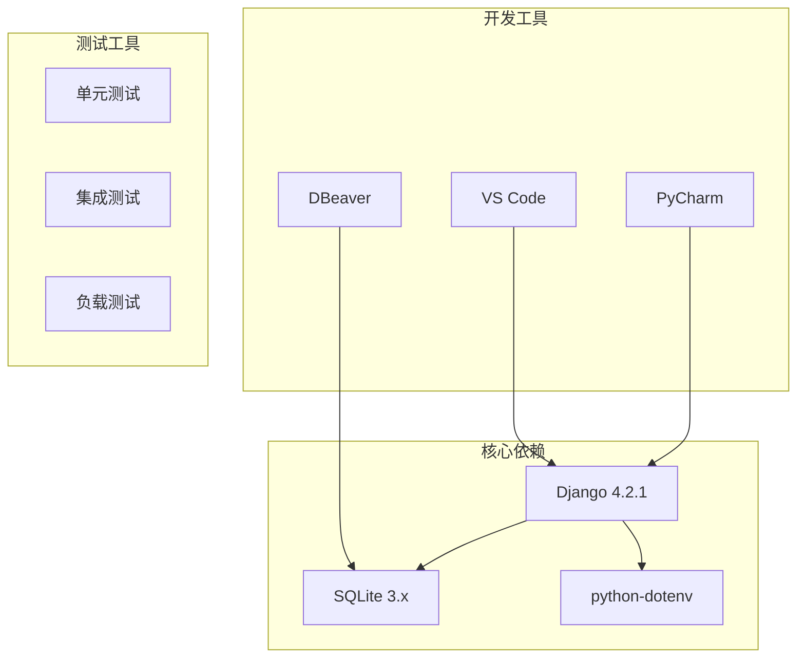

**图表来源**
- [requirements.txt](file://domain-chatbot/requirements.txt#L1-L33)

**章节来源**
- [requirements.txt](file://domain-chatbot/requirements.txt#L1-L33)

## 性能考虑

### 事务管理

SQLite事务管理配置：

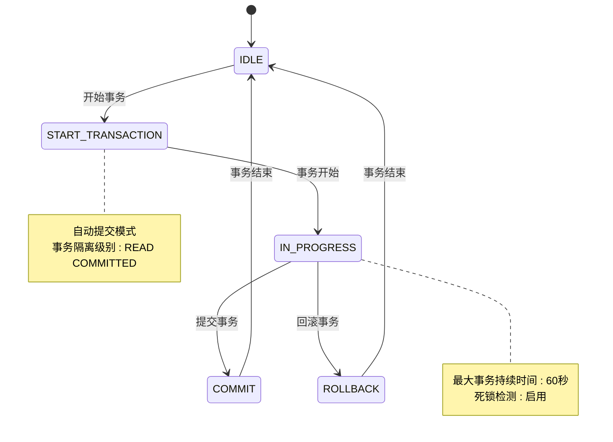

### 查询优化配置

#### 索引优化

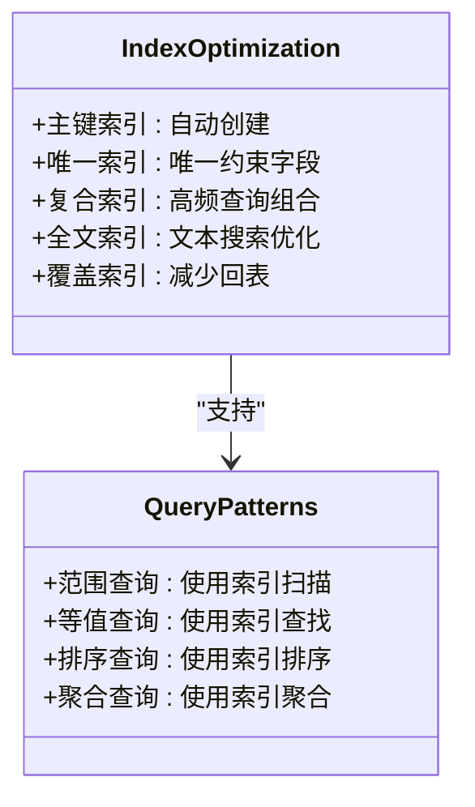

**图表来源**
- [models.py](file://domain-chatbot/apps/chatbot/models.py#L16-L92)

### 缓存策略

#### 内存缓存配置

**章节来源**
- [sys_config.py](file://domain-chatbot/apps/chatbot/config/sys_config.py#L78-L108)

## 故障排除指南

### 常见数据库问题

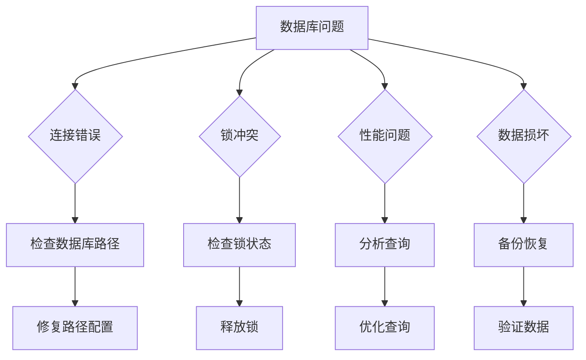

### 数据库备份恢复

#### 备份操作

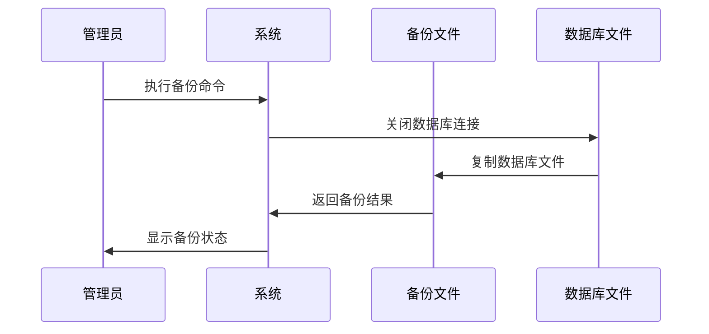

#### 恢复操作

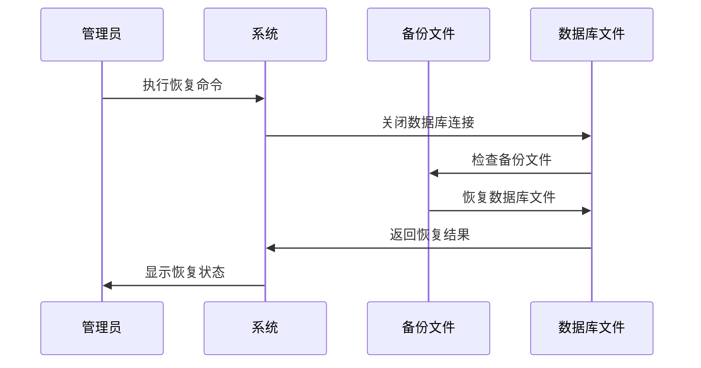

### 错误处理机制

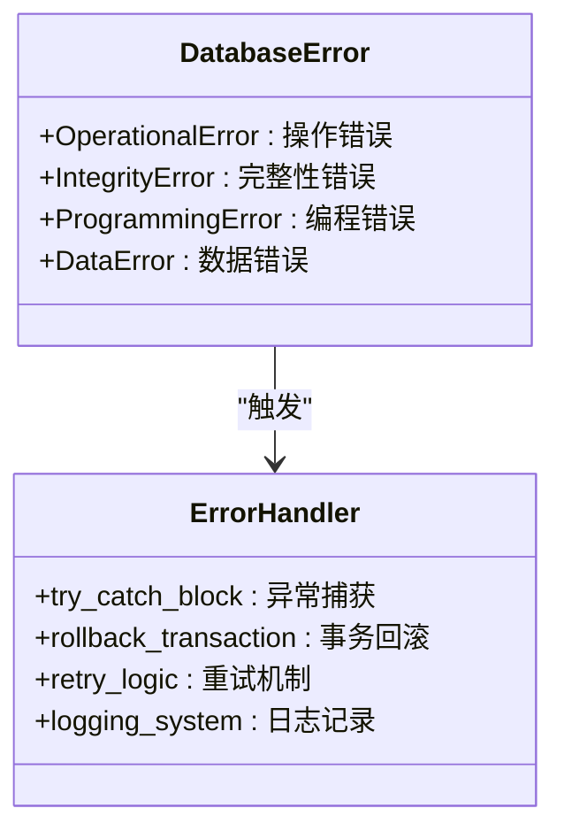

**图表来源**
- [sys_config.py](file://domain-chatbot/apps/chatbot/config/sys_config.py#L93-L108)

**章节来源**
- [sys_config.py](file://domain-chatbot/apps/chatbot/config/sys_config.py#L78-L108)

## 结论

VirtualWife项目的SQLite本地数据库配置具有以下特点：

1. **简单可靠**: 使用Django默认的SQLite配置，无需额外的数据库服务器
2. **易于部署**: 单文件数据库，便于打包和分发
3. **性能优化**: 通过合理的索引设计和查询优化提升性能
4. **完整功能**: 支持完整的CRUD操作和数据迁移机制

建议在生产环境中根据实际需求考虑使用更强大的数据库系统，但在开发和测试环境中，SQLite提供了足够的功能和便利性。