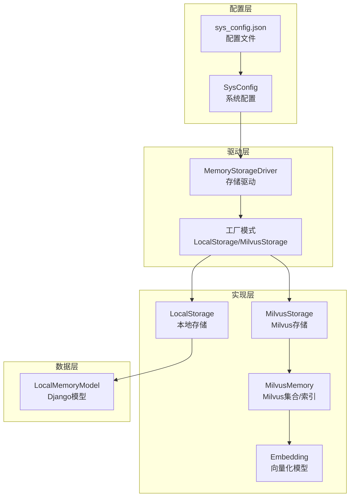
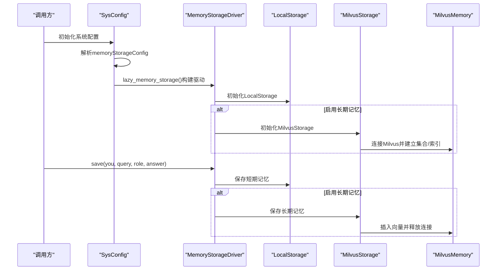
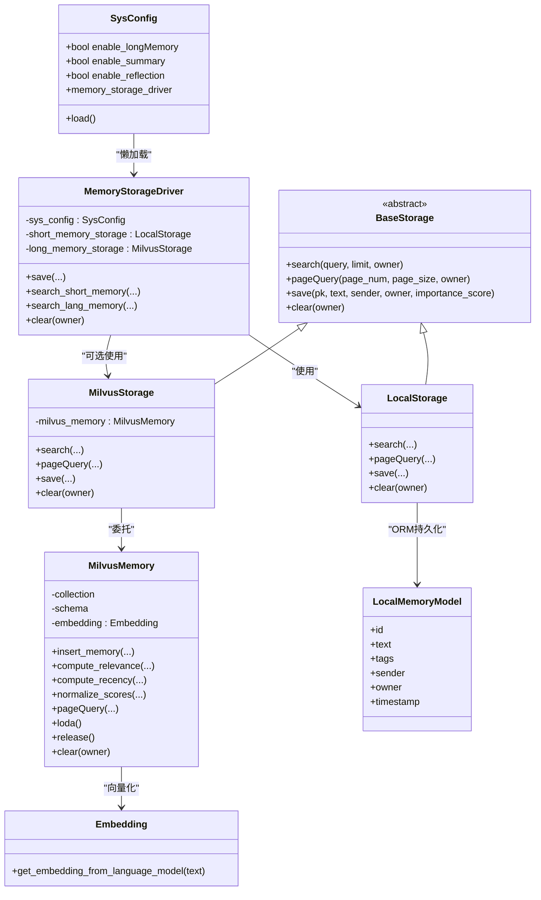

# 内存存储驱动配置

<cite>
**本文引用的文件**
- [memory_storage.py](file://domain-chatbot/apps/chatbot/memory/memory_storage.py)
- [base_storage.py](file://domain-chatbot/apps/chatbot/memory/base_storage.py)
- [local_storage_impl.py](file://domain-chatbot/apps/chatbot/memory/local/local_storage_impl.py)
- [milvus_storage_impl.py](file://domain-chatbot/apps/chatbot/memory/milvus/milvus_storage_impl.py)
- [milvus_memory.py](file://domain-chatbot/apps/chatbot/memory/milvus/milvus_memory.py)
- [sys_config.py](file://domain-chatbot/apps/chatbot/config/sys_config.py)
- [sys_config.json](file://domain-chatbot/apps/chatbot/config/sys_config.json)
- [models.py](file://domain-chatbot/apps/chatbot/models.py)
- [snowflake_utils.py](file://domain-chatbot/apps/chatbot/utils/snowflake_utils.py)
- [embedding.py](file://domain-chatbot/apps/chatbot/memory/embedding.py)
- [settings.tsx](file://domain-chatvrm/src/components/settings.tsx)
</cite>

## 目录
1. [简介](#简介)
2. [项目结构](#项目结构)
3. [核心组件](#核心组件)
4. [架构总览](#架构总览)
5. [详细组件分析](#详细组件分析)
6. [依赖分析](#依赖分析)
7. [性能考虑](#性能考虑)
8. [故障排查指南](#故障排查指南)
9. [结论](#结论)
10. [附录](#附录)

## 简介
本文件面向VirtualWife项目的内存存储驱动配置，聚焦MemoryStorageDriver的配置架构与使用方式，涵盖：
- 驱动初始化参数与懒加载机制
- 本地存储与Milvus向量存储的工厂式切换
- 内存存储的容量、过期与清理策略说明
- 性能优化建议（批量写入、异步、缓存）
- 监控与告警配置建议
- 扩展开发：自定义存储驱动的实现与配置规范

## 项目结构
与内存存储驱动相关的关键目录与文件如下：
- 驱动与接口层：memory_storage.py、base_storage.py
- 本地存储实现：local/local_storage_impl.py
- Milvus存储实现：milvus/milvus_storage_impl.py、milvus/milvus_memory.py
- 系统配置：config/sys_config.py、config/sys_config.json
- 数据模型：apps/chatbot/models.py
- 唯一ID生成：utils/snowflake_utils.py
- 向量化嵌入：memory/embedding.py
- 前端配置界面：domain-chatvrm/src/components/settings.tsx

图表来源
- [memory_storage.py](file://domain-chatbot/apps/chatbot/memory/memory_storage.py#L14-L25)
- [base_storage.py](file://domain-chatbot/apps/chatbot/memory/base_storage.py#L4-L27)
- [local_storage_impl.py](file://domain-chatbot/apps/chatbot/memory/local/local_storage_impl.py#L14-L71)
- [milvus_storage_impl.py](file://domain-chatbot/apps/chatbot/memory/milvus/milvus_storage_impl.py#L5-L61)
- [milvus_memory.py](file://domain-chatbot/apps/chatbot/memory/milvus/milvus_memory.py#L15-L56)
- [sys_config.py](file://domain-chatbot/apps/chatbot/config/sys_config.py#L32-L192)
- [sys_config.json](file://domain-chatbot/apps/chatbot/config/sys_config.json#L35-L52)
- [models.py](file://domain-chatbot/apps/chatbot/models.py#L53-L69)
- [embedding.py](file://domain-chatbot/apps/chatbot/memory/embedding.py#L4-L19)

章节来源
- [memory_storage.py](file://domain-chatbot/apps/chatbot/memory/memory_storage.py#L14-L25)
- [sys_config.py](file://domain-chatbot/apps/chatbot/config/sys_config.py#L32-L192)
- [sys_config.json](file://domain-chatbot/apps/chatbot/config/sys_config.json#L35-L52)

## 核心组件
- MemoryStorageDriver：统一入口，负责根据系统配置选择本地或Milvus存储，并协调短期与长期记忆的读写。
- BaseStorage：抽象接口，定义search/pageQuery/save/clear等标准方法。
- LocalStorage：基于Django ORM的本地存储实现，使用LocalMemoryModel持久化。
- MilvusStorage：基于Milvus的向量检索实现，封装MilvusMemory。
- MilvusMemory：Milvus集合、索引、向量化、搜索与评分逻辑。
- SysConfig：系统配置加载与懒加载存储驱动；控制是否启用长期记忆、摘要与反思。
- LocalMemoryModel：短期记忆的数据模型。

章节来源
- [memory_storage.py](file://domain-chatbot/apps/chatbot/memory/memory_storage.py#L14-L107)
- [base_storage.py](file://domain-chatbot/apps/chatbot/memory/base_storage.py#L4-L27)
- [local_storage_impl.py](file://domain-chatbot/apps/chatbot/memory/local/local_storage_impl.py#L14-L71)
- [milvus_storage_impl.py](file://domain-chatbot/apps/chatbot/memory/milvus/milvus_storage_impl.py#L5-L61)
- [milvus_memory.py](file://domain-chatbot/apps/chatbot/memory/milvus/milvus_memory.py#L15-L184)
- [sys_config.py](file://domain-chatbot/apps/chatbot/config/sys_config.py#L32-L192)
- [models.py](file://domain-chatbot/apps/chatbot/models.py#L53-L69)

## 架构总览
MemoryStorageDriver采用“工厂+懒加载”模式：
- 在SysConfig中按需加载MemoryStorageDriver，避免不必要的Milvus连接。
- 当enable_longMemory为真时，驱动同时持有LocalStorage与MilvusStorage；否则仅LocalStorage。
- 保存流程：先写LocalStorage，再可选地写Milvus（含摘要与重要性评分）。

图表来源
- [sys_config.py](file://domain-chatbot/apps/chatbot/config/sys_config.py#L17-L29)
- [memory_storage.py](file://domain-chatbot/apps/chatbot/memory/memory_storage.py#L20-L83)
- [milvus_storage_impl.py](file://domain-chatbot/apps/chatbot/memory/milvus/milvus_storage_impl.py#L51-L55)
- [milvus_memory.py](file://domain-chatbot/apps/chatbot/memory/milvus/milvus_memory.py#L57-L65)

## 详细组件分析

### MemoryStorageDriver 配置与工厂模式
- 初始化参数
  - memory_storage_config：包含Milvus连接参数（host、port、user、password、db_name）。
  - sys_config：系统配置对象，决定是否启用长期记忆、摘要与反思。
- 工厂模式
  - 通过lazy_memory_storage在SysConfig中按需实例化，避免无用连接。
  - 当enable_longMemory为真时，同时持有LocalStorage与MilvusStorage；否则仅LocalStorage。
- 事务管理
  - 本地存储使用Django ORM事务语义；Milvus写入为单条insert，未见显式事务封装。
  - 建议：如需强一致，可在应用层封装事务边界或使用Milvus事务特性（视Milvus版本支持而定）。

章节来源
- [memory_storage.py](file://domain-chatbot/apps/chatbot/memory/memory_storage.py#L20-L24)
- [sys_config.py](file://domain-chatbot/apps/chatbot/config/sys_config.py#L17-L29)
- [sys_config.py](file://domain-chatbot/apps/chatbot/config/sys_config.py#L185-L191)

### 本地存储 LocalStorage
- 功能
  - 检索：按owner过滤，按时间倒序取前N条。
  - 分页：支持按页查询，返回text列表。
  - 保存：使用jieba分词与关键词抽取，写入LocalMemoryModel。
  - 清理：按owner删除。
- 存储容量与过期
  - 仓库未提供容量上限与过期策略配置项；可通过Django ORM层面增加约束或定期清理脚本实现。
- 连接池
  - 使用Django默认数据库连接；未见显式连接池配置。

章节来源
- [local_storage_impl.py](file://domain-chatbot/apps/chatbot/memory/local/local_storage_impl.py#L19-L71)
- [models.py](file://domain-chatbot/apps/chatbot/models.py#L53-L69)

### Milvus 存储 MilvusStorage 与 MilvusMemory
- 连接与集合
  - 通过memory_storage_config连接Milvus，创建集合与索引（IVF_SQ8），维度768。
- 检索与评分
  - compute_relevance：向量相似度搜索，结合重要性与最近性评分，归一化后排序。
  - compute_recency：指数衰减计算最近性分数。
  - normalize_scores：综合得分=相关性+重要性+最近性。
- 分页与清理
  - pageQuery：基于表达式分页查询。
  - clear：按条件删除（示例中为非空owner）。
- 连接池
  - 通过connections.connect建立连接；每次操作load/release，未见连接池复用。

章节来源
- [milvus_storage_impl.py](file://domain-chatbot/apps/chatbot/memory/milvus/milvus_storage_impl.py#L18-L61)
- [milvus_memory.py](file://domain-chatbot/apps/chatbot/memory/milvus/milvus_memory.py#L22-L56)
- [milvus_memory.py](file://domain-chatbot/apps/chatbot/memory/milvus/milvus_memory.py#L67-L138)
- [milvus_memory.py](file://domain-chatbot/apps/chatbot/memory/milvus/milvus_memory.py#L146-L154)

### 系统配置 SysConfig 与 sys_config.json
- 配置项
  - memoryStorageConfig.milvusMemory：host、port、user、password、dbName。
  - memoryStorageConfig.enableLongMemory：是否启用长期记忆。
  - memoryStorageConfig.enableSummary：是否启用记忆摘要。
  - memoryStorageConfig.languageModelForSummary：摘要使用的LLM类型。
  - memoryStorageConfig.enableReflection/languageModelForReflection：反思相关开关与模型。
- 懒加载
  - lazy_memory_storage从sys_config.json提取Milvus参数，构造MemoryStorageDriver。
- 前端配置
  - ChatVRM前端settings.tsx提供Milvus配置输入与“关闭长期记忆”的开关。

章节来源
- [sys_config.json](file://domain-chatbot/apps/chatbot/config/sys_config.json#L35-L52)
- [sys_config.py](file://domain-chatbot/apps/chatbot/config/sys_config.py#L17-L29)
- [sys_config.py](file://domain-chatbot/apps/chatbot/config/sys_config.py#L165-L183)
- [settings.tsx](file://domain-chatvrm/src/components/settings.tsx#L579-L696)

### 唯一ID与向量化
- SnowFlake：全局唯一ID生成器，用于短期与长期记忆主键。
- Embedding：基于中文RoBERTa模型生成文本向量，维度768。

章节来源
- [snowflake_utils.py](file://domain-chatbot/apps/chatbot/utils/snowflake_utils.py#L23-L97)
- [embedding.py](file://domain-chatbot/apps/chatbot/memory/embedding.py#L4-L19)

## 依赖分析
- 组件耦合
  - MemoryStorageDriver依赖SysConfig与LocalStorage/MilvusStorage。
  - MilvusStorage依赖MilvusMemory；MilvusMemory依赖Embedding与Pymilvus。
  - LocalStorage依赖Django ORM与LocalMemoryModel。
- 外部依赖
  - Milvus：向量检索与索引。
  - Transformers/PyTorch：文本向量化。
  - Django ORM：本地存储持久化。

图表来源
- [memory_storage.py](file://domain-chatbot/apps/chatbot/memory/memory_storage.py#L14-L107)
- [base_storage.py](file://domain-chatbot/apps/chatbot/memory/base_storage.py#L4-L27)
- [local_storage_impl.py](file://domain-chatbot/apps/chatbot/memory/local/local_storage_impl.py#L14-L71)
- [milvus_storage_impl.py](file://domain-chatbot/apps/chatbot/memory/milvus/milvus_storage_impl.py#L5-L61)
- [milvus_memory.py](file://domain-chatbot/apps/chatbot/memory/milvus/milvus_memory.py#L15-L56)
- [embedding.py](file://domain-chatbot/apps/chatbot/memory/embedding.py#L4-L19)
- [models.py](file://domain-chatbot/apps/chatbot/models.py#L53-L69)

## 性能考虑
- 批量写入
  - MilvusMemory.insert_memory为单条插入；建议在上层聚合后再批量写入，减少网络往返与索引刷新开销。
- 异步操作
  - 本地存储与Milvus写入均为同步；可在应用层引入消息队列或异步任务（Celery）以提升响应。
- 缓存策略
  - 可在Milvus侧启用查询缓存（视Milvus版本支持），或在应用层缓存热点检索结果。
- 连接池
  - Milvus未见连接池配置；建议在部署层使用连接池中间件或调整Milvus服务端连接参数。
- 向量化
  - Embedding模型推理成本较高；可考虑模型量化、批处理与GPU加速。

[本节为通用性能建议，不直接分析具体文件]

## 故障排查指南
- Milvus连接失败
  - 检查sys_config.json中的host/port/user/password/dbName是否正确。
  - 确认Milvus服务可用与网络连通。
- 检索结果为空
  - 确认已写入记忆；MilvusMemory.search带有owner与sender过滤，确保条件正确。
  - 检查compute_relevance的limit与nprobe参数是否合理。
- 本地存储异常
  - 检查Django数据库连接与LocalMemoryModel表结构。
  - 若出现性能问题，考虑为owner与timestamp字段添加索引。
- 日志与错误
  - MemoryStorageDriver在异常时打印traceback并记录日志；关注error级别输出。

章节来源
- [milvus_storage_impl.py](file://domain-chatbot/apps/chatbot/memory/milvus/milvus_storage_impl.py#L38-L50)
- [memory_storage.py](file://domain-chatbot/apps/chatbot/memory/memory_storage.py#L49-L54)

## 结论
MemoryStorageDriver通过SysConfig懒加载与工厂模式实现了本地与Milvus存储的灵活切换。当前实现侧重短期记忆的快速检索与长期记忆的向量检索，具备清晰的扩展点。建议在生产环境中完善容量与过期策略、引入连接池与异步写入、以及加强监控与告警。

[本节为总结性内容，不直接分析具体文件]

## 附录

### 配置清单与说明
- memoryStorageConfig.milvusMemory
  - host：Milvus主机地址
  - port：Milvus端口
  - user：用户名
  - password：密码
  - dbName：数据库名
- memoryStorageConfig.enableLongMemory：是否启用长期记忆
- memoryStorageConfig.enableSummary：是否启用记忆摘要
- memoryStorageConfig.languageModelForSummary：摘要使用的LLM类型
- memoryStorageConfig.enableReflection/languageModelForReflection：反思相关开关与模型

章节来源
- [sys_config.json](file://domain-chatbot/apps/chatbot/config/sys_config.json#L35-L52)
- [sys_config.py](file://domain-chatbot/apps/chatbot/config/sys_config.py#L165-L183)

### 自定义存储驱动扩展指南
- 实现步骤
  - 新建类实现BaseStorage接口（search/pageQuery/save/clear）。
  - 在MemoryStorageDriver中增加工厂分支，依据配置选择新驱动。
  - 在SysConfig中新增配置项并更新lazy_memory_storage。
- 配置规范
  - 在sys_config.json中新增子配置块，包含连接参数与开关。
  - 在前端settings.tsx中增加对应配置项输入框与开关。
- 注意事项
  - 明确事务与一致性需求，必要时在应用层封装事务。
  - 评估性能影响，优先考虑批量写入与连接池。

章节来源
- [base_storage.py](file://domain-chatbot/apps/chatbot/memory/base_storage.py#L4-L27)
- [memory_storage.py](file://domain-chatbot/apps/chatbot/memory/memory_storage.py#L20-L24)
- [sys_config.py](file://domain-chatbot/apps/chatbot/config/sys_config.py#L17-L29)
- [settings.tsx](file://domain-chatvrm/src/components/settings.tsx#L579-L696)