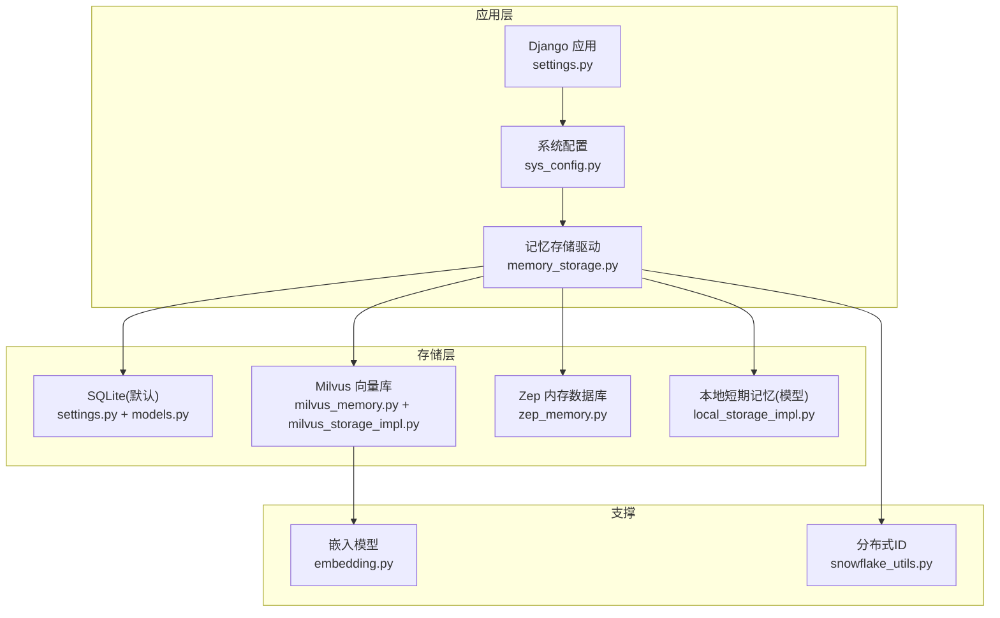
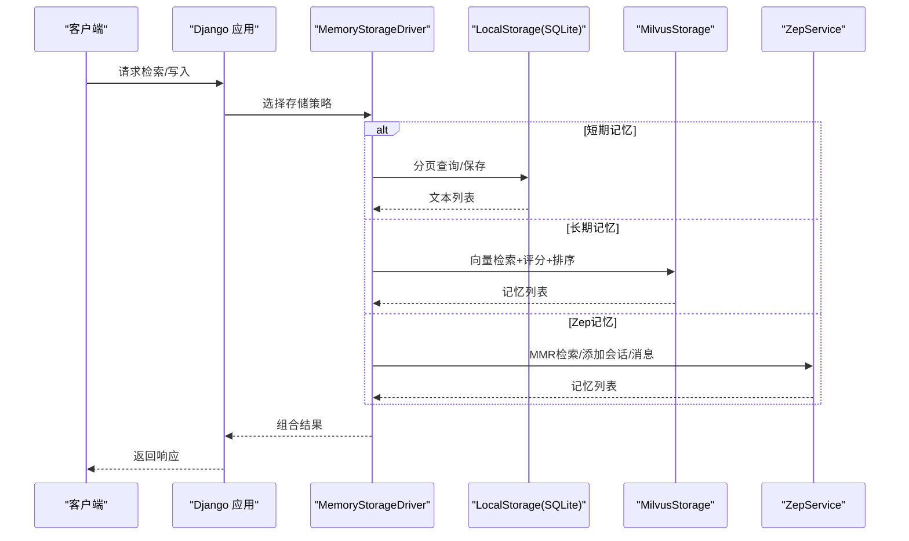
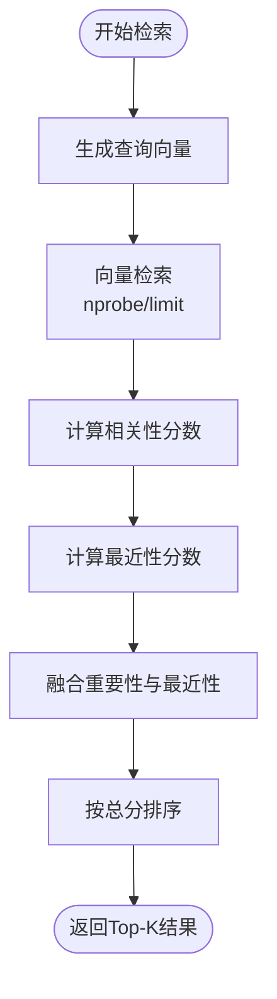
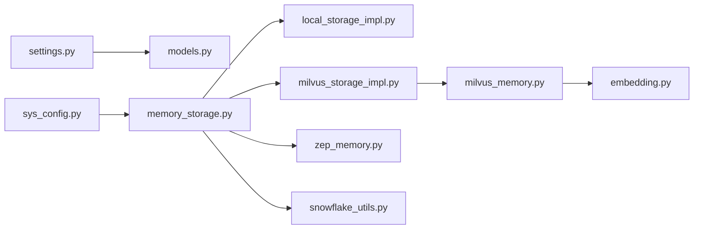

# 数据库性能优化

<cite>
**本文引用的文件**
- [settings.py](file://domain-chatbot/VirtualWife/settings.py)
- [sys_config.py](file://domain-chatbot/apps/chatbot/config/sys_config.py)
- [milvus_storage_impl.py](file://domain-chatbot/apps/chatbot/memory/milvus/milvus_storage_impl.py)
- [milvus_memory.py](file://domain-chatbot/apps/chatbot/memory/milvus/milvus_memory.py)
- [local_storage_impl.py](file://domain-chatbot/apps/chatbot/memory/local/local_storage_impl.py)
- [zep_memory.py](file://domain-chatbot/apps/chatbot/memory/zep/zep_memory.py)
- [embedding.py](file://domain-chatbot/apps/chatbot/memory/embedding.py)
- [snowflake_utils.py](file://domain-chatbot/apps/chatbot/utils/snowflake_utils.py)
- [models.py](file://domain-chatbot/apps/chatbot/models.py)
- [docker-compose-dev.yaml](file://installer/experiment/docker-compose-dev.yaml)
</cite>

## 目录
1. [简介](#简介)
2. [项目结构](#项目结构)
3. [核心组件](#核心组件)
4. [架构总览](#架构总览)
5. [详细组件分析](#详细组件分析)
6. [依赖分析](#依赖分析)
7. [性能考量](#性能考量)
8. [故障排查指南](#故障排查指南)
9. [结论](#结论)
10. [附录](#附录)

## 简介
本文件面向VirtualWife项目的数据库性能优化，聚焦多数据库环境下的整体优化策略，涵盖：
- SQLite查询优化（Django默认数据库）
- Milvus向量检索优化
- 连接池与连接复用策略建议
- 查询性能优化技术（索引、查询计划、批量）
- 内存数据库（Zep）的性能配置要点
- 监控与诊断（慢查询、指标、瓶颈分析）
- 扩容与高并发调优方案

## 项目结构
项目采用Django后端与多存储后端并行的架构：SQLite用于系统配置与本地短期记忆；Milvus用于长期向量记忆；Zep用于会话与摘要记忆；同时包含嵌入模型服务与SnowFlake分布式ID生成。

图表来源
- [settings.py](file://domain-chatbot/VirtualWife/settings.py#L95-L100)
- [sys_config.py](file://domain-chatbot/apps/chatbot/config/sys_config.py#L17-L29)
- [milvus_storage_impl.py](file://domain-chatbot/apps/chatbot/memory/milvus/milvus_storage_impl.py#L1-L31)
- [milvus_memory.py](file://domain-chatbot/apps/chatbot/memory/milvus/milvus_memory.py#L1-L53)
- [local_storage_impl.py](file://domain-chatbot/apps/chatbot/memory/local/local_storage_impl.py#L1-L71)
- [zep_memory.py](file://domain-chatbot/apps/chatbot/memory/zep/zep_memory.py#L1-L169)
- [embedding.py](file://domain-chatbot/apps/chatbot/memory/embedding.py#L1-L19)
- [snowflake_utils.py](file://domain-chatbot/apps/chatbot/utils/snowflake_utils.py#L1-L107)

章节来源
- [settings.py](file://domain-chatbot/VirtualWife/settings.py#L95-L100)
- [sys_config.py](file://domain-chatbot/apps/chatbot/config/sys_config.py#L17-L29)

## 核心组件
- SQLite默认数据库：用于系统配置、用户与本地短期记忆等，配置在Django settings中，默认引擎为sqlite3。
- Milvus向量存储：封装Collection Schema、索引、插入与检索流程，支持按sender/owner过滤与评分排序。
- Zep内存数据库：通过ZepClient进行用户、会话、消息与检索（MMR重排）。
- 本地短期记忆：基于Django ORM的分页与排序查询。
- 嵌入模型：基于中文RoBERTa模型生成向量。
- 分布式ID：SnowFlake生成全局唯一ID。

章节来源
- [settings.py](file://domain-chatbot/VirtualWife/settings.py#L95-L100)
- [milvus_memory.py](file://domain-chatbot/apps/chatbot/memory/milvus/milvus_memory.py#L1-L53)
- [milvus_storage_impl.py](file://domain-chatbot/apps/chatbot/memory/milvus/milvus_storage_impl.py#L1-L31)
- [local_storage_impl.py](file://domain-chatbot/apps/chatbot/memory/local/local_storage_impl.py#L1-L71)
- [zep_memory.py](file://domain-chatbot/apps/chatbot/memory/zep/zep_memory.py#L1-L169)
- [embedding.py](file://domain-chatbot/apps/chatbot/memory/embedding.py#L1-L19)
- [snowflake_utils.py](file://domain-chatbot/apps/chatbot/utils/snowflake_utils.py#L1-L107)

## 架构总览

图表来源
- [milvus_storage_impl.py](file://domain-chatbot/apps/chatbot/memory/milvus/milvus_storage_impl.py#L18-L31)
- [local_storage_impl.py](file://domain-chatbot/apps/chatbot/memory/local/local_storage_impl.py#L19-L51)
- [zep_memory.py](file://domain-chatbot/apps/chatbot/memory/zep/zep_memory.py#L119-L135)

## 详细组件分析

### SQLite查询优化（Django默认数据库）
- 数据库引擎与路径：默认使用sqlite3，数据库文件位于项目db子目录。
- 本地短期记忆模型：包含文本、标签、发送者、所有者、时间戳字段，适合按owner与时间戳排序的分页查询。
- 查询优化建议
  - 索引：对常用过滤字段（如owner）与排序字段（timestamp）建立复合索引，减少排序成本。
  - 分页：使用offset/limit分页，避免一次性加载大量数据；可考虑游标分页降低offset过大带来的性能问题。
  - 批量写入：批量插入本地记忆，减少事务开销。
  - 事务：将多次写入合并到单个事务中，降低提交频率。
  - 查询裁剪：仅select必要字段，避免SELECT *。
  - 缓存：对热点查询结果进行轻量缓存（如LRU），降低重复查询压力。

章节来源
- [settings.py](file://domain-chatbot/VirtualWife/settings.py#L95-L100)
- [local_storage_impl.py](file://domain-chatbot/apps/chatbot/memory/local/local_storage_impl.py#L31-L51)
- [models.py](file://domain-chatbot/apps/chatbot/models.py#L53-L67)

### Milvus向量搜索优化
- 集合与Schema：主键、文本、sender、owner、timestamp、importance_score、embedding字段。
- 索引与检索参数：使用IVF_SQ8索引，metric_type为L2，nprobe参数控制候选集大小。
- 检索流程：文本向量化→构造查询向量→向量检索→相关性分数计算→最近性与重要性融合→归一化→排序。
- 优化建议
  - 索引调优：根据数据规模调整nlist与nprobe，平衡召回率与延迟；定期重建索引以维持精度。
  - 过滤表达式：合理使用expr过滤sender/owner，减少无效扫描。
  - 输出字段裁剪：仅返回必要字段，减少网络与序列化开销。
  - 连接复用：保持连接常驻，避免频繁connect/disconnect。
  - 批量插入：将多条向量合并为批量insert，提升吞吐。
  - 载入/释放：按需load/release，避免常驻占用资源。
  - 评分融合：对relevance、importance、recency权重进行A/B测试，找到最佳组合。

图表来源
- [milvus_memory.py](file://domain-chatbot/apps/chatbot/memory/milvus/milvus_memory.py#L67-L128)

章节来源
- [milvus_memory.py](file://domain-chatbot/apps/chatbot/memory/milvus/milvus_memory.py#L1-L53)
- [milvus_memory.py](file://domain-chatbot/apps/chatbot/memory/milvus/milvus_memory.py#L88-L116)
- [milvus_memory.py](file://domain-chatbot/apps/chatbot/memory/milvus/milvus_memory.py#L118-L128)
- [milvus_storage_impl.py](file://domain-chatbot/apps/chatbot/memory/milvus/milvus_storage_impl.py#L18-L31)

### Zep内存数据库性能配置
- 功能概览：用户、会话、消息管理与检索（支持MMR重排）。
- 性能要点
  - 连接与会话：确保ZepClient连接稳定，避免频繁创建销毁；对会话进行生命周期管理。
  - 检索参数：合理设置mmr_lambda与limit，权衡多样性与相关性。
  - 批量写入：将多条消息合并写入，减少RTT。
  - 缓存策略：对近期会话与常用检索结果做本地缓存，降低重复请求。
  - 健康检查：结合容器编排健康检查，保障服务可用性。

章节来源
- [zep_memory.py](file://domain-chatbot/apps/chatbot/memory/zep/zep_memory.py#L20-L28)
- [zep_memory.py](file://domain-chatbot/apps/chatbot/memory/zep/zep_memory.py#L119-L135)
- [docker-compose-dev.yaml](file://installer/experiment/docker-compose-dev.yaml#L38-L51)

### 连接池与连接复用策略
- SQLite：Django默认连接池能力有限，建议在高并发场景下启用连接池中间件或使用连接池库（如sqlalchemy的pool），并设置合理的最大连接数与超时。
- Milvus：通过连接管理保持长连接，避免频繁connect/disconnect；在批量操作前后显式load/release。
- Zep：复用ZepClient实例，避免重复初始化；对并发请求进行限流与队列化。

章节来源
- [milvus_memory.py](file://domain-chatbot/apps/chatbot/memory/milvus/milvus_memory.py#L22-L30)
- [milvus_storage_impl.py](file://domain-chatbot/apps/chatbot/memory/milvus/milvus_storage_impl.py#L20-L27)

### 查询性能优化技术
- 索引优化：SQLite上为owner、timestamp建立索引；Milvus上根据数据规模调整nlist/nprobe。
- 查询计划分析：利用ORM的explain功能（Django可借助第三方工具）查看SQL执行计划；Milvus可通过指标与日志观察检索耗时。
- 批量操作优化：批量insert、批量检索；减少网络往返与事务次数。
- 字段裁剪：仅返回必要字段，减少序列化与传输开销。

章节来源
- [local_storage_impl.py](file://domain-chatbot/apps/chatbot/memory/local/local_storage_impl.py#L19-L29)
- [milvus_memory.py](file://domain-chatbot/apps/chatbot/memory/milvus/milvus_memory.py#L46-L52)

### 嵌入模型与向量化性能
- 模型：中文RoBERTa模型，支持批量编码；建议关闭并行tokenizers以避免线程争用。
- 性能建议：预热模型、批量化输入、GPU加速（如可用）、缓存向量结果。

章节来源
- [embedding.py](file://domain-chatbot/apps/chatbot/memory/embedding.py#L1-L19)
- [milvus_memory.py](file://domain-chatbot/apps/chatbot/memory/milvus/milvus_memory.py#L12)

### 分布式ID与写入去重
- SnowFlake：生成全局唯一ID，避免冲突；注意时钟回拨检测与序列溢出处理。

章节来源
- [snowflake_utils.py](file://domain-chatbot/apps/chatbot/utils/snowflake_utils.py#L75-L78)

## 依赖分析

图表来源
- [settings.py](file://domain-chatbot/VirtualWife/settings.py#L95-L100)
- [sys_config.py](file://domain-chatbot/apps/chatbot/config/sys_config.py#L17-L29)
- [milvus_storage_impl.py](file://domain-chatbot/apps/chatbot/memory/milvus/milvus_storage_impl.py#L1-L31)
- [milvus_memory.py](file://domain-chatbot/apps/chatbot/memory/milvus/milvus_memory.py#L1-L53)
- [local_storage_impl.py](file://domain-chatbot/apps/chatbot/memory/local/local_storage_impl.py#L1-L71)
- [zep_memory.py](file://domain-chatbot/apps/chatbot/memory/zep/zep_memory.py#L1-L169)
- [embedding.py](file://domain-chatbot/apps/chatbot/memory/embedding.py#L1-L19)
- [snowflake_utils.py](file://domain-chatbot/apps/chatbot/utils/snowflake_utils.py#L1-L107)

## 性能考量
- 多数据库协同：SQLite负责结构化数据与短期记忆；Milvus负责向量检索；Zep负责会话与摘要；应避免跨库事务，采用最终一致性。
- 并发与锁：SQLite在高并发写入时可能成为瓶颈，建议引入连接池与只读副本；Milvus写入高峰时可分批与限流。
- 缓存策略：对热点检索结果与会话内容进行缓存，降低后端压力。
- 监控与告警：采集慢查询、检索耗时、连接池利用率、向量库指标，建立告警阈值。
- 扩容与负载均衡：前端增加反向代理与负载均衡；后端按存储类型水平扩展（Milvus集群、Zep服务副本、数据库读副本）。

## 故障排查指南
- SQLite慢查询
  - 现象：分页查询缓慢、排序开销大。
  - 排查：确认索引是否存在；检查ORM生成的SQL；评估offset过大问题。
  - 处理：创建复合索引；改用游标分页；减少字段选择。
- Milvus检索慢
  - 现象：nprobe过小导致召回不足，nprobe过大导致延迟上升。
  - 排查：查看检索耗时与命中率；确认索引类型与参数。
  - 处理：调整nlist/nprobe；按expr过滤减少扫描；输出字段裁剪。
- Zep连接异常
  - 现象：检索失败、超时。
  - 排查：检查Zep服务健康状态；确认DSN与API Key；查看容器日志。
  - 处理：复用客户端；增加重试与熔断；监控健康检查。
- 向量模型性能
  - 现象：向量化耗时长。
  - 排查：模型初始化与tokenizer并行设置；批量化输入大小。
  - 处理：关闭并行tokenizers；批量化；缓存结果。

章节来源
- [local_storage_impl.py](file://domain-chatbot/apps/chatbot/memory/local/local_storage_impl.py#L31-L51)
- [milvus_memory.py](file://domain-chatbot/apps/chatbot/memory/milvus/milvus_memory.py#L88-L116)
- [zep_memory.py](file://domain-chatbot/apps/chatbot/memory/zep/zep_memory.py#L20-L28)
- [docker-compose-dev.yaml](file://installer/experiment/docker-compose-dev.yaml#L38-L51)
- [embedding.py](file://domain-chatbot/apps/chatbot/memory/embedding.py#L1-L19)

## 结论
通过在SQLite、Milvus与Zep三类存储上的针对性优化（索引、连接池、批量、缓存与监控），可显著提升VirtualWife在高并发与大规模数据场景下的响应速度与稳定性。建议以监控为先导，持续迭代索引与参数配置，并结合横向扩展与负载均衡实现弹性扩容。

## 附录
- 监控与诊断建议
  - SQLite：启用SQL日志与慢查询日志；使用ORM提供的执行计划分析工具。
  - Milvus：关注检索耗时、命中率、索引构建进度与磁盘IO；使用官方指标导出。
  - Zep：采集请求延迟、错误率与健康检查；结合容器编排的健康探针。
- 扩容与高并发
  - 前端：反向代理与负载均衡；静态资源CDN。
  - 后端：数据库读副本、Milvus集群、Zep服务副本；连接池与限流。
- 配置参考
  - SQLite：连接池大小、超时、只读副本。
  - Milvus：nlist/nprobe、索引类型、输出字段裁剪。
  - Zep：连接复用、MMR参数、缓存策略。