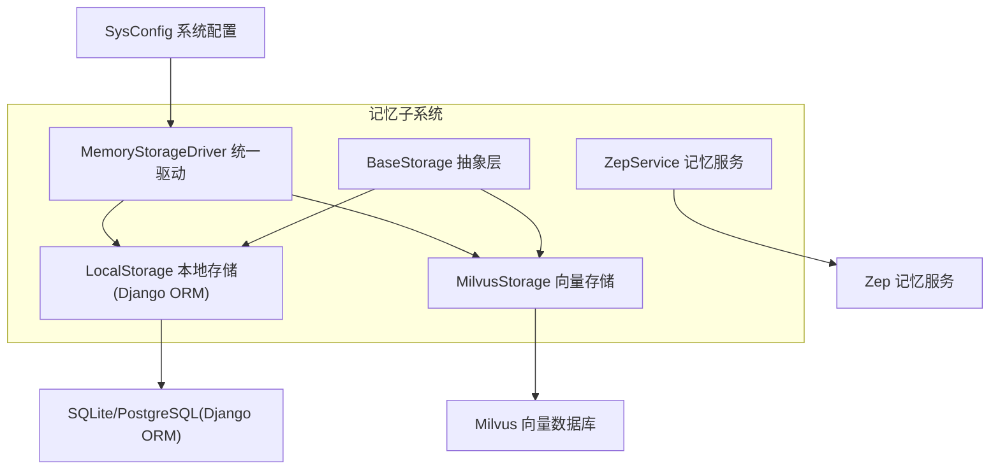
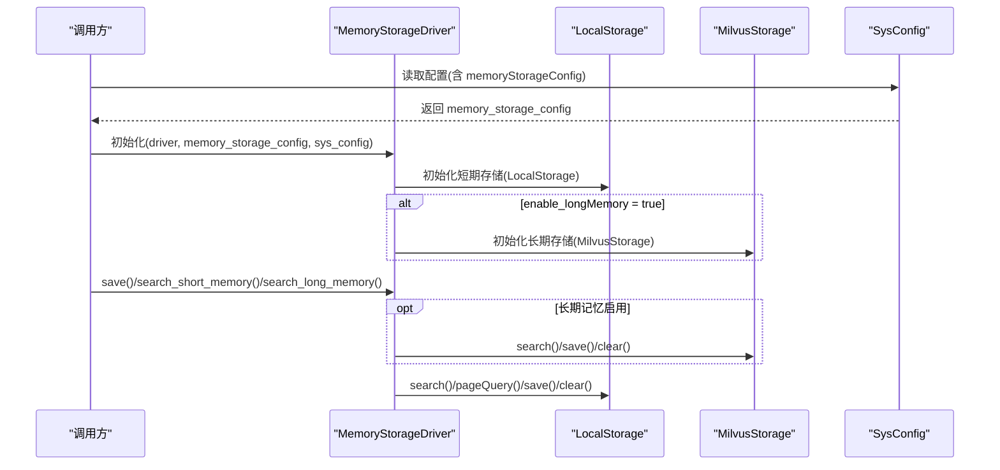
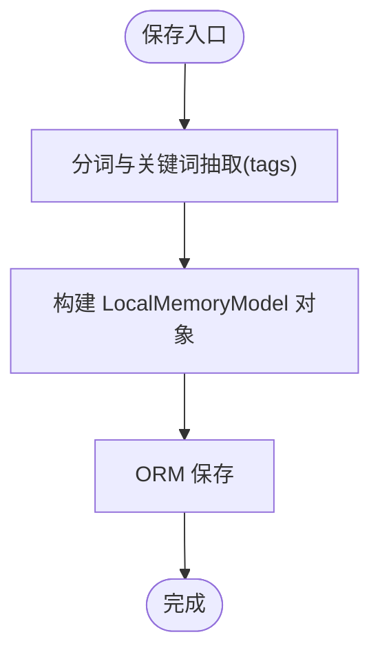
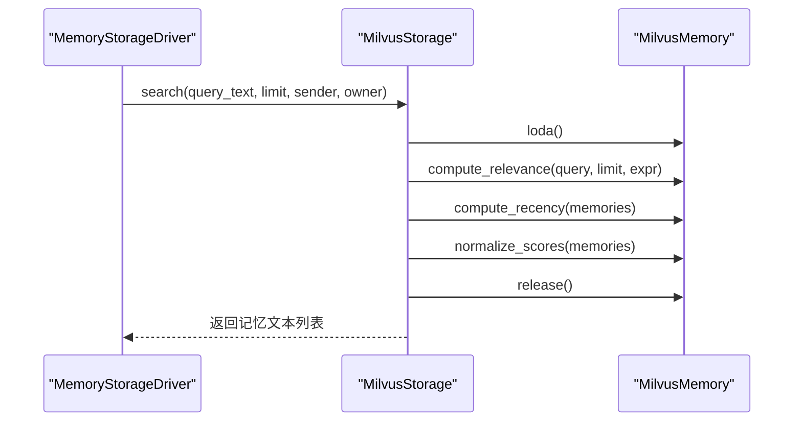
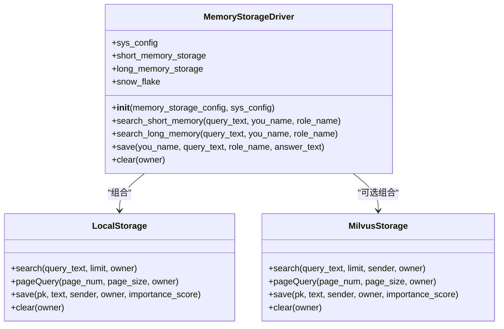
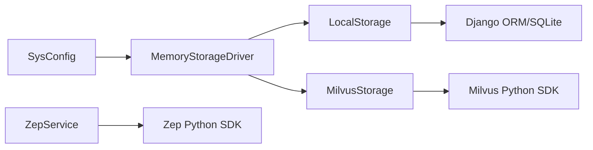

# 数据库配置

<cite>
**本文引用的文件**
- [domain-chatbot/apps/chatbot/memory/base_storage.py](file://domain-chatbot/apps/chatbot/memory/base_storage.py)
- [domain-chatbot/apps/chatbot/memory/local/local_storage_impl.py](file://domain-chatbot/apps/chatbot/memory/local/local_storage_impl.py)
- [domain-chatbot/apps/chatbot/memory/milvus/milvus_storage_impl.py](file://domain-chatbot/apps/chatbot/memory/milvus/milvus_storage_impl.py)
- [domain-chatbot/apps/chatbot/memory/zep/zep_memory.py](file://domain-chatbot/apps/chatbot/memory/zep/zep_memory.py)
- [domain-chatbot/apps/chatbot/memory/memory_storage.py](file://domain-chatbot/apps/chatbot/memory/memory_storage.py)
- [domain-chatbot/apps/chatbot/config/sys_config.py](file://domain-chatbot/apps/chatbot/config/sys_config.py)
- [domain-chatbot/apps/chatbot/models.py](file://domain-chatbot/apps/chatbot/models.py)
- [installer/docker-compose.yaml](file://installer/docker-compose.yaml)
- [installer/milvus/docker-compose.yml](file://installer/milvus/docker-compose.yml)
</cite>

## 目录
1. [简介](#简介)
2. [项目结构](#项目结构)
3. [核心组件](#核心组件)
4. [架构总览](#架构总览)
5. [详细组件分析](#详细组件分析)
6. [依赖分析](#依赖分析)
7. [性能考虑](#性能考虑)
8. [故障排查指南](#故障排查指南)
9. [结论](#结论)
10. [附录](#附录)

## 简介
本文件面向数据库管理员与运维工程师，系统化梳理 VirtualWife 项目中的多数据库配置与运行机制，覆盖以下方面：
- 多数据库支持架构：SQLite（Django ORM）本地存储、Milvus 向量数据库、Zep 记忆数据库。
- 关键配置项：主机地址、端口、用户名、密码、数据库名等。
- 内存存储驱动 MemoryStorageDriver 的初始化参数、连接池与事务管理设置。
- Milvus 向量数据库的特殊配置：集合命名、向量维度、索引类型、查询参数等。
- 性能优化：连接池大小、超时设置、批量写入、索引优化等。
- 迁移与备份恢复策略、监控与告警建议。

## 项目结构
VirtualWife 的数据库相关能力集中在 chatbot 应用的记忆子系统中，采用“抽象接口 + 多实现”的设计模式，通过 SysConfig 动态加载配置并懒加载记忆驱动。

图表来源
- [domain-chatbot/apps/chatbot/memory/base_storage.py](file://domain-chatbot/apps/chatbot/memory/base_storage.py#L1-L27)
- [domain-chatbot/apps/chatbot/memory/local/local_storage_impl.py](file://domain-chatbot/apps/chatbot/memory/local/local_storage_impl.py#L1-L71)
- [domain-chatbot/apps/chatbot/memory/milvus/milvus_storage_impl.py](file://domain-chatbot/apps/chatbot/memory/milvus/milvus_storage_impl.py#L1-L61)
- [domain-chatbot/apps/chatbot/memory/zep/zep_memory.py](file://domain-chatbot/apps/chatbot/memory/zep/zep_memory.py#L1-L169)
- [domain-chatbot/apps/chatbot/memory/memory_storage.py](file://domain-chatbot/apps/chatbot/memory/memory_storage.py#L1-L176)
- [domain-chatbot/apps/chatbot/config/sys_config.py](file://domain-chatbot/apps/chatbot/config/sys_config.py#L1-L208)

章节来源
- [domain-chatbot/apps/chatbot/memory/base_storage.py](file://domain-chatbot/apps/chatbot/memory/base_storage.py#L1-L27)
- [domain-chatbot/apps/chatbot/memory/memory_storage.py](file://domain-chatbot/apps/chatbot/memory/memory_storage.py#L1-L176)
- [domain-chatbot/apps/chatbot/config/sys_config.py](file://domain-chatbot/apps/chatbot/config/sys_config.py#L1-L208)

## 核心组件
- 抽象层 BaseStorage：定义统一的记忆检索、分页查询、保存、清空等接口。
- 本地存储 LocalStorage：基于 Django ORM 的 SQLite/PostgreSQL 表 LocalMemoryModel 实现，负责短期记忆持久化。
- 向量存储 MilvusStorage：封装 MilvusMemory，负责长期记忆的向量化检索与评分排序。
- 记忆驱动 MemoryStorageDriver：聚合短期与长期记忆，协调 SnowFlake 生成主键、控制摘要与重要性评分流程。
- 系统配置 SysConfig：从 sys_config.json 中读取 memoryStorageConfig 并懒加载 MemoryStorageDriver；同时提供 enable_summary、enable_longMemory 等开关。

章节来源
- [domain-chatbot/apps/chatbot/memory/base_storage.py](file://domain-chatbot/apps/chatbot/memory/base_storage.py#L1-L27)
- [domain-chatbot/apps/chatbot/memory/local/local_storage_impl.py](file://domain-chatbot/apps/chatbot/memory/local/local_storage_impl.py#L1-L71)
- [domain-chatbot/apps/chatbot/memory/milvus/milvus_storage_impl.py](file://domain-chatbot/apps/chatbot/memory/milvus/milvus_storage_impl.py#L1-L61)
- [domain-chatbot/apps/chatbot/memory/memory_storage.py](file://domain-chatbot/apps/chatbot/memory/memory_storage.py#L1-L176)
- [domain-chatbot/apps/chatbot/config/sys_config.py](file://domain-chatbot/apps/chatbot/config/sys_config.py#L17-L30)

## 架构总览
下图展示 MemoryStorageDriver 如何根据 SysConfig 的配置选择启用短期与长期记忆，并调用对应存储实现。

图表来源
- [domain-chatbot/apps/chatbot/memory/memory_storage.py](file://domain-chatbot/apps/chatbot/memory/memory_storage.py#L20-L25)
- [domain-chatbot/apps/chatbot/memory/local/local_storage_impl.py](file://domain-chatbot/apps/chatbot/memory/local/local_storage_impl.py#L16-L18)
- [domain-chatbot/apps/chatbot/memory/milvus/milvus_storage_impl.py](file://domain-chatbot/apps/chatbot/memory/milvus/milvus_storage_impl.py#L9-L17)
- [domain-chatbot/apps/chatbot/config/sys_config.py](file://domain-chatbot/apps/chatbot/config/sys_config.py#L17-L30)

## 详细组件分析

### 抽象层 BaseStorage
- 职责：定义统一接口，确保 LocalStorage、MilvusStorage 等实现具备一致的检索、分页、保存、清空能力。
- 关键方法：search、pageQuery、save、clear。

章节来源
- [domain-chatbot/apps/chatbot/memory/base_storage.py](file://domain-chatbot/apps/chatbot/memory/base_storage.py#L4-L27)

### 本地存储 LocalStorage（SQLite/PostgreSQL）
- 数据模型：LocalMemoryModel，字段包括 id、text、tags、sender、owner、timestamp。
- 查询逻辑：按 owner 过滤并按时间倒序分页；支持按 owner 或全局分页查询。
- 写入逻辑：使用 jieba 进行分词与关键词抽取，写入 tags；保存时生成当前时间戳。
- 清空逻辑：按 owner 删除记录。

图表来源
- [domain-chatbot/apps/chatbot/memory/local/local_storage_impl.py](file://domain-chatbot/apps/chatbot/memory/local/local_storage_impl.py#L53-L66)
- [domain-chatbot/apps/chatbot/models.py](file://domain-chatbot/apps/chatbot/models.py#L53-L69)

章节来源
- [domain-chatbot/apps/chatbot/memory/local/local_storage_impl.py](file://domain-chatbot/apps/chatbot/memory/local/local_storage_impl.py#L1-L71)
- [domain-chatbot/apps/chatbot/models.py](file://domain-chatbot/apps/chatbot/models.py#L53-L69)

### 向量存储 MilvusStorage
- 初始化参数：从 memory_storage_config 读取 host、port、user、password、db_name。
- 查询流程：构造过滤表达式 owner/sender，调用 MilvusMemory 执行相关性评分、最近性归一化，返回最高分记忆片段。
- 分页查询：计算 offset 与 limit，按 owner 过滤。
- 写入流程：插入记忆条目，包含主键、文本、sender、owner、重要性分数。
- 清空流程：按 owner 清理。

图表来源
- [domain-chatbot/apps/chatbot/memory/milvus/milvus_storage_impl.py](file://domain-chatbot/apps/chatbot/memory/milvus/milvus_storage_impl.py#L18-L40)

章节来源
- [domain-chatbot/apps/chatbot/memory/milvus/milvus_storage_impl.py](file://domain-chatbot/apps/chatbot/memory/milvus/milvus_storage_impl.py#L1-L61)

### 记忆驱动 MemoryStorageDriver
- 初始化：接收 memory_storage_config 与 SysConfig；实例化 LocalStorage；根据 enable_longMemory 条件实例化 MilvusStorage。
- 保存流程：先写短期记忆；若开启摘要与长期记忆，则生成摘要与重要性分数后写入 Milvus。
- 查询流程：短期记忆直接分页；长期记忆按角色与发送者过滤并评分排序。
- 主键生成：使用 SnowFlake 生成全局唯一 ID。

图表来源
- [domain-chatbot/apps/chatbot/memory/memory_storage.py](file://domain-chatbot/apps/chatbot/memory/memory_storage.py#L14-L25)
- [domain-chatbot/apps/chatbot/memory/local/local_storage_impl.py](file://domain-chatbot/apps/chatbot/memory/local/local_storage_impl.py#L14-L18)
- [domain-chatbot/apps/chatbot/memory/milvus/milvus_storage_impl.py](file://domain-chatbot/apps/chatbot/memory/milvus/milvus_storage_impl.py#L5-L17)

章节来源
- [domain-chatbot/apps/chatbot/memory/memory_storage.py](file://domain-chatbot/apps/chatbot/memory/memory_storage.py#L1-L176)

### 系统配置 SysConfig 与懒加载
- 配置来源：sys_config.json；SysConfigModel 可持久化配置。
- 懒加载：lazy_memory_storage 从 memoryStorageConfig 中提取 Milvus 连接参数，构造 memory_storage_config 并初始化 MemoryStorageDriver。
- 开关控制：enable_summary、enable_longMemory、enableReflection 等影响记忆处理流程。

章节来源
- [domain-chatbot/apps/chatbot/config/sys_config.py](file://domain-chatbot/apps/chatbot/config/sys_config.py#L17-L30)
- [domain-chatbot/apps/chatbot/config/sys_config.py](file://domain-chatbot/apps/chatbot/config/sys_config.py#L83-L191)

### Zep 记忆服务（可选）
- 客户端：ZepClient，支持用户、会话、消息与记忆的增删查改。
- MMR 检索：支持按 summary 或 messages 范围检索，并可设置 mmr_lambda 控制多样性与相关性权衡。
- 生命周期：按 user_id 与 channel_id 维度管理会话与记忆。

章节来源
- [domain-chatbot/apps/chatbot/memory/zep/zep_memory.py](file://domain-chatbot/apps/chatbot/memory/zep/zep_memory.py#L20-L169)

## 依赖分析
- 组件耦合：MemoryStorageDriver 通过 SysConfig 注入配置，按需装配 LocalStorage 与 MilvusStorage；MilvusStorage 依赖 MilvusMemory（具体实现位于 milvus_memory.py 文件中）。
- 外部依赖：Django ORM（SQLite/PostgreSQL）、Milvus Python SDK、Zep Python SDK。
- 环境变量：OPENAI、OLLAMA、ZHIPUAI 等大模型相关环境变量由 SysConfig 在加载时注入。

图表来源
- [domain-chatbot/apps/chatbot/config/sys_config.py](file://domain-chatbot/apps/chatbot/config/sys_config.py#L122-L139)
- [domain-chatbot/apps/chatbot/memory/memory_storage.py](file://domain-chatbot/apps/chatbot/memory/memory_storage.py#L20-L25)
- [domain-chatbot/apps/chatbot/memory/zep/zep_memory.py](file://domain-chatbot/apps/chatbot/memory/zep/zep_memory.py#L20-L28)

章节来源
- [domain-chatbot/apps/chatbot/config/sys_config.py](file://domain-chatbot/apps/chatbot/config/sys_config.py#L122-L139)
- [domain-chatbot/apps/chatbot/memory/memory_storage.py](file://domain-chatbot/apps/chatbot/memory/memory_storage.py#L20-L25)

## 性能考虑
- 连接池与事务
  - Django ORM：可通过 Django settings 中的数据库连接池参数（如最大连接数、空闲连接数、连接超时）进行优化；在高并发场景下建议开启连接池复用。
  - Milvus：客户端连接池由 SDK 管理，建议在应用侧复用单例客户端，避免频繁创建销毁；合理设置查询批大小与并发度。
  - Zep：客户端为 HTTP 客户端，建议在应用侧复用单例，减少握手开销。
- 超时设置
  - Django ORM：设置连接超时与查询超时，防止慢查询阻塞。
  - Milvus：设置请求超时与重试策略，避免单次查询长时间占用资源。
  - Zep：设置请求超时与重试，结合指数退避。
- 批量操作
  - Django ORM：使用 bulk_create/bulk_update 减少往返次数。
  - Milvus：使用批量 insert 接口，合理控制单批大小以平衡吞吐与延迟。
- 索引优化
  - Milvus：根据查询语料选择合适索引类型与参数（如 HNSW/IVF），并定期 rebuild 索引；向量维度与 metric 类型应与业务匹配。
- 缓存与预热
  - 常用查询结果可缓存于 Redis/Memcached，降低重复计算成本。
- 监控与告警
  - 数据库侧：连接数、QPS、慢查询、锁等待、磁盘 IO。
  - Milvus 侧：查询延迟、向量插入速率、索引构建状态。
  - Zep 侧：请求延迟、错误率、会话活跃度。

## 故障排查指南
- 连接失败
  - Milvus：检查 host/port/user/password/db_name 是否正确；确认网络连通与防火墙放行；查看 Milvus 日志。
  - Zep：确认 base_url 与 api_key；检查服务可用性与鉴权。
  - Django ORM：核对数据库类型、连接串、账号权限。
- 查询异常
  - Milvus：确认集合存在、分区过滤表达式语法正确、索引已构建；适当增大查询 topK 或调整 mmr_lambda。
  - Zep：确认 user_id/channel_id 存在；检查 lastn 参数与检索范围。
- 性能问题
  - 检查连接池上限与超时配置；观察慢查询日志；评估批量写入与索引策略。
- 备份与恢复
  - Django ORM：定期导出 SQL/序列化数据；生产环境建议使用数据库自带备份工具。
  - Milvus：使用官方备份方案（快照/对象存储备份），验证恢复流程。
  - Zep：遵循其提供的备份与恢复流程。

章节来源
- [domain-chatbot/apps/chatbot/memory/milvus/milvus_storage_impl.py](file://domain-chatbot/apps/chatbot/memory/milvus/milvus_storage_impl.py#L9-L17)
- [domain-chatbot/apps/chatbot/memory/zep/zep_memory.py](file://domain-chatbot/apps/chatbot/memory/zep/zep_memory.py#L20-L28)
- [domain-chatbot/apps/chatbot/config/sys_config.py](file://domain-chatbot/apps/chatbot/config/sys_config.py#L122-L139)

## 结论
VirtualWife 的数据库配置围绕“抽象接口 + 多实现”展开，SysConfig 负责集中化配置与懒加载，MemoryStorageDriver 则在运行时动态装配短期与长期记忆存储。Milvus 与 Zep 作为可插拔的外部组件，提供了强大的向量检索与记忆管理能力。通过合理的连接池、超时、批量与索引策略，可在保证稳定性的同时提升整体性能。建议在生产环境中完善备份与监控体系，确保系统的可维护性与可靠性。

## 附录

### 数据库配置清单与说明
- SQLite/PostgreSQL（本地存储）
  - 连接参数：由 Django settings 中的数据库配置决定（主机、端口、数据库名、用户名、密码、字符集、连接池等）。
  - 表结构：LocalMemoryModel，包含 text/tags/sender/owner/timestamp 等字段。
  - 事务：Django ORM 默认事务隔离级别与回滚策略。
- Milvus（向量数据库）
  - 连接参数：host、port、user、password、db_name。
  - 集合命名：由 MilvusMemory 内部管理；查询时使用 owner/sender 表达式过滤。
  - 向量维度与索引：由 Milvus 集合 schema 与索引参数决定；查询时可设置 topK 与 mmr_lambda。
  - 查询参数：支持表达式过滤、相关性评分、最近性归一化、MMR 重排。
- Zep（记忆服务）
  - 连接参数：base_url、api_key。
  - 会话与用户：按 user_id 与 channel_id 维度管理；支持检索与 MMR 重排。

章节来源
- [domain-chatbot/apps/chatbot/memory/local/local_storage_impl.py](file://domain-chatbot/apps/chatbot/memory/local/local_storage_impl.py#L53-L66)
- [domain-chatbot/apps/chatbot/models.py](file://domain-chatbot/apps/chatbot/models.py#L53-L69)
- [domain-chatbot/apps/chatbot/memory/milvus/milvus_storage_impl.py](file://domain-chatbot/apps/chatbot/memory/milvus/milvus_storage_impl.py#L9-L17)
- [domain-chatbot/apps/chatbot/memory/zep/zep_memory.py](file://domain-chatbot/apps/chatbot/memory/zep/zep_memory.py#L20-L28)

### 配置文件与容器编排参考
- 容器编排：chatbot、chatvrm、gateway 服务通过 docker-compose.yaml 组织；Milvus 通过独立 compose 启动。
- 环境变量：OPENAI、OLLAMA、ZHIPUAI 等在 SysConfig 加载时注入。

章节来源
- [installer/docker-compose.yaml](file://installer/docker-compose.yaml#L1-L44)
- [installer/milvus/docker-compose.yml](file://installer/milvus/docker-compose.yml#L1-L200)
- [domain-chatbot/apps/chatbot/config/sys_config.py](file://domain-chatbot/apps/chatbot/config/sys_config.py#L122-L139)