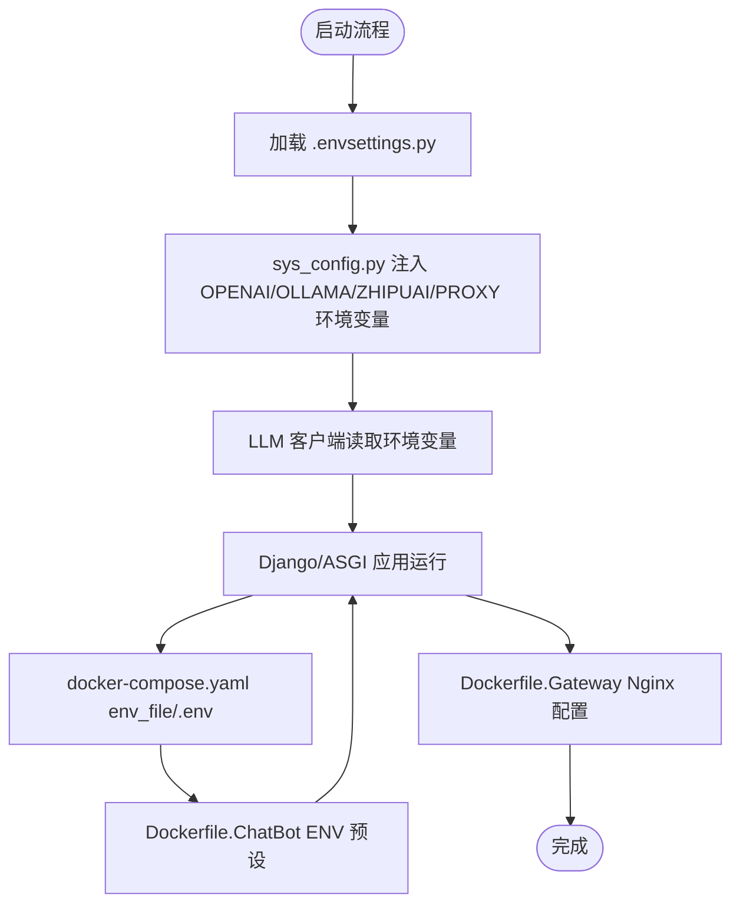
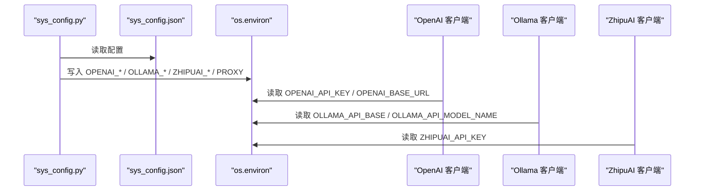
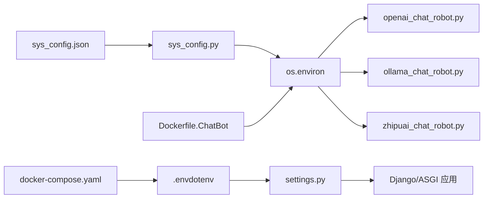

# 环境变量配置

<cite>
**本文引用的文件**
- [settings.py](file://domain-chatbot/VirtualWife/settings.py)
- [sys_config.py](file://domain-chatbot/apps/chatbot/config/sys_config.py)
- [sys_config.json](file://domain-chatbot/apps/chatbot/config/sys_config.json)
- [openai_chat_robot.py](file://domain-chatbot/apps/chatbot/llms/openai/openai_chat_robot.py)
- [ollama_chat_robot.py](file://domain-chatbot/apps/chatbot/llms/ollama/ollama_chat_robot.py)
- [zhipuai_chat_robot.py](file://domain-chatbot/apps/chatbot/llms/zhipuai/zhipuai_chat_robot.py)
- [docker-compose.yaml](file://installer/docker-compose.yaml)
- [Dockerfile.ChatBot](file://infrastructure-packaging/Dockerfile.ChatBot)
- [Dockerfile.Gateway](file://infrastructure-packaging/Dockerfile.Gateway)
- [docker-compose-dev.yaml](file://installer/experiment/docker-compose-dev.yaml)
- [manage.py](file://domain-chatbot/manage.py)
- [asgi.py](file://domain-chatbot/VirtualWife/asgi.py)
- [urls.py](file://domain-chatbot/VirtualWife/urls.py)
</cite>

## 目录
1. [简介](#简介)
2. [项目结构](#项目结构)
3. [核心组件](#核心组件)
4. [架构总览](#架构总览)
5. [详细组件分析](#详细组件分析)
6. [依赖关系分析](#依赖关系分析)
7. [性能考虑](#性能考虑)
8. [故障排查指南](#故障排查指南)
9. [结论](#结论)
10. [附录](#附录)

## 简介
本文件为 VirtualWife 项目的环境变量配置权威指南，面向 DevOps 工程师与系统管理员。内容涵盖：
- Django 相关环境变量（如 SECRET_KEY、DEBUG、ALLOWED_HOSTS 等）及其作用与设置要点
- AI 服务相关环境变量（OPENAI_API_KEY、OPENAI_BASE_URL、OLLAMA_API_BASE、OLLAMA_API_MODEL_NAME、ZHIPUAI_API_KEY、HTTP_PROXY/HTTPS_PROXY/SOCKS5_PROXY 等）
- 环境变量的作用域与优先级（系统级、Docker 环境变量、.env 文件覆盖）
- 最佳实践（敏感信息保护、配置分离、多环境管理）
- 验证方法、常见错误排查与安全配置建议

## 项目结构
VirtualWife 由后端 Django 应用、前端 Next.js 应用、网关与基础设施编排组成。与环境变量配置直接相关的关键位置如下：
- Django 设置与运行：settings.py、asgi.py、urls.py、manage.py
- AI 服务接入：OpenAI/Ollama/ZhipuAI 的 LLM 客户端
- 配置注入：sys_config.py 从 sys_config.json 注入环境变量
- 编排与镜像：docker-compose.yaml、Dockerfile.ChatBot、Dockerfile.Gateway、docker-compose-dev.yaml

```mermaid
graph TB
subgraph "后端应用"
S["settings.py<br/>Django 设置"]
A["asgi.py<br/>ASGI 应用"]
U["urls.py<br/>路由"]
M["manage.py<br/>命令入口"]
SC["sys_config.py<br/>系统配置注入"]
SJ["sys_config.json<br/>默认配置"]
end
subgraph "AI 服务客户端"
OA["openai_chat_robot.py"]
OL["ollama_chat_robot.py"]
ZP["zhipuai_chat_robot.py"]
end
subgraph "容器与编排"
DC["docker-compose.yaml"]
DCB["Dockerfile.ChatBot"]
DG["Dockerfile.Gateway"]
DCD["docker-compose-dev.yaml"]
end
S --> A --> U
M --> S
SC --> OA
SC --> OL
SC --> ZP
SJ --> SC
DC -. env_file/.env .-> S
DCB -. ENV .-> S
DG -. Nginx 配置 .-> A
DCD -. dev 环境 .-> OA
```

图表来源
- [settings.py](file://domain-chatbot/VirtualWife/settings.py#L1-L208)
- [asgi.py](file://domain-chatbot/VirtualWife/asgi.py#L1-L42)
- [urls.py](file://domain-chatbot/VirtualWife/urls.py#L1-L44)
- [manage.py](file://domain-chatbot/manage.py#L1-L28)
- [sys_config.py](file://domain-chatbot/apps/chatbot/config/sys_config.py#L1-L208)
- [sys_config.json](file://domain-chatbot/apps/chatbot/config/sys_config.json#L1-L60)
- [openai_chat_robot.py](file://domain-chatbot/apps/chatbot/llms/openai/openai_chat_robot.py#L1-L101)
- [ollama_chat_robot.py](file://domain-chatbot/apps/chatbot/llms/ollama/ollama_chat_robot.py#L1-L100)
- [zhipuai_chat_robot.py](file://domain-chatbot/apps/chatbot/llms/zhipuai/zhipuai_chat_robot.py#L1-L71)
- [docker-compose.yaml](file://installer/docker-compose.yaml#L1-L44)
- [Dockerfile.ChatBot](file://infrastructure-packaging/Dockerfile.ChatBot#L1-L31)
- [Dockerfile.Gateway](file://infrastructure-packaging/Dockerfile.Gateway#L1-L4)
- [docker-compose-dev.yaml](file://installer/experiment/docker-compose-dev.yaml#L1-L77)

章节来源
- [settings.py](file://domain-chatbot/VirtualWife/settings.py#L1-L208)
- [docker-compose.yaml](file://installer/docker-compose.yaml#L1-L44)

## 核心组件
本节梳理与环境变量强相关的组件及职责：
- Django 设置与运行
  - settings.py：加载 .env；定义 SECRET_KEY、DEBUG、ALLOWED_HOSTS、DATABASES、日志、CORS 等
  - asgi.py：初始化 ASGI 应用并挂载路由
  - urls.py：注册 chatbot/speech 接口与 Swagger 文档
  - manage.py：设置 DJANGO_SETTINGS_MODULE 并执行命令行
- 系统配置注入
  - sys_config.py：从 sys_config.json 读取配置，动态写入 OPENAI_*、OLLAMA_*、ZHIPUAI_*、HTTP_PROXY 等环境变量
  - sys_config.json：默认配置模板，包含各模型与代理参数的默认值
- AI 服务客户端
  - openai_chat_robot.py：读取 OPENAI_API_KEY、OPENAI_BASE_URL
  - ollama_chat_robot.py：读取 OLLAMA_API_BASE、OLLAMA_API_MODEL_NAME
  - zhipuai_chat_robot.py：读取 ZHIPUAI_API_KEY
- 容器与编排
  - docker-compose.yaml：通过 env_file 引入 .env，暴露端口映射
  - Dockerfile.ChatBot：预设部分 ENV，迁移数据库
  - Dockerfile.Gateway：基于 OpenResty 的 Nginx 配置
  - docker-compose-dev.yaml：开发环境示例，包含 ZEP 相关环境变量

章节来源
- [settings.py](file://domain-chatbot/VirtualWife/settings.py#L1-L208)
- [asgi.py](file://domain-chatbot/VirtualWife/asgi.py#L1-L42)
- [urls.py](file://domain-chatbot/VirtualWife/urls.py#L1-L44)
- [manage.py](file://domain-chatbot/manage.py#L1-L28)
- [sys_config.py](file://domain-chatbot/apps/chatbot/config/sys_config.py#L1-L208)
- [sys_config.json](file://domain-chatbot/apps/chatbot/config/sys_config.json#L1-L60)
- [openai_chat_robot.py](file://domain-chatbot/apps/chatbot/llms/openai/openai_chat_robot.py#L1-L101)
- [ollama_chat_robot.py](file://domain-chatbot/apps/chatbot/llms/ollama/ollama_chat_robot.py#L1-L100)
- [zhipuai_chat_robot.py](file://domain-chatbot/apps/chatbot/llms/zhipuai/zhipuai_chat_robot.py#L1-L71)
- [docker-compose.yaml](file://installer/docker-compose.yaml#L1-L44)
- [Dockerfile.ChatBot](file://infrastructure-packaging/Dockerfile.ChatBot#L1-L31)
- [Dockerfile.Gateway](file://infrastructure-packaging/Dockerfile.Gateway#L1-L4)
- [docker-compose-dev.yaml](file://installer/experiment/docker-compose-dev.yaml#L1-L77)

## 架构总览
下图展示环境变量在系统中的流向与作用范围：



图表来源
- [settings.py](file://domain-chatbot/VirtualWife/settings.py#L13-L17)
- [sys_config.py](file://domain-chatbot/apps/chatbot/config/sys_config.py#L123-L155)
- [openai_chat_robot.py](file://domain-chatbot/apps/chatbot/llms/openai/openai_chat_robot.py#L20-L24)
- [ollama_chat_robot.py](file://domain-chatbot/apps/chatbot/llms/ollama/ollama_chat_robot.py#L19-L23)
- [zhipuai_chat_robot.py](file://domain-chatbot/apps/chatbot/llms/zhipuai/zhipuai_chat_robot.py#L18-L22)
- [docker-compose.yaml](file://installer/docker-compose.yaml#L12-L15)
- [Dockerfile.ChatBot](file://infrastructure-packaging/Dockerfile.ChatBot#L22-L26)

## 详细组件分析

### Django 环境变量与配置要点
- SECRET_KEY
  - 作用：Django 安全密钥，用于签名与加密
  - 设置建议：生产环境必须使用强随机值，避免硬编码在代码或镜像中
  - 当前行为：settings.py 中存在默认值，应被 .env 或编排层覆盖
- DEBUG
  - 作用：启用/禁用调试模式
  - 设置建议：仅开发环境开启，生产关闭
- ALLOWED_HOSTS
  - 作用：允许访问的主机列表，生产环境建议明确指定域名/IP
  - 当前行为：当前为通配，存在安全风险
- DATABASES
  - 作用：数据库配置（默认 SQLite）
  - 设置建议：生产环境建议使用 PostgreSQL/MariaDB，并通过环境变量注入连接串
- CORS 与静态资源
  - 作用：跨域与静态资源路径
  - 设置建议：生产环境限制允许来源与方法
- 日志与通道
  - 作用：日志目录、格式、处理器与 Channels 内存通道层
  - 设置建议：生产环境建议使用文件轮转与远程日志

章节来源
- [settings.py](file://domain-chatbot/VirtualWife/settings.py#L26-L32)
- [settings.py](file://domain-chatbot/VirtualWife/settings.py#L95-L100)
- [settings.py](file://domain-chatbot/VirtualWife/settings.py#L67-L69)
- [settings.py](file://domain-chatbot/VirtualWife/settings.py#L154-L207)

### AI 服务环境变量
- OpenAI
  - OPENAI_API_KEY：OpenAI API 密钥
  - OPENAI_BASE_URL：可选自定义基础地址（如代理/兼容服务）
  - 读取位置：openai_chat_robot.py
  - 注入来源：sys_config.py 从 sys_config.json 读取并写入 os.environ
- Ollama
  - OLLAMA_API_BASE：Ollama 服务地址
  - OLLAMA_API_MODEL_NAME：模型名称（如 qwen:7b）
  - 读取位置：ollama_chat_robot.py
  - 注入来源：sys_config.py 从 sys_config.json 读取并写入 os.environ
- 百度智谱
  - ZHIPUAI_API_KEY：智谱 API 密钥
  - 读取位置：zhipuai_chat_robot.py
  - 注入来源：sys_config.py 从 sys_config.json 读取并写入 os.environ
- 代理
  - HTTP_PROXY、HTTPS_PROXY、SOCKS5_PROXY：网络代理配置
  - 注入来源：sys_config.py 在 enableProxy=true 时写入 os.environ
  - 默认值：sys_config.json 提供示例地址（开发环境）

章节来源
- [openai_chat_robot.py](file://domain-chatbot/apps/chatbot/llms/openai/openai_chat_robot.py#L20-L24)
- [ollama_chat_robot.py](file://domain-chatbot/apps/chatbot/llms/ollama/ollama_chat_robot.py#L19-L23)
- [zhipuai_chat_robot.py](file://domain-chatbot/apps/chatbot/llms/zhipuai/zhipuai_chat_robot.py#L18-L22)
- [sys_config.py](file://domain-chatbot/apps/chatbot/config/sys_config.py#L123-L155)
- [sys_config.json](file://domain-chatbot/apps/chatbot/config/sys_config.json#L11-L23)

### 系统配置注入流程
- sys_config.py 从 sys_config.json 读取配置，动态写入 os.environ，随后各 LLM 客户端读取
- enableProxy 控制是否注入 HTTP/HTTPS/SOCKS5 代理
- Ollama 默认值在未提供配置时回退到本地常用默认值



图表来源
- [sys_config.py](file://domain-chatbot/apps/chatbot/config/sys_config.py#L123-L155)
- [sys_config.json](file://domain-chatbot/apps/chatbot/config/sys_config.json#L11-L23)
- [openai_chat_robot.py](file://domain-chatbot/apps/chatbot/llms/openai/openai_chat_robot.py#L20-L24)
- [ollama_chat_robot.py](file://domain-chatbot/apps/chatbot/llms/ollama/ollama_chat_robot.py#L19-L23)
- [zhipuai_chat_robot.py](file://domain-chatbot/apps/chatbot/llms/zhipuai/zhipuai_chat_robot.py#L18-L22)

章节来源
- [sys_config.py](file://domain-chatbot/apps/chatbot/config/sys_config.py#L1-L208)
- [sys_config.json](file://domain-chatbot/apps/chatbot/config/sys_config.json#L1-L60)

### 编排与镜像中的环境变量
- docker-compose.yaml
  - 通过 env_file 引入 .env
  - 暴露端口映射（如 8000:8000）
  - 网络与容器命名
- Dockerfile.ChatBot
  - 预设 ENV（如 TIMEZONE），执行数据库迁移
  - CMD 启动 Django
- Dockerfile.Gateway
  - 基于 OpenResty 的 Nginx 配置
- docker-compose-dev.yaml
  - 开发环境示例，包含 ZEP 相关环境变量（如 ZEP_OPENAI_API_KEY）

章节来源
- [docker-compose.yaml](file://installer/docker-compose.yaml#L1-L44)
- [Dockerfile.ChatBot](file://infrastructure-packaging/Dockerfile.ChatBot#L1-L31)
- [Dockerfile.Gateway](file://infrastructure-packaging/Dockerfile.Gateway#L1-L4)
- [docker-compose-dev.yaml](file://installer/experiment/docker-compose-dev.yaml#L1-L77)

## 依赖关系分析
- settings.py 依赖 .env 加载（dotenv），并影响 Django 运行时行为
- sys_config.py 依赖 sys_config.json，默认配置，同时向 os.environ 注入变量
- LLM 客户端依赖 os.environ 中的 API 密钥与代理设置
- docker-compose.yaml 与 Dockerfile.ChatBot 共同决定容器内环境变量来源与默认值



图表来源
- [settings.py](file://domain-chatbot/VirtualWife/settings.py#L13-L17)
- [sys_config.py](file://domain-chatbot/apps/chatbot/config/sys_config.py#L123-L155)
- [sys_config.json](file://domain-chatbot/apps/chatbot/config/sys_config.json#L11-L23)
- [openai_chat_robot.py](file://domain-chatbot/apps/chatbot/llms/openai/openai_chat_robot.py#L20-L24)
- [ollama_chat_robot.py](file://domain-chatbot/apps/chatbot/llms/ollama/ollama_chat_robot.py#L19-L23)
- [zhipuai_chat_robot.py](file://domain-chatbot/apps/chatbot/llms/zhipuai/zhipuai_chat_robot.py#L18-L22)
- [docker-compose.yaml](file://installer/docker-compose.yaml#L12-L15)
- [Dockerfile.ChatBot](file://infrastructure-packaging/Dockerfile.ChatBot#L22-L26)

章节来源
- [settings.py](file://domain-chatbot/VirtualWife/settings.py#L13-L17)
- [sys_config.py](file://domain-chatbot/apps/chatbot/config/sys_config.py#L123-L155)
- [docker-compose.yaml](file://installer/docker-compose.yaml#L12-L15)
- [Dockerfile.ChatBot](file://infrastructure-packaging/Dockerfile.ChatBot#L22-L26)

## 性能考虑
- 禁用 TOKENIZERS_PARALLELISM：sys_config.py 中显式设置为 false，避免多进程并发导致的性能问题
- 日志轮转：settings.py 中配置 RotatingFileHandler，建议生产环境调整大小与备份数量
- 数据库：SQLite 适合开发测试，生产建议迁移到高性能数据库并使用连接池

章节来源
- [sys_config.py](file://domain-chatbot/apps/chatbot/config/sys_config.py#L90-L90)
- [settings.py](file://domain-chatbot/VirtualWife/settings.py#L179-L187)

## 故障排查指南
- 环境变量未生效
  - 检查 .env 是否正确加载（settings.py 中 load_dotenv）
  - 检查 docker-compose.yaml 的 env_file 路径是否正确
  - 检查 sys_config.py 是否成功写入 os.environ
- OpenAI/Ollama/ZhipuAI 访问失败
  - 确认对应 API 密钥与基础地址已注入
  - 若使用代理，确认 HTTP/HTTPS/SOCKS5 代理已启用并正确配置
- Django 安全警告
  - ALLOWED_HOSTS 不要使用通配，生产环境需明确域名/IP
  - SECRET_KEY 必须强随机且保密
- 端口与网关
  - 确认 docker-compose.yaml 端口映射与实际宿主机端口一致
  - 网关容器需正确挂载 conf.d 配置

章节来源
- [settings.py](file://domain-chatbot/VirtualWife/settings.py#L13-L17)
- [docker-compose.yaml](file://installer/docker-compose.yaml#L12-L15)
- [sys_config.py](file://domain-chatbot/apps/chatbot/config/sys_config.py#L123-L155)
- [openai_chat_robot.py](file://domain-chatbot/apps/chatbot/llms/openai/openai_chat_robot.py#L20-L24)
- [ollama_chat_robot.py](file://domain-chatbot/apps/chatbot/llms/ollama/ollama_chat_robot.py#L19-L23)
- [zhipuai_chat_robot.py](file://domain-chatbot/apps/chatbot/llms/zhipuai/zhipuai_chat_robot.py#L18-L22)

## 结论
- 环境变量是 VirtualWife 部署与运行的关键，涉及 Django 安全与功能、AI 服务访问与代理策略
- 生产环境务必通过编排层与 .env 管理敏感变量，避免硬编码
- 建议采用分环境（dev/stage/prod）与分层覆盖（系统级/编排层/配置文件）的策略
- 严格的安全与合规检查（密钥轮换、最小权限、审计日志）是运维基线

## 附录

### 环境变量清单与用途
- Django 相关
  - SECRET_KEY：Django 安全密钥（必须）
  - DEBUG：调试开关（仅开发）
  - ALLOWED_HOSTS：允许访问的主机（生产必须精确）
  - DATABASES：数据库连接（推荐使用外部数据库）
- AI 服务相关
  - OPENAI_API_KEY：OpenAI 密钥（必须）
  - OPENAI_BASE_URL：OpenAI 自定义基础地址（可选）
  - OLLAMA_API_BASE：Ollama 服务地址（可选，默认本地）
  - OLLAMA_API_MODEL_NAME：模型名称（可选，默认 qwen:7b）
  - ZHIPUAI_API_KEY：智谱密钥（必须）
- 代理相关
  - HTTP_PROXY：HTTP 代理
  - HTTPS_PROXY：HTTPS 代理
  - SOCKS5_PROXY：SOCKS5 代理
- 容器与编排
  - TIMEZONE：容器时区
  - ENV_FILE：docker-compose env_file 路径
  - CHATBOT_TAG/CHATVRM_TAG/GATEWAY_TAG：镜像标签
  - NGINX_HTTP_PORT/NGINX_HTTPS_PORT：网关端口映射

章节来源
- [settings.py](file://domain-chatbot/VirtualWife/settings.py#L26-L32)
- [settings.py](file://domain-chatbot/VirtualWife/settings.py#L95-L100)
- [sys_config.py](file://domain-chatbot/apps/chatbot/config/sys_config.py#L123-L155)
- [sys_config.json](file://domain-chatbot/apps/chatbot/config/sys_config.json#L6-L10)
- [docker-compose.yaml](file://installer/docker-compose.yaml#L12-L37)
- [Dockerfile.ChatBot](file://infrastructure-packaging/Dockerfile.ChatBot#L22-L26)

### 设置方法与最佳实践
- 分层覆盖顺序（优先级从低到高）
  1) Dockerfile ENV 默认值
  2) .env 文件（dotenv 加载）
  3) docker-compose env_file
  4) 运行时环境变量（系统级）
- 最佳实践
  - 敏感信息：使用编排层或密钥管理服务注入，不要提交到仓库
  - 配置分离：不同环境使用不同 .env 与 docker-compose 文件
  - 多环境管理：dev/stage/prod 三套配置，严格审批与审计
  - 安全加固：禁止 DEBUG，限定 ALLOWED_HOSTS，定期轮换密钥
  - 可观测性：启用日志轮转与告警，记录关键事件

章节来源
- [settings.py](file://domain-chatbot/VirtualWife/settings.py#L13-L17)
- [docker-compose.yaml](file://installer/docker-compose.yaml#L12-L15)
- [Dockerfile.ChatBot](file://infrastructure-packaging/Dockerfile.ChatBot#L22-L26)