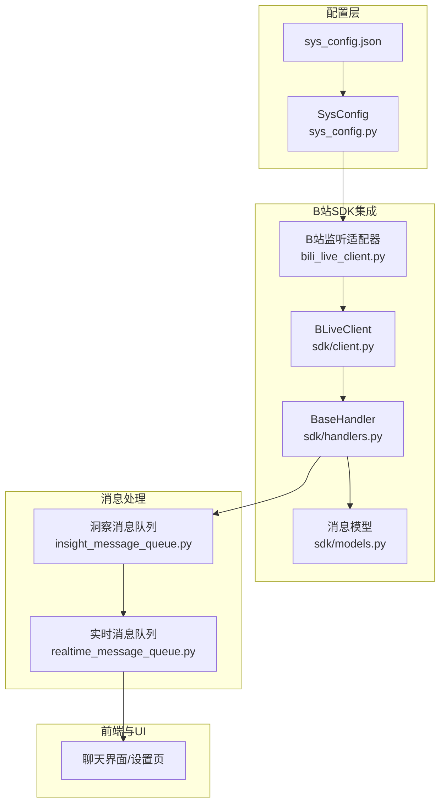
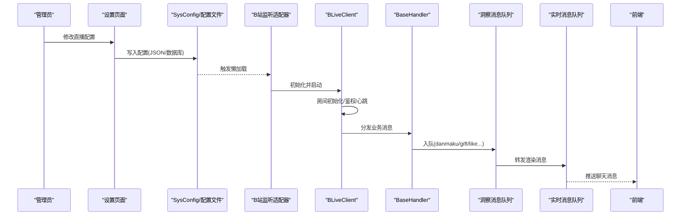
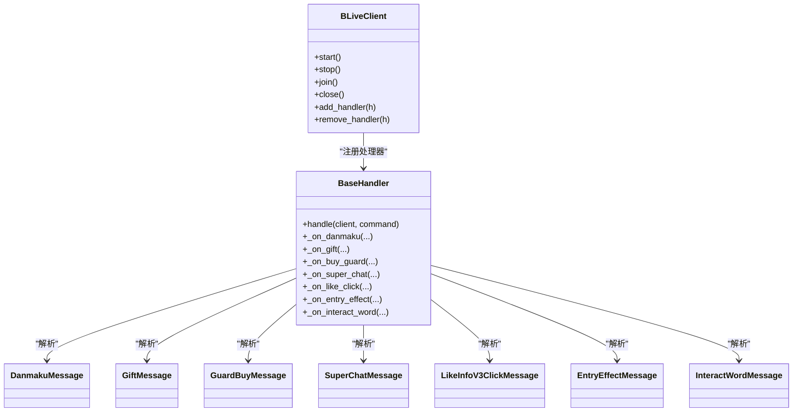

# 直播集成配置

<cite>
**本文引用的文件**   
- [domain-chatbot/apps/chatbot/insight/bilibili/bili_live_client.py](file://domain-chatbot/apps/chatbot/insight/bilibili/bili_live_client.py)
- [domain-chatbot/apps/chatbot/insight/bilibili/sdk/client.py](file://domain-chatbot/apps/chatbot/insight/bilibili/sdk/client.py)
- [domain-chatbot/apps/chatbot/insight/bilibili/sdk/handlers.py](file://domain-chatbot/apps/chatbot/insight/bilibili/sdk/handlers.py)
- [domain-chatbot/apps/chatbot/insight/bilibili/sdk/models.py](file://domain-chatbot/apps/chatbot/insight/bilibili/sdk/models.py)
- [domain-chatbot/apps/chatbot/insight/bilibili_api/bili_live_client.py](file://domain-chatbot/apps/chatbot/insight/bilibili_api/bili_live_client.py)
- [domain-chatbot/apps/chatbot/insight/insight_message_queue.py](file://domain-chatbot/apps/chatbot/insight/insight_message_queue.py)
- [domain-chatbot/apps/chatbot/output/realtime_message_queue.py](file://domain-chatbot/apps/chatbot/output/realtime_message_queue.py)
- [domain-chatbot/apps/chatbot/config/sys_config.py](file://domain-chatbot/apps/chatbot/config/sys_config.py)
- [domain-chatbot/apps/chatbot/config/sys_config.json](file://domain-chatbot/apps/chatbot/config/sys_config.json)
- [domain-chatbot/apps/chatbot/utils/chat_message_utils.py](file://domain-chatbot/apps/chatbot/utils/chat_message_utils.py)
- [domain-chatbot/tests/bilibili_api_test.py](file://domain-chatbot/tests/bilibili_api_test.py)
- [domain-chatbot/requirements.txt](file://domain-chatbot/requirements.txt)
</cite>

## 目录
1. [简介](#简介)
2. [项目结构](#项目结构)
3. [核心组件](#核心组件)
4. [架构总览](#架构总览)
5. [组件详解](#组件详解)
6. [依赖关系分析](#依赖关系分析)
7. [性能与优化](#性能与优化)
8. [故障排查与运维](#故障排查与运维)
9. [结论](#结论)
10. [附录](#附录)

## 简介
本文件面向直播服务管理员，系统性梳理 VirtualWife 项目中 B站直播集成的配置与运行机制。内容覆盖：
- 直播房间与认证配置
- 弹幕监听与消息处理链路
- 实时互动参数与消息队列
- 连接建立、心跳、断线重连与异常处理
- 性能优化与监控告警建议
- 安全与合规要点

## 项目结构
围绕直播集成的相关模块主要位于 domain-chatbot 的 insight 与 bilibili_api 子目录，并通过配置中心与消息队列串联。

图表来源
- [domain-chatbot/apps/chatbot/config/sys_config.py](file://domain-chatbot/apps/chatbot/config/sys_config.py#L1-L208)
- [domain-chatbot/apps/chatbot/config/sys_config.json](file://domain-chatbot/apps/chatbot/config/sys_config.json#L1-L60)
- [domain-chatbot/apps/chatbot/insight/bilibili_api/bili_live_client.py](file://domain-chatbot/apps/chatbot/insight/bilibili_api/bili_live_client.py#L1-L167)
- [domain-chatbot/apps/chatbot/insight/bilibili/sdk/client.py](file://domain-chatbot/apps/chatbot/insight/bilibili/sdk/client.py#L1-L610)
- [domain-chatbot/apps/chatbot/insight/bilibili/sdk/handlers.py](file://domain-chatbot/apps/chatbot/insight/bilibili/sdk/handlers.py#L1-L190)
- [domain-chatbot/apps/chatbot/insight/bilibili/sdk/models.py](file://domain-chatbot/apps/chatbot/insight/bilibili/sdk/models.py#L1-L441)
- [domain-chatbot/apps/chatbot/insight/insight_message_queue.py](file://domain-chatbot/apps/chatbot/insight/insight_message_queue.py#L1-L83)
- [domain-chatbot/apps/chatbot/output/realtime_message_queue.py](file://domain-chatbot/apps/chatbot/output/realtime_message_queue.py#L1-L107)

章节来源
- [domain-chatbot/apps/chatbot/config/sys_config.py](file://domain-chatbot/apps/chatbot/config/sys_config.py#L1-L208)
- [domain-chatbot/apps/chatbot/config/sys_config.json](file://domain-chatbot/apps/chatbot/config/sys_config.json#L1-L60)

## 核心组件
- B站直播客户端（SDK封装）：负责房间初始化、连接弹幕服务器、鉴权、心跳、断线重连与消息解析。
- 消息处理器：将底层协议消息映射为高层模型并分发到洞察消息队列。
- 洞察消息队列：统一承载弹幕、礼物、舰长、点赞等事件，供后续处理与转发。
- 实时消息队列：将最终渲染消息推送到前端通道。
- 配置中心：集中管理直播开关、房间ID、Cookie、代理等参数。
- bilibili-api 适配器：另一种监听实现，基于 bilibili-api-python，支持线程池与事件回调。

章节来源
- [domain-chatbot/apps/chatbot/insight/bilibili/sdk/client.py](file://domain-chatbot/apps/chatbot/insight/bilibili/sdk/client.py#L87-L207)
- [domain-chatbot/apps/chatbot/insight/bilibili/sdk/handlers.py](file://domain-chatbot/apps/chatbot/insight/bilibili/sdk/handlers.py#L45-L190)
- [domain-chatbot/apps/chatbot/insight/insight_message_queue.py](file://domain-chatbot/apps/chatbot/insight/insight_message_queue.py#L14-L83)
- [domain-chatbot/apps/chatbot/output/realtime_message_queue.py](file://domain-chatbot/apps/chatbot/output/realtime_message_queue.py#L21-L107)
- [domain-chatbot/apps/chatbot/config/sys_config.py](file://domain-chatbot/apps/chatbot/config/sys_config.py#L32-L82)
- [domain-chatbot/apps/chatbot/insight/bilibili_api/bili_live_client.py](file://domain-chatbot/apps/chatbot/insight/bilibili_api/bili_live_client.py#L16-L100)

## 架构总览
下图展示从配置到消息消费的端到端流程：

图表来源
- [domain-chatbot/apps/chatbot/config/sys_config.py](file://domain-chatbot/apps/chatbot/config/sys_config.py#L52-L82)
- [domain-chatbot/apps/chatbot/insight/bilibili_api/bili_live_client.py](file://domain-chatbot/apps/chatbot/insight/bilibili_api/bili_live_client.py#L110-L138)
- [domain-chatbot/apps/chatbot/insight/bilibili/sdk/client.py](file://domain-chatbot/apps/chatbot/insight/bilibili/sdk/client.py#L200-L238)
- [domain-chatbot/apps/chatbot/insight/bilibili/sdk/handlers.py](file://domain-chatbot/apps/chatbot/insight/bilibili/sdk/handlers.py#L124-L140)
- [domain-chatbot/apps/chatbot/insight/insight_message_queue.py](file://domain-chatbot/apps/chatbot/insight/insight_message_queue.py#L47-L70)
- [domain-chatbot/apps/chatbot/output/realtime_message_queue.py](file://domain-chatbot/apps/chatbot/output/realtime_message_queue.py#L54-L68)

## 组件详解

### 直播客户端与房间配置
- 房间ID与认证
  - 通过环境变量或配置文件读取房间ID与Cookie，用于 SDK 客户端鉴权。
  - bilibili-api 适配器从配置中读取房间ID与Cookie字符串，解析出关键字段构造凭证。
- 连接参数
  - SDK 客户端支持自定义心跳间隔、SSL 验证策略与会话超时。
- 运行控制
  - 提供 start/stop/join/close 生命周期管理；内部维护网络协程与心跳定时器。

章节来源
- [domain-chatbot/apps/chatbot/insight/bilibili/bili_live_client.py](file://domain-chatbot/apps/chatbot/insight/bilibili/bili_live_client.py#L24-L51)
- [domain-chatbot/apps/chatbot/insight/bilibili/sdk/client.py](file://domain-chatbot/apps/chatbot/insight/bilibili/sdk/client.py#L99-L122)
- [domain-chatbot/apps/chatbot/insight/bilibili_api/bili_live_client.py](file://domain-chatbot/apps/chatbot/insight/bilibili_api/bili_live_client.py#L110-L138)
- [domain-chatbot/apps/chatbot/config/sys_config.json](file://domain-chatbot/apps/chatbot/config/sys_config.json#L2-L5)

### 弹幕监听与消息处理
- 消息模型
  - SDK 提供 Heartbeat/Danmaku/Gift/Guard/SuperChat/Like/EntryEffect/Interact 等模型，便于统一处理。
- 处理器分发
  - BaseHandler 将原始命令按 cmd 分发至对应回调，同时内置常见忽略命令集合。
- 事件落地
  - 弹幕、礼物、舰长、点赞、入场特效等事件被封装为 InsightMessage 并入队。

章节来源
- [domain-chatbot/apps/chatbot/insight/bilibili/sdk/models.py](file://domain-chatbot/apps/chatbot/insight/bilibili/sdk/models.py#L16-L441)
- [domain-chatbot/apps/chatbot/insight/bilibili/sdk/handlers.py](file://domain-chatbot/apps/chatbot/insight/bilibili/sdk/handlers.py#L54-L140)
- [domain-chatbot/apps/chatbot/insight/bilibili/bili_live_client.py](file://domain-chatbot/apps/chatbot/insight/bilibili/bili_live_client.py#L70-L109)
- [domain-chatbot/apps/chatbot/insight/insight_message_queue.py](file://domain-chatbot/apps/chatbot/insight/insight_message_queue.py#L47-L70)

### 实时互动参数与消息队列
- 洞察消息队列
  - 线程安全队列承载各类互动事件，统一转为实时消息并推送前端。
- 实时消息队列
  - 负责将最终渲染消息推送到前端通道，支持表情生成与文本清洗。
- 文本清洗
  - 工具函数去除多余标记与特殊字符，提升 TTS 与渲染稳定性。

章节来源
- [domain-chatbot/apps/chatbot/insight/insight_message_queue.py](file://domain-chatbot/apps/chatbot/insight/insight_message_queue.py#L14-L83)
- [domain-chatbot/apps/chatbot/output/realtime_message_queue.py](file://domain-chatbot/apps/chatbot/output/realtime_message_queue.py#L21-L107)
- [domain-chatbot/apps/chatbot/utils/chat_message_utils.py](file://domain-chatbot/apps/chatbot/utils/chat_message_utils.py#L4-L27)

### bilibili-api 适配器
- 事件监听
  - 使用 bilibili-api-python 的 LiveDanmaku 订阅弹幕、礼物、入场等事件。
- 线程池管理
  - 通过线程池在独立线程中运行异步事件循环，避免阻塞主线程。
- 生命周期控制
  - 支持延迟加载、关闭与资源回收。

章节来源
- [domain-chatbot/apps/chatbot/insight/bilibili_api/bili_live_client.py](file://domain-chatbot/apps/chatbot/insight/bilibili_api/bili_live_client.py#L16-L100)
- [domain-chatbot/apps/chatbot/insight/bilibili_api/bili_live_client.py](file://domain-chatbot/apps/chatbot/insight/bilibili_api/bili_live_client.py#L102-L138)

## 依赖关系分析

图表来源
- [domain-chatbot/apps/chatbot/insight/bilibili/sdk/client.py](file://domain-chatbot/apps/chatbot/insight/bilibili/sdk/client.py#L178-L207)
- [domain-chatbot/apps/chatbot/insight/bilibili/sdk/handlers.py](file://domain-chatbot/apps/chatbot/insight/bilibili/sdk/handlers.py#L54-L140)
- [domain-chatbot/apps/chatbot/insight/bilibili/sdk/models.py](file://domain-chatbot/apps/chatbot/insight/bilibili/sdk/models.py#L16-L441)

章节来源
- [domain-chatbot/apps/chatbot/insight/bilibili/sdk/client.py](file://domain-chatbot/apps/chatbot/insight/bilibili/sdk/client.py#L178-L207)
- [domain-chatbot/apps/chatbot/insight/bilibili/sdk/handlers.py](file://domain-chatbot/apps/chatbot/insight/bilibili/sdk/handlers.py#L54-L140)
- [domain-chatbot/apps/chatbot/insight/bilibili/sdk/models.py](file://domain-chatbot/apps/chatbot/insight/bilibili/sdk/models.py#L16-L441)

## 性能与优化
- 并发与消息处理
  - SDK 处理器并发触发，建议将耗时操作放入队列或线程池，避免阻塞网络协程。
- 心跳与重连
  - SDK 默认心跳周期可配置；断线后按指数退避策略重连，必要时可调整重试上限与超时阈值。
- 内存与带宽
  - 对于高频弹幕场景，建议启用消息压缩（SDK 已支持 Brotli），并限制单次处理消息量。
- 线程池与事件循环
  - bilibili-api 适配器使用线程池隔离事件循环，避免阻塞主线程；合理设置最大工作线程数。
- 日志与采样
  - 对高频日志进行采样输出，降低磁盘 IO 压力；仅在异常路径输出完整堆栈。

章节来源
- [domain-chatbot/apps/chatbot/insight/bilibili/sdk/client.py](file://domain-chatbot/apps/chatbot/insight/bilibili/sdk/client.py#L178-L188)
- [domain-chatbot/apps/chatbot/insight/bilibili/sdk/client.py](file://domain-chatbot/apps/chatbot/insight/bilibili/sdk/client.py#L410-L428)
- [domain-chatbot/apps/chatbot/insight/bilibili_api/bili_live_client.py](file://domain-chatbot/apps/chatbot/insight/bilibili_api/bili_live_client.py#L81-L100)

## 故障排查与运维

### 连接与鉴权
- 房间ID与Cookie校验
  - 确认配置中的房间ID与Cookie有效且未过期；bilibili-api 适配器需正确解析 Cookie 字段。
- SSL 与代理
  - 若部署在受限网络，确保代理配置正确；必要时关闭 SSL 校验仅限开发环境。
- 心跳与断线
  - 观察心跳是否持续下发；若长时间无消息，检查网络连通性与服务器负载。

章节来源
- [domain-chatbot/apps/chatbot/config/sys_config.json](file://domain-chatbot/apps/chatbot/config/sys_config.json#L2-L5)
- [domain-chatbot/apps/chatbot/insight/bilibili/sdk/client.py](file://domain-chatbot/apps/chatbot/insight/bilibili/sdk/client.py#L410-L428)
- [domain-chatbot/apps/chatbot/insight/bilibili_api/bili_live_client.py](file://domain-chatbot/apps/chatbot/insight/bilibili_api/bili_live_client.py#L119-L138)

### 消息处理与队列
- 队列积压
  - 若洞察消息队列或实时消息队列堆积，检查下游处理逻辑是否阻塞；必要时拆分处理线程。
- 文本清洗
  - 若出现 TTS 失败或渲染异常，检查清洗规则与特殊字符过滤策略。

章节来源
- [domain-chatbot/apps/chatbot/insight/insight_message_queue.py](file://domain-chatbot/apps/chatbot/insight/insight_message_queue.py#L52-L70)
- [domain-chatbot/apps/chatbot/output/realtime_message_queue.py](file://domain-chatbot/apps/chatbot/output/realtime_message_queue.py#L70-L95)
- [domain-chatbot/apps/chatbot/utils/chat_message_utils.py](file://domain-chatbot/apps/chatbot/utils/chat_message_utils.py#L24-L27)

### 安全与合规
- Cookie 管理
  - Cookie 应存储在受控环境变量或密钥管理服务中，避免明文写入配置文件。
- 日志脱敏
  - 输出日志时对敏感字段进行脱敏处理，避免泄露用户信息。
- 访问控制
  - 前端与后端均应实施访问控制，防止未授权修改直播配置。

章节来源
- [domain-chatbot/apps/chatbot/config/sys_config.json](file://domain-chatbot/apps/chatbot/config/sys_config.json#L2-L5)
- [domain-chatbot/requirements.txt](file://domain-chatbot/requirements.txt#L29-L29)

## 结论
本方案提供了两条直播监听路径：基于 SDK 的轻量实现与基于 bilibili-api 的事件驱动实现。通过配置中心统一管理房间与认证参数，结合消息队列完成事件汇聚与实时渲染。建议在生产环境中启用消息压缩、线程池隔离与日志采样，并严格管理 Cookie 与日志脱敏，以获得稳定、可观测、可扩展的直播集成能力。

## 附录

### 配置项清单（直播相关）
- enableLive：是否启用直播监听
- liveStreamingConfig.B_ROOM_ID：B站房间ID
- liveStreamingConfig.B_COOKIE：Cookie 字符串（bilibili-api 适配器解析）
- languageModelConfig.*：大模型相关配置（影响后续对话处理）
- enableProxy/httpProxy/httpsProxy/socks5Proxy：代理配置

章节来源
- [domain-chatbot/apps/chatbot/config/sys_config.json](file://domain-chatbot/apps/chatbot/config/sys_config.json#L1-L60)

### 测试参考
- bilibili-api 测试脚本展示了如何从 Cookie 中提取关键字段并建立连接。

章节来源
- [domain-chatbot/tests/bilibili_api_test.py](file://domain-chatbot/tests/bilibili_api_test.py#L1-L44)