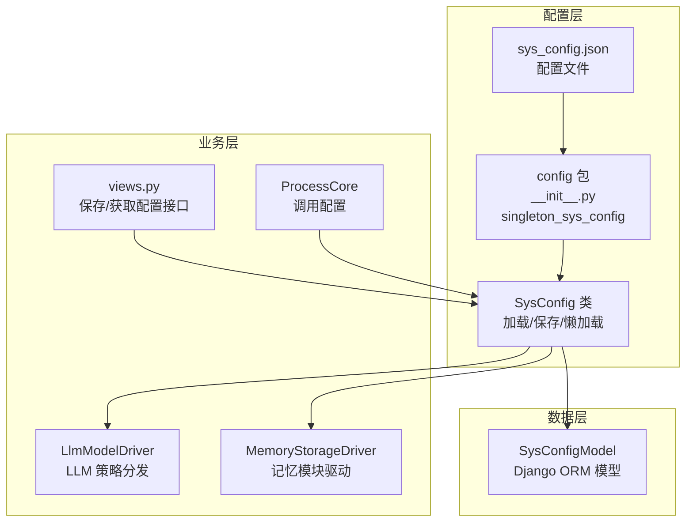
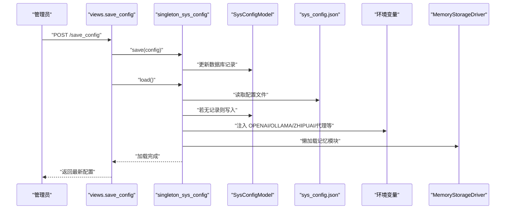
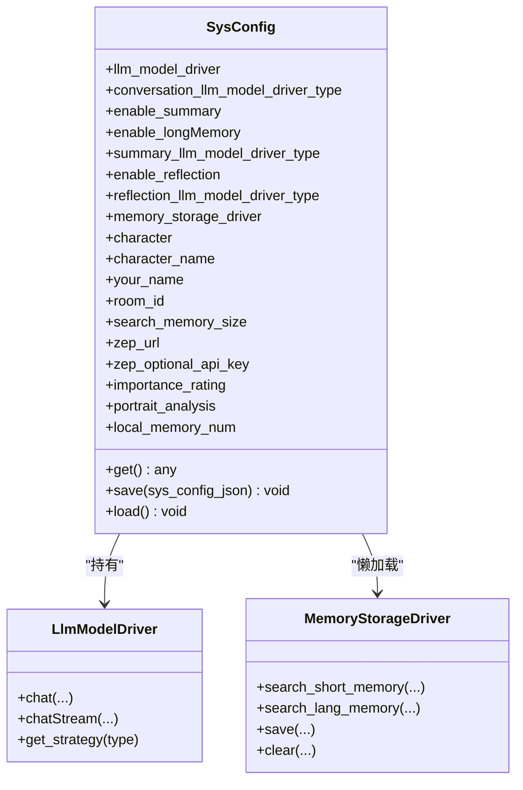
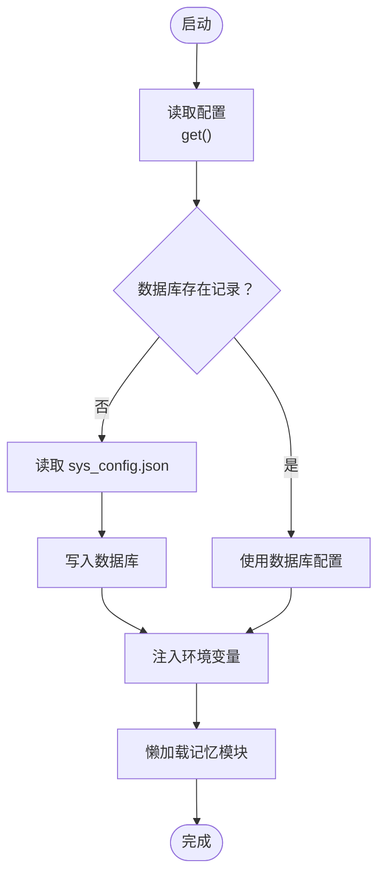
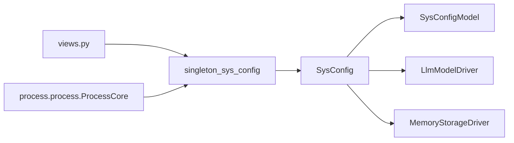

# 系统配置

<cite>
**本文引用的文件**
- [sys_config.py](file://domain-chatbot/apps/chatbot/config/sys_config.py)
- [sys_config.json](file://domain-chatbot/apps/chatbot/config/sys_config.json)
- [__init__.py（配置包）](file://domain-chatbot/apps/chatbot/config/__init__.py)
- [models.py](file://domain-chatbot/apps/chatbot/models.py)
- [llm_model_strategy.py](file://domain-chatbot/apps/chatbot/llms/llm_model_strategy.py)
- [memory_storage.py](file://domain-chatbot/apps/chatbot/memory/memory_storage.py)
- [views.py](file://domain-chatbot/apps/chatbot/views.py)
- [process.py](file://domain-chatbot/apps/chatbot/process/process.py)
- [settings.py](file://domain-chatbot/VirtualWife/settings.py)
- [manage.py](file://domain-chatbot/manage.py)
</cite>

## 目录
1. [简介](#简介)
2. [项目结构](#项目结构)
3. [核心组件](#核心组件)
4. [架构总览](#架构总览)
5. [详细组件分析](#详细组件分析)
6. [依赖关系分析](#依赖关系分析)
7. [性能与可靠性考量](#性能与可靠性考量)
8. [故障排查指南](#故障排查指南)
9. [结论](#结论)
10. [附录](#附录)

## 简介
本文件面向系统管理员与运维人员，系统性梳理 VirtualWife 的系统配置管理，涵盖配置文件层次结构、加载机制、持久化存储、生命周期管理、默认值与环境变量覆盖、热更新支持、验证与错误处理、备份与恢复等。重点解析配置模块 sys_config.py 中的 SysConfig 类实现，以及配置文件 sys_config.json 的结构与字段语义，并给出从“磁盘文件 → 内存缓存 → 数据库存储”的完整流程说明。

## 项目结构
配置相关的核心文件位于 chatbot 应用的 config 包内，配合 Django ORM 的 SysConfigModel 用于持久化；配置在应用启动时加载，同时通过 REST 接口支持运行时热更新。

图表来源
- [sys_config.py](file://domain-chatbot/apps/chatbot/config/sys_config.py#L32-L208)
- [sys_config.json](file://domain-chatbot/apps/chatbot/config/sys_config.json#L1-L60)
- [__init__.py（配置包）](file://domain-chatbot/apps/chatbot/config/__init__.py#L1-L8)
- [models.py](file://domain-chatbot/apps/chatbot/models.py#L39-L50)
- [views.py](file://domain-chatbot/apps/chatbot/views.py#L34-L61)
- [process.py](file://domain-chatbot/apps/chatbot/process/process.py#L19-L77)
- [llm_model_strategy.py](file://domain-chatbot/apps/chatbot/llms/llm_model_strategy.py#L107-L149)
- [memory_storage.py](file://domain-chatbot/apps/chatbot/memory/memory_storage.py#L14-L25)

章节来源
- [sys_config.py](file://domain-chatbot/apps/chatbot/config/sys_config.py#L1-L208)
- [sys_config.json](file://domain-chatbot/apps/chatbot/config/sys_config.json#L1-L60)
- [__init__.py（配置包）](file://domain-chatbot/apps/chatbot/config/__init__.py#L1-L8)
- [models.py](file://domain-chatbot/apps/chatbot/models.py#L39-L50)
- [views.py](file://domain-chatbot/apps/chatbot/views.py#L34-L61)
- [process.py](file://domain-chatbot/apps/chatbot/process/process.py#L19-L77)

## 核心组件
- SysConfig 类：负责配置的加载、保存、持久化、默认角色初始化、环境变量注入、懒加载记忆模块等。
- SysConfigModel：Django 模型，用于将配置 JSON 存储到数据库。
- singleton_sys_config：全局单例，贯穿应用生命周期。
- 配置文件 sys_config.json：定义系统各模块的配置段与字段。
- LlmModelDriver：根据配置选择不同 LLM 提供商的策略。
- MemoryStorageDriver：根据配置启用短期/长期记忆，并按需懒加载。

章节来源
- [sys_config.py](file://domain-chatbot/apps/chatbot/config/sys_config.py#L32-L208)
- [models.py](file://domain-chatbot/apps/chatbot/models.py#L39-L50)
- [llm_model_strategy.py](file://domain-chatbot/apps/chatbot/llms/llm_model_strategy.py#L107-L149)
- [memory_storage.py](file://domain-chatbot/apps/chatbot/memory/memory_storage.py#L14-L25)
- [__init__.py（配置包）](file://domain-chatbot/apps/chatbot/config/__init__.py#L1-L8)

## 架构总览
配置生命周期从磁盘文件读取开始，优先尝试从数据库加载已持久化的配置；若不存在则写入数据库；随后将配置映射到内存属性，并注入环境变量；最后通过懒加载初始化记忆模块。运行时可通过 REST 接口保存并触发重新加载。

图表来源
- [views.py](file://domain-chatbot/apps/chatbot/views.py#L34-L50)
- [sys_config.py](file://domain-chatbot/apps/chatbot/config/sys_config.py#L57-L192)
- [models.py](file://domain-chatbot/apps/chatbot/models.py#L39-L50)

## 详细组件分析

### SysConfig 类实现
- 初始化与加载
  - 在构造函数中调用 load()，确保应用启动即完成配置加载。
  - 通过 get() 从数据库或文件读取配置；若数据库无记录则写入。
  - load() 将配置映射到类属性，注入环境变量，初始化默认角色，懒加载记忆模块。
- 配置持久化
  - save() 将传入的配置 JSON 写回数据库。
- 环境变量注入
  - 注入 OPENAI、OLLAMA、ZHIPUAI 的 API KEY 与基础 URL。
  - 根据 enableProxy 控制 HTTP/HTTPS/SOCKS5 代理。
- 懒加载记忆模块
  - 仅在需要时创建 MemoryStorageDriver，避免不必要的资源占用。
- 默认角色初始化
  - 若数据库中无自定义角色，自动写入默认角色模板。

图表来源
- [sys_config.py](file://domain-chatbot/apps/chatbot/config/sys_config.py#L32-L208)
- [llm_model_strategy.py](file://domain-chatbot/apps/chatbot/llms/llm_model_strategy.py#L107-L149)
- [memory_storage.py](file://domain-chatbot/apps/chatbot/memory/memory_storage.py#L14-L25)

章节来源
- [sys_config.py](file://domain-chatbot/apps/chatbot/config/sys_config.py#L52-L208)

### 配置文件结构与字段说明（sys_config.json）
- liveStreamingConfig
  - B_ROOM_ID：直播房间号
  - B_COOKIE：直播 Cookie（为空时可能影响访问）
- enableProxy：是否启用代理
- httpProxy/httpsProxy/socks5Proxy：代理地址
- languageModelConfig
  - openai：OPENAI_API_KEY、OPENAI_BASE_URL
  - ollama：OLLAMA_API_BASE、OLLAMA_API_MODEL_NAME
  - zhipuai：ZHIPUAI_API_KEY
- characterConfig
  - character：角色编号
  - character_name：角色名称
  - yourName：用户昵称
  - vrmModel/vrmModelType：VRM 模型与类型
- conversationConfig
  - conversationType：对话类型（如 default）
  - languageModel：对话使用的 LLM 类型（openai/ollama/zhipuai）
- memoryStorageConfig
  - zep_memory：zep_url、zep_optional_api_key
  - milvusMemory：host、port、user、password、dbName
  - enableLongMemory：是否启用长期记忆
  - enableSummary：是否启用记忆摘要
  - languageModelForSummary：摘要使用的 LLM 类型
  - enableReflection：是否启用反思
  - languageModelForReflection：反思使用的 LLM 类型
- custom_role_template_type：角色模板类型
- background_id/background_url：背景图片相关
- ttsConfig
  - ttsType：TTS 引擎类型（如 Edge）
  - ttsVoiceId：语音 ID

章节来源
- [sys_config.json](file://domain-chatbot/apps/chatbot/config/sys_config.json#L1-L60)

### 配置加载与持久化流程
- 文件读取与数据库落盘
  - get() 优先从数据库读取；若无记录则从 sys_config.json 读取并写入数据库。
- 环境变量注入
  - 根据配置注入 OPENAI/OLLAMA/ZHIPUAI 的 API KEY 与基础 URL，以及代理相关变量。
- 懒加载记忆模块
  - 仅在需要时创建 MemoryStorageDriver，避免启动时资源浪费。
- 默认角色初始化
  - 若数据库中无角色，自动写入默认角色模板。

图表来源
- [sys_config.py](file://domain-chatbot/apps/chatbot/config/sys_config.py#L57-L192)
- [models.py](file://domain-chatbot/apps/chatbot/models.py#L39-L50)

章节来源
- [sys_config.py](file://domain-chatbot/apps/chatbot/config/sys_config.py#L57-L192)

### 运行时热更新与接口
- 保存配置
  - save_config 接口接收前端传入的配置 JSON，调用 singleton_sys_config.save 并立即执行 load。
- 获取配置
  - get_config 接口返回当前内存中的配置 JSON。
- 直播配置联动
  - 保存配置后可触发直播客户端的懒加载逻辑（注释中预留）。

章节来源
- [views.py](file://domain-chatbot/apps/chatbot/views.py#L34-L61)

### 与业务模块的集成
- ProcessCore 在对话流程中直接使用 singleton_sys_config 的属性：
  - 选择角色、检索短期/长期记忆、调用 LLM 流式生成。
- LlmModelDriver 根据配置选择具体 LLM 策略（OpenAI/Ollama/ZhipuAI）。
- MemoryStorageDriver 根据配置决定是否启用长期记忆与摘要/反思。

章节来源
- [process.py](file://domain-chatbot/apps/chatbot/process/process.py#L19-L77)
- [llm_model_strategy.py](file://domain-chatbot/apps/chatbot/llms/llm_model_strategy.py#L107-L149)
- [memory_storage.py](file://domain-chatbot/apps/chatbot/memory/memory_storage.py#L14-L25)

## 依赖关系分析
- 配置层
  - sys_config.py 依赖 Django ORM 模型 SysConfigModel，依赖 LlmModelDriver 与 MemoryStorageDriver。
- 数据层
  - SysConfigModel 作为配置的持久化载体。
- 业务层
  - ProcessCore、views、memory_storage、llm_model_strategy 等模块均依赖 singleton_sys_config。

图表来源
- [views.py](file://domain-chatbot/apps/chatbot/views.py#L13-L14)
- [process.py](file://domain-chatbot/apps/chatbot/process/process.py#L8-L31)
- [sys_config.py](file://domain-chatbot/apps/chatbot/config/sys_config.py#L32-L208)
- [models.py](file://domain-chatbot/apps/chatbot/models.py#L39-L50)

章节来源
- [views.py](file://domain-chatbot/apps/chatbot/views.py#L13-L14)
- [process.py](file://domain-chatbot/apps/chatbot/process/process.py#L8-L31)
- [sys_config.py](file://domain-chatbot/apps/chatbot/config/sys_config.py#L32-L208)

## 性能与可靠性考量
- 懒加载策略
  - 记忆模块仅在需要时初始化，减少启动时资源占用。
- 环境变量注入
  - 将敏感配置注入环境变量，避免硬编码在代码中，便于容器化部署与密钥管理。
- 数据库持久化
  - 配置落库，避免文件损坏导致的配置丢失；同时支持运行时热更新。
- 错误处理
  - 配置加载失败时记录日志，不影响其他模块运行；默认角色初始化异常也会被记录但不会阻断主流程。

章节来源
- [sys_config.py](file://domain-chatbot/apps/chatbot/config/sys_config.py#L74-L108)
- [memory_storage.py](file://domain-chatbot/apps/chatbot/memory/memory_storage.py#L14-L25)

## 故障排查指南
- 配置无法加载
  - 检查 sys_config.json 是否存在且格式正确；确认数据库中是否存在对应 code 的记录。
  - 查看日志中关于配置加载与数据库操作的输出。
- LLM 无法连接
  - 检查 languageModelConfig 下的 API KEY 与基础 URL 是否正确；确认 enableProxy 与代理配置是否生效。
- 记忆模块异常
  - 检查 memoryStorageConfig 的 milvus/zep 配置；确认 enableLongMemory 开关状态。
- 环境变量未生效
  - 确认配置中代理开关与代理地址；检查进程是否重新加载配置。
- 热更新无效
  - 确认 save_config 接口调用成功并触发了 load；检查浏览器或客户端缓存。

章节来源
- [sys_config.py](file://domain-chatbot/apps/chatbot/config/sys_config.py#L57-L192)
- [views.py](file://domain-chatbot/apps/chatbot/views.py#L34-L61)

## 结论
VirtualWife 的配置体系采用“文件 + 数据库 + 内存单例”的三层结构，既保证了配置的持久化与可追溯，又提供了运行时热更新能力。SysConfig 类承担了配置加载、验证、持久化与懒加载等职责，与 LLM 与记忆模块紧密耦合。建议在生产环境中结合容器化与密钥管理工具，严格控制敏感配置的可见范围，并定期备份数据库以保障配置安全。

## 附录

### 配置项默认值与覆盖机制
- 默认值来源
  - sys_config.json 中的字段即为默认值来源；首次运行时若数据库无记录，将从该文件读取并写入数据库。
- 环境变量覆盖
  - 配置中涉及的 API KEY 与基础 URL 会被注入到进程环境变量；容器部署时可通过环境变量覆盖敏感配置。
- 热更新
  - 通过 save_config 接口提交新的配置 JSON，系统将立即持久化并重新加载，无需重启服务。

章节来源
- [sys_config.py](file://domain-chatbot/apps/chatbot/config/sys_config.py#L57-L192)
- [views.py](file://domain-chatbot/apps/chatbot/views.py#L34-L50)

### 配置验证与错误处理
- 验证规则
  - 通过数据库记录的存在与否进行“存在性”验证；字段完整性由 sys_config.json 与 SysConfigModel 的结构约束共同保证。
- 错误处理
  - 配置加载异常、默认角色初始化异常、记忆模块懒加载异常均被捕获并记录日志，避免中断主流程。

章节来源
- [sys_config.py](file://domain-chatbot/apps/chatbot/config/sys_config.py#L74-L108)
- [models.py](file://domain-chatbot/apps/chatbot/models.py#L39-L50)

### 备份与恢复方案
- 备份
  - 定期导出数据库中 SysConfigModel 的记录，保留 code 与 config 字段。
- 恢复
  - 将备份记录导入数据库；若文件系统中存在 sys_config.json，则可作为兜底默认值来源；否则需手动补齐缺失的配置文件。

章节来源
- [models.py](file://domain-chatbot/apps/chatbot/models.py#L39-L50)
- [sys_config.py](file://domain-chatbot/apps/chatbot/config/sys_config.py#L57-L76)