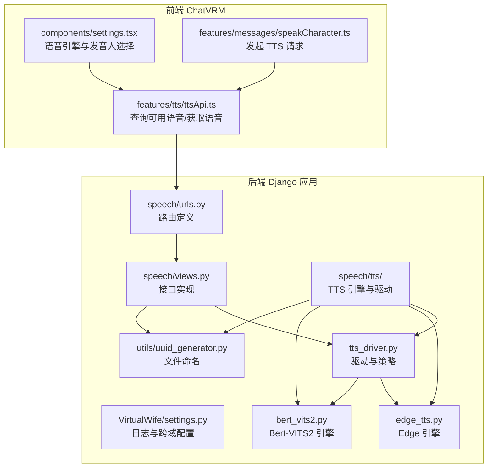
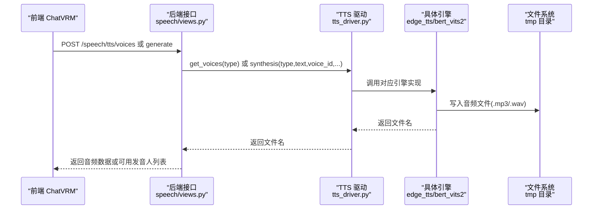
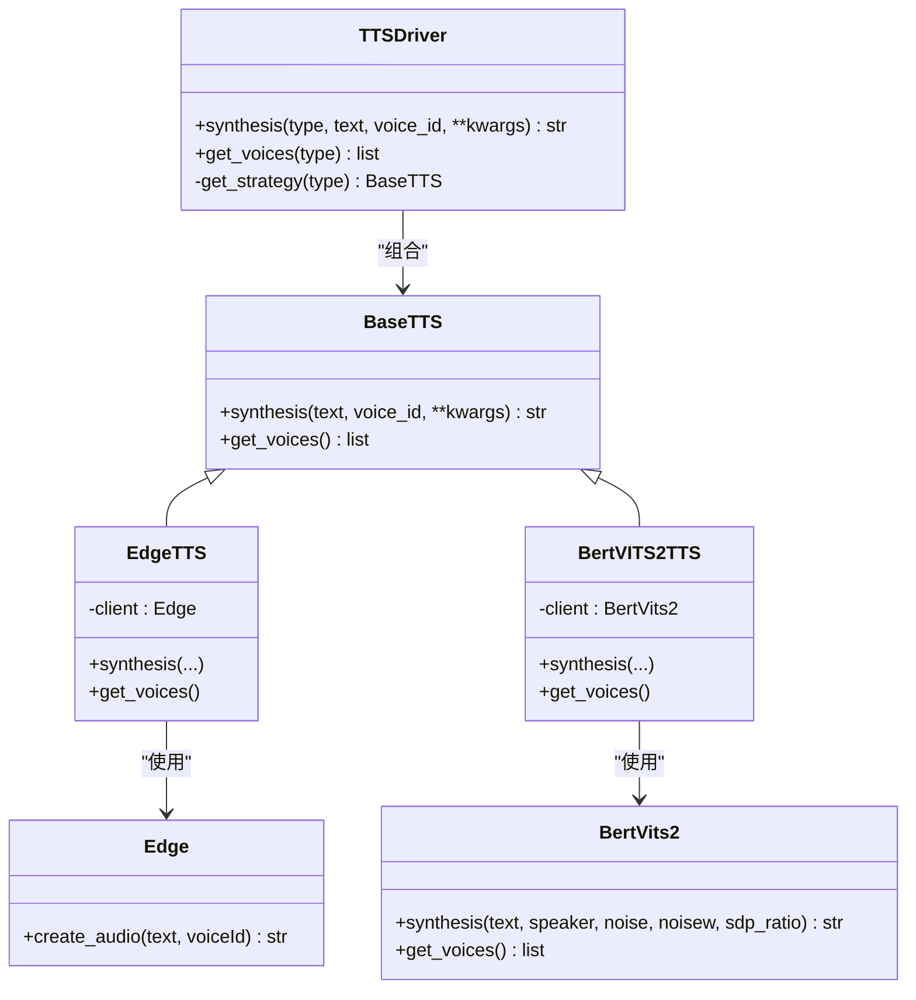
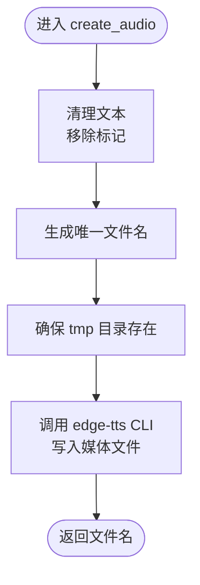
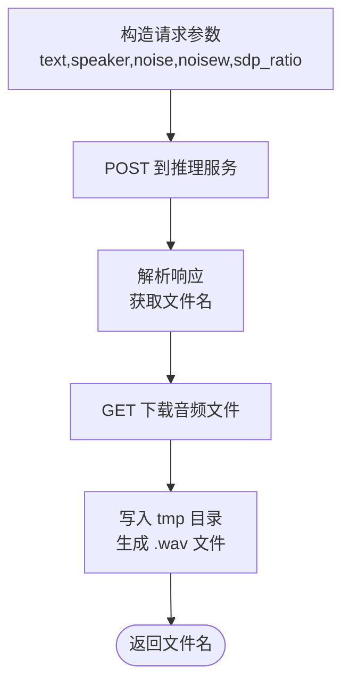
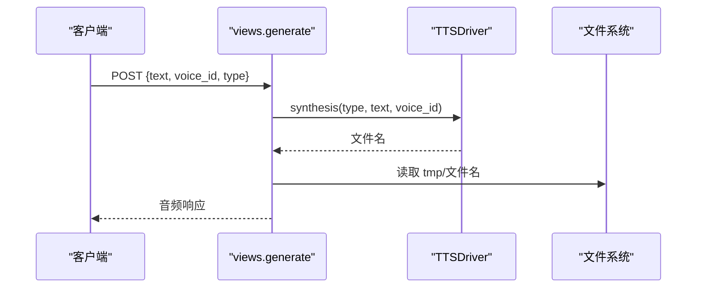
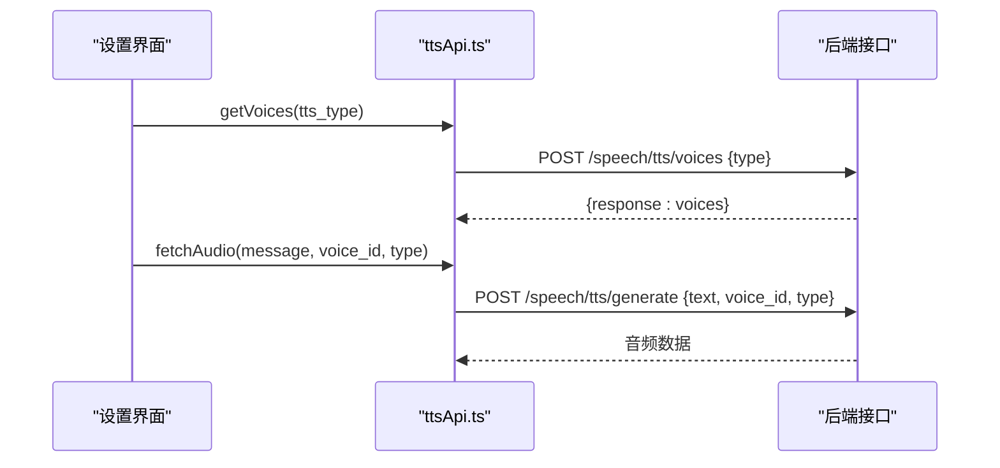
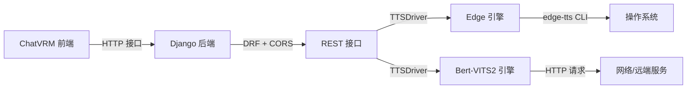

# 语音服务配置

<cite>
**本文引用的文件**
- [domain-chatbot/apps/speech/tts/tts_driver.py](file://domain-chatbot/apps/speech/tts/tts_driver.py)
- [domain-chatbot/apps/speech/tts/edge_tts.py](file://domain-chatbot/apps/speech/tts/edge_tts.py)
- [domain-chatbot/apps/speech/tts/bert_vits2.py](file://domain-chatbot/apps/speech/tts/bert_vits2.py)
- [domain-chatbot/apps/speech/views.py](file://domain-chatbot/apps/speech/views.py)
- [domain-chatbot/apps/speech/urls.py](file://domain-chatbot/apps/speech/urls.py)
- [domain-chatbot/apps/speech/tts/__init__.py](file://domain-chatbot/apps/speech/tts/__init__.py)
- [domain-chatbot/apps/speech/utils/uuid_generator.py](file://domain-chatbot/apps/speech/utils/uuid_generator.py)
- [domain-chatbot/VirtualWife/settings.py](file://domain-chatbot/VirtualWife/settings.py)
- [domain-chatvrm/src/features/tts/ttsApi.ts](file://domain-chatvrm/src/features/tts/ttsApi.ts)
- [domain-chatvrm/src/components/settings.tsx](file://domain-chatvrm/src/components/settings.tsx)
- [domain-chatvrm/src/features/messages/speakCharacter.ts](file://domain-chatvrm/src/features/messages/speakCharacter.ts)
</cite>

## 目录
1. [简介](#简介)
2. [项目结构](#项目结构)
3. [核心组件](#核心组件)
4. [架构总览](#架构总览)
5. [详细组件分析](#详细组件分析)
6. [依赖关系分析](#依赖关系分析)
7. [性能考虑](#性能考虑)
8. [故障排查指南](#故障排查指南)
9. [结论](#结论)
10. [附录](#附录)

## 简介
本文件面向语音服务管理员与开发者，系统化梳理 VirtualWife 项目的语音服务配置与优化方案。重点覆盖多语音引擎支持的配置架构（Edge TTS、Bert-VITS2）、语音参数配置（语速、音调、音量、发音人选择等）、引擎切换机制（TTS 驱动初始化、引擎选择逻辑、语音质量控制）、引擎特点与适用场景（实时性 vs 自然度、语音包管理）、性能优化（并发处理、缓存策略、网络优化、音频格式转换）、以及监控与错误处理、降级策略等高级能力。

## 项目结构
语音服务位于后端 Django 应用 domain-chatbot 的 apps/speech 子模块中，前端 ChatVRM 通过 HTTP 接口调用后端 TTS 能力。整体结构如下：

图表来源
- [domain-chatbot/VirtualWife/settings.py](file://domain-chatbot/VirtualWife/settings.py#L67-L69)
- [domain-chatbot/apps/speech/urls.py](file://domain-chatbot/apps/speech/urls.py#L1-L9)
- [domain-chatbot/apps/speech/views.py](file://domain-chatbot/apps/speech/views.py#L1-L74)
- [domain-chatbot/apps/speech/tts/tts_driver.py](file://domain-chatbot/apps/speech/tts/tts_driver.py#L54-L74)
- [domain-chatbot/apps/speech/tts/edge_tts.py](file://domain-chatbot/apps/speech/tts/edge_tts.py#L27-L51)
- [domain-chatbot/apps/speech/tts/bert_vits2.py](file://domain-chatbot/apps/speech/tts/bert_vits2.py#L647-L664)
- [domain-chatbot/apps/speech/utils/uuid_generator.py](file://domain-chatbot/apps/speech/utils/uuid_generator.py#L1-L11)
- [domain-chatvrm/src/features/tts/ttsApi.ts](file://domain-chatvrm/src/features/tts/ttsApi.ts#L1-L25)
- [domain-chatvrm/src/components/settings.tsx](file://domain-chatvrm/src/components/settings.tsx#L232-L273)
- [domain-chatvrm/src/features/messages/speakCharacter.ts](file://domain-chatvrm/src/features/messages/speakCharacter.ts#L51-L81)

章节来源
- [domain-chatbot/apps/speech/urls.py](file://domain-chatbot/apps/speech/urls.py#L1-L9)
- [domain-chatbot/apps/speech/views.py](file://domain-chatbot/apps/speech/views.py#L1-L74)
- [domain-chatbot/apps/speech/tts/tts_driver.py](file://domain-chatbot/apps/speech/tts/tts_driver.py#L54-L74)

## 核心组件
- TTS 驱动与策略：统一抽象 BaseTTS，具体实现 EdgeTTS 与 BertVITS2TTS，由 TTSDriver 统一调度与选择。
- Edge 引擎：基于本地 edge-tts CLI 工具进行实时文本转语音，输出 MP3 文件。
- Bert-VITS2 引擎：调用远程推理服务，返回 WAV 文件；支持噪声、音色波动、SDP 比例等参数。
- 视图层：提供 /speech/tts/generate 与 /speech/tts/voices 两个接口，负责参数解析、调用驱动、文件读写与响应。
- 前端集成：ChatVRM 侧通过 API 查询可用发音人并发起语音合成请求。

章节来源
- [domain-chatbot/apps/speech/tts/tts_driver.py](file://domain-chatbot/apps/speech/tts/tts_driver.py#L9-L74)
- [domain-chatbot/apps/speech/tts/edge_tts.py](file://domain-chatbot/apps/speech/tts/edge_tts.py#L27-L51)
- [domain-chatbot/apps/speech/tts/bert_vits2.py](file://domain-chatbot/apps/speech/tts/bert_vits2.py#L647-L664)
- [domain-chatbot/apps/speech/views.py](file://domain-chatbot/apps/speech/views.py#L16-L74)

## 架构总览
语音服务采用“视图层 → 驱动层 → 引擎层”的分层设计，支持多引擎动态切换与统一参数传递。

图表来源
- [domain-chatbot/apps/speech/views.py](file://domain-chatbot/apps/speech/views.py#L16-L74)
- [domain-chatbot/apps/speech/tts/tts_driver.py](file://domain-chatbot/apps/speech/tts/tts_driver.py#L57-L65)
- [domain-chatbot/apps/speech/tts/edge_tts.py](file://domain-chatbot/apps/speech/tts/edge_tts.py#L35-L50)
- [domain-chatbot/apps/speech/tts/bert_vits2.py](file://domain-chatbot/apps/speech/tts/bert_vits2.py#L621-L644)

## 详细组件分析

### TTS 驱动与策略（TTSDriver）
- 抽象基类 BaseTTS 定义统一接口：synthesis 与 get_voices。
- EdgeTTS：封装 Edge 引擎，直接调用 create_audio。
- BertVITS2TTS：封装 BertVits2 引擎，支持 noise、noisew、sdp_ratio 参数。
- TTSDriver：根据 type 选择具体引擎，异常处理 Unknown type。

图表来源
- [domain-chatbot/apps/speech/tts/tts_driver.py](file://domain-chatbot/apps/speech/tts/tts_driver.py#L9-L74)
- [domain-chatbot/apps/speech/tts/edge_tts.py](file://domain-chatbot/apps/speech/tts/edge_tts.py#L27-L51)
- [domain-chatbot/apps/speech/tts/bert_vits2.py](file://domain-chatbot/apps/speech/tts/bert_vits2.py#L647-L664)

章节来源
- [domain-chatbot/apps/speech/tts/tts_driver.py](file://domain-chatbot/apps/speech/tts/tts_driver.py#L54-L74)

### Edge TTS（实时性优先）
- 发音人列表：包含 zh-CN、zh-HK、zh-TW 多地区发音人。
- 文本预处理：移除特定 HTML 标记，避免 edge-tts 解析异常。
- 文件生成：调用 edge-tts CLI 输出 MP3，文件名通过 UUID 生成器保证唯一。
- 适用场景：对延迟敏感、无需高自然度的场景；适合快速播报与交互反馈。

图表来源
- [domain-chatbot/apps/speech/tts/edge_tts.py](file://domain-chatbot/apps/speech/tts/edge_tts.py#L29-L50)
- [domain-chatbot/apps/speech/utils/uuid_generator.py](file://domain-chatbot/apps/speech/utils/uuid_generator.py#L1-L11)

章节来源
- [domain-chatbot/apps/speech/tts/edge_tts.py](file://domain-chatbot/apps/speech/tts/edge_tts.py#L9-L51)

### Bert-VITS2（自然度优先）
- 远程推理：通过固定 URL 提交 JSON 参数，下载生成的音频文件。
- 参数体系：noise、noisew、sdp_ratio 等影响韵律与自然度；默认值在驱动层设定。
- 发音人库：内置大量角色发音人，按语言标签区分。
- 适用场景：追求自然度与情感表达的剧情/角色扮演场景；需要高质量语音包时。

图表来源
- [domain-chatbot/apps/speech/tts/bert_vits2.py](file://domain-chatbot/apps/speech/tts/bert_vits2.py#L621-L644)

章节来源
- [domain-chatbot/apps/speech/tts/bert_vits2.py](file://domain-chatbot/apps/speech/tts/bert_vits2.py#L30-L663)

### 视图层与接口
- /speech/tts/generate：接收 text、voice_id、type，调用单例驱动合成，读取 tmp 文件返回音频。
- /speech/tts/voices：接收 type，返回该引擎可用发音人列表。
- 错误处理：捕获异常并返回 500 与错误信息；日志记录便于排障。

图表来源
- [domain-chatbot/apps/speech/views.py](file://domain-chatbot/apps/speech/views.py#L16-L47)
- [domain-chatbot/apps/speech/tts/__init__.py](file://domain-chatbot/apps/speech/tts/__init__.py#L1-L4)

章节来源
- [domain-chatbot/apps/speech/views.py](file://domain-chatbot/apps/speech/views.py#L16-L74)
- [domain-chatbot/apps/speech/urls.py](file://domain-chatbot/apps/speech/urls.py#L1-L9)

### 前端集成与用户配置
- 设置界面：提供引擎选择（Edge、Bert-VITS2）与发音人下拉框。
- 获取发音人：POST /speech/tts/voices 查询当前引擎可用发音人。
- 发起合成：POST /speech/tts/generate 获取音频字节流。

图表来源
- [domain-chatvrm/src/components/settings.tsx](file://domain-chatvrm/src/components/settings.tsx#L232-L273)
- [domain-chatvrm/src/features/tts/ttsApi.ts](file://domain-chatvrm/src/features/tts/ttsApi.ts#L11-L25)
- [domain-chatvrm/src/features/messages/speakCharacter.ts](file://domain-chatvrm/src/features/messages/speakCharacter.ts#L53-L81)

章节来源
- [domain-chatvrm/src/components/settings.tsx](file://domain-chatvrm/src/components/settings.tsx#L232-L273)
- [domain-chatvrm/src/features/tts/ttsApi.ts](file://domain-chatvrm/src/features/tts/ttsApi.ts#L1-L25)
- [domain-chatvrm/src/features/messages/speakCharacter.ts](file://domain-chatvrm/src/features/messages/speakCharacter.ts#L51-L81)

## 依赖关系分析
- 后端依赖
  - Django + DRF：提供 REST 接口与路由。
  - 日志系统：统一输出 INFO/DEBUG/ERROR 级别日志，支持文件轮转。
  - CORS：允许任意来源与请求头，便于前端直连。
- 引擎依赖
  - Edge：依赖本地 edge-tts CLI 工具安装与可用性。
  - Bert-VITS2：依赖远端推理服务可达性与稳定性。
- 前端依赖
  - ChatVRM 通过 API 层与后端通信，UI 控制引擎与发音人选择。

图表来源
- [domain-chatbot/VirtualWife/settings.py](file://domain-chatbot/VirtualWife/settings.py#L67-L69)
- [domain-chatbot/apps/speech/views.py](file://domain-chatbot/apps/speech/views.py#L16-L74)
- [domain-chatbot/apps/speech/tts/tts_driver.py](file://domain-chatbot/apps/speech/tts/tts_driver.py#L54-L74)
- [domain-chatbot/apps/speech/tts/edge_tts.py](file://domain-chatbot/apps/speech/tts/edge_tts.py#L47-L48)
- [domain-chatbot/apps/speech/tts/bert_vits2.py](file://domain-chatbot/apps/speech/tts/bert_vits2.py#L8-L28)

章节来源
- [domain-chatbot/VirtualWife/settings.py](file://domain-chatbot/VirtualWife/settings.py#L67-L69)
- [domain-chatbot/apps/speech/tts/tts_driver.py](file://domain-chatbot/apps/speech/tts/tts_driver.py#L54-L74)

## 性能考虑
- 并发与吞吐
  - 当前视图层为同步阻塞 IO，建议在生产环境启用异步 WSGI/ASGI 服务器与连接池，限制并发请求数，避免资源争用。
- 缓存策略
  - 对热点文本/发音人组合进行结果缓存（如 Redis），命中则直接返回音频文件路径，降低引擎压力。
- 网络优化
  - Bert-VITS2 依赖远端服务，建议增加超时与重试、熔断与降级策略；对网络抖动进行指数退避。
- 音频格式转换
  - Edge 输出 MP3，Bert-VITS2 输出 WAV；前端可统一转换为 MP3 以节省带宽与兼容性更好。
- 临时文件管理
  - 合成完成后立即删除 tmp 文件，避免磁盘膨胀；可引入 LRU 清理策略与配额限制。
- 日志与监控
  - 开启 INFO 级别日志并聚合到集中式日志系统；关键指标（QPS、P95/P99 延迟、错误率、引擎成功率）纳入监控面板。

[本节为通用性能指导，不直接分析具体文件]

## 故障排查指南
- 常见问题定位
  - Edge 引擎失败：检查 edge-tts CLI 是否安装、权限是否正确、网络代理是否影响进程启动。
  - Bert-VITS2 失败：检查推理服务可达性、请求体参数是否符合预期、远端服务状态码与响应结构。
  - 文件无法读取：确认 tmp 目录存在且具备写入权限；检查文件名生成与路径拼接。
- 日志与告警
  - 查看 Django 日志文件（轮转文件），定位异常堆栈；结合前端错误提示与后端 500 响应进行关联分析。
- 降级策略
  - 当 Bert-VITS2 不可用时，自动切换至 Edge 引擎；或返回预设提示音；同时记录降级事件用于后续评估。

章节来源
- [domain-chatbot/VirtualWife/settings.py](file://domain-chatbot/VirtualWife/settings.py#L159-L207)
- [domain-chatbot/apps/speech/views.py](file://domain-chatbot/apps/speech/views.py#L45-L47)

## 结论
本语音服务通过统一驱动层实现了多引擎无缝切换，结合前端灵活的引擎与发音人选择，满足不同场景下的实时性与自然度需求。建议在生产环境中完善并发控制、缓存与网络优化、日志与监控体系，并制定明确的降级策略，以获得稳定、高效、可运维的语音服务能力。

[本节为总结性内容，不直接分析具体文件]

## 附录

### 语音参数配置清单（后端驱动层）
- Edge 引擎
  - 发音人选择：通过 voice_id 指定（见发音人列表）。
  - 文本预处理：自动移除特定标记，避免 edge-tts 报错。
- Bert-VITS2 引擎
  - 发音人选择：通过 speaker 指定。
  - 关键参数（默认值来自驱动层）：
    - noise：影响韵律自然度，默认值由驱动设定。
    - noisew：影响音色波动，默认值由驱动设定。
    - sdp_ratio：影响确定性比例，默认值由驱动设定。

章节来源
- [domain-chatbot/apps/speech/tts/edge_tts.py](file://domain-chatbot/apps/speech/tts/edge_tts.py#L9-L24)
- [domain-chatbot/apps/speech/tts/bert_vits2.py](file://domain-chatbot/apps/speech/tts/bert_vits2.py#L653-L660)
- [domain-chatbot/apps/speech/tts/tts_driver.py](file://domain-chatbot/apps/speech/tts/tts_driver.py#L44-L48)

### 接口定义（后端）
- GET /speech/tts/voices
  - 请求体：{"type": "Edge|Bert-VITS2"}
  - 响应：{"response": [...], "code": "200"}
- POST /speech/tts/generate
  - 请求体：{"text": "...", "voice_id": "...", "type": "Edge|Bert-VITS2"}
  - 响应：音频文件（Content-Type: audio/mpeg 或 audio/wav）

章节来源
- [domain-chatbot/apps/speech/urls.py](file://domain-chatbot/apps/speech/urls.py#L1-L9)
- [domain-chatbot/apps/speech/views.py](file://domain-chatbot/apps/speech/views.py#L16-L74)

### 前端配置要点
- 设置界面提供引擎与发音人选择，调用后端接口完成配置持久化与即时生效。
- 发起语音合成时携带当前全局配置中的 type 与 voice_id。

章节来源
- [domain-chatvrm/src/components/settings.tsx](file://domain-chatvrm/src/components/settings.tsx#L232-L273)
- [domain-chatvrm/src/features/messages/speakCharacter.ts](file://domain-chatvrm/src/features/messages/speakCharacter.ts#L69-L80)
- [domain-chatvrm/src/features/tts/ttsApi.ts](file://domain-chatvrm/src/features/tts/ttsApi.ts#L11-L25)