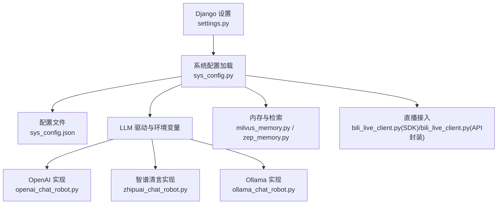
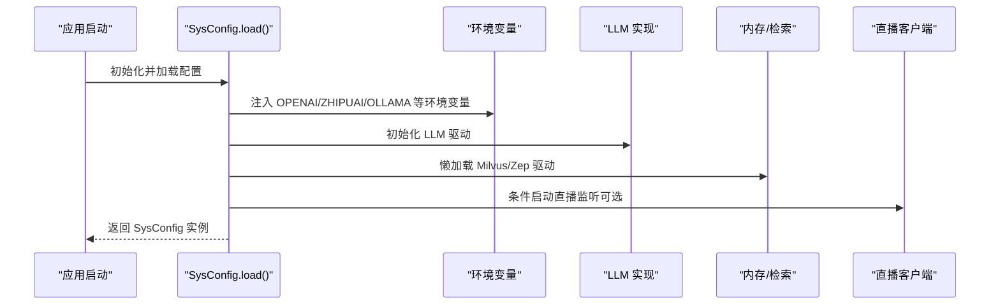
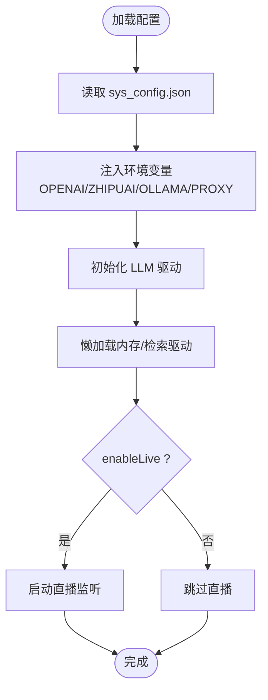
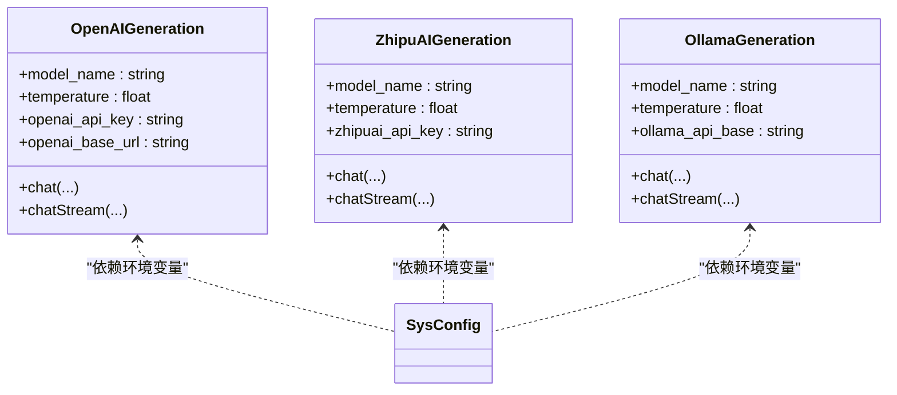
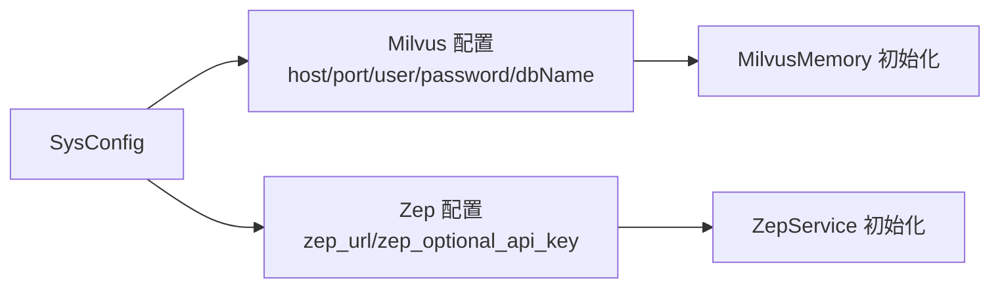
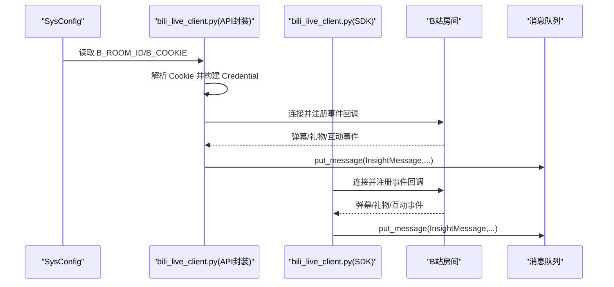
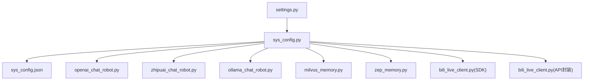

# 配置管理

<cite>
**本文引用的文件**
- [settings.py](file://domain-chatbot/VirtualWife/settings.py)
- [sys_config.py](file://domain-chatbot/apps/chatbot/config/sys_config.py)
- [sys_config.json](file://domain-chatbot/apps/chatbot/config/sys_config.json)
- [openai_chat_robot.py](file://domain-chatbot/apps/chatbot/llms/openai/openai_chat_robot.py)
- [zhipuai_chat_robot.py](file://domain-chatbot/apps/chatbot/llms/zhipuai/zhipuai_chat_robot.py)
- [ollama_chat_robot.py](file://domain-chatbot/apps/chatbot/llms/ollama/ollama_chat_robot.py)
- [milvus_memory.py](file://domain-chatbot/apps/chatbot/memory/milvus/milvus_memory.py)
- [zep_memory.py](file://domain-chatbot/apps/chatbot/memory/zep/zep_memory.py)
- [bili_live_client.py（SDK）](file://domain-chatbot/apps/chatbot/insight/bilibili/bili_live_client.py)
- [client.py（SDK）](file://domain-chatbot/apps/chatbot/insight/bilibili/sdk/client.py)
- [handlers.py（SDK）](file://domain-chatbot/apps/chatbot/insight/bilibili/sdk/handlers.py)
- [bili_live_client.py（API封装）](file://domain-chatbot/apps/chatbot/insight/bilibili_api/bili_live_client.py)
</cite>

## 目录
1. [简介](#简介)
2. [项目结构](#项目结构)
3. [核心组件](#核心组件)
4. [架构总览](#架构总览)
5. [详细组件分析](#详细组件分析)
6. [依赖分析](#依赖分析)
7. [性能考虑](#性能考虑)
8. [故障排除指南](#故障排除指南)
9. [结论](#结论)
10. [附录](#附录)

## 简介
本文件为 VirtualWife 项目的配置管理参考文档，覆盖系统配置的层次结构（环境变量、配置文件、运行时配置）、LLM 模型配置（OpenAI、智谱清言、Ollama）、数据库配置（SQLite、Milvus、Zep）、语音服务配置（TTS 类型与参数）、直播集成配置（B站 API、房间与弹幕处理），以及配置格式、默认值、动态更新机制、验证与排障建议。文档同时提供面向系统管理员与开发者的可视化图示与最佳实践。

## 项目结构
- Django 应用配置位于 settings.py，定义数据库、静态媒体、日志、通道层等基础运行参数。
- 系统运行时配置由 sys_config.py 读取 sys_config.json，并将其映射到运行期对象，同时注入环境变量供各模块使用。
- LLM 模块按供应商拆分，分别从环境变量读取密钥与端点；Ollama 通过 LiteLLM 适配。
- 内存与检索模块支持 Milvus 向量库与 Zep 语义记忆。
- 直播模块提供两套接入方案：基于 SDK 的 B站弹幕客户端与基于 bilibili-api 的封装。
- 语音服务配置项在系统配置中以键值形式存在，便于切换不同 TTS 引擎。

图表来源
- [settings.py](file://domain-chatbot/VirtualWife/settings.py#L95-L100)
- [sys_config.py](file://domain-chatbot/apps/chatbot/config/sys_config.py#L83-L192)
- [sys_config.json](file://domain-chatbot/apps/chatbot/config/sys_config.json#L1-L60)
- [openai_chat_robot.py](file://domain-chatbot/apps/chatbot/llms/openai/openai_chat_robot.py#L14-L44)
- [zhipuai_chat_robot.py](file://domain-chatbot/apps/chatbot/llms/zhipuai/zhipuai_chat_robot.py#L13-L36)
- [ollama_chat_robot.py](file://domain-chatbot/apps/chatbot/llms/ollama/ollama_chat_robot.py#L14-L43)
- [milvus_memory.py](file://domain-chatbot/apps/chatbot/memory/milvus/milvus_memory.py#L22-L52)
- [zep_memory.py](file://domain-chatbot/apps/chatbot/memory/zep/zep_memory.py#L20-L28)
- [bili_live_client.py（SDK）](file://domain-chatbot/apps/chatbot/insight/bilibili/bili_live_client.py#L17-L51)
- [bili_live_client.py（API封装）](file://domain-chatbot/apps/chatbot/insight/bilibili_api/bili_live_client.py#L16-L78)

章节来源
- [settings.py](file://domain-chatbot/VirtualWife/settings.py#L95-L100)
- [sys_config.py](file://domain-chatbot/apps/chatbot/config/sys_config.py#L83-L192)
- [sys_config.json](file://domain-chatbot/apps/chatbot/config/sys_config.json#L1-L60)

## 核心组件
- Django 数据库与日志配置：默认 SQLite，媒体路径与日志轮转策略在 settings.py 中集中定义。
- 系统配置加载器：sys_config.py 从 sys_config.json 读取配置，注入环境变量，初始化 LLM 驱动、内存存储与直播监听。
- LLM 模型配置：OpenAI、智谱清言、Ollama 的密钥与端点均通过环境变量注入，确保各实现模块无需硬编码。
- 内存与检索：Milvus 向量库与 Zep 语义记忆作为可选持久化与检索后端。
- 直播集成：SDK 版本与 API 封装版本双轨并行，前者直接消费弹幕事件，后者通过 bilibili-api 提供事件回调。
- 语音服务：TTS 类型与语音参数在系统配置中声明，便于切换 Edge、BERT-VITS2 等引擎。

章节来源
- [settings.py](file://domain-chatbot/VirtualWife/settings.py#L95-L100)
- [sys_config.py](file://domain-chatbot/apps/chatbot/config/sys_config.py#L123-L155)
- [sys_config.json](file://domain-chatbot/apps/chatbot/config/sys_config.json#L11-L59)

## 架构总览
系统配置贯穿三层：
- 环境变量层：由 sys_config.py 注入，供 LLM 与外部服务读取。
- 配置文件层：sys_config.json 定义各子系统的开关与参数。
- 运行时配置层：SysConfig 对象在应用启动时加载并缓存，必要时支持动态更新。

图表来源
- [sys_config.py](file://domain-chatbot/apps/chatbot/config/sys_config.py#L83-L192)
- [openai_chat_robot.py](file://domain-chatbot/apps/chatbot/llms/openai/openai_chat_robot.py#L20-L24)
- [zhipuai_chat_robot.py](file://domain-chatbot/apps/chatbot/llms/zhipuai/zhipuai_chat_robot.py#L18-L22)
- [ollama_chat_robot.py](file://domain-chatbot/apps/chatbot/llms/ollama/ollama_chat_robot.py#L19-L23)
- [milvus_memory.py](file://domain-chatbot/apps/chatbot/memory/milvus/milvus_memory.py#L22-L30)
- [zep_memory.py](file://domain-chatbot/apps/chatbot/memory/zep/zep_memory.py#L20-L28)
- [bili_live_client.py（SDK）](file://domain-chatbot/apps/chatbot/insight/bilibili/bili_live_client.py#L37-L51)

## 详细组件分析

### 环境变量与运行时配置
- 环境变量注入位置：SysConfig.load() 会将 OpenAI、智谱清言、Ollama 的密钥与端点写入进程环境，随后各 LLM 实现从环境读取。
- 代理配置：当 enableProxy 为真时，HTTP/HTTPS/SOCKS5 代理会被注入；否则清空代理。
- 动态更新：SysConfig 提供 save()/load() 方法，可在运行时更新 sys_config.json 并刷新环境变量与驱动。

图表来源
- [sys_config.py](file://domain-chatbot/apps/chatbot/config/sys_config.py#L83-L192)
- [sys_config.json](file://domain-chatbot/apps/chatbot/config/sys_config.json#L6-L10)
- [bili_live_client.py（API封装）](file://domain-chatbot/apps/chatbot/insight/bilibili_api/bili_live_client.py#L110-L138)

章节来源
- [sys_config.py](file://domain-chatbot/apps/chatbot/config/sys_config.py#L78-L82)
- [sys_config.py](file://domain-chatbot/apps/chatbot/config/sys_config.py#L123-L155)

### LLM 模型配置
- OpenAI：从环境变量读取 API 密钥与可选基础地址，支持自定义基础 URL 以对接兼容服务。
- 智谱清言：从环境变量读取 API 密钥，使用官方 SDK 完成流式/非流式对话。
- Ollama：通过 LiteLLM 适配，从环境变量读取基础地址与模型名称，支持本地模型推理。

图表来源
- [openai_chat_robot.py](file://domain-chatbot/apps/chatbot/llms/openai/openai_chat_robot.py#L14-L44)
- [zhipuai_chat_robot.py](file://domain-chatbot/apps/chatbot/llms/zhipuai/zhipuai_chat_robot.py#L13-L36)
- [ollama_chat_robot.py](file://domain-chatbot/apps/chatbot/llms/ollama/ollama_chat_robot.py#L14-L43)
- [sys_config.py](file://domain-chatbot/apps/chatbot/config/sys_config.py#L123-L138)

章节来源
- [openai_chat_robot.py](file://domain-chatbot/apps/chatbot/llms/openai/openai_chat_robot.py#L20-L44)
- [zhipuai_chat_robot.py](file://domain-chatbot/apps/chatbot/llms/zhipuai/zhipuai_chat_robot.py#L18-L36)
- [ollama_chat_robot.py](file://domain-chatbot/apps/chatbot/llms/ollama/ollama_chat_robot.py#L19-L43)
- [sys_config.json](file://domain-chatbot/apps/chatbot/config/sys_config.json#L11-L22)

### 数据库与内存配置
- SQLite：Django 默认数据库，文件位于 db 子目录。
- Milvus：向量检索后端，需提供主机、端口、用户、密码与数据库名；集合模式与索引参数在内存模块中定义。
- Zep：语义记忆后端，需提供服务地址与可选 API Key；模块提供用户、会话与记忆的增删查改。

图表来源
- [sys_config.json](file://domain-chatbot/apps/chatbot/config/sys_config.json#L35-L51)
- [milvus_memory.py](file://domain-chatbot/apps/chatbot/memory/milvus/milvus_memory.py#L22-L52)
- [zep_memory.py](file://domain-chatbot/apps/chatbot/memory/zep/zep_memory.py#L20-L28)

章节来源
- [settings.py](file://domain-chatbot/VirtualWife/settings.py#L95-L100)
- [milvus_memory.py](file://domain-chatbot/apps/chatbot/memory/milvus/milvus_memory.py#L22-L52)
- [zep_memory.py](file://domain-chatbot/apps/chatbot/memory/zep/zep_memory.py#L20-L28)

### 语音服务配置
- 配置项：系统配置中包含 ttsType 与 ttsVoiceId 等键，用于选择 TTS 引擎与语音参数。
- 实现：语音模块包含多种引擎适配（如 Edge、BERT-VITS2 等），具体实现文件位于 apps/speech/tts 下，可通过配置项切换。

章节来源
- [sys_config.json](file://domain-chatbot/apps/chatbot/config/sys_config.json#L56-L59)

### 直播集成配置
- B站 API 密钥与房间：sys_config.json 提供 B_ROOM_ID 与 B_COOKIE；API 封装版本解析 Cookie 并建立 Credential。
- 直播监听：SDK 版本直接消费弹幕事件；API 封装版本通过 bilibili-api 的 LiveDanmaku 事件回调。
- 弹幕过滤规则：SDK handlers.py 中定义了常见可忽略的 cmd 列表，便于过滤噪声事件。

图表来源
- [sys_config.json](file://domain-chatbot/apps/chatbot/config/sys_config.json#L2-L5)
- [bili_live_client.py（API封装）](file://domain-chatbot/apps/chatbot/insight/bilibili_api/bili_live_client.py#L110-L138)
- [bili_live_client.py（SDK）](file://domain-chatbot/apps/chatbot/insight/bilibili/bili_live_client.py#L37-L51)
- [handlers.py（SDK）](file://domain-chatbot/apps/chatbot/insight/bilibili/sdk/handlers.py#L15-L38)

章节来源
- [sys_config.json](file://domain-chatbot/apps/chatbot/config/sys_config.json#L2-L5)
- [bili_live_client.py（API封装）](file://domain-chatbot/apps/chatbot/insight/bilibili_api/bili_live_client.py#L110-L138)
- [bili_live_client.py（SDK）](file://domain-chatbot/apps/chatbot/insight/bilibili/bili_live_client.py#L17-L51)
- [handlers.py（SDK）](file://domain-chatbot/apps/chatbot/insight/bilibili/sdk/handlers.py#L15-L38)

## 依赖分析
- 配置依赖链：settings.py 提供基础运行环境；sys_config.py 依赖 sys_config.json 与 Django ORM；LLM 模块依赖环境变量；内存模块依赖 Milvus/Zep 客户端；直播模块依赖 B站 SDK/API。
- 外部依赖：LiteLLM 用于统一 LLM 调用；pymilvus 与 zep_python 分别用于 Milvus 与 Zep；bilibi-api 用于 API 封装版直播。

图表来源
- [settings.py](file://domain-chatbot/VirtualWife/settings.py#L95-L100)
- [sys_config.py](file://domain-chatbot/apps/chatbot/config/sys_config.py#L83-L192)
- [sys_config.json](file://domain-chatbot/apps/chatbot/config/sys_config.json#L1-L60)
- [openai_chat_robot.py](file://domain-chatbot/apps/chatbot/llms/openai/openai_chat_robot.py#L1-L101)
- [zhipuai_chat_robot.py](file://domain-chatbot/apps/chatbot/llms/zhipuai/zhipuai_chat_robot.py#L1-L71)
- [ollama_chat_robot.py](file://domain-chatbot/apps/chatbot/llms/ollama/ollama_chat_robot.py#L1-L100)
- [milvus_memory.py](file://domain-chatbot/apps/chatbot/memory/milvus/milvus_memory.py#L1-L184)
- [zep_memory.py](file://domain-chatbot/apps/chatbot/memory/zep/zep_memory.py#L1-L169)
- [bili_live_client.py（SDK）](file://domain-chatbot/apps/chatbot/insight/bilibili/bili_live_client.py#L1-L129)
- [bili_live_client.py（API封装）](file://domain-chatbot/apps/chatbot/insight/bilibili_api/bili_live_client.py#L1-L167)

## 性能考虑
- 环境变量与惰性初始化：SysConfig 在加载时注入环境变量并惰性初始化内存驱动，避免不必要的资源占用。
- Milvus 索引与搜索参数：集合模式与索引参数已在内存模块中固定，建议结合数据规模调整 nlist 与 nprobe。
- 日志轮转：Django 日志采用滚动文件与控制台输出，建议生产环境限制日志级别并定期清理。
- 直播事件处理：SDK 与 API 封装版本均采用事件回调，建议在回调中仅做轻量处理，重任务放入队列异步执行。

[本节为通用建议，不直接分析具体文件]

## 故障排除指南
- LLM 连接失败
  - 检查环境变量是否正确注入（OPENAI_API_KEY、OPENAI_BASE_URL、ZHIPUAI_API_KEY、OLLAMA_API_BASE、OLLAMA_API_MODEL_NAME）。
  - 若使用代理，确认 enableProxy 与代理地址配置正确。
- Milvus 连接异常
  - 核对 host、port、user、password、dbName 是否与部署一致；确认网络可达与权限正确。
- Zep 语义记忆异常
  - 核对 zep_url 与可选 API Key；确认服务可用且会话/用户存在。
- 直播监听无弹幕
  - 确认 B_ROOM_ID 与 B_COOKIE 正确；API 封装版本需解析 Cookie 并构建 Credential；SDK 版本需检查房间号与认证流程。
- 日志定位
  - 查看 logs/django.log 与控制台输出，结合配置加载日志定位问题。

章节来源
- [sys_config.py](file://domain-chatbot/apps/chatbot/config/sys_config.py#L123-L155)
- [milvus_memory.py](file://domain-chatbot/apps/chatbot/memory/milvus/milvus_memory.py#L22-L30)
- [zep_memory.py](file://domain-chatbot/apps/chatbot/memory/zep/zep_memory.py#L20-L28)
- [bili_live_client.py（API封装）](file://domain-chatbot/apps/chatbot/insight/bilibili_api/bili_live_client.py#L110-L138)
- [settings.py](file://domain-chatbot/VirtualWife/settings.py#L154-L207)

## 结论
本配置体系通过环境变量与 JSON 配置文件实现清晰的分层管理，结合惰性初始化与可选功能（直播、记忆后端），满足多场景部署需求。建议在生产环境中严格校验环境变量与外部服务连通性，并通过日志与监控持续观察运行状态。

[本节为总结性内容，不直接分析具体文件]

## 附录

### 配置文件格式与默认值
- sys_config.json 关键键位与默认值（来自仓库现有配置）：
  - liveStreamingConfig
    - B_ROOM_ID: 示例值 27892212
    - B_COOKIE: 空字符串（需按实际填写）
  - enableProxy: false
  - httpProxy/httpsProxy/socks5Proxy: 示例地址（需按实际网络环境填写）
  - languageModelConfig.openai
    - OPENAI_API_KEY: sk-
    - OPENAI_BASE_URL: 空字符串（留空则使用默认端点）
  - languageModelConfig.ollama
    - OLLAMA_API_BASE: http://localhost:11434
    - OLLAMA_API_MODEL_NAME: qwen:7b
  - languageModelConfig.zhipuai
    - ZHIPUAI_API_KEY: SK
  - memoryStorageConfig.milvusMemory
    - host: 127.0.0.1
    - port: 19530
    - user: user
    - password: Milvus
    - dbName: default
  - memoryStorageConfig.zep_memory
    - zep_url: http://localhost:8881
    - zep_optional_api_key: optional_api_key
  - ttsConfig
    - ttsType: Edge
    - ttsVoiceId: zh-CN-XiaoyiNeural

章节来源
- [sys_config.json](file://domain-chatbot/apps/chatbot/config/sys_config.json#L1-L60)

### 动态配置更新机制
- SysConfig.save(): 将内存中的配置写回数据库（SysConfigModel），随后 SysConfig.load() 会重新读取并刷新环境变量与驱动。
- 建议：在更新配置后重启相关服务或触发 SysConfig.load()，确保新配置生效。

章节来源
- [sys_config.py](file://domain-chatbot/apps/chatbot/config/sys_config.py#L78-L82)
- [sys_config.py](file://domain-chatbot/apps/chatbot/config/sys_config.py#L83-L192)