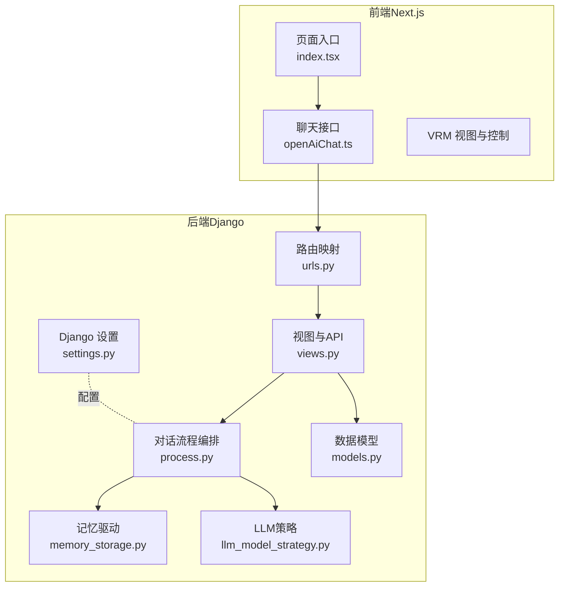
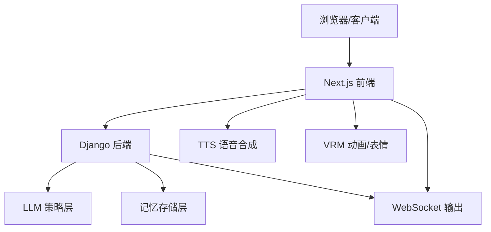
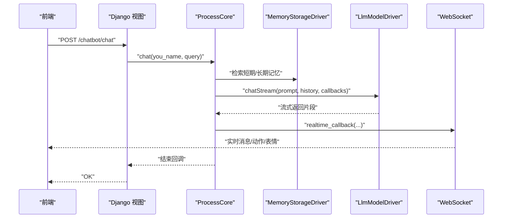
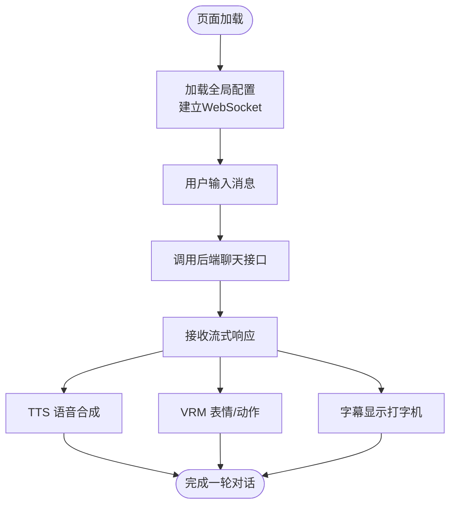
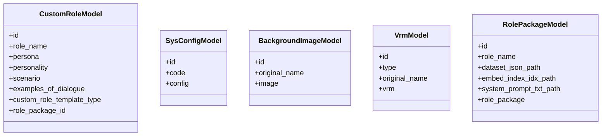
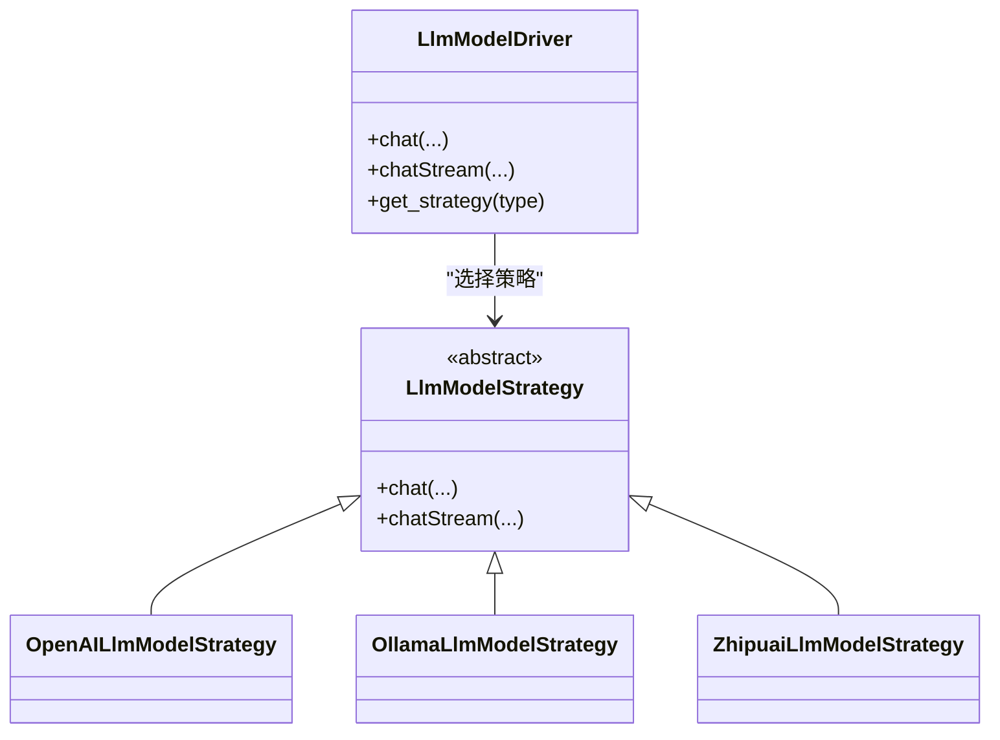
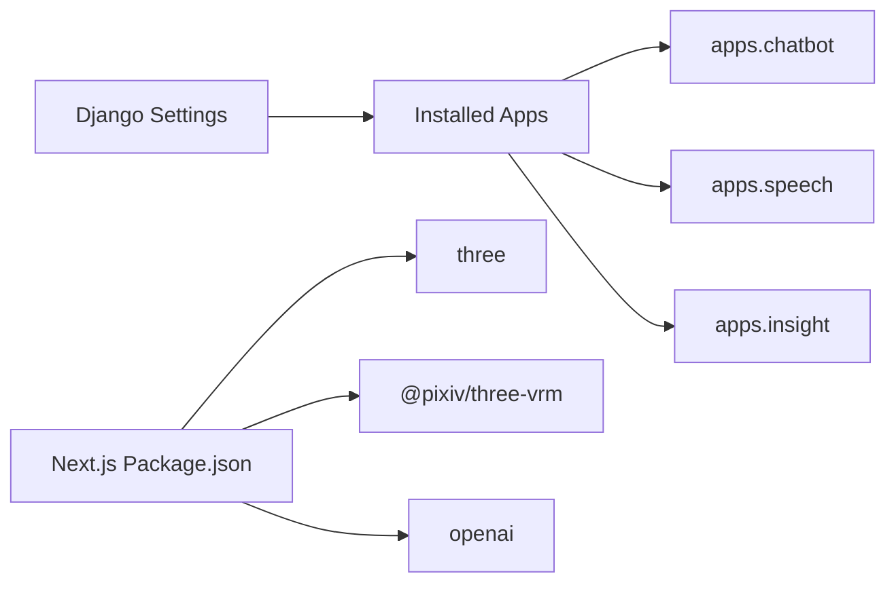

# 项目概述

<cite>
**本文引用的文件**
- [product.md](file://product.md)
- [develop.md](file://develop.md)
- [FAQ.md](file://FAQ.md)
- [settings.py](file://domain-chatbot/VirtualWife/settings.py)
- [urls.py](file://domain-chatbot/apps/chatbot/urls.py)
- [views.py](file://domain-chatbot/apps/chatbot/views.py)
- [models.py](file://domain-chatbot/apps/chatbot/models.py)
- [process.py](file://domain-chatbot/apps/chatbot/process/process.py)
- [character.py](file://domain-chatbot/apps/chatbot/character/character.py)
- [memory_storage.py](file://domain-chatbot/apps/chatbot/memory/memory_storage.py)
- [llm_model_strategy.py](file://domain-chatbot/apps/chatbot/llms/llm_model_strategy.py)
- [package.json](file://domain-chatvrm/package.json)
- [index.tsx](file://domain-chatvrm/src/pages/index.tsx)
- [openAiChat.ts](file://domain-chatvrm/src/features/chat/openAiChat.ts)
</cite>

## 目录
1. [引言](#引言)
2. [项目结构](#项目结构)
3. [核心组件](#核心组件)
4. [架构总览](#架构总览)
5. [详细组件分析](#详细组件分析)
6. [依赖关系分析](#依赖关系分析)
7. [性能考虑](#性能考虑)
8. [故障排除指南](#故障排除指南)
9. [结论](#结论)
10. [附录](#附录)

## 引言
VirtualWife 是一个基于 AI 的虚拟伴侣交互系统，旨在提供沉浸式的多模态对话体验。系统通过“聊天机器人后端（Django）+ 前端界面（Next.js）”的前后端分离架构，结合智能对话、虚拟角色管理、多模态交互（语音合成、表情与动作控制、弹幕联动）等能力，为用户提供可定制、可扩展的虚拟伙伴。

- 核心目标
  - 提供自然流畅的智能对话体验
  - 支持虚拟角色的创建、管理和多模态展示
  - 实现与直播弹幕的联动与实时反馈
  - 支持多种大语言模型（LLM）与记忆体系（短期/长期）

- 主要特性
  - 智能对话：支持流式输出、多轮上下文、角色模板与安装包
  - 虚拟角色管理：角色创建、角色包上传与安装、系统/用户VRM模型管理
  - 多模态交互：TTS 语音合成、VRM 表情与动作控制、字幕与弹幕联动
  - 记忆体系：短期本地记忆与长期 Milvus 向量记忆
  - 直播联动：B站弹幕监听与行为响应

- 技术栈
  - 后端：Django + Channels（WebSocket）、Django REST Framework、SQLite（默认）
  - 前端：Next.js 13（React 18）、Three.js、VRM 动画与表情控制
  - 大模型：OpenAI、Ollama、智谱清言（策略模式抽象）
  - 记忆：本地内存 + Milvus 向量数据库（可选）

- 使用场景
  - 直播互动：弹幕触发角色回复、动作与表情联动
  - 私人陪伴：个性化角色、长期记忆增强情感连结
  - 教育/娱乐：角色扮演教学、故事叙述与互动游戏

## 项目结构
项目采用分层清晰的双域架构：
- domain-chatbot：Django 后端，负责对话流程编排、角色与配置管理、记忆与LLM策略、WebSocket 输出
- domain-chatvrm：Next.js 前端，负责VRM 视图、消息输入、TTS/表情/动作控制、弹幕监听与UI交互
- infrastructure-gateway：Nginx 转发配置（上游服务指向后端与前端）
- installer：Docker 化部署脚本与依赖（Milvus、Zep 等）
- docs/FAQ：文档与常见问题

图表来源
- [settings.py](file://domain-chatbot/VirtualWife/settings.py#L37-L50)
- [urls.py](file://domain-chatbot/apps/chatbot/urls.py#L5-L25)
- [views.py](file://domain-chatbot/apps/chatbot/views.py#L20-L31)
- [process.py](file://domain-chatbot/apps/chatbot/process/process.py#L33-L70)
- [memory_storage.py](file://domain-chatbot/apps/chatbot/memory/memory_storage.py#L14-L25)
- [llm_model_strategy.py](file://domain-chatbot/apps/chatbot/llm_model_strategy.py#L107-L149)
- [models.py](file://domain-chatbot/apps/chatbot/models.py#L16-L92)
- [index.tsx](file://domain-chatvrm/src/pages/index.tsx#L38-L91)
- [openAiChat.ts](file://domain-chatvrm/src/features/chat/openAiChat.ts#L90-L113)

章节来源
- [settings.py](file://domain-chatbot/VirtualWife/settings.py#L37-L50)
- [urls.py](file://domain-chatbot/apps/chatbot/urls.py#L5-L25)
- [views.py](file://domain-chatbot/apps/chatbot/views.py#L20-L31)
- [process.py](file://domain-chatbot/apps/chatbot/process/process.py#L33-L70)
- [memory_storage.py](file://domain-chatbot/apps/chatbot/memory/memory_storage.py#L14-L25)
- [llm_model_strategy.py](file://domain-chatbot/apps/chatbot/llm_model_strategy.py#L107-L149)
- [models.py](file://domain-chatbot/apps/chatbot/models.py#L16-L92)
- [index.tsx](file://domain-chatvrm/src/pages/index.tsx#L38-L91)
- [openAiChat.ts](file://domain-chatvrm/src/features/chat/openAiChat.ts#L90-L113)

## 核心组件
- 后端核心
  - Django 应用与中间件：启用 CORS、Channels、REST Framework、ASGI/WSGI
  - API 路由：聊天、角色管理、配置、图片与VRM模型上传/展示、角色包安装
  - 对话流程：角色生成、提示词构建、短期/长期记忆检索、LLM 流式对话、实时回调
  - 记忆驱动：本地短期记忆 + Milvus 长期记忆（可选），支持摘要与重要性评分
  - LLM 策略：OpenAI/Ollama/Zhipuai 三类策略，统一接口封装
  - 数据模型：PortalUser、CustomRole、SysConfig、LocalMemory、BackgroundImage、Vrm、RolePackage

- 前端核心
  - 页面入口：初始化全局配置、WebSocket 连接、字幕与表情控制
  - 聊天接口：向后端发起对话请求，接收流式响应并驱动TTS与VRM 动作
  - VRM 控制：表情切换、动作加载、字幕打字机效果
  - 弹幕联动：监听弹幕事件，触发角色回复与动作

章节来源
- [settings.py](file://domain-chatbot/VirtualWife/settings.py#L56-L70)
- [urls.py](file://domain-chatbot/apps/chatbot/urls.py#L5-L25)
- [views.py](file://domain-chatbot/apps/chatbot/views.py#L20-L31)
- [process.py](file://domain-chatbot/apps/chatbot/process/process.py#L33-L70)
- [memory_storage.py](file://domain-chatbot/apps/chatbot/memory/memory_storage.py#L14-L25)
- [llm_model_strategy.py](file://domain-chatbot/apps/chatbot/llm_model_strategy.py#L107-L149)
- [models.py](file://domain-chatbot/apps/chatbot/models.py#L16-L92)
- [index.tsx](file://domain-chatvrm/src/pages/index.tsx#L116-L164)
- [openAiChat.ts](file://domain-chatvrm/src/features/chat/openAiChat.ts#L90-L113)

## 架构总览
系统采用“前端 Next.js + 后端 Django”的前后端分离架构，通过 REST 接口与 WebSocket 实现实时交互。

图表来源
- [settings.py](file://domain-chatbot/VirtualWife/settings.py#L146-L152)
- [urls.py](file://domain-chatbot/apps/chatbot/urls.py#L5-L25)
- [views.py](file://domain-chatbot/apps/chatbot/views.py#L20-L31)
- [process.py](file://domain-chatbot/apps/chatbot/process/process.py#L33-L70)
- [memory_storage.py](file://domain-chatbot/apps/chatbot/memory/memory_storage.py#L14-L25)
- [llm_model_strategy.py](file://domain-chatbot/apps/chatbot/llm_model_strategy.py#L107-L149)
- [index.tsx](file://domain-chatvrm/src/pages/index.tsx#L326-L337)
- [openAiChat.ts](file://domain-chatvrm/src/features/chat/openAiChat.ts#L90-L113)

## 详细组件分析

### 组件A：对话流程编排（后端）
- 职责
  - 加载角色与提示词模板
  - 检索短期/长期记忆
  - 调用 LLM 策略进行流式对话
  - 通过 WebSocket 实时推送结果与动作指令

图表来源
- [views.py](file://domain-chatbot/apps/chatbot/views.py#L20-L31)
- [process.py](file://domain-chatbot/apps/chatbot/process/process.py#L33-L70)
- [memory_storage.py](file://domain-chatbot/apps/chatbot/memory/memory_storage.py#L26-L54)
- [llm_model_strategy.py](file://domain-chatbot/apps/chatbot/llm_model_strategy.py#L122-L138)
- [index.tsx](file://domain-chatvrm/src/pages/index.tsx#L296-L324)

章节来源
- [process.py](file://domain-chatbot/apps/chatbot/process/process.py#L33-L70)
- [memory_storage.py](file://domain-chatbot/apps/chatbot/memory/memory_storage.py#L26-L54)
- [llm_model_strategy.py](file://domain-chatbot/apps/chatbot/llm_model_strategy.py#L122-L138)
- [views.py](file://domain-chatbot/apps/chatbot/views.py#L20-L31)
- [index.tsx](file://domain-chatvrm/src/pages/index.tsx#L296-L324)

### 组件B：前端聊天与VRM控制
- 职责
  - 初始化全局配置与WebSocket
  - 发起聊天请求，接收流式响应
  - 驱动TTS与VRM表情/动作
  - 展示字幕与聊天日志

图表来源
- [index.tsx](file://domain-chatvrm/src/pages/index.tsx#L67-L91)
- [index.tsx](file://domain-chatvrm/src/pages/index.tsx#L249-L286)
- [index.tsx](file://domain-chatvrm/src/pages/index.tsx#L116-L164)
- [openAiChat.ts](file://domain-chatvrm/src/features/chat/openAiChat.ts#L90-L113)

章节来源
- [index.tsx](file://domain-chatvrm/src/pages/index.tsx#L67-L91)
- [index.tsx](file://domain-chatvrm/src/pages/index.tsx#L249-L286)
- [index.tsx](file://domain-chatvrm/src/pages/index.tsx#L116-L164)
- [openAiChat.ts](file://domain-chatvrm/src/features/chat/openAiChat.ts#L90-L113)

### 组件C：角色与配置管理（后端）
- 职责
  - 自定义角色的增删改查
  - 系统配置的读取与保存
  - 背景图与VRM模型的上传/展示/删除
  - 角色包的上传与解压安装，生成对应角色

图表来源
- [models.py](file://domain-chatbot/apps/chatbot/models.py#L16-L92)
- [views.py](file://domain-chatbot/apps/chatbot/views.py#L88-L170)
- [views.py](file://domain-chatbot/apps/chatbot/views.py#L188-L246)
- [views.py](file://domain-chatbot/apps/chatbot/views.py#L249-L293)

章节来源
- [models.py](file://domain-chatbot/apps/chatbot/models.py#L16-L92)
- [views.py](file://domain-chatbot/apps/chatbot/views.py#L88-L170)
- [views.py](file://domain-chatbot/apps/chatbot/views.py#L188-L246)
- [views.py](file://domain-chatbot/apps/chatbot/views.py#L249-L293)

### 组件D：LLM 策略与模型驱动
- 职责
  - 统一 LLM 接口（同步/异步）
  - OpenAI/Ollama/Zhipuai 策略选择
  - 对话流式输出与回调

图表来源
- [llm_model_strategy.py](file://domain-chatbot/apps/chatbot/llms/llm_model_strategy.py#L13-L149)

章节来源
- [llm_model_strategy.py](file://domain-chatbot/apps/chatbot/llms/llm_model_strategy.py#L13-L149)

## 依赖关系分析
- 后端依赖
  - Django + daphne + channels：提供 ASGI 与 WebSocket
  - REST Framework：提供 API 视图与序列化
  - CORS：跨域支持
  - SQLite：默认数据库
  - 自定义应用：chatbot、speech、insight 等

- 前端依赖
  - Next.js 13 + React 18
  - Three.js + @pixiv/three-vrm：VRM 渲染与动画
  - openai：浏览器侧 OpenAI SDK（示例）
  - 类型与样式：TypeScript、TailwindCSS

图表来源
- [settings.py](file://domain-chatbot/VirtualWife/settings.py#L37-L50)
- [package.json](file://domain-chatvrm/package.json#L13-L33)

章节来源
- [settings.py](file://domain-chatbot/VirtualWife/settings.py#L37-L50)
- [package.json](file://domain-chatvrm/package.json#L13-L33)

## 性能考虑
- 对话流式输出
  - 使用 LLM 策略的异步流式接口，前端逐段渲染，降低首帧等待时间
- 记忆检索
  - 短期记忆优先使用本地缓存；长期记忆按需检索，避免全量扫描
- WebSocket 实时推送
  - 仅推送必要片段，减少带宽占用
- VRM 动画与TTS
  - 分句播放，避免长音频缓冲；表情/动作按需加载，降低资源消耗

## 故障排除指南
- Docker 环境访问 OpenAI 失败
  - 检查代理设置，确保容器内可访问外网
  - 在高级设置中开启 http-proxy 并指向 host.docker.internal
- 无法访问 Milvus 或 text-generation-webui
  - 使用 host.docker.internal 进行容器内网络访问
- npm run dev 报错
  - 删除 package-lock.json 后重新安装依赖
- B站弹幕监听失败
  - 核对直播间ID与 Cookie 完整性
- 环境要求
  - Python 3.10.12、Node 15.x（或 Next.js 推荐版本）

章节来源
- [FAQ.md](file://FAQ.md#L42-L50)
- [FAQ.md](file://FAQ.md#L56-L69)
- [FAQ.md](file://FAQ.md#L71-L85)
- [develop.md](file://develop.md#L3-L20)

## 结论
VirtualWife 通过前后端分离架构，将智能对话、虚拟角色管理与多模态交互有机结合，既适合个人日常使用，也可用于直播互动与内容创作。后端以 Django 为核心，具备良好的扩展性；前端以 Next.js 为基础，提供流畅的VRM 交互体验。配合可插拔的 LLM 策略与可选的长期记忆体系，系统能够满足不同场景下的需求。

## 附录
- 快速开始
  - 后端（Django）
    - 进入 domain-chatbot，安装依赖，迁移数据库，运行开发服务器
  - 前端（Next.js）
    - 进入 domain-chatvrm，安装依赖，启动开发服务器
  - 基础概念
    - 角色：角色模板与角色包；配置：系统参数与代理设置；记忆：短期与长期记忆；弹幕：直播联动
  - 系统要求
    - Python 3.10.12、Node 15.x（或 Next.js 推荐版本）
  - 初始配置
    - 创建 .env 文件，配置时区与相关参数；在高级设置中开启代理与直播配置

章节来源
- [develop.md](file://develop.md#L22-L71)
- [product.md](file://product.md#L3-L15)